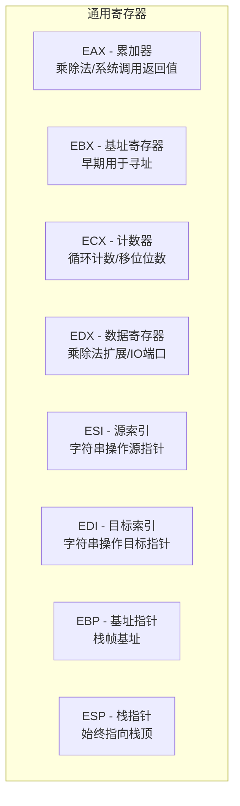
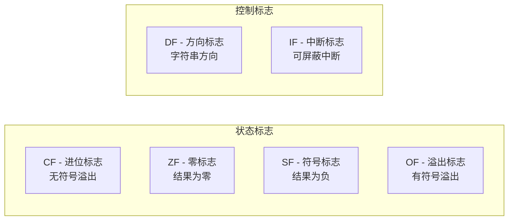
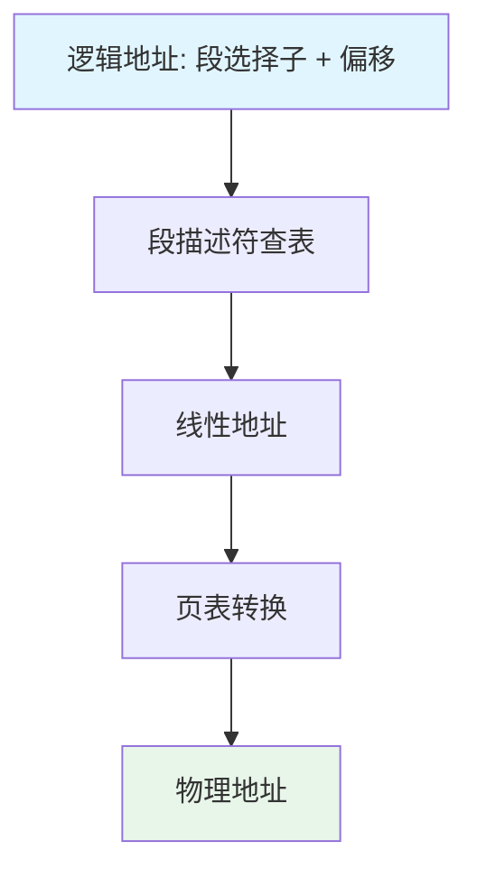
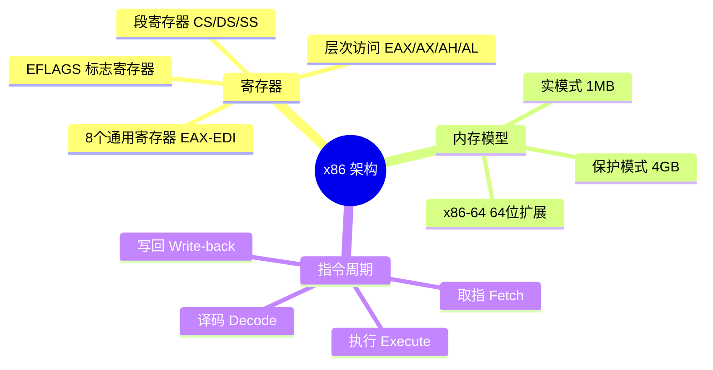

# 处理器架构概述

## CPU：计算机的"大脑"

如果把计算机比作一个工厂，CPU 就是车间里的工人——它不断从内存中**取指令**、**译码**、**执行**，周而复始。理解 CPU 的内部结构，是写出高效汇编代码的前提。


这就是经典的**指令周期**（Instruction Cycle），也叫 fetch-decode-execute 循环。现代 CPU 用流水线让这些阶段重叠执行，但基本原理不变。

## x86 寄存器全景

寄存器是 CPU 内部最快的存储单元——比内存快 100 倍以上。汇编编程的核心就是操作寄存器。

### 通用寄存器（32 位）

x86 有 8 个 32 位通用寄存器，每个都有历史遗留的特殊用途：



### 寄存器的层次结构

每个 32 位寄存器可以拆分为更小的访问单元：

```
31                  15        7       0
┌────────────────────┬─────────┬───────┐
│                    │    AH   │  AL   │
│       EAX          ├─────────┴───────┤
│                    │      AX        │
└────────────────────┴─────────────────┘
```

| 访问方式 | 位数 | 说明 |
|----------|------|------|
| `EAX` | 32 位 | 完整寄存器 |
| `AX` | 低 16 位 | 兼容 16 位代码 |
| `AH` | 第 8-15 位 | AX 的高字节 |
| `AL` | 第 0-7 位 | AX 的低字节 |

::: important 修改低 16 位不影响高 16 位
写 `AX` 只改变 EAX 的低 16 位，高 16 位保持不变。但写 `EAX` 会覆盖全部 32 位。这个细节在混合 16/32 位操作时容易出错。
:::

### 段寄存器

x86 继承了 16 位时代的段式内存模型，有 6 个段寄存器：

| 寄存器 | 名称 | 用途 |
|--------|------|------|
| CS | 代码段 | 指令取指的段基址 |
| DS | 数据段 | 数据访问的默认段 |
| SS | 栈段 | 栈操作（PUSH/POP）的段 |
| ES | 附加段 | 字符串操作的目标段 |
| FS | 附加段 | 线程局部存储（TLS） |
| GS | 附加段 | 操作系统特定用途 |

在 Linux 平坦内存模型下，所有段寄存器指向相同的段基址，你基本不用手动操作它们。

### 标志寄存器 EFLAGS

EFLAGS 是一个 32 位寄存器，每一位是一个独立的状态标志：



| 标志 | 位 | 含义 | 典型用途 |
|------|-----|------|---------|
| CF | 0 | 进位/借位 | 无符号数溢出判断 |
| ZF | 6 | 结果为零 | `cmp` 后判断相等 |
| SF | 7 | 结果为负 | 判断正负 |
| OF | 11 | 有符号溢出 | 有符号数运算溢出 |
| DF | 10 | 字符串方向 | `std`/`cld` 控制 |

::: tip EFLAGS 不直接读写
你不能用 `mov` 直接读写 EFLAGS。用 `pushf`/`popf` 将标志压栈/弹栈来间接访问，或用 `lahf`/`sahf` 操作低 8 位。
:::

## 内存模型：从实模式到保护模式

### 实模式（Real Mode）

8086 时代的内存模型，地址空间只有 **1MB**（20 位地址）。地址计算方式：

```
物理地址 = 段寄存器 × 16 + 偏移量
```

这就是著名的"段:偏移"表示法，如 `0x07C0:0x0000` = 物理地址 `0x7C00`——操作系统引导扇区的加载位置。

### 保护模式（Protected Mode）

80386 引入 32 位保护模式，支持 **4GB** 地址空间：

- 段描述符表（GDT/LDT）定义段的基地址、限长和权限
- 分页机制支持虚拟内存
- 特权级（Ring 0-3）实现操作系统保护



::: warning Linux 的平坦模型
在 Linux 下，CS/DS/SS 等段寄存器都指向基址为 0、限长为 4GB 的段描述符。所以逻辑地址 = 线性地址，你不需要关心段机制。但如果写引导扇区代码（实模式），段机制就必须手动处理。
:::

## x86-64：64 位扩展

AMD 在 x86 基础上扩展到 64 位，增加了 8 个通用寄存器（R8-R15），并将原有寄存器扩展到 64 位：

```
64位:  RAX  RBX  RCX  RDX  RSI  RDI  RBP  RSP  R8-R15
32位:  EAX  EBX  ECX  EDX  ESI  EDI  EBP  ESP  R8D-R15D
16位:  AX   BX   CX   DX   SI   DI   BP   SP   R8W-R15W
 8位:  AL   BL   CL   DL   SIL  DIL  BPL  SPL  R8B-R15B
```

::: important 64 位下字节寄存器的变化
在 32 位模式下，只有 AL/BL/CL/DL 可作为 8 位寄存器访问。64 位模式下，SIL/DIL/BPL/SPL 也可独立访问（需 REX 前缀），并且新增了 R8B-R15B。
:::

### x86-64 调用约定（System V AMD64 ABI）

Linux 下 64 位汇编遵循 System V ABI，与 32 位有重大区别：

| 项目 | 32 位 (cdecl) | 64 位 (System V) |
|------|--------------|-----------------|
| 参数传递 | 全部通过栈 | 前 6 个通过寄存器 RDI/RSI/RDX/RCX/R8/R9 |
| 返回值 | EAX | RAX |
| 栈对齐 | 4 字节 | 16 字节（调用前） |
| 调用者保存 | EAX/ECX/EDX | RAX/RCX/RDX/RSI/RDI/R8-R11 |
| 被调用者保存 | EBX/ESI/EDI/EBP | RBX/RBP/R12-R15 |

## 实战：用 GDB 观察寄存器

```nasm
; regs.asm - 寄存器操作演示
; 编译: nasm -f elf32 regs.asm -o regs.o
; 链接: ld -m elf_i386 regs.o -o regs
; 调试: gdb ./regs

section .data
    value dd 0x11223344

section .text
    global _start

_start:
    mov eax, 0x11223344     ; EAX = 0x11223344
    mov ax, 0x5566          ; 只修改低16位
    ; EAX 现在是 0x11225566
    mov al, 0xAA            ; 只修改最低字节
    ; EAX 现在是 0x112255AA

    ; 符号扩展
    movsx ebx, al           ; EBX = 0xFFFFFFAA (AL=0xAA 是负数)
    movzx ecx, al           ; ECX = 0x000000AA (零扩展)

    ; 退出
    mov eax, 1
    xor ebx, ebx
    int 0x80
```

GDB 调试会话：

```bash
(gdb) break _start
(gdb) run
(gdb) info registers eax ebx ecx
eax            0x0                 0
# 执行 mov eax, 0x11223344 后
(gdb) stepi
(gdb) print/x $eax
$1 = 0x11223344
# 执行 mov ax, 0x5566 后
(gdb) stepi
(gdb) print/x $eax
$2 = 0x11225566
```

## 小结



::: tip 面试要点
- x86 有 8 个 32 位通用寄存器，每个可按 32/16/8 位访问
- EFLAGS 的 CF/ZF/SF/OF 四个状态标志，是条件跳转的基础
- x86 采用小端序，Linux 使用平坦内存模型
- 64 位新增 R8-R15 寄存器，调用约定改为寄存器传参
- 实模式 vs 保护模式的区别：寻址空间和内存保护
:::

::: info 原著参考
本章内容参考自《汇编语言：基于Linux环境（第3版）》Jeff Duntemann 第3章"Lifting the Hood"及第8章"Our Object All Sublime"。书中详细讲解了 x86 寄存器的演化历史和各寄存器的典型用途。
:::
