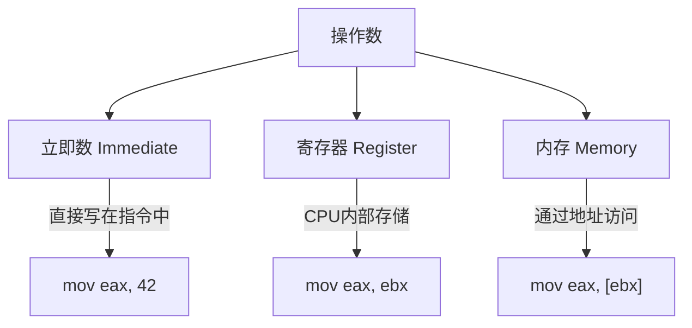

# 基本语法与指令格式

## 汇编源程序的结构

一个完整的 NASM 汇编源程序由**段**（Section）组成。就像一篇文章有标题、正文和注释一样，汇编程序也有自己的"段落分工"：

```nasm
; ============================================
; 程序名: template.asm
; 功能: 汇编程序模板
; ============================================

section .data           ; 数据段 - 已初始化的全局数据
    msg db 'Hello', 0

section .bss            ; BSS段 - 未初始化的全局数据
    buffer resb 64

section .text           ; 代码段 - 指令序列
    global _start

_start:
    ; 程序逻辑写在这里
    mov eax, 1
    xor ebx, ebx
    int 0x80
```


### 三大段详解

| 段名 | 关键字 | 内容 | 内存属性 |
|------|--------|------|---------|
| 数据段 | `.data` | 有初始值的变量、字符串 | 可读可写 |
| BSS段 | `.bss` | 未初始化的缓冲区 | 可读可写（运行时清零） |
| 代码段 | `.text` | 机器指令 | 可读可执行 |

::: tip .data vs .bss
`.data` 中的数据在可执行文件中占空间，`.bss` 中的数据不占——链接器只记录大小，运行时由操作系统清零。所以大缓冲区应放在 `.bss` 中。
:::

## 指令格式

x86 汇编指令的一般格式：

```
[标号:] 助记符 [操作数1[, 操作数2]] [; 注释]
```

### 各部分解析

**标号（Label）**：标记指令或数据的地址，相当于给内存位置起了名字。

```nasm
loop_start:              ; 这就是一个标号
    add eax, 1
    jmp loop_start       ; 跳转到标号处
```

**助记符（Mnemonic）**：指令的操作码，如 `mov`、`add`、`jmp`。

**操作数（Operand）**：指令操作的对象，可以有 0-3 个。

```nasm
ret                  ; 0个操作数
inc eax              ; 1个操作数
mov eax, ebx         ; 2个操作数
imul eax, ebx, 5     ; 3个操作数（某些指令支持）
```

## 操作数的类型

操作数是汇编指令的核心，理解操作数的类型就是理解指令如何工作。



### 立即数（Immediate）

直接写在指令中的常量值：

```nasm
mov eax, 42           ; 十进制立即数
mov eax, 0x2A         ; 十六进制立即数
mov eax, 0b101010     ; 二进制立即数
mov eax, 'A'          ; 字符立即数（等于 0x41）
```

::: warning 立即数不能作为目的操作数
`mov 42, eax` 是非法的——你不能向一个常量"写入"。立即数只能出现在源操作数位置。
:::

### 寄存器操作数

直接使用 CPU 寄存器名：

```nasm
mov eax, ebx          ; 寄存器到寄存器
mov eax, 100          ; 立即数到寄存器
```

### 内存操作数

通过方括号 `[]` 引用内存地址，这是汇编中最灵活也最容易出错的部分：

```nasm
; 直接寻址 - 使用标号
mov eax, [myVar]              ; 读取 myVar 地址处的 32 位值

; 寄存器间接寻址
mov eax, [ebx]                ; EBX 中的值作为地址

; 基址+偏移寻址
mov eax, [ebx + 4]            ; EBX + 4 作为地址

; 基址+索引*比例+偏移（最通用形式）
mov eax, [ebx + ecx*4 + 8]   ; 完整寻址公式
```

::: important 寻址公式
x86 最通用的内存寻址公式：`[base + index * scale + displacement]`
- base：基址寄存器（任何通用寄存器）
- index：索引寄存器（除 ESP 外的任何通用寄存器）
- scale：比例因子（1/2/4/8）
- displacement：常量偏移

这个公式完美支持数组访问：`array[i]` → `[array_base + i * element_size]`
:::

## 数据大小与类型推断

x86 指令可以操作不同大小的数据（8/16/32/64 位）。NASM 需要知道操作数的大小：

### 明确指定大小

当指令无法推断操作数大小时（如内存到内存的操作不存在，但向内存写立即数时），需要用 `byte/word/dword` 指定：

```nasm
mov byte [buffer], 0x41       ; 写入 1 字节
mov word [buffer], 0x4142     ; 写入 2 字节
mov dword [buffer], 0x41424344 ; 写入 4 字节
```

### 自动推断

当操作数中有一个是寄存器时，大小可自动推断：

```nasm
mov [buffer], eax             ; 自动推断为 dword（因为 EAX 是 32 位）
mov [buffer], al              ; 自动推断为 byte（因为 AL 是 8 位）
```

| 关键字 | 大小 | C 语言对应 |
|--------|------|-----------|
| `byte` | 1 字节 | `char` |
| `word` | 2 字节 | `short` |
| `dword` | 4 字节 | `int` |
| `qword` | 8 字节 | `long long` |

## 常用伪指令

### equ - 定义常量

```nasm
EXIT_OK   equ 0
SYS_WRITE equ 4
msg_len   equ $ - msg        ; $ 表示当前地址，计算字符串长度
```

`equ` 不分配内存，仅在编译时做文本替换。

### times - 重复

```nasm
times 10 db 0                ; 10 个零字节
times 5 nop                  ; 5 条 NOP 指令（填充/对齐用）
```

### global - 声明全局符号

```nasm
global _start                ; 告诉链接器入口点
global my_function           ; 允许外部文件调用此函数
```

### extern - 引用外部符号

```nasm
extern printf                ; 引用 C 标准库函数
```

## 注释规范

良好的注释习惯对汇编尤其重要——因为没有注释的汇编代码几乎不可读：

```nasm
; ============================================
; 函数: calculate_sum
; 输入: ECX = 数组长度, ESI = 数组地址
; 输出: EAX = 数组元素之和
; 破坏: ECX, ESI
; ============================================
calculate_sum:
    xor eax, eax              ; sum = 0
.sum_loop:
    add eax, [esi]            ; sum += *ptr
    add esi, 4                ; ptr++（4字节元素）
    dec ecx                   ; count--
    jnz .sum_loop             ; if count != 0, continue
    ret
```

::: tip NASM 局部标号
以 `.` 开头的标号是**局部标号**，如 `.sum_loop`。它属于上一个非局部标号 `calculate_sum` 的作用域。不同函数中可以有同名局部标号而不会冲突。
:::

## 完整示例：数组求和

```nasm
; array_sum.asm - 数组求和程序
; 编译: nasm -f elf32 array_sum.asm -o array_sum.o
; 链接: gcc -m32 array_sum.o -o array_sum -nostdlib
; 运行: ./array_sum; echo $?

section .data
    array dd 10, 20, 30, 40, 50   ; 5 个 32 位整数
    array_len equ ($ - array) / 4  ; 元素个数

section .text
    global _start

_start:
    ; 设置参数
    mov esi, array              ; 数组基地址
    mov ecx, array_len          ; 元素个数

    ; 调用求和函数
    call sum_array

    ; EAX 中为求和结果，作为退出码
    ; 退出码范围 0-255，10+20+30+40+50=150
    mov ebx, eax
    mov eax, 1
    int 0x80

; ============================================
; sum_array - 32位整数数组求和
; 输入: ESI = 数组地址, ECX = 元素个数
; 输出: EAX = 和
; ============================================
sum_array:
    xor eax, eax               ; sum = 0
.loop:
    test ecx, ecx              ; 检查计数器
    jz .done                   ; 为零则结束
    add eax, [esi]             ; 累加当前元素
    add esi, 4                 ; 移动到下一个元素
    dec ecx                    ; 计数器递减
    jmp .loop                  ; 继续循环
.done:
    ret
```

验证：

```bash
./array_sum
echo $?           # 输出 150 (10+20+30+40+50)
```

## 小结


::: tip 面试要点
- x86 通用寻址公式：`[base + index*scale + disp]`，支持数组的高效访问
- NASM 中 `[]` 表示内存引用，不加 `[]` 表示值本身
- `equ` 不分配内存，是编译时常量
- 局部标号以 `.` 开头，作用域限定在最近的非局部标号内
- 数据大小用 `byte/word/dword` 指定，有寄存器操作数时可自动推断
:::

::: info 原著参考
本章内容参考自《汇编语言：基于Linux环境（第3版）》Jeff Duntemann 第4章"Location, Location, Location"及第5章"The Right to Assemble"。书中详细讲解了 NASM 语法规则和寻址模式。
:::
