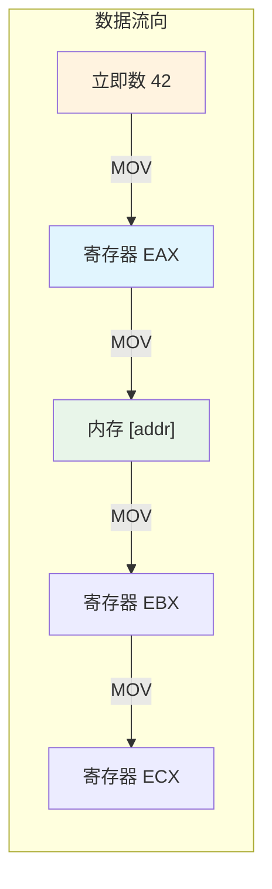
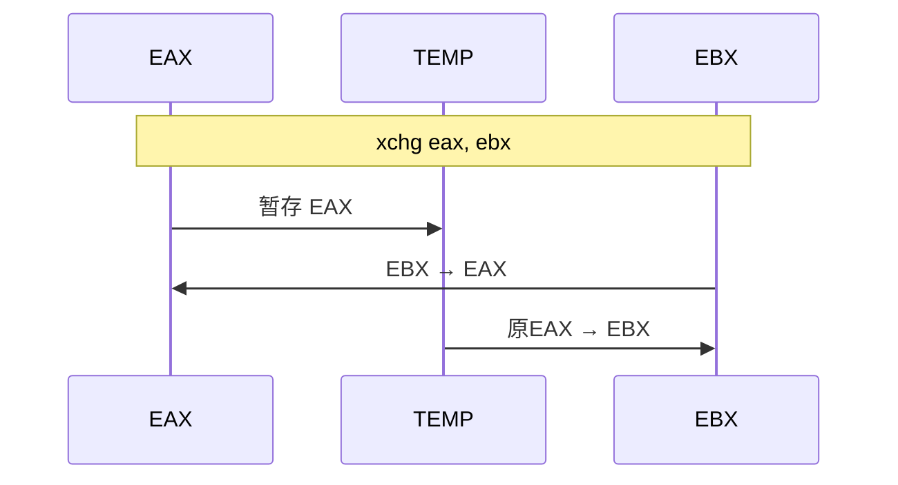
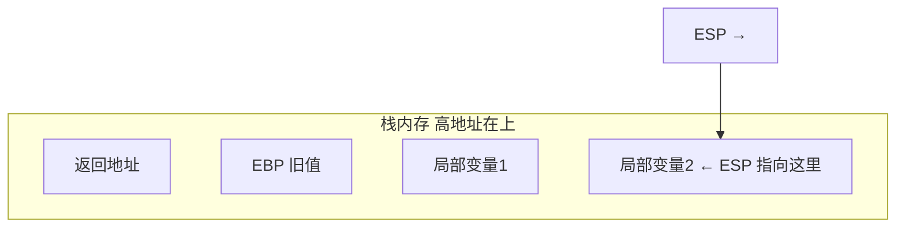
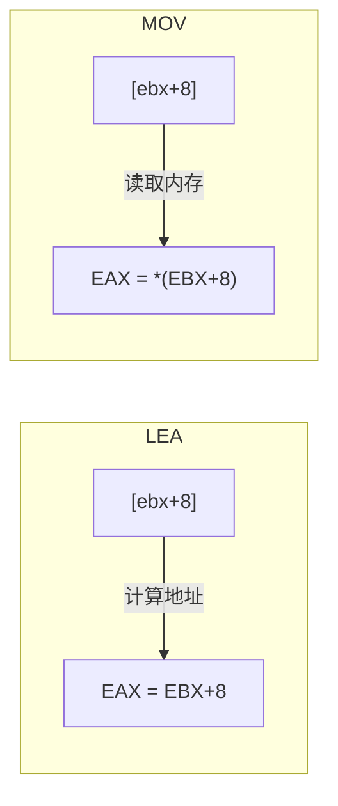
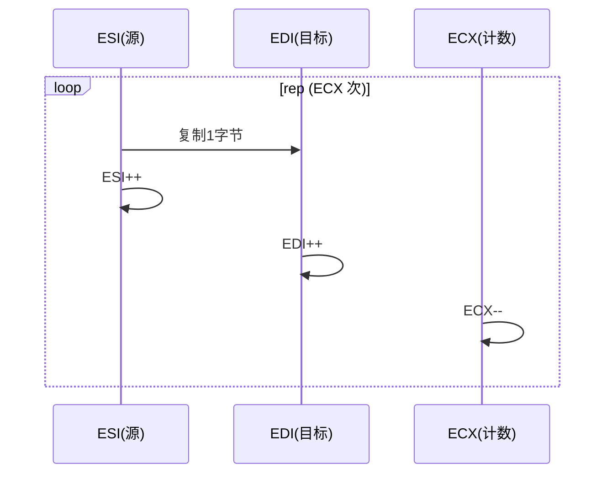

# 数据传送指令

## MOV：汇编世界的"快递员"

如果说汇编指令是一支乐队，`MOV` 就是那个负责搬运乐器的后勤人员——它不改变数据本身，只负责把数据从一个地方搬到另一个地方。但正因为搬运是一切操作的基础，`MOV` 是你用得最多的指令。



## MOV 指令详解

### 基本格式

```nasm
mov dest, src       ; dest ← src
```

::: important MOV 的铁律
1. **不能两个操作数都是内存**——x86 不允许内存到内存的直接传送
2. **立即数只能做源操作数**——`mov 42, eax` 非法
3. **操作数大小必须一致**——`mov eax, bl` 非法（32 位 vs 8 位）
:::

### 合法与非法 MOV 示例

```nasm
; ✅ 合法
mov eax, 42              ; 立即数 → 寄存器
mov eax, ebx             ; 寄存器 → 寄存器
mov [addr], eax          ; 寄存器 → 内存
mov eax, [addr]          ; 内存 → 寄存器
mov word [addr], 42      ; 立即数 → 内存（需指定大小）

; ❌ 非法
mov [addr1], [addr2]     ; 内存 → 内存（不允许！）
mov 42, eax              ; 立即数做目标（不允许！）
mov eax, bl              ; 大小不匹配（32位 vs 8位）
```

### 内存到内存的替代方案

当确实需要内存到内存的传送时，借助寄存器中转：

```nasm
; 将 src_mem 的值复制到 dst_mem
mov eax, [src_mem]       ; 内存 → 寄存器
mov [dst_mem], eax       ; 寄存器 → 内存
```

## 扩展传送指令

### MOVZX - 零扩展传送

将小尺寸数据**零扩展**到大尺寸寄存器，高位全部填 0：

```nasm
movzx eax, byte [data]    ; 8位 → 32位，高位填0
movzx eax, word [data]    ; 16位 → 32位，高位填0
```

示例：

```nasm
; 假设 [data] 处的字节为 0xFF
movzx eax, byte [data]    ; EAX = 0x000000FF（无符号 255）
```

### MOVSX - 符号扩展传送

将小尺寸数据**符号扩展**到大尺寸寄存器，高位填符号位：

```nasm
movsx eax, byte [data]    ; 8位 → 32位，高位填符号位
movsx eax, word [data]    ; 16位 → 32位，高位填符号位
```

示例：

```nasm
; 假设 [data] 处的字节为 0xFF
movsx eax, byte [data]    ; EAX = 0xFFFFFFFF（有符号 -1）
```

::: warning MOVZX vs MOVSX 的选择
- 处理**无符号数**时用 `MOVZX`
- 处理**有符号数**时用 `MOVSX`
- 用错了会导致数据完全错误！`0xFF` 零扩展是 255，符号扩展是 -1
:::

## XCHG - 交换指令

不借助临时变量，直接交换两个操作数的值：

```nasm
xchg eax, ebx            ; 交换 EAX 和 EBX
xchg eax, [addr]         ; 交换 EAX 和内存中的值
```



::: tip XCHG 的原子性
`XCHG` 指令在与内存操作数一起使用时，会自动加锁（隐式 LOCK 前缀），是多线程同步的基础原语之一。
:::

## 栈操作指令

栈是一种**后进先出（LIFO）**的数据结构，ESP 始终指向栈顶。



### PUSH - 压栈

```nasm
push eax        ; ESP -= 4, [ESP] = EAX
push word 42    ; ESP -= 2, [ESP] = 42（16位压栈）
```

`push eax` 等价于：

```nasm
sub esp, 4
mov [esp], eax
```

### POP - 弹栈

```nasm
pop eax         ; EAX = [ESP], ESP += 4
```

`pop eax` 等价于：

```nasm
mov eax, [esp]
add esp, 4
```

### PUSHF / POPF - 标志寄存器操作

```nasm
pushf           ; 将 EFLAGS 压栈
popf            ; 从栈弹出到 EFLAGS
```

在需要保存/恢复标志位时使用，尤其是 `CMP` 等指令会修改标志位的情况。

::: important PUSH/POP 的操作数大小
在 32 位模式下，`push`/`pop` 默认操作 32 位（ESP 变化 4 字节）。如果操作数是 16 位，ESP 只变化 2 字节。不要混用不同大小的 push/pop，否则栈会失衡。
:::

## LEA - 加载有效地址

`LEA` 是一条经常被误解的指令。它的名字是"Load Effective Address"，但实际用途远不止加载地址：

```nasm
lea eax, [ebx + ecx*4 + 8]    ; EAX = EBX + ECX*4 + 8
```

::: tip LEA 的秘密
`LEA` 不访问内存！它只是计算方括号内的地址值，将结果存入目标寄存器。利用这一点，`LEA` 可以做**不修改标志位的算术运算**：

```nasm
; LEA 用于算术
lea eax, [eax + eax*2]    ; EAX *= 3（不修改标志位）
lea eax, [eax + 4]        ; EAX += 4（比 add eax,4 短，不修改标志位）
lea eax, [eax*8]          ; EAX *= 8
```
:::

### LEA vs MOV

```nasm
; MOV: 访问内存中存储的值
mov eax, [ebx + 8]        ; EAX = 内存地址(EBX+8)处的值

; LEA: 计算地址本身
lea eax, [ebx + 8]        ; EAX = EBX + 8（地址值）
```



## 数据传送实战：结构体字段访问

假设有如下 C 结构体：

```c
struct Person {
    int id;          // 偏移 0
    char name[32];   // 偏移 4
    int age;         // 偏移 36
};                   // 总大小 40
```

在汇编中访问字段：

```nasm
; person.asm - 结构体字段访问
; 编译: nasm -f elf32 person.asm -o person.o
; 链接: gcc -m32 person.o -o person -nostdlib

section .data
    ; 定义一个 Person 结构体实例
    person:
        .id   dd 1001
        .name times 32 db 0
        .age  dd 25

section .text
    global _start

_start:
    ; 读取 id 字段（偏移 0）
    mov eax, [person]                ; EAX = 1001

    ; 读取 age 字段（偏移 36）
    mov ebx, [person + 36]           ; EBX = 25

    ; 修改 age 字段
    mov dword [person + 36], 26      ; age = 26

    ; 用 LEA 获取 name 字段的地址
    lea ecx, [person + 4]            ; ECX = name 数组首地址

    ; 向 name 写入字符串 "Tom"
    mov byte [ecx], 'T'
    mov byte [ecx+1], 'o'
    mov byte [ecx+2], 'm'
    mov byte [ecx+3], 0

    ; 退出，返回 id 值
    mov ebx, [person]
    mov eax, 1
    int 0x80
```

## 批量传送：REP MOVSB

当需要大块内存复制时，使用字符串操作指令配合 REP 前缀：

```nasm
; 将 src 处的 100 字节复制到 dst
mov esi, src           ; 源地址
mov edi, dst           ; 目标地址
mov ecx, 100           ; 字节数
cld                    ; 清除方向标志（向前传送）
rep movsb              ; 逐字节复制，ECX 次
```



::: warning 方向标志 DF
- `CLD` 清除方向标志：ESI/EDI 递增（向前）
- `STD` 设置方向标志：ESI/EDI 递减（向后）
- 使用 `REP MOVSB` 前务必先 `CLD`，否则方向可能不确定
:::

## 小结

| 指令 | 功能 | 关键要点 |
|------|------|---------|
| `MOV` | 数据传送 | 禁止内存到内存 |
| `MOVZX` | 零扩展传送 | 无符号数扩展 |
| `MOVSX` | 符号扩展传送 | 有符号数扩展 |
| `XCHG` | 交换 | 内存操作具有原子性 |
| `PUSH/POP` | 栈操作 | LIFO，ESP 自动调整 |
| `LEA` | 加载有效地址 | 不访存，可做算术 |
| `REP MOVSB` | 批量复制 | 需设置 ESI/EDI/ECX/DF |

::: tip 面试要点
- MOV 不允许两个操作数都是内存地址，需要借助寄存器中转
- MOVZX 用于无符号数扩展，MOVSX 用于有符号数扩展
- LEA 不访问内存，只计算地址，可做不修改标志位的乘法和加法
- PUSH 使 ESP 减小，POP 使 ESP 增大（x86 栈向低地址增长）
- REP MOVSB 需要 CLD 清除方向标志，确保向前复制
:::

::: info 原著参考
本章内容参考自《汇编语言：基于Linux环境（第3版）》Jeff Duntemann 第7章"Following the Instructions"及第9章"Bits, Flags, Branches, and Tables"。书中用"寄存器是桌上的盒子，内存是墙上的架子"等比喻讲解数据传送。
:::
