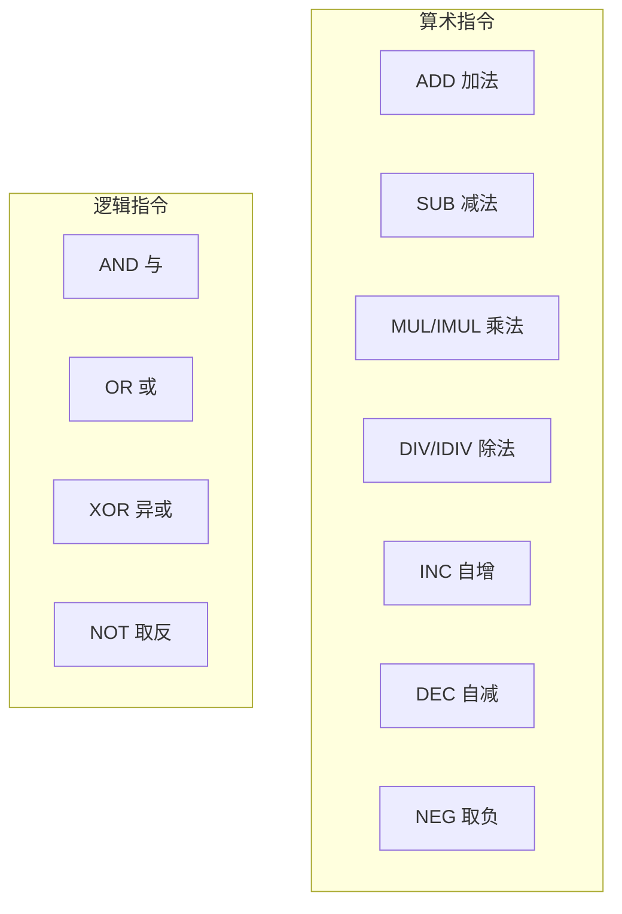
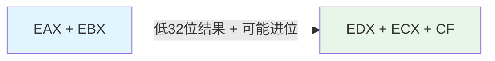
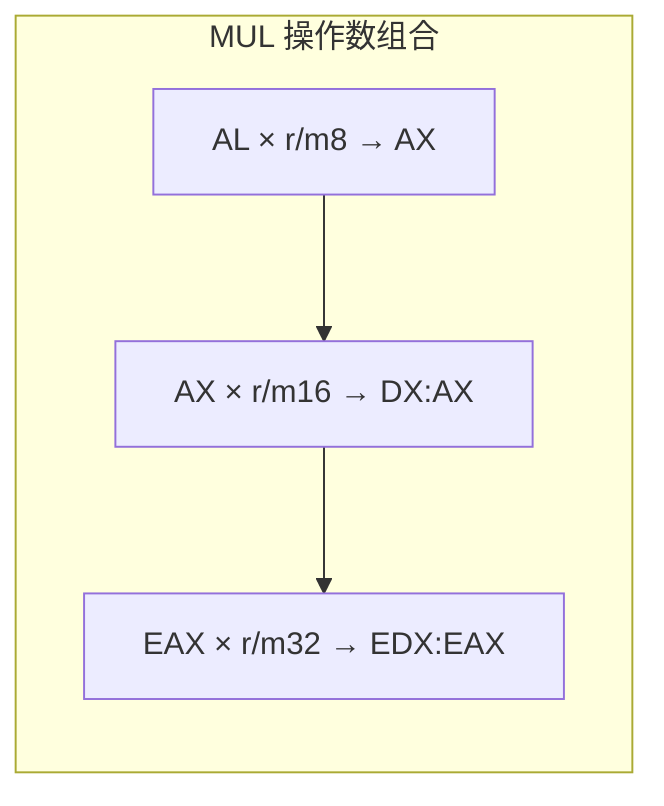
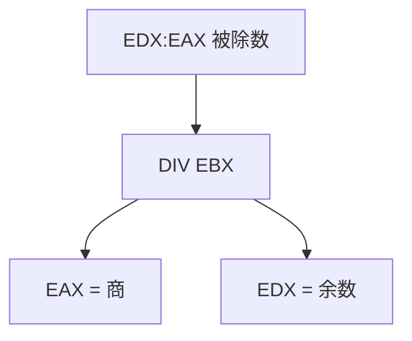
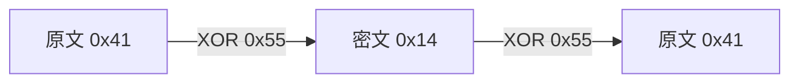

# 算术与逻辑指令

## 算术指令：CPU 的计算引擎

如果 MOV 是搬运工，算术指令就是 CPU 车间里的计算器——加、减、乘、除，以及取负，构成了数据处理的基本操作集。



## 加法与减法

### ADD - 加法

```nasm
add eax, 10          ; EAX = EAX + 10
add eax, ebx         ; EAX = EAX + EBX
add [counter], 1     ; 内存值加 1
```

ADD 影响所有算术标志位：CF（进位）、ZF（零）、SF（符号）、OF（溢出）。

### ADC - 带进位加法

用于实现**多精度加法**（大于 32 位的数相加）：

```nasm
; 64 位加法: EDX:EAX + ECX:EBX
add eax, ebx         ; 先加低 32 位
adc edx, ecx         ; 再加高 32 位 + 进位
```



### SUB - 减法

```nasm
sub eax, 10          ; EAX = EAX - 10
sub eax, ebx         ; EAX = EAX - EBX
```

### SBB - 带借位减法

与 ADC 对称，用于多精度减法：

```nasm
; 64 位减法: EDX:EAX - ECX:EBX
sub eax, ebx         ; 先减低 32 位
sbb edx, ecx         ; 再减高 32 位 - 借位
```

### INC / DEC - 自增与自减

```nasm
inc eax              ; EAX += 1
dec ecx              ; ECX -= 1
inc byte [counter]   ; 内存字节加 1
```

::: warning INC/DEC 不影响 CF
`INC` 和 `DEC` 会修改 ZF/SF/OF，但**不影响 CF**。这在循环计数时是优点——不会破坏之前的进位状态。但如果你的进位判断依赖 INC/DEC，就会出错。
:::

## 乘法

x86 的乘法比较特殊，因为两个 N 位数相乘的结果需要 2N 位来存储。

### MUL - 无符号乘法

```nasm
mul ebx              ; EDX:EAX = EAX * EBX（32位×32位 = 64位）
mul cx               ; DX:AX = AX * CX（16位×16位 = 32位）
mul byte [data]      ; AX = AL * [data]（8位×8位 = 16位）
```



::: important MUL 的固定操作数
`MUL` 的一个操作数是隐含的（AL/AX/EAX），结果存入固定位置。如果结果的高半部分非零，CF=OF=1，表示结果超出了低半部分的表示范围。
:::

### IMUL - 有符号乘法

IMUL 有三种形式：

```nasm
; 单操作数形式 - 与 MUL 格式相同，但有符号
imul ebx             ; EDX:EAX = EAX * EBX（有符号）

; 双操作数形式 - 结果存入目标寄存器
imul eax, ebx        ; EAX = EAX * EBX（截断为32位）

; 三操作数形式 - 最灵活
imul eax, ebx, 10    ; EAX = EBX * 10
imul eax, [array + ecx*4], 3  ; EAX = [array+ecx*4] * 3
```

::: tip IMUL 三操作数形式最实用
`imul dest, src, imm` 一次完成"取值→乘立即数→存结果"，非常适合计算数组偏移等场景。
:::

## 除法

### DIV - 无符号除法

```nasm
div ebx              ; EAX = EDX:EAX / EBX, EDX = EDX:EAX % EBX
div cx               ; AX = DX:AX / CX, DX = DX:AX % CX
div byte [data]      ; AL = AX / [data], AH = AX % [data]
```



### IDIV - 有符号除法

格式与 DIV 相同，但进行有符号除法：

```nasm
; 有符号除法前，需要先符号扩展被除数
mov eax, -100
cdq                   ; EAX 符号扩展到 EDX:EAX
idiv dword [divisor]  ; EAX = EDX:EAX / [divisor], EDX = 余数
```

::: warning 除法溢出（#DE 异常）
如果商超出了目标寄存器的表示范围（例如被 0 除，或被除数远大于除数），CPU 会触发**除法错误异常**（中断 0），程序崩溃。在除法前务必检查除数是否为零！
:::

### 符号扩展辅助指令

| 指令 | 操作 | 用途 |
|------|------|------|
| `CBW` | AL → AX（符号扩展） | 8 位有符号除法前 |
| `CWD` | AX → DX:AX（符号扩展） | 16 位有符号除法前 |
| `CDQ` | EAX → EDX:EAX（符号扩展） | 32 位有符号除法前 |
| `CQO` | RAX → RDX:RAX（符号扩展） | 64 位有符号除法前 |

## NEG - 取负

```nasm
neg eax              ; EAX = -EAX（用补码取负）
neg byte [data]      ; [data] = -[data]
```

等价于对操作数取反加一（补码操作）。

## 逻辑指令：位级操作

逻辑指令按位操作，是位掩码、标志设置的基础。

### AND - 按位与

```nasm
and eax, 0xFF        ; 保留低 8 位，其余清零（掩码操作）
and al, 0xDF         ; 清除第 5 位（小写转大写）
test eax, eax        ; TEST = AND 但不保存结果，只设标志位
```

### OR - 按位或

```nasm
or eax, 0x01         ; 设置最低位
or al, 0x20          ; 设置第 5 位（大写转小写）
```

### XOR - 按位异或

XOR 有几个经典用法：

```nasm
xor eax, eax         ; EAX = 0（最快的清零方式）
xor eax, eax         ; 比 mov eax, 0 短且快

; 交换两个寄存器（不用临时变量）
xor eax, ebx
xor ebx, eax
xor eax, ebx

; 加密/解密（XOR 同一个值两次恢复原文）
xor al, 0x55         ; 加密
xor al, 0x55         ; 解密（恢复原文）
```



### NOT - 按位取反

```nasm
not eax              ; EAX = ~EAX（逐位取反，不影响标志位）
```

::: important NOT vs NEG
- `NOT` 是按位取反（1的补码）
- `NEG` 是取负（2的补码 = 取反 + 1）
- `NOT 0x01` = `0xFE`，`NEG 0x01` = `0xFF`
:::

## TEST 指令

`TEST` 执行 AND 运算但不保存结果，只设置标志位。它是检查特定位是否为 1 的最高效方式：

```nasm
test eax, eax        ; 检查 EAX 是否为零（ZF=1 则为零）
test al, 0x80        ; 检查 AL 最高位是否为 1
test ecx, ecx        ; 常用于检查指针是否为 NULL
```

## 实战：冒泡排序

下面的程序用算术和逻辑指令实现数组排序：

```nasm
; bubble_sort.asm - 冒泡排序
; 编译: nasm -f elf32 bubble_sort.asm -o bubble_sort.o
; 链接: gcc -m32 bubble_sort.o -o bubble_sort -nostdlib

section .data
    array dd 64, 25, 12, 22, 11      ; 待排序数组
    len   equ ($ - array) / 4        ; 元素个数 = 5

section .text
    global _start

_start:
    mov ecx, len                     ; 外层循环计数
    dec ecx                          ; n-1 轮

.outer_loop:
    push ecx                         ; 保存外层计数
    mov esi, 0                       ; 内层索引

.inner_loop:
    mov eax, [array + esi*4]         ; array[i]
    mov ebx, [array + esi*4 + 4]    ; array[i+1]
    cmp eax, ebx                     ; 比较
    jle .no_swap                     ; 如果 array[i] <= array[i+1]，不交换

    ; 交换 array[i] 和 array[i+1]
    mov [array + esi*4], ebx
    mov [array + esi*4 + 4], eax

.no_swap:
    inc esi                          ; i++
    dec ecx                          ; 内层计数--
    jnz .inner_loop                  ; 内层循环

    pop ecx                          ; 恢复外层计数
    dec ecx                          ; 外层计数--
    jnz .outer_loop                  ; 外层循环

    ; 排序完成，数组为 11, 12, 22, 25, 64
    ; 用第一个元素作为退出码
    mov ebx, [array]                 ; EBX = 11
    mov eax, 1
    int 0x80
```

验证：

```bash
./bubble_sort; echo $?    # 输出 11（最小值）
```

## 实战：ASCII 数字转整数

```nasm
; atoi.asm - ASCII字符串转整数
; 输入: ESI = 字符串地址
; 输出: EAX = 整数值

atoi:
    xor eax, eax               ; result = 0
    xor ebx, ebx               ; 清零（用于暂存字符）

.loop:
    mov bl, [esi]              ; 读取一个字符
    test bl, bl                ; 是否为 null 终止符？
    jz .done
    sub bl, '0'                ; ASCII → 数字 ('0'=0x30)
    cmp bl, 9                  ; 检查是否为有效数字
    ja .done                   ; 非数字字符则结束

    imul eax, eax, 10         ; result *= 10
    add eax, ebx               ; result += digit
    inc esi                    ; 移动到下一个字符
    jmp .loop

.done:
    ret
```

## 小结

| 类别 | 指令 | 关键点 |
|------|------|--------|
| 加法 | ADD/ADC/INC | ADC 用于多精度 |
| 减法 | SUB/SBB/DEC | SBB 用于多精度 |
| 乘法 | MUL/IMUL | IMUL 三操作数形式最灵活 |
| 除法 | DIV/IDIV | 必须先符号扩展，防除零异常 |
| 取负 | NEG | 补码取反+1 |
| 逻辑 | AND/OR/XOR/NOT | XOR 清零最快，XOR 加密可逆 |
| 测试 | TEST | 等效 AND 但不存结果 |

::: tip 面试要点
- `MUL` 是无符号乘法，结果在 EDX:EAX；`IMUL` 有三种形式，三操作数形式最实用
- 除法前必须用 `CDQ` 等指令做符号扩展，否则结果错误
- `INC/DEC` 不影响 CF 标志位
- `XOR reg, reg` 是最快的清零方式（比 `MOV reg, 0` 更优）
- `TEST` 等效于 `AND` 但不修改操作数，常用于检查零值和位状态
- `NEG` 是补码取负（取反+1），`NOT` 是逐位取反
:::

::: info 原著参考
本章内容参考自《汇编语言：基于Linux环境（第3版）》Jeff Duntemann 第7章"Following the Instructions"及第8章"Our Object All Sublime"。书中详细讲解了算术指令的标志位行为和溢出判断。
:::
