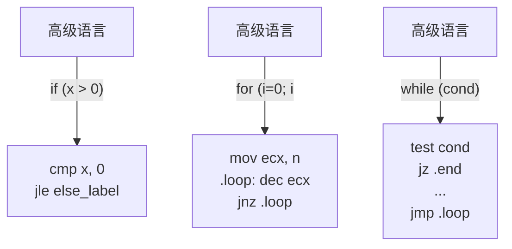
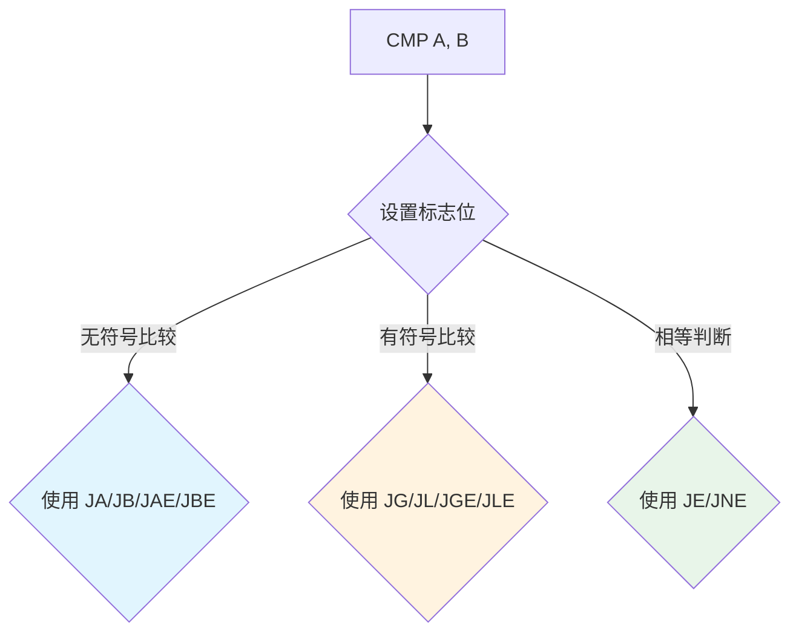
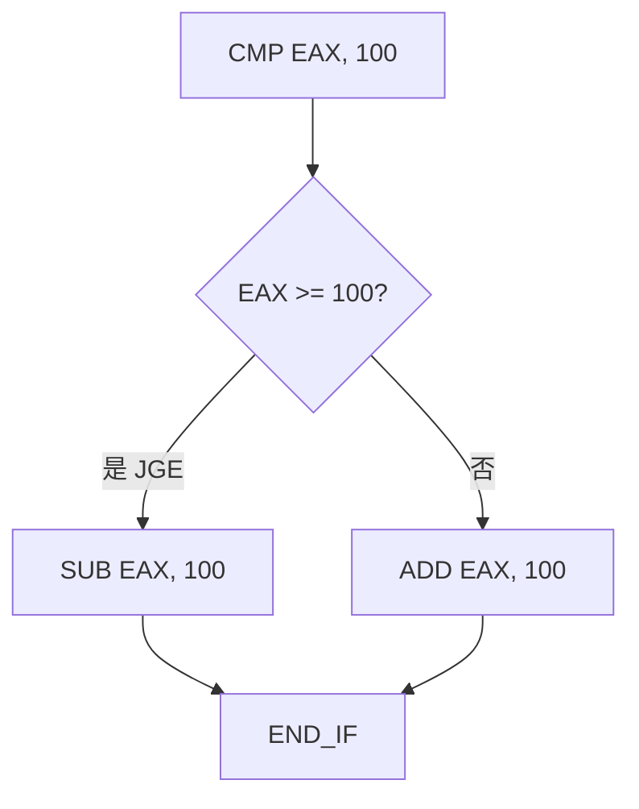
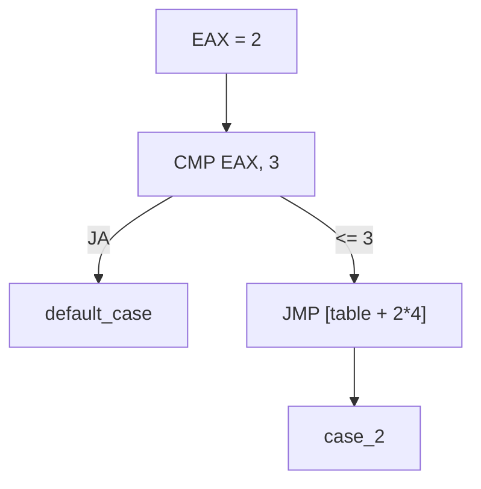
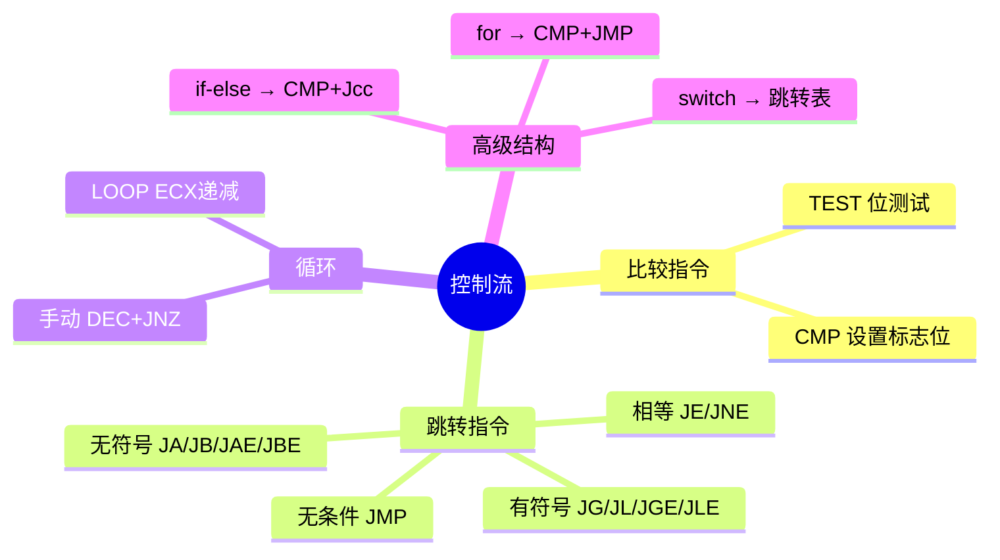

# 控制流指令

## 没有if的世界

高级语言中，`if/else/for/while` 是控制程序流向的基本结构。但在汇编中，**没有这些语法糖**——一切控制流都由 `CMP`、标志位和**跳转指令**实现。

理解这一点就像从自动驾驶切换到手动挡：你不再说"如果下雨就开雨刷"，而是说"检查雨量传感器，如果值 > 阈值，跳转到开雨刷的代码"。



## CMP - 比较指令

`CMP` 是所有条件跳转的前提——它做减法但不保存结果，只设置标志位：

```nasm
cmp eax, ebx         ; 计算 EAX - EBX，设置标志位
```

| 关系 | EAX vs EBX | ZF | CF | SF | OF |
|------|-----------|-----|-----|-----|-----|
| EAX = EBX | 差为 0 | 1 | 0 | 0 | 0 |
| EAX > EBX（无符号） | 差 > 0，无借位 | 0 | 0 | - | - |
| EAX < EBX（无符号） | 差 < 0，有借位 | 0 | 1 | - | - |

::: important CMP vs SUB
`CMP` 和 `SUB` 做同样的减法运算，但 `CMP` 不保存结果到目的操作数。`CMP` 的作用纯粹是设置标志位。
:::

## 无条件跳转：JMP

```nasm
jmp label            ; 直接跳转，无条件
jmp eax              ; 间接跳转，跳转到 EAX 中的地址
jmp [addr]           ; 间接跳转，跳转到内存中存储的地址
```

`JMP` 是汇编版的 `goto`——它不做任何判断，直接改变 EIP（指令指针）。

## 条件跳转：Jcc 指令族

条件跳转根据 EFLAGS 的状态决定是否跳转。这是汇编实现分支逻辑的核心。

### 无符号条件跳转

| 指令 | 含义 | 判断条件 | 助记 |
|------|------|---------|------|
| `JA` | Above（大于） | CF=0 且 ZF=0 | **A**bove |
| `JAE` | Above or Equal（大于等于） | CF=0 | **A**bove/**E**qual |
| `JB` | Below（小于） | CF=1 | **B**elow |
| `JBE` | Below or Equal（小于等于） | CF=1 或 ZF=1 | **B**elow/**E**qual |
| `JE` / `JZ` | Equal / Zero | ZF=1 | **E**qual / **Z**ero |
| `JNE` / `JNZ` | Not Equal / Not Zero | ZF=0 | **N**ot **E**qual |

### 有符号条件跳转

| 指令 | 含义 | 判断条件 | 助记 |
|------|------|---------|------|
| `JG` | Greater（大于） | ZF=0 且 SF=OF | **G**reater |
| `JGE` | Greater or Equal（大于等于） | SF=OF | **G**reater/**E**qual |
| `JL` | Less（小于） | SF≠OF | **L**ess |
| `JLE` | Less or Equal（小于等于） | ZF=1 或 SF≠OF | **L**ess/**E**qual |



::: warning 无符号 vs 有符号跳转——最常见的坑
`JA/JB` 和 `JG/JL` 判断的标志位完全不同！用错会导致逻辑错误。

```nasm
cmp eax, -1          ; EAX = 0xFFFFFFFF, -1 = 0xFFFFFFFF
ja  above_label      ; 无符号: 0xFFFFFFFF > -1 → 跳转！（视作 4294967295 > 4294967295 → 不跳转）
                    ; 实际上 0xFFFFFFFF 看作无符号是 4294967295，-1 也被看作 4294967295，相等
jg  greater_label    ; 有符号: -1 > -1 → 不跳转（正确）
```

**铁律**：比较无符号数用 JA/JB/JAE/JBE，比较有符号数用 JG/JL/JGE/JLE。
:::

## 单标志位跳转

| 指令 | 条件 | 用途 |
|------|------|------|
| `JC` | CF=1 | 检测进位/借位 |
| `JNC` | CF=0 | 检测无进位 |
| `JZ` / `JE` | ZF=1 | 检测零/相等 |
| `JNZ` / `JNE` | ZF=0 | 检测非零/不等 |
| `JS` | SF=1 | 检测负数 |
| `JNS` | SF=0 | 检测正数 |
| `JO` | OF=1 | 检测有符号溢出 |
| `JNO` | OF=0 | 检测无溢出 |

## 循环指令：LOOP

`LOOP` 是一个简化的循环控制指令，自动递减 ECX 并判断：

```nasm
mov ecx, 10          ; 循环 10 次
.loop:
    ; 循环体
    loop .loop       ; ECX--, 如果 ECX != 0 则跳转
```

等价于：

```nasm
.loop:
    ; 循环体
    dec ecx
    jnz .loop
```

::: tip LOOP 的局限
- `LOOP` 固定使用 ECX，不够灵活
- `LOOP` 不影响标志位
- 在现代 CPU 上，`dec ecx + jnz` 可能比 `loop` 更快
- 如果循环体修改了 ECX，就不能用 LOOP
:::

## 实现高级控制结构

### if-else

```c
// C 代码
if (eax >= 100) {
    eax = eax - 100;
} else {
    eax = eax + 100;
}
```

```nasm
; 汇编实现
    cmp eax, 100
    jge .then_block
.else_block:
    add eax, 100
    jmp .end_if
.then_block:
    sub eax, 100
.end_if:
```



### for 循环

```c
// C 代码
for (int i = 0; i < n; i++) {
    sum += array[i];
}
```

```nasm
; 汇编实现
    xor eax, eax               ; sum = 0
    xor ecx, ecx               ; i = 0
.for_loop:
    cmp ecx, [n]               ; i < n ?
    jge .for_end
    add eax, [array + ecx*4]   ; sum += array[i]
    inc ecx                    ; i++
    jmp .for_loop
.for_end:
```

### while 循环

```c
// C 代码
while (x != 0) {
    x = x / 2;
    count++;
}
```

```nasm
; 汇编实现
    mov ecx, 0                 ; count = 0
.while_loop:
    cmp dword [x], 0
    je .while_end              ; x == 0 则退出
    shr dword [x], 1           ; x /= 2（算术右移）
    inc ecx                    ; count++
    jmp .while_loop
.while_end:
```

### switch-case（跳转表）

对于多分支情况，跳转表比级联 if-else 更高效：

```nasm
; 跳转表实现 switch-case
section .data
    ; 跳转表：存储各 case 的地址
    jump_table dd case_0, case_1, case_2, case_3

section .text
    ; EAX = case 值 (0-3)
    cmp eax, 3
    ja default_case            ; 超出范围
    jmp [jump_table + eax*4]  ; 跳转到对应 case

case_0:
    ; 处理 case 0
    jmp switch_end
case_1:
    ; 处理 case 1
    jmp switch_end
case_2:
    ; 处理 case 2
    jmp switch_end
case_3:
    ; 处理 case 3
    jmp switch_end
default_case:
    ; 默认处理
switch_end:
```



## 实战：二分查找

```nasm
; binary_search.asm - 二分查找
; 在已排序数组中查找目标值
; 输入: EAX = 目标值
; 输出: EAX = 索引（找到）或 -1（未找到）

section .data
    array dd 10, 20, 30, 40, 50, 60, 70, 80, 90, 100
    len   equ ($ - array) / 4

section .text
    global _start

_start:
    ; 查找 60
    mov eax, 60
    call binary_search
    ; EAX = 5（索引）

    mov ebx, eax
    mov eax, 1
    int 0x80

binary_search:
    ; 保存目标值
    push eax

    mov ecx, 0                   ; low = 0
    mov edx, len - 1             ; high = len - 1

.search_loop:
    cmp ecx, edx
    jg .not_found                ; low > high → 未找到

    ; mid = (low + high) / 2
    mov eax, ecx
    add eax, edx
    shr eax, 1                   ; EAX = mid
    mov esi, eax                 ; ESI = mid

    ; 比较 array[mid] 与目标
    mov edi, [array + esi*4]
    cmp edi, [esp]               ; 与栈上的目标值比较
    je .found                    ; 相等 → 找到
    jl .search_high              ; array[mid] < target → 搜索右半

    ; array[mid] > target → 搜索左半
    lea edx, [esi - 1]           ; high = mid - 1
    jmp .search_loop

.search_high:
    lea ecx, [esi + 1]           ; low = mid + 1
    jmp .search_loop

.found:
    mov eax, esi                 ; 返回索引
    add esp, 4                   ; 清理栈
    ret

.not_found:
    mov eax, -1                  ; 返回 -1
    add esp, 4
    ret
```

## 实战：斐波那契数列

```nasm
; fibonacci.asm - 计算第 N 个斐波那契数
; 编译: nasm -f elf32 fibonacci.asm -o fibonacci.o
; 链接: gcc -m32 fibonacci.o -o fibonacci -nostdlib

section .data
    n dd 10                      ; 计算第 10 个斐波那契数

section .text
    global _start

_start:
    mov ecx, [n]                 ; N
    call fib
    ; EAX = F(10) = 55

    mov ebx, eax
    mov eax, 1
    int 0x80

; ============================================
; fib - 计算第 N 个斐波那契数（迭代法）
; 输入: ECX = N
; 输出: EAX = F(N)
; ============================================
fib:
    cmp ecx, 0
    je .fib_zero
    cmp ecx, 1
    je .fib_one

    mov eax, 0                   ; a = F(0) = 0
    mov edx, 1                   ; b = F(1) = 1

.fib_loop:
    mov ebx, eax
    add ebx, edx                 ; temp = a + b
    mov eax, edx                 ; a = b
    mov edx, ebx                 ; b = temp
    dec ecx
    cmp ecx, 1
    jg .fib_loop

    mov eax, edx                 ; 返回 b
    ret

.fib_zero:
    xor eax, eax                 ; F(0) = 0
    ret

.fib_one:
    mov eax, 1                   ; F(1) = 1
    ret
```

验证：

```bash
./fibonacci; echo $?    # 输出 55 (F(10)=55)
```

## 小结



::: tip 面试要点
- CMP 做减法设标志位，不保存结果；TEST 做 AND 设标志位，不保存结果
- 无符号比较用 JA/JB 系列，有符号比较用 JG/JL 系列——用错是经典 bug
- LOOP 指令自动递减 ECX，但现代代码更常用 `dec + jnz`
- switch-case 可用跳转表实现，O(1) 时间复杂度
- 条件跳转是短距离跳转（-128~+127 字节），长距离需要反条件跳转+JMP 组合
:::

::: info 原著参考
本章内容参考自《汇编语言：基于Linux环境（第3版）》Jeff Duntemann 第9章"Bits, Flags, Branches, and Tables"。书中用"记分牌"比喻标志位，并详细讲解了跳转表的技术。
:::
