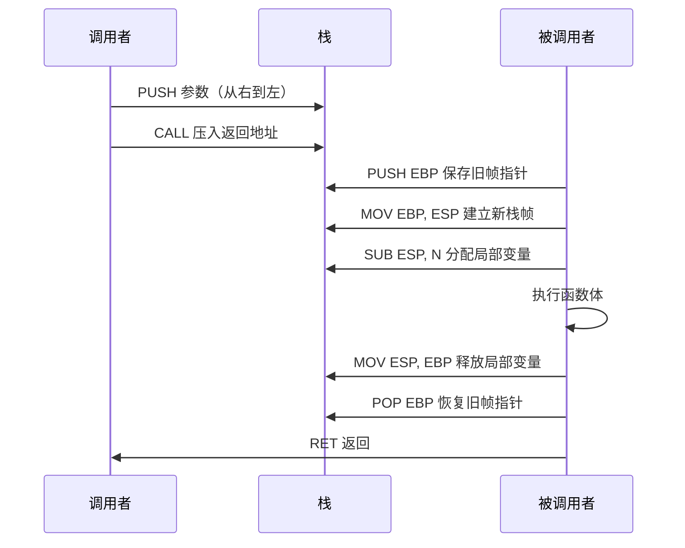
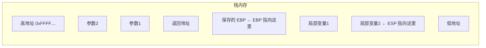
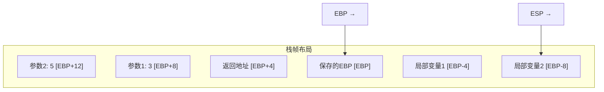
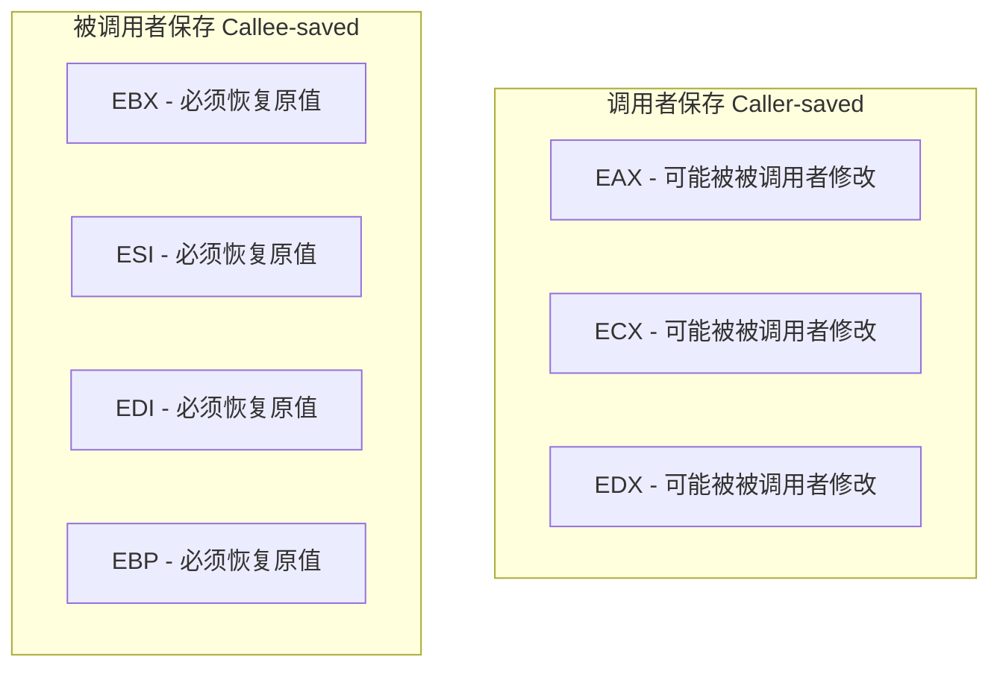
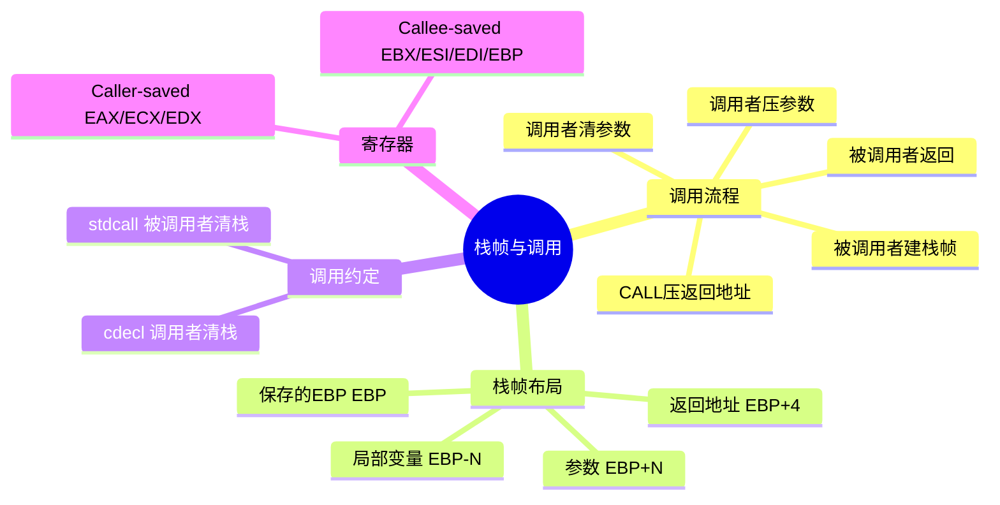

# 栈帧与过程调用

## 函数调用的底层真相

在 C 语言中写 `result = add(3, 5)` 只是一行代码，但在 CPU 层面，这行代码引发了一连串精密的操作：保存当前执行位置、传递参数、跳转、执行、返回结果、恢复现场。这一切都依赖**栈**和**栈帧**机制。

如果把函数调用比作寄信，栈帧就是信封——上面写着寄信人地址（返回地址）、信件内容（参数和局部变量），确保信件能准确送达和回复。



## 栈的工作原理

### 栈的生长方向

x86 的栈向**低地址方向增长**：



::: important 栈的双指针
- **ESP（栈指针）**：始终指向栈顶（最后压入的数据），随 PUSH/POP 自动移动
- **EBP（帧指针）**：指向当前栈帧的固定基准点，函数执行期间不变
:::

### 为什么需要 EBP？

ESP 在函数执行过程中会不断变化（PUSH/POP），而参数和局部变量需要稳定的访问基准。EBP 就是这个"锚点"：

- 参数通过 `[EBP + 8]`、`[EBP + 12]` 等正偏移访问
- 局部变量通过 `[EBP - 4]`、`[EBP - 8]` 等负偏移访问

## CALL 和 RET 指令

### CALL - 调用函数

```nasm
call my_function     ; 等价于: push eip_next; jmp my_function
```

CALL 做两件事：
1. 将下一条指令的地址（返回地址）压入栈中
2. 跳转到目标函数

### RET - 返回调用者

```nasm
ret                  ; 等价于: pop eip; jmp eip
ret 8                ; 返回并清理 8 字节参数（stdcall 约定）
```

RET 从栈顶弹出返回地址，跳转回去。

## 函数调用的标准流程

### 调用者（Caller）的职责

```nasm
; 1. 保存调用者保存的寄存器（如果需要）
push eax             ; 可选：保存 EAX

; 2. 压入参数（从右到左，cdecl 约定）
push dword 5         ; 第二个参数
push dword 3         ; 第一个参数

; 3. 调用函数
call add_numbers

; 4. 清理参数（cdecl 由调用者清理）
add esp, 8           ; 2 个参数 × 4 字节 = 8

; 5. 使用返回值（EAX 中）
; EAX = add_numbers 的返回值

; 6. 恢复调用者保存的寄存器
pop eax              ; 可选：恢复 EAX
```

### 被调用者（Callee）的职责

```nasm
add_numbers:
    ; =========== 序言 (Prologue) ===========
    push ebp                ; 保存调用者的帧指针
    mov ebp, esp            ; 建立新栈帧
    sub esp, 8              ; 分配局部变量空间（2个4字节变量）

    ; =========== 函数体 ===========
    ; 访问参数: [ebp+8] = 第1个参数, [ebp+12] = 第2个参数
    mov eax, [ebp+8]        ; 取出参数1
    add eax, [ebp+12]       ; 加上参数2
    ; EAX 现在是返回值

    ; =========== 结语 (Epilogue) ===========
    mov esp, ebp            ; 释放局部变量
    pop ebp                 ; 恢复调用者的帧指针
    ret                     ; 返回
```

## 栈帧布局详解

调用 `add_numbers(3, 5)` 后的栈帧：

```
高地址
┌──────────────────┐
│    参数2: 5       │ [EBP + 12]
├──────────────────┤
│    参数1: 3       │ [EBP + 8]
├──────────────────┤
│    返回地址       │ [EBP + 4]
├──────────────────┤
│    保存的 EBP     │ [EBP] ← EBP 指向这里
├──────────────────┤
│  局部变量1        │ [EBP - 4]
├──────────────────┤
│  局部变量2        │ [EBP - 8] ← ESP 指向这里
└──────────────────┘
低地址
```



::: tip 偏移量速记
- 返回地址在 `[EBP + 4]`（EBP 上方第一个位置）
- 第一个参数在 `[EBP + 8]`（跳过 EBP 和返回地址）
- 局部变量在 `[EBP - N]`（EBP 下方）
:::

## 调用约定

### cdecl（C 默认调用约定）

| 规则 | 说明 |
|------|------|
| 参数传递 | 从右到左压栈 |
| 栈清理 | **调用者**负责（`add esp, N`） |
| 返回值 | 存入 EAX |
| 调用者保存 | EAX, ECX, EDX |
| 被调用者保存 | EBX, ESI, EDI, EBP |

### stdcall（Windows API 使用）

| 规则 | 说明 |
|------|------|
| 参数传递 | 从右到左压栈 |
| 栈清理 | **被调用者**负责（`ret N`） |
| 返回值 | 存入 EAX |

::: warning 调用约定不匹配的后果
如果调用者期望自己清理栈（cdecl），但被调用者用 `ret 8` 清理了（stdcall），栈指针会偏移 8 字节，导致程序崩溃。混合编程时务必统一调用约定。
:::

## 寄存器保存规则



**规则**：
- 如果调用者需要保留 EAX/ECX/EDX 的值，调用前自己 PUSH 保存
- 被调用者如果使用 EBX/ESI/EDI，必须在使用前 PUSH，返回前 POP 恢复

## 实战：完整函数调用示例

```nasm
; func_call.asm - 完整的函数调用演示
; 编译: nasm -f elf32 func_call.asm -o func_call.o
; 链接: gcc -m32 func_call.o -o func_call -nostdlib

section .data
    result dd 0

section .text
    global _start

_start:
    ; 调用 max(42, 17)
    push dword 17            ; 第二个参数（从右到左）
    push dword 42            ; 第一个参数
    call max
    add esp, 8               ; cdecl: 调用者清理参数

    mov [result], eax        ; 保存返回值（EAX = 42）

    ; 调用 factorial(5)
    push dword 5
    call factorial
    add esp, 4               ; 清理 1 个参数

    ; EAX = 120 (5!)
    mov ebx, eax
    mov eax, 1
    int 0x80

; ============================================
; max - 返回两个整数中的较大值
; 输入: [ebp+8] = a, [ebp+12] = b
; 输出: EAX = max(a, b)
; ============================================
max:
    push ebp
    mov ebp, esp

    mov eax, [ebp+8]         ; a
    cmp eax, [ebp+12]        ; a vs b
    jge .max_done
    mov eax, [ebp+12]        ; b 更大，返回 b

.max_done:
    mov esp, ebp
    pop ebp
    ret

; ============================================
; factorial - 计算阶乘（迭代版）
; 输入: [ebp+8] = n
; 输出: EAX = n!
; ============================================
factorial:
    push ebp
    mov ebp, esp
    push ebx                 ; 保存 callee-saved 寄存器

    mov ecx, [ebp+8]         ; n
    mov eax, 1               ; result = 1
    mov ebx, 1               ; i = 1

.fact_loop:
    cmp ebx, ecx
    jg .fact_done            ; i > n 结束
    imul eax, ebx            ; result *= i
    inc ebx                  ; i++
    jmp .fact_loop

.fact_done:
    pop ebx                  ; 恢复 EBX
    mov esp, ebp
    pop ebp
    ret
```

## 实战：用 GDB 检查栈帧

```bash
gdb ./func_call
(gdb) break max
(gdb) run
# 在 max 函数入口处停下
(gdb) info registers ebp esp
ebp            0xffffd008    Esp 指向栈顶
esp            0xffffd000

# 查看栈帧内容
(gdb) x/4xw $ebp
0xffffd008:  0xffffd018  0x08048356  0x0000002a  0x00000011
#            保存的EBP    返回地址     参数a=42     参数b=17

# 验证参数
(gdb) print/x *(int*)($ebp+8)
$1 = 0x2a     # 42
(gdb) print/x *(int*)($ebp+12)
$2 = 0x11     # 17
```

## LEAVE 指令

`LEAVE` 是序言/结语的快捷指令：

```nasm
; 这两行：
mov esp, ebp
pop ebp

; 等价于：
leave
```

所以函数结语可以简化为：

```nasm
    leave
    ret
```

同理，ENTER 指令可以替代序言，但现代编译器不使用 ENTER（太慢），通常用 `push ebp / mov ebp, esp / sub esp, N`。

## 小结



::: tip 面试要点
- 函数调用标准流程：序言（push ebp / mov ebp,esp / sub esp,N）→ 函数体 → 结语（leave / ret）
- 参数通过 [EBP+8]、[EBP+12] 访问，局部变量通过 [EBP-N] 访问
- cdecl 由调用者清理栈（add esp,N），stdcall 由被调用者清理（ret N）
- CALL = PUSH 返回地址 + JMP，RET = POP 返回地址 + JMP
- 调用者保存 EAX/ECX/EDX，被调用者保存 EBX/ESI/EDI/EBP
- LEAVE = MOV ESP,EBP + POP EBP
:::

::: info 原著参考
本章内容参考自《汇编语言：基于Linux环境（第3版）》Jeff Duntemann 第10章"Decking Out the Procedures"。书中详细讲解了过程调用的完整流程和栈帧管理技术。
:::
