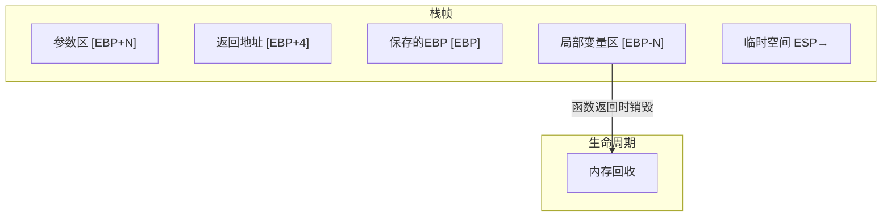
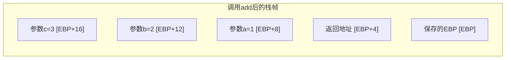
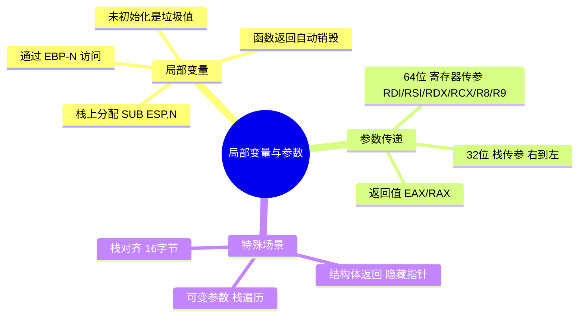

# 局部变量与参数传递

## 局部变量：栈上的临时工坊

C 语言中，函数内声明的局部变量在函数返回后就消失了——因为它们住在**栈**上，函数返回时栈帧被销毁，变量也随之消亡。理解局部变量在栈上的布局，是理解程序内存行为的关键。



## 局部变量的分配与访问

### 在栈上分配局部变量

在函数序言中，通过 `SUB ESP, N` 在栈上预留空间：

```nasm
my_function:
    push ebp
    mov ebp, esp
    sub esp, 12              ; 分配 3 个 int 大小的局部变量

    ; 局部变量布局：
    ; [ebp-4]  = 第1个局部变量
    ; [ebp-8]  = 第2个局部变量
    ; [ebp-12] = 第3个局部变量

    ; 使用局部变量
    mov dword [ebp-4], 10    ; var1 = 10
    mov dword [ebp-8], 20    ; var2 = 20
    mov dword [ebp-12], 30   ; var3 = 30

    ; 计算 sum = var1 + var2 + var3
    mov eax, [ebp-4]
    add eax, [ebp-8]
    add eax, [ebp-12]

    ; 结语
    mov esp, ebp             ; 释放局部变量
    pop ebp
    ret
```

### 局部变量 vs 全局变量

| 特性 | 局部变量（栈上） | 全局变量（.data/.bss） |
|------|----------------|---------------------|
| 位置 | `[EBP-N]` | 固定地址（标号） |
| 生命周期 | 函数调用期间 | 程序运行期间 |
| 初始化 | 必须手动赋值 | 可在 .data 中指定 |
| 线程安全 | 是（每个线程独立栈） | 否（共享内存） |
| 速度 | 稍慢（需偏移计算） | 稍快（绝对地址） |

::: tip 未初始化的局部变量是垃圾值
栈上的局部变量不会自动清零！它的初始值是之前使用该内存位置的残留数据。这就是 C 语言中"未初始化的局部变量值不确定"的底层原因。
:::

## 参数传递机制

### 通过栈传参（32 位 cdecl）

这是 32 位 x86 最基本的参数传递方式：

```c
// C 代码
int add(int a, int b, int c) {
    return a + b + c;
}
// 调用: add(1, 2, 3)
```

```nasm
; 调用者
push dword 3              ; 第3个参数（最右先压）
push dword 2              ; 第2个参数
push dword 1              ; 第1个参数
call add
add esp, 12               ; 清理 3 × 4 = 12 字节

; 被调用者
add:
    push ebp
    mov ebp, esp

    mov eax, [ebp+8]      ; a = 1
    add eax, [ebp+12]     ; + b = 2
    add eax, [ebp+16]     ; + c = 3
    ; EAX = 6

    mov esp, ebp
    pop ebp
    ret
```



### 通过寄存器传参（64 位 System V ABI）

64 位模式下，前 6 个整数参数通过寄存器传递，极大减少了内存访问：

```nasm
; 64 位调用 add(1, 2, 3)
mov edi, 1                ; 第1个参数
mov esi, 2                ; 第2个参数
mov edx, 3                ; 第3个参数
call add

; 64 位 add 函数
add:
    mov eax, edi           ; a
    add eax, esi           ; + b
    add eax, edx           ; + c
    ret
```

| 参数序号 | 寄存器 | 浮点参数寄存器 |
|---------|--------|--------------|
| 1 | RDI | XMM0 |
| 2 | RSI | XMM1 |
| 3 | RDX | XMM2 |
| 4 | RCX | XMM3 |
| 5 | R8 | XMM4 |
| 6 | R9 | XMM5 |
| 7+ | 栈 | 栈 |

## 返回值传递

### 单个返回值

整数和指针返回值存入 EAX/RAX：

```nasm
; 返回 42
mov eax, 42
; ... leave/ret
```

### 64 位返回值

存入 EDX:EAX（32 位）或 RAX（64 位）：

```nasm
; 返回 64 位值（32 位模式）
mov eax, 0x12345678       ; 低 32 位
mov edx, 0x9ABCDEF0       ; 高 32 位
```

### 结构体返回值

较大的结构体通过**隐藏指针参数**返回——调用者在栈上分配空间，将地址作为额外参数传入：

```c
// C 代码
struct Point { int x; int y; };
struct Point create_point(int x, int y);
```

```nasm
; 调用者
sub esp, 8                ; 为 Point 结构体分配空间
push dword 10             ; y
push dword 20             ; x
push esp                  ; 隐藏参数：结构体地址（简化示例）
call create_point

; 被调用者通过隐藏指针写入结构体
create_point:
    push ebp
    mov ebp, esp
    ; [ebp+8]  = 隐藏指针（结构体地址）
    ; [ebp+12] = x
    ; [ebp+16] = y
    mov ecx, [ebp+8]      ; 结构体地址
    mov eax, [ebp+12]     ; x
    mov [ecx], eax        ; point.x = x
    mov eax, [ebp+16]     ; y
    mov [ecx+4], eax      ; point.y = y
    mov eax, [ebp+8]      ; 返回结构体地址
    mov esp, ebp
    pop ebp
    ret 12                 ; stdcall: 清理 3 个参数
```

## 栈对齐

### 64 位的 16 字节对齐要求

System V AMD64 ABI 要求在执行 CALL 指令时，栈必须 **16 字节对齐**：


::: warning 对齐错误会导致段错误
如果调用 SSE/AVX 指令（如 printf 内部使用）时栈未 16 字节对齐，CPU 会触发**通用保护异常**，程序崩溃。这是 64 位汇编最常见的坑之一。

修正方法：在序言中多减 8 字节：
```nasm
push rbp
mov rbp, rsp
sub rsp, 24              ; 而非 16，确保 16 字节对齐
```
:::

## 实战：可变参数函数

可变参数函数（如 `printf`）无法通过寄存器知道参数个数，必须依赖栈布局：

```nasm
; vararg.asm - 简单的可变参数求和
; 编译: nasm -f elf32 vararg.asm -o vararg.o
; 链接: gcc -m32 vararg.o -o vararg -nostdlib

section .data
    fmt db 'Sum = %d', 0xA, 0

section .text
    extern printf
    global _start

_start:
    ; 调用 sum_varargs(3, 10, 20, 30)
    ; 第一个参数是后续参数的个数
    push dword 30
    push dword 20
    push dword 10
    push dword 3           ; count = 3
    call sum_varargs
    add esp, 16

    ; 用 printf 输出结果
    push eax
    push fmt
    call printf
    add esp, 8

    ; 退出
    mov eax, 1
    xor ebx, ebx
    int 0x80

; ============================================
; sum_varargs - 可变参数求和
; 输入: [ebp+8] = count, [ebp+12..] = values
; 输出: EAX = sum
; ============================================
sum_varargs:
    push ebp
    mov ebp, esp
    push esi                ; 保存 callee-saved

    mov ecx, [ebp+8]       ; count
    xor eax, eax            ; sum = 0
    lea esi, [ebp+12]      ; 第一个值的地址

.sum_loop:
    test ecx, ecx
    jz .sum_done
    add eax, [esi]          ; sum += *ptr
    add esi, 4              ; ptr++
    dec ecx
    jmp .sum_loop

.sum_done:
    pop esi
    mov esp, ebp
    pop ebp
    ret
```

## 实战：交换两个变量的值

```nasm
; swap.asm - 通过指针参数交换两个变量
; 演示"传址"参数传递

section .data
    x dd 100
    y dd 200

section .text
    global _start

_start:
    ; 调用 swap(&x, &y)
    push dword y            ; &y
    push dword x            ; &x
    call swap
    add esp, 8

    ; 现在 x=200, y=100
    mov ebx, [x]            ; EBX = 200
    mov eax, 1
    int 0x80

; ============================================
; swap - 交换两个整数
; 输入: [ebp+8] = &a, [ebp+12] = &b
; ============================================
swap:
    push ebp
    mov ebp, esp

    mov eax, [ebp+8]       ; eax = &a
    mov ecx, [ebp+12]      ; ecx = &b

    mov edx, [eax]          ; edx = *a
    xchg edx, [ecx]         ; edx ↔ *b
    mov [eax], edx          ; *a = 原 *b

    mov esp, ebp
    pop ebp
    ret
```

## 实战：GCD 最大公约数

```nasm
; gcd.asm - 欧几里得算法求最大公约数
; 编译: nasm -f elf32 gcd.asm -o gcd.o
; 链接: gcc -m32 gcd.o -o gcd -nostdlib

section .data
    a dd 48
    b dd 18

section .text
    global _start

_start:
    push dword [b]
    push dword [a]
    call gcd
    add esp, 8

    ; EAX = GCD(48, 18) = 6
    mov ebx, eax
    mov eax, 1
    int 0x80

; ============================================
; gcd - 欧几里得算法（迭代）
; 输入: [ebp+8] = a, [ebp+12] = b
; 输出: EAX = gcd(a, b)
; ============================================
gcd:
    push ebp
    mov ebp, esp

    mov eax, [ebp+8]       ; a
    mov ecx, [ebp+12]      ; b

.gcd_loop:
    test ecx, ecx
    jz .gcd_done           ; b == 0 → 返回 a
    xor edx, edx
    div ecx                 ; EAX = a/b, EDX = a%b
    mov eax, ecx            ; a = b
    mov ecx, edx            ; b = a%b
    jmp .gcd_loop

.gcd_done:
    ; EAX 已经是 GCD
    mov esp, ebp
    pop ebp
    ret
```

验证：

```bash
./gcd; echo $?    # 输出 6 (GCD(48,18)=6)
```

## 小结



::: tip 面试要点
- 局部变量在栈上分配，通过 [EBP-N] 访问，函数返回时自动释放
- 32 位 cdecl 参数从右到左压栈，调用者清理；64 位前 6 参数通过寄存器传递
- 未初始化的局部变量值不确定（栈上残留数据）
- 64 位函数调用要求栈 16 字节对齐，否则 SSE 指令会崩溃
- 结构体返回值通过隐藏指针参数实现
- 传值无法修改实参，传址（指针）才能修改——汇编中通过传递地址实现
:::

::: info 原著参考
本章内容参考自《汇编语言：基于Linux环境（第3版）》Jeff Duntemann 第10章"Decking Out the Procedures"及第11章"Strings and Things"。书中深入讲解了局部变量管理和参数传递的各种技巧。
:::
