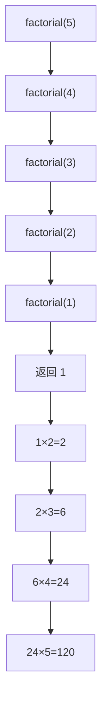
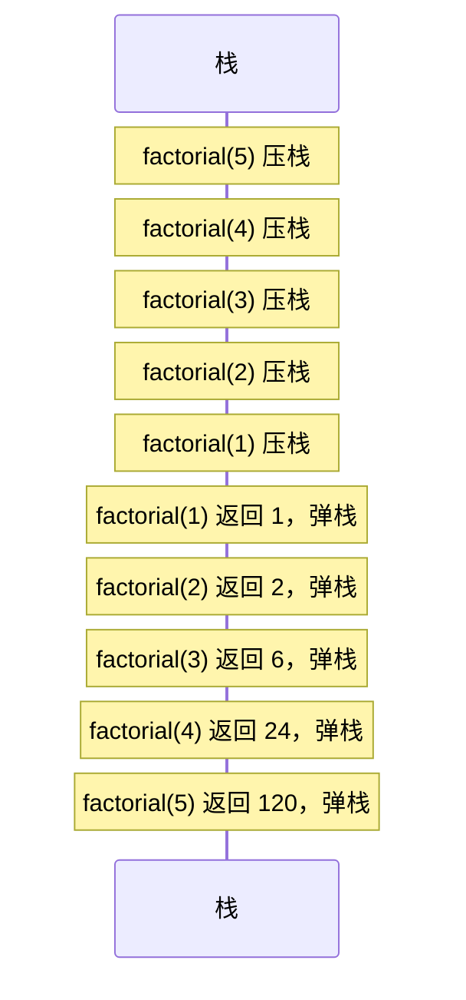
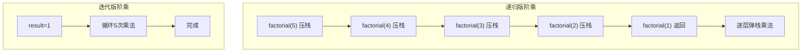
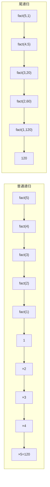

# 递归

## 递归的底层机制：栈的叠加

递归在高级语言中看似优雅——函数调用自身。但在底层，每次递归调用都创建一个**全新的栈帧**，层层叠加，直到基准条件触发后逐层返回。

如果把递归比作俄罗斯套娃，栈帧就是一层层的娃娃壳——最外层打开后里面还有一个，直到最小的那个（基准条件），然后一层层合上返回。



## 递归的栈帧变化

调用 `factorial(5)` 时栈帧的生长和收缩：



::: important 递归的内存代价
每次递归调用至少消耗 8 字节（EBP + 返回地址），加上参数和局部变量。如果递归深度为 N，栈消耗至少 O(N)。**栈溢出**是递归最常见的问题——Linux 默认栈大小约 8MB，深度过大会导致栈溢出崩溃。
:::

## 经典递归：阶乘

### 递归实现

```nasm
; factorial_rec.asm - 递归版阶乘
; 编译: nasm -f elf32 factorial_rec.asm -o factorial_rec.o
; 链接: gcc -m32 factorial_rec.o -o factorial_rec -nostdlib

section .data
    n dd 5                      ; 计算 5!

section .text
    global _start

_start:
    push dword [n]              ; 参数 n
    call factorial
    add esp, 4                  ; 清理参数

    ; EAX = 120 (5!)
    mov ebx, eax
    mov eax, 1
    int 0x80

; ============================================
; factorial - 递归计算阶乘
; 输入: [ebp+8] = n
; 输出: EAX = n!
; ============================================
factorial:
    push ebp
    mov ebp, esp

    mov eax, [ebp+8]           ; n

    ; 基准条件: n <= 1
    cmp eax, 1
    jle .base_case

    ; 递归: factorial(n-1)
    dec eax
    push eax                   ; 参数 n-1
    call factorial
    add esp, 4                 ; 清理参数

    ; 乘以 n: result = n * factorial(n-1)
    imul eax, [ebp+8]         ; EAX = factorial(n-1) * n
    jmp .fact_done

.base_case:
    mov eax, 1                 ; 0! = 1! = 1

.fact_done:
    mov esp, ebp
    pop ebp
    ret
```

### 栈帧详解：factorial(3)

```
调用 factorial(3) 时的栈帧叠加：

┌────────────────────┐ ← 高地址
│  参数 n=3          │
│  返回地址 → _start │
│  保存的 EBP        │
│  参数 n=2          │
│  返回地址 → fact   │
│  保存的 EBP        │
│  参数 n=1          │
│  返回地址 → fact   │
│  保存的 EBP ← EBP  │
└────────────────────┘ ← 低地址 (ESP)
```

## 经典递归：斐波那契数列

```nasm
; fib_rec.asm - 递归版斐波那契
; 注意：递归版效率极低，仅作教学演示

section .data
    n dd 8                      ; 计算 F(8) = 21

section .text
    global _start

_start:
    push dword [n]
    call fib
    add esp, 4

    mov ebx, eax
    mov eax, 1
    int 0x80

; ============================================
; fib - 递归计算斐波那契数
; 输入: [ebp+8] = n
; 输出: EAX = F(n)
; ============================================
fib:
    push ebp
    mov ebp, esp

    mov ecx, [ebp+8]           ; n

    ; 基准条件
    cmp ecx, 0
    je .fib_zero
    cmp ecx, 1
    je .fib_one

    ; fib(n-1)
    lea eax, [ecx-1]
    push eax
    call fib
    add esp, 4
    push eax                   ; 保存 fib(n-1) 的结果

    ; fib(n-2)
    lea eax, [ecx-2]
    push eax
    call fib
    add esp, 4

    ; EAX = fib(n-2), 栈顶 = fib(n-1)
    pop edx                    ; EDX = fib(n-1)
    add eax, edx               ; EAX = fib(n-1) + fib(n-2)
    jmp .fib_done

.fib_zero:
    xor eax, eax               ; F(0) = 0
    jmp .fib_done

.fib_one:
    mov eax, 1                 ; F(1) = 1

.fib_done:
    mov esp, ebp
    pop ebp
    ret
```

::: warning 递归斐波那契的指数级复杂度
递归版斐波那契的时间复杂度是 O(2^n)！F(5) 会计算 F(4) 和 F(3)，F(4) 又计算 F(3) 和 F(2)……大量重复计算。这是递归的经典反面教材——**能用迭代就用迭代**。
:::

## 递归 vs 迭代的栈对比



| 特性 | 递归 | 迭代 |
|------|------|------|
| 栈空间 | O(N) | O(1) |
| 时间复杂度 | 可能含重复计算 | 通常更优 |
| 代码可读性 | 对数学定义直观 | 需要手动管理状态 |
| 栈溢出风险 | 高 | 低 |
| 性能 | 函数调用开销大 | 循环开销小 |

## 尾递归优化

**尾递归**（Tail Recursion）是指递归调用是函数的最后一个操作，返回值直接是递归调用的结果。编译器可以将尾递归优化为循环，避免栈增长。

### 普通递归 vs 尾递归

```nasm
; 普通递归（非尾递归）: factorial(n)
; 返回前还需要做乘法，不是最后一个操作
factorial:
    ...
    push eax
    call factorial             ; 递归调用
    add esp, 4
    imul eax, [ebp+8]         ; ← 递归调用后还有操作！不是尾递归
    ...

; 尾递归版: factorial(n, accumulator)
; 递归调用是最后操作，无需返回后再计算
factorial_tail:
    push ebp
    mov ebp, esp

    mov eax, [ebp+8]          ; n
    mov ecx, [ebp+12]         ; acc

    cmp eax, 1
    jle .tail_base

    ; 递归调用: factorial_tail(n-1, n*acc)
    imul ecx, eax             ; acc = n * acc
    dec eax                   ; n = n - 1
    push ecx                  ; 新 acc
    push eax                  ; 新 n

    mov esp, ebp              ; ← 关键：复用当前栈帧！
    pop ebp
    ; 直接跳转而非调用，不压入新返回地址
    jmp factorial_tail        ; 尾调用优化

.tail_base:
    mov eax, ecx              ; 返回 acc
    mov esp, ebp
    pop ebp
    ret
```



::: tip 尾递归优化的本质
尾递归优化将递归调用 `call + ret` 替换为 `jmp`，不压入新的返回地址，复用当前栈帧。这样栈深度始终为 O(1)，与迭代等价。

注意：NASM 本身不做尾递归优化——需要程序员手动将 `call` 改为 `jmp` 并复用栈帧。GCC 等编译器在 `-O2` 以上会自动做此优化。
:::

## 经典递归：汉诺塔

```nasm
; hanoi.asm - 汉诺塔递归解法
; 编译: nasm -f elf32 hanoi.asm -o hanoi.o
; 链接: gcc -m32 hanoi.o -o hanoi

section .data
    fmt db 'Move disk from %d to %d', 0xA, 0
    n    dd 3                      ; 3 个盘子

section .text
    extern printf
    global main

main:
    push ebp
    mov ebp, esp

    ; hanoi(3, 1, 3, 2) — 从柱1移到柱3，借助柱2
    push dword 2               ; auxiliary
    push dword 3               ; to
    push dword 1               ; from
    push dword [n]             ; n
    call hanoi
    add esp, 16

    xor eax, eax
    mov esp, ebp
    pop ebp
    ret

; ============================================
; hanoi - 汉诺塔递归
; 输入: [ebp+8]=n, [ebp+12]=from, [ebp+16]=to, [ebp+20]=aux
; ============================================
hanoi:
    push ebp
    mov ebp, esp
    push ebx                   ; 保存 callee-saved
    push esi
    push edi

    mov eax, [ebp+8]          ; n
    cmp eax, 1
    je .hanoi_base

    ; hanoi(n-1, from, aux, to)
    mov ecx, [ebp+16]         ; to → 作为 aux
    push ecx
    mov ecx, [ebp+20]         ; aux → 作为 to
    push ecx
    mov ecx, [ebp+12]         ; from
    push ecx
    dec eax
    push eax
    call hanoi
    add esp, 16

    ; 移动最底下的盘子: from → to
    push dword [ebp+16]       ; to
    push dword [ebp+12]       ; from
    push fmt
    call printf
    add esp, 12

    ; hanoi(n-1, aux, to, from)
    mov ecx, [ebp+12]         ; from → 作为 aux
    push ecx
    mov ecx, [ebp+16]         ; to
    push ecx
    mov ecx, [ebp+20]         ; aux → 作为 from
    push ecx
    mov eax, [ebp+8]
    dec eax
    push eax
    call hanoi
    add esp, 16
    jmp .hanoi_done

.hanoi_base:
    ; 只有一个盘子，直接移动
    push dword [ebp+16]       ; to
    push dword [ebp+12]       ; from
    push fmt
    call printf
    add esp, 12

.hanoi_done:
    pop edi
    pop esi
    pop ebx
    mov esp, ebp
    pop ebp
    ret
```

## 实战：用 GDB 跟踪递归

```bash
gdb ./factorial_rec
(gdb) break factorial
(gdb) run
# 第1次命中: factorial(5)
(gdb) print *(int*)($ebp+8)
$1 = 5

(gdb) continue
# 第2次命中: factorial(4)
(gdb) print *(int*)($ebp+8)
$2 = 4

# 查看调用栈
(gdb) backtrace
#0  factorial at factorial_rec.asm:20
#1  0x08048356 in factorial at factorial_rec.asm:28
#2  0x08048356 in factorial at factorial_rec.asm:28
#3  0x08048356 in factorial at factorial_rec.asm:28
#4  0x08048356 in factorial at factorial_rec.asm:28
#5  0x080483d0 in _start at factorial_rec.asm:12

# 查看每一层的参数
(gdb) frame 4
(gdb) print *(int*)($ebp+8)
$3 = 5    # 最外层 factorial(5)
```

## 小结

```mermaid
mindmap
  root((递归))
    机制
      每次调用新建栈帧
      栈帧层层叠加
      基准条件停止递归
    经典问题
      阶乘 O(n)栈
      斐波那契 指数时间
      汉诺塔 O(2^n)步
    优化
      尾递归 → 迭代
      用JMP替代CALL
      复用栈帧
    风险
      栈溢出
      重复计算
      性能低下
```

::: tip 面试要点
- 递归在底层通过栈帧叠加实现，每次调用消耗 O(1) 栈空间，总深度 O(N)
- 递归必须有基准条件（Base Case），否则无限递归导致栈溢出
- 尾递归优化：将 `call` 改为 `jmp` + 复用栈帧，使栈深度降为 O(1)
- 递归版斐波那契时间复杂度 O(2^n)，实际应用中应使用迭代或记忆化
- Linux 默认栈大小约 8MB，可用 `ulimit -s` 查看/修改
:::

::: info 原著参考
本章内容参考自《汇编语言：基于Linux环境（第3版）》Jeff Duntemann 第10章"Decking Out the Procedures"。书中对过程调用的深入讲解为理解递归的栈帧机制奠定了基础。
:::
