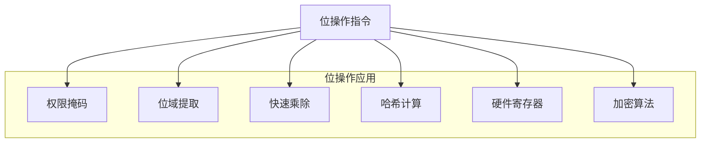
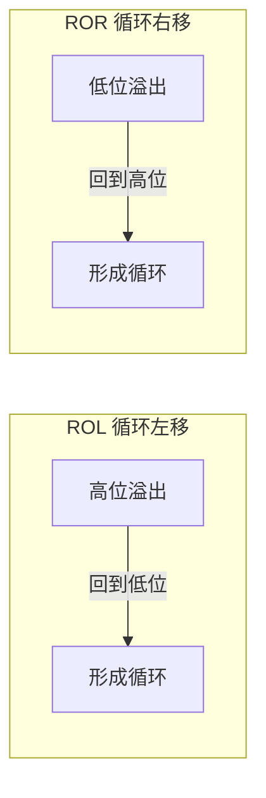

# 位操作指令

## 为什么位操作如此重要？

位操作是汇编语言的超能力——高级语言也能做位运算，但汇编让你**精确到每一个比特**。操作系统内核、加密算法、硬件驱动、网络协议，这些底层代码都大量依赖位操作。

如果说 MOV 是搬运工，算术指令是计算器，那么位操作指令就是一把**手术刀**——精确、高效，能对数据的每一个比特做手术。



## 移位指令

### SHL / SHR - 逻辑移位

逻辑移位在空出的位上填 0：

```nasm
shl eax, 1            ; 逻辑左移1位 = 乘以2
shr eax, 1            ; 逻辑右移1位 = 无符号除以2
shl eax, 4            ; 左移4位 = 乘以16
shr eax, 3            ; 右移3位 = 除以8
```

```
SHL 示例: EAX = 0x00000005 (5)
         0000 0000 0000 0000 0000 0000 0000 0101
    SHL 1→ 0000 0000 0000 0000 0000 0000 0000 1010  = 0x0A (10)
    SHL 4→ 0000 0000 0000 0000 0000 0000 0101 0000  = 0x50 (80)

SHR 示例: EAX = 0x00000005 (5)
         0000 0000 0000 0000 0000 0000 0000 0101
    SHR 1→ 0000 0000 0000 0000 0000 0000 0000 0010  = 0x02 (2)
```

::: tip 移位 = 快速乘除
移位比乘除指令快得多：
- `shl eax, 1` = `eax * 2`（1 个时钟周期）
- `imul eax, 2` = `eax * 2`（3+ 个时钟周期）
- 编译器会自动将 `x * 2^n` 优化为 `shl x, n`
:::

### SAL / SAR - 算术移位

算术移位保留符号位——左移与 SHL 相同，右移时高位填符号位：

```nasm
sar eax, 1            ; 算术右移1位 = 有符号除以2（向负无穷取整）
```

```
SAR 示例: EAX = 0xFFFFFFFB (-5)
         1111 1111 1111 1111 1111 1111 1111 1011
   SAR 1→ 1111 1111 1111 1111 1111 1111 1111 1101  = -3 (正确：-5/2=-3)

SHR 示例: EAX = 0xFFFFFFFB (-5) — 如果误用 SHR
         1111 1111 1111 1111 1111 1111 1111 1011
   SHR 1→ 0111 1111 1111 1111 1111 1111 1111 1101  = 2147483645 (错误！)
```

::: warning SAR vs SHR 的选择
- **有符号数**除以 2 的幂：用 `SAR`（保留符号位）
- **无符号数**除以 2 的幂：用 `SHR`（高位填 0）
- 混淆两者会导致负数运算完全错误
:::

### 移位量超过 1

移位量可以是立即数或 CL 寄存器：

```nasm
shl eax, 4            ; 左移 4 位（立即数）
mov cl, 8
shr eax, cl           ; 右移 CL 位（CL=8）
```

::: important 移位量的限制
x86 只使用移位量的低 5 位（0-31），64 位模式使用低 6 位（0-63）。`shl eax, 32` 等于不移位（32 的低 5 位是 0）。
:::

## 循环移位指令

### ROL / ROR - 循环移位

移出的位回到另一端，不像 SHL/SHR 那样丢弃：

```nasm
rol eax, 4            ; 循环左移4位
ror eax, 8            ; 循环右移8位
```

```
ROL 示例: EAX = 0x12345678
         0001 0010 0011 0100 0101 0110 0111 1000
   ROL 4→ 0010 0011 0100 0101 0110 0111 1000 0001  = 0x23456781
```



### RCL / RCR - 带进位循环移位

将 CF 标志位作为第 33 位参与循环：

```nasm
rcl eax, 1            ; 带进位循环左移1位
rcr eax, 1            ; 带进位循环右移1位
```

## 位测试与操作指令

### BT / BTS / BTR / BTC

| 指令 | 功能 | 助记 |
|------|------|------|
| `BT` | 测试指定位（将位值送入 CF） | **B**it **T**est |
| `BTS` | 测试并设置指定位为 1 | **B**it **T**est and **S**et |
| `BTR` | 测试并清除指定位为 0 | **B**it **T**est and **R**eset |
| `BTC` | 测试并取反指定位 | **B**it **T**est and **C**omplement |

```nasm
; 测试 EAX 的第 3 位
bt eax, 3              ; CF = EAX 的 bit3

; 设置 EBX 的第 5 位为 1
bts ebx, 5             ; bit5 = 1, CF = 原bit5

; 清除 ECX 的第 7 位
btr ecx, 7             ; bit7 = 0, CF = 原bit7

; 取反 EDX 的第 0 位
btc edx, 0             ; bit0 = ~bit0, CF = 原bit0
```

::: tip BTS/BTR 的原子性
在多处理器系统中，`BTS` 和 `BTR` 配合 `LOCK` 前缀可以实现**原子位操作**——这是内核自旋锁的实现基础：
```nasm
lock bts [lock_var], 0    ; 原子地测试并设置 bit0
jc spin_wait              ; 如果原来为1（已锁），等待
```
:::

### BSF / BSR - 位扫描

从低/高端扫描第一个为 1 的位：

```nasm
bsf eax, ebx           ; 找 EBX 中最低的1位，位号存入EAX
bsr eax, ebx           ; 找 EBX 中最高的1位，位号存入EAX
```

```
EBX = 0x00001000 (bit12 为1)
BSF EAX, EBX → EAX = 12
BSR EAX, EBX → EAX = 12

EBX = 0x00000000 (全0)
BSF EAX, EBX → ZF=1, EAX 未定义
```

应用场景：快速计算 log2、找最低位 1 的位置。

## 位操作经典技巧

### 掩码操作

```nasm
; 提取低 N 位
and eax, 0xFF          ; 提取低 8 位
and eax, 0x0F          ; 提取低 4 位

; 设置某些位
or eax, 0x80           ; 设置最高位

; 翻转某些位
xor eax, 0x55          ; 翻转奇数位

; 清除某些位
and eax, ~0x0F         ; 清除低 4 位（NASM中需写为 0xFFFFFFF0）
```

### 位域提取与插入

```nasm
; 提取 bit8-bit15（8位宽的位域）
mov ecx, eax
shr ecx, 8             ; 右移8位，使目标位域对齐到最低位
and ecx, 0xFF          ; 屏蔽其他位

; 插入值到 bit8-bit15
and eax, 0xFFFF00FF    ; 清除 bit8-15
or  eax, [value_shl_8] ; 或运算插入新值
```

### 判断奇偶

```nasm
test al, 1              ; 测试最低位
jnz is_odd              ; 1 = 奇数
; 否则是偶数
```

### 快速取模（2的幂）

```nasm
; x % 8 等价于 x & 7
and eax, 7              ; EAX = EAX % 8
; x % 256 等价于 x & 0xFF
and eax, 0xFF           ; EAX = EAX % 256
```

### 交换高低字节

```nasm
; 交换 AX 中的高低字节
rol ax, 8               ; 等价于 xchg al, ah
```

## 实战：位图操作

```nasm
; bitmap.asm - 位图操作示例
; 演示位图（Bitmap）的设置、清除和测试操作

section .data
    bitmap dd 0                     ; 32位位图（可管理32个标志）

section .text
    global _start

_start:
    ; 设置 bit 3
    bts [bitmap], 3
    ; 设置 bit 7
    bts [bitmap], 7
    ; 设置 bit 15
    bts [bitmap], 15

    ; 测试 bit 7
    bt [bitmap], 7
    jc bit7_set              ; CF=1 表示已设置

bit7_set:
    ; 清除 bit 3
    btr [bitmap], 3

    ; 统计位图中 1 的个数（Population Count）
    mov eax, [bitmap]
    call popcount
    ; EAX = 1 的个数

    mov ebx, eax
    mov eax, 1
    int 0x80

; ============================================
; popcount - 统计 EAX 中 1 的个数
; 输入: EAX = 待统计值
; 输出: ECX = 1 的个数
; ============================================
popcount:
    mov ecx, 0               ; count = 0

.pc_loop:
    test eax, eax
    jz .pc_done
    bsf edx, eax             ; 找最低的1位
    btr eax, edx             ; 清除该位
    inc ecx                  ; count++
    jmp .pc_loop

.pc_done:
    mov eax, ecx
    ret
```

## 实战：简易加密（XOR 加密）

```nasm
; xor_cipher.asm - XOR 加密/解密演示
; 编译: nasm -f elf32 xor_cipher.asm -o xor_cipher.o
; 链接: gcc -m32 xor_cipher.o -o xor_cipher -nostdlib

section .data
    key     db 0x5A, 0xA5, 0xFF, 0x00     ; 4字节密钥
    key_len equ $ - key
    message db 'Hello, Assembly World!'
    msg_len equ $ - message

section .bss
    encrypted resb 64
    decrypted resb 64

section .text
    global _start

_start:
    ; 加密
    mov esi, message
    mov edi, encrypted
    mov ecx, msg_len
    call xor_encrypt

    ; 解密（再次 XOR 同一密钥）
    mov esi, encrypted
    mov edi, decrypted
    mov ecx, msg_len
    call xor_encrypt

    ; 验证解密结果
    ; decrypted 应与 message 相同

    mov ebx, 0
    mov eax, 1
    int 0x80

; ============================================
; xor_encrypt - XOR 加密/解密
; 输入: ESI=源, EDI=目标, ECX=长度
; 使用 key 作为循环密钥
; ============================================
xor_encrypt:
    push ebx
    xor ebx, ebx            ; 密钥索引 = 0

.enc_loop:
    test ecx, ecx
    jz .enc_done

    ; 读取明文字节
    mov al, [esi]
    ; 与密钥字节 XOR
    xor al, [key + ebx]
    ; 写入密文字节
    mov [edi], al

    inc esi
    inc edi
    inc ebx
    and ebx, key_len - 1    ; 密钥索引循环 (key_len必须是2的幂)
    dec ecx
    jmp .enc_loop

.enc_done:
    pop ebx
    ret
```

## 小结

| 指令 | 功能 | 典型用途 |
|------|------|---------|
| SHL/SHR | 逻辑移位 | 快速乘除 2 的幂 |
| SAL/SAR | 算术移位 | 有符号除法 |
| ROL/ROR | 循环移位 | 数据旋转 |
| BT/BTS/BTR/BTC | 位测试/设置/清除/取反 | 位图操作、锁 |
| BSF/BSR | 位扫描 | 找最低/最高位 |
| AND/OR/XOR | 逻辑运算 | 掩码、设置、翻转 |

::: tip 面试要点
- SHL 1 位 = 乘以 2，SHR 1 位 = 无符号除以 2，SAR 1 位 = 有符号除以 2
- SAR 保留符号位，SHR 高位填 0——处理负数时必须用 SAR
- BTS/BTR 配合 LOCK 前缀可实现多处理器原子位操作（自旋锁基础）
- XOR 加密的特性：同一密钥 XOR 两次恢复原文
- 取模 2^n 可用 AND (2^n - 1) 替代，比 DIV 快得多
- BSF/BSR 找最低/最高位 1 的位置，全 0 时 ZF=1
:::

::: info 原著参考
本章内容参考自《汇编语言：基于Linux环境（第3版）》Jeff Duntemann 第9章"Bits, Flags, Branches, and Tables"。书中用"灯泡开关"比喻位操作，并详细讲解了移位和位操作指令的应用。
:::
