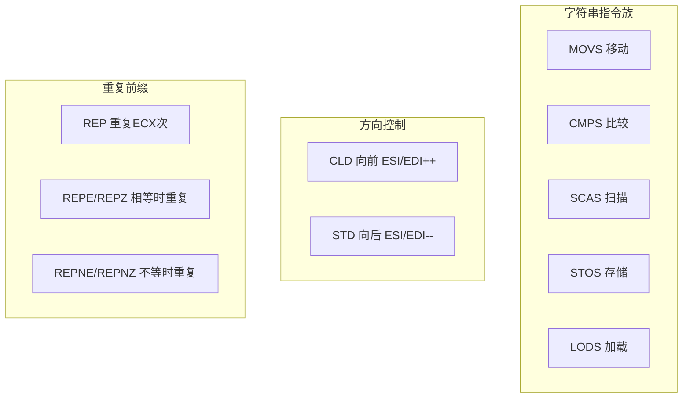
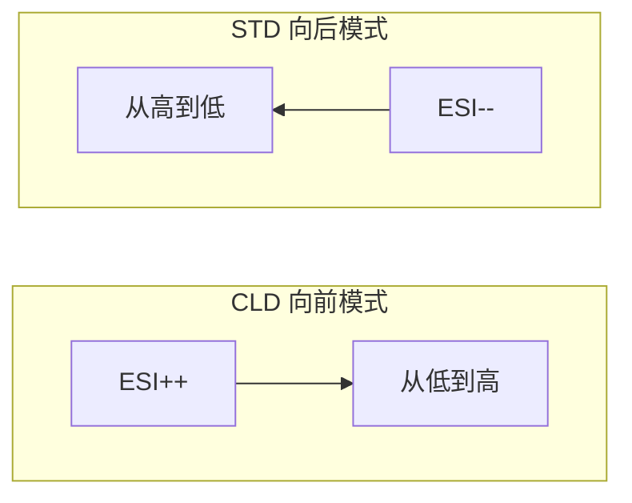
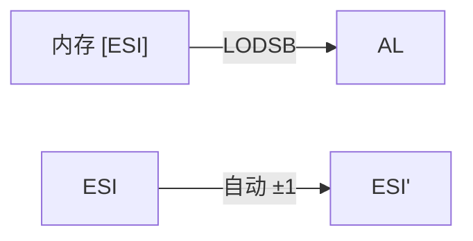
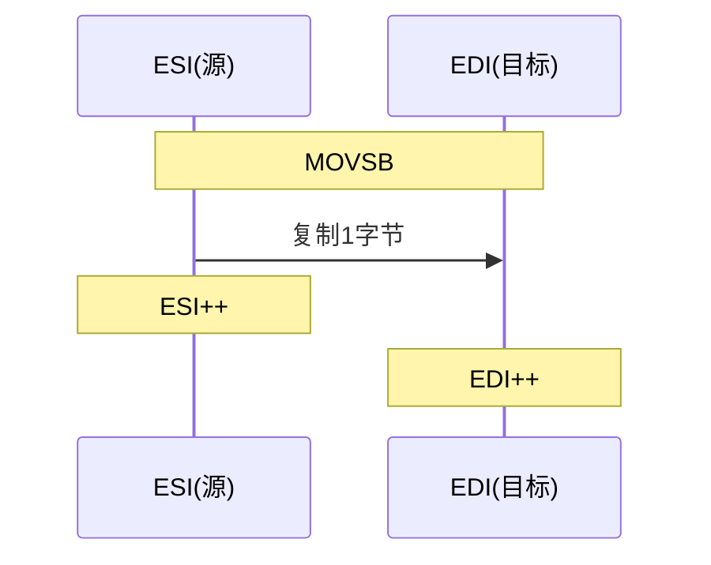
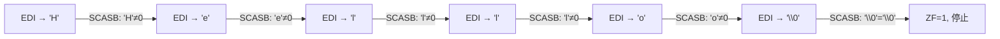
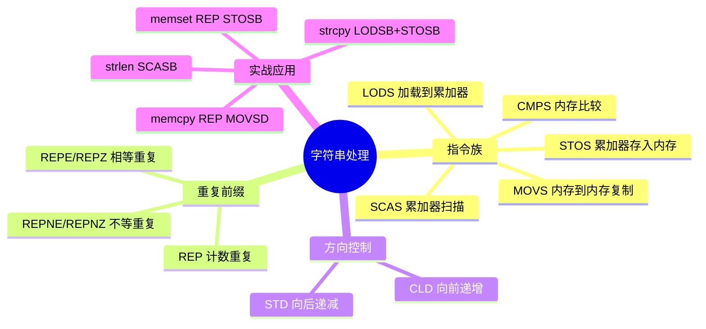

# 字符串处理

## x86 字符串指令：硬件加速的数据搬运

x86 架构有一组专门的"字符串指令"，它们能自动递增/递减地址指针，配合 REP 前缀可以用一条指令完成整块数据的操作。这里的"字符串"不仅指文本——本质上它是**内存块操作指令**。



## 方向标志 DF

字符串指令的操作方向由 DF（Direction Flag）控制：

```nasm
cld                    ; DF=0, ESI/EDI 递增（向前，默认推荐）
std                    ; DF=1, ESI/EDI 递减（向后）
```



::: important 始终先设置 DF
DF 的值可能被之前的代码修改，使用字符串指令前**务必**先 `CLD` 或 `STD`。大多数情况用 `CLD`（向前）。
:::

## LODS - 加载字符串

从 ESI 指向的内存加载到累加器：

```nasm
lodsb                  ; AL = [ESI], ESI += 1 (或 -= 1)
lodsw                  ; AX = [ESI], ESI += 2
lodsd                  ; EAX = [ESI], ESI += 4
```



典型用途：逐字符处理字符串。

## STOS - 存储字符串

将累加器的值存入 EDI 指向的内存：

```nasm
stosb                  ; [EDI] = AL, EDI += 1
stosw                  ; [EDI] = AX, EDI += 2
stosd                  ; [EDI] = EAX, EDI += 4
```

配合 REP 前缀可以快速填充内存：

```nasm
; 将 buffer 的 256 字节全部填充为 0xAA
mov edi, buffer
mov al, 0xAA
mov ecx, 256
cld
rep stosb
```

::: tip REP STOSB 是最快的内存填充
`REP STOSB` 在现代 CPU 上会被优化为内部微操作，填充大块内存比手写循环快得多。
:::

## MOVS - 移动字符串

从 ESI 指向的内存复制到 EDI 指向的内存：

```nasm
movsb                  ; [EDI] = [ESI], ESI += 1, EDI += 1
movsw                  ; 2 字节复制
movsd                  ; 4 字节复制
```



### 批量复制

```nasm
; 复制 1024 字节从 src 到 dst
mov esi, src
mov edi, dst
mov ecx, 1024 / 4         ; 以 4 字节为单位
cld
rep movsd                  ; 32 位复制，比 movsb 快 4 倍
```

::: tip 优化：用 MOVSD 替代 MOVSB
尽可能用 `MOVSD`（4 字节）或 `MOVSQ`（8 字节，64 位模式）替代 `MOVSB`，减少循环次数。剩余字节再用 `MOVSB` 处理。
:::

### 处理重叠区域

当源和目标内存区域重叠时，需要从高地址开始复制：

```nasm
; 将内存区域向前移动（dst < src，有重叠）
mov esi, src + count - 1   ; 从末尾开始
mov edi, dst + count - 1
mov ecx, count
std                         ; 向后方向
rep movsb
cld                         ; 恢复向前方向
```

这等价于 C 语言中的 `memmove`。

## CMPS - 比较字符串

比较 ESI 和 EDI 指向的内存：

```nasm
cmpsb                  ; 比较 [ESI] 和 [EDI], 设置标志位
cmpsw                  ; 2 字节比较
cmpsd                  ; 4 字节比较
```

配合 REPE/REPNE 前缀：

```nasm
; 比较两个字符串是否相等
mov esi, str1
mov edi, str2
mov ecx, max_len
cld
repe cmpsb              ; 相等时继续比较
; ZF=1 表示相等，ZF=0 表示不等
```

## SCAS - 扫描字符串

将累加器与 EDI 指向的内存比较：

```nasm
scasb                  ; 比较 AL 和 [EDI], 设置标志位, EDI += 1
scasw                  ; 2 字节扫描
scasd                  ; 4 字节扫描
```

### 字符串长度计算（strlen）

```nasm
; 计算 ESI 指向字符串的长度
strlen:
    mov edi, esi           ; 目标地址
    xor al, al             ; 搜索 '\0'
    mov ecx, -1            ; 最大搜索次数（几乎无限）
    cld
    repne scasb            ; 不等于 AL 时继续扫描
    ; ECX = -(长度+2) → 长度 = -ECX - 2
    not ecx
    dec ecx
    mov eax, ecx           ; 返回长度
    ret
```



## 字符串指令速查表

| 指令 | 操作 | 源 | 目标 | 自动调整 |
|------|------|-----|------|---------|
| LODSB | 加载 | [ESI] | AL | ESI ±1 |
| STOSB | 存储 | AL | [EDI] | EDI ±1 |
| MOVSB | 复制 | [ESI] | [EDI] | ESI/EDI ±1 |
| CMPSB | 比较 | [ESI] | [EDI] | ESI/EDI ±1 |
| SCASB | 扫描 | AL | [EDI] | EDI ±1 |

每个指令都有 B/W/D 后缀变体（1/2/4 字节）。

## REP 前缀速查

| 前缀 | 条件 | 用途 |
|------|------|------|
| `REP` | ECX ≠ 0 | MOVS/STOS 批量操作 |
| `REPE` / `REPZ` | ECX ≠ 0 且 ZF=1 | CMPS/SCAS 找不等 |
| `REPNE` / `REPNZ` | ECX ≠ 0 且 ZF=0 | CMPS/SCAS 找相等 |

## 实战：字符串函数库

```nasm
; string_lib.asm - 常用字符串操作函数
; 编译: nasm -f elf32 string_lib.asm -o string_lib.o
; 链接: gcc -m32 string_lib.o -o string_lib -nostdlib

section .data
    hello db 'Hello, World!', 0
    world db 'World', 0
    buffer times 64 db 0

section .text
    global _start

_start:
    ; 测试 strlen
    mov esi, hello
    call my_strlen
    ; EAX = 13

    ; 测试 strcpy
    mov esi, hello
    mov edi, buffer
    call my_strcpy

    ; 测试 strchr - 查找字符
    mov esi, hello
    mov al, ','
    call my_strchr
    ; EAX = 指向 ',' 的指针（或 NULL）

    ; 用退出码返回字符串长度
    mov ebx, 13            ; 期望 13
    mov eax, 1
    int 0x80

; ============================================
; my_strlen - 计算字符串长度
; 输入: ESI = 字符串地址
; 输出: EAX = 长度
; ============================================
my_strlen:
    push edi
    push ecx
    mov edi, esi
    xor al, al
    mov ecx, -1
    cld
    repne scasb
    not ecx
    dec ecx
    mov eax, ecx
    pop ecx
    pop edi
    ret

; ============================================
; my_strcpy - 字符串复制
; 输入: ESI = 源, EDI = 目标
; ============================================
my_strcpy:
    push eax
    cld
.copy_loop:
    lodsb                   ; AL = [ESI++]
    stosb                   ; [EDI++] = AL
    test al, al             ; 是否到达 '\0'?
    jnz .copy_loop
    pop eax
    ret

; ============================================
; my_strchr - 查找字符
; 输入: ESI = 字符串, AL = 目标字符
; 输出: EAX = 找到的地址（或 0）
; ============================================
my_strchr:
    push edi
    push ecx
    mov edi, esi
    mov ecx, -1
    cld
    repne scasb
    jnz .not_found
    lea eax, [edi - 1]     ; 指向找到的字符
    jmp .strchr_done
.not_found:
    xor eax, eax
.strchr_done:
    pop ecx
    pop edi
    ret
```

## 实战：大小写转换

```nasm
; case_convert.asm - 字符串大小写转换
; 演示 LODSB/STOSB 与位操作的结合

section .data
    lower db 'hello world', 0
    upper times 12 db 0

section .text
    global _start

_start:
    ; 小写转大写
    mov esi, lower
    mov edi, upper
    cld

.to_upper_loop:
    lodsb                   ; AL = [ESI++]
    test al, al
    jz .to_upper_done
    cmp al, 'a'
    jb .not_lower
    cmp al, 'z'
    ja .not_lower
    and al, 0xDF            ; 清除第5位 → 大写
.not_lower:
    stosb                   ; [EDI++] = AL
    jmp .to_upper_loop

.to_upper_done:
    stosb                   ; 复制 null 终止符

    ; 退出
    mov eax, 1
    xor ebx, ebx
    int 0x80
```

## 小结



::: tip 面试要点
- 字符串指令自动递增/递减 ESI 和 EDI，方向由 DF 控制
- 使用字符串指令前务必 `CLD`（清除方向标志）
- REP 前缀配合 MOVS/STOS 做批量操作，配合 CMPS/SCAS 做条件搜索
- `REPNE SCASB` 实现 strlen：搜索 '\0' 字符
- 重叠内存复制用 STD + 从末尾开始（类似 memmove）
- 尽量用 MOVSD 替代 MOVSB，减少循环次数
:::

::: info 原著参考
本章内容参考自《汇编语言：基于Linux环境（第3版）》Jeff Duntemann 第11章"Strings and Things"。书中将字符串指令比作"自动扶梯"——你只需站上去，它自动前进。
:::
