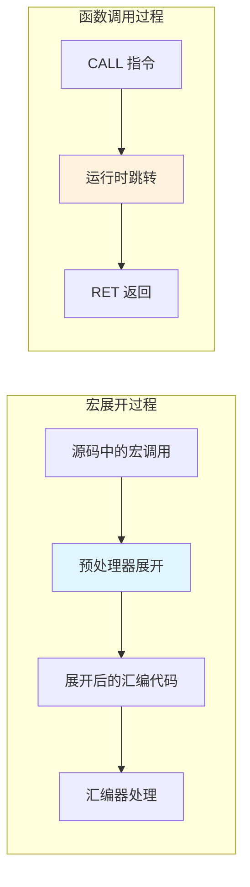
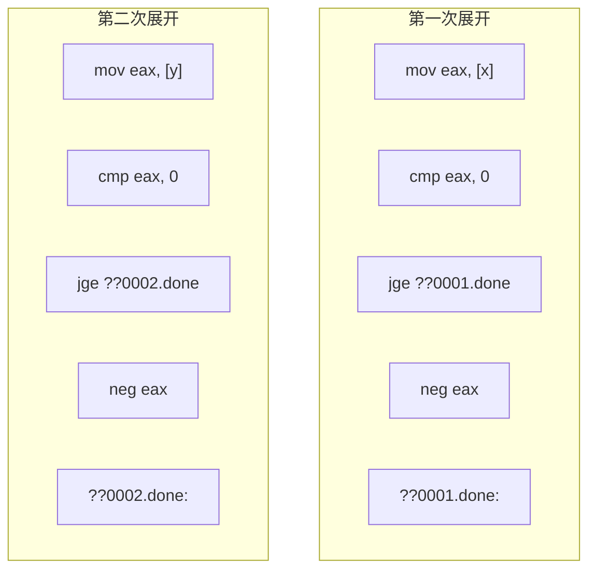
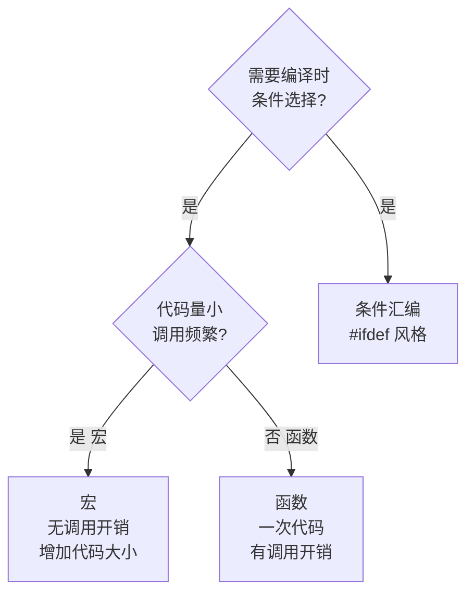
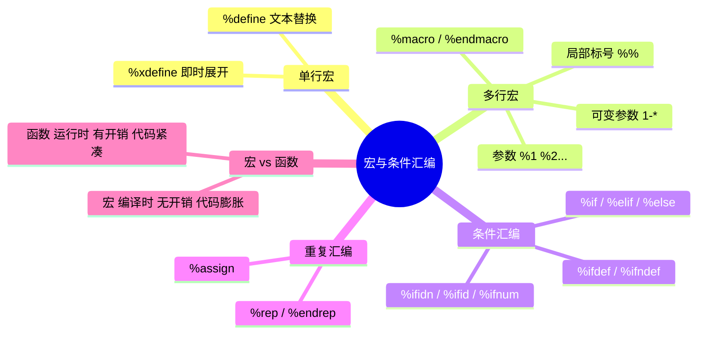

# 宏与条件汇编

## 为什么要用宏？

写过一段时间汇编后，你会发现某些代码片段反复出现——函数序言/结语、系统调用序列、常用常量定义。复制粘贴不仅累，还容易出错。**宏**（Macro）就是汇编的"代码模板"——定义一次，到处使用。

如果函数是运行时的代码复用，宏就是**编译时的代码复用**。宏在汇编阶段被展开，没有函数调用的开销。



## NASM 宏基础

### 单行宏：%define

`%define` 类似 C 语言的 `#define`，做简单的文本替换：

```nasm
%define EXIT_OK    0
%define SYS_WRITE  4
%define SYS_EXIT   1
%define STDOUT     1

; 使用
mov eax, SYS_EXIT
mov ebx, EXIT_OK
int 0x80
```

```nasm
; 带参数的单行宏
%define add1(x)  (x + 1)

mov eax, add1(10)     ; 展开为: mov eax, (10 + 1)
```

::: tip %define vs %xdefine
- `%define` 是惰性展开——每次使用时重新求值
- `%xdefine` 在定义时展开一次——类似 C 的宏行为
- 大多数情况用 `%define` 即可
:::

### 多行宏：%macro / %endmacro

多行宏是 NASM 宏系统的核心，可以包含任意多条指令：

```nasm
; 定义函数序言宏
%macro PROLOGUE 0
    push ebp
    mov ebp, esp
%endmacro

; 定义函数结语宏
%macro EPILOGUE 0
    mov esp, ebp
    pop ebp
    ret
%endmacro

; 使用
my_function:
    PROLOGUE
    ; ... 函数体 ...
    EPILOGUE
```

### 带参数的宏

宏可以接受参数，通过 `%1`、`%2` 等引用：

```nasm
; 系统调用宏
; 参数: %1=系统调用号, %2=参数个数
%macro SYSCALL 2
    mov eax, %1
    int 0x80
%endmacro

; 但这不够灵活，让我们写一个更好的版本

; 通用系统调用宏（最多3个参数）
; %1=调用号, %2=arg1, %3=arg2, %4=arg3
%macro DO_SYSCALL 1-4
    mov eax, %1
    %if %0 >= 2
    mov ebx, %2
    %endif
    %if %0 >= 3
    mov ecx, %3
    %endif
    %if %0 >= 4
    mov edx, %4
    %endif
    int 0x80
%endmacro

; 使用
DO_SYSCALL 1, 0              ; exit(0)
DO_SYSCALL 4, 1, msg, len   ; write(1, msg, len)
```

`%0` 表示实际传入的参数个数。`1-4` 表示最少 1 个、最多 4 个参数。

### 局部标号

宏内的标号如果重复展开会冲突。用 `%%` 前缀创建**宏局部标号**：

```nasm
; 绝对值宏
%macro ABS 1
    mov eax, %1
    cmp eax, 0
    jge %%done
    neg eax
%%done:
%endmacro

; 多次调用不会冲突
ABS [x]        ; 生成 %%done → ??0001.done
ABS [y]        ; 生成 %%done → ??0002.done
```



::: important 宏局部标号必须用 %%
如果宏内有跳转标号，必须用 `%%` 前缀。否则宏展开两次后会产生重复标号，汇编报错。
:::

## 条件汇编

条件汇编允许根据编译时条件选择性地包含代码——类似 C 的 `#ifdef`。

### %ifdef / %ifndef / %else / %endif

```nasm
; 调试模式开关
%define DEBUG

%ifdef DEBUG
    ; 调试版本：打印调试信息
    %macro DPRINT 1
        push eax
        push ebx
        push ecx
        push edx
        mov eax, 4
        mov ebx, 1
        mov ecx, %1
        mov edx, %1_len
        int 0x80
        pop edx
        pop ecx
        pop ebx
        pop eax
    %endmacro
%else
    ; 发布版本：DPRINT 什么都不做
    %macro DPRINT 1
    %endmacro
%endif
```

### %if / %elif / %else

```nasm
; 根据目标平台选择代码
%ifidn __OUTPUT_FORMAT__, elf32
    ; 32 位 Linux
    %define SYSCALL_INT 0x80
%elifidn __OUTPUT_FORMAT__, elf64
    ; 64 位 Linux
    %define SYSCALL_INST syscall
%elifidn __OUTPUT_FORMAT__, win32
    ; 32 位 Windows
    %define SYSCALL_INT 0x2E
%endif
```

### 条件汇编指令一览

| 指令 | 条件 |
|------|------|
| `%ifdef SYMBOL` | SYMBOL 已定义 |
| `%ifndef SYMBOL` | SYMBOL 未定义 |
| `%ifexpr EXPR` | 表达式为真 |
| `%ifidn A, B` | A 和 B 完全相同（区分大小写） |
| `%ifidni A, B` | A 和 B 相同（不区分大小写） |
| `%ifid TOKEN` | TOKEN 是标识符 |
| `%ifnum TOKEN` | TOKEN 是数字 |
| `%ifstr TOKEN` | TOKEN 是字符串 |

## 实用宏库

```nasm
; macros.inc - 通用宏库
; 使用: %include "macros.inc"

; ============================================
; 函数序言/结语
; ============================================
%macro PROLOGUE 0-1 0       ; 可选参数：局部变量字节数
    push ebp
    mov ebp, esp
    %if %1 > 0
    sub esp, %1
    %endif
%endmacro

%macro EPILOGUE 0-1 0       ; 可选参数：ret N 中的 N
    mov esp, ebp
    pop ebp
    %if %1 = 0
    ret
    %else
    ret %1
    %endif
%endmacro

; ============================================
; 系统调用宏
; ============================================
%macro sys_exit 1
    mov eax, 1
    mov ebx, %1
    int 0x80
%endmacro

%macro sys_write 3
    mov eax, 4
    mov ebx, %1              ; fd
    mov ecx, %2              ; buf
    mov edx, %3              ; len
    int 0x80
%endmacro

%macro sys_read 3
    mov eax, 3
    mov ebx, %1              ; fd
    mov ecx, %2              ; buf
    mov edx, %3              ; len
    int 0x80
%endmacro

; ============================================
; 断言宏（调试用）
; ============================================
%macro ASSERT 2
    %ifidn __OUTPUT_FORMAT__, elf32
        cmp %1, %2
        je %%ok
        ; 断言失败 - 调用 abort
        mov eax, 1
        mov ebx, 99
        int 0x80
    %%ok:
    %endif
%endmacro

; ============================================
; 字符串长度计算
; ============================================
%macro STRLEN 1
    %assign %%len 0
    %strlen %%len %1
%%len
%endmacro
```

## 实战：使用宏的 Hello World

```nasm
; hello_macro.asm - 使用宏重写的 Hello World
; 编译: nasm -f elf32 hello_macro.asm -o hello_macro.o
; 链接: ld -m elf_i386 hello_macro.o -o hello_macro

%include "macros.inc"

section .data
    msg db 'Hello from Macros!', 0xA
    msg_len equ $ - msg

section .text
    global _start

_start:
    sys_write STDOUT, msg, msg_len
    sys_exit 0
```

## 实战：泛型数组操作宏

```nasm
; array_macros.asm - 泛型数组操作
; 编译: nasm -f elf32 array_macros.asm -o array_macros.o
; 链接: gcc -m32 array_macros.o -o array_macros -nostdlib

; 数组遍历宏
; %1=数组名, %2=元素个数, %3=元素大小, %4=处理代码
%macro ARRAY_FOREACH 4
    push esi
    push ecx
    mov esi, %1
    mov ecx, %2
%%loop:
    %4                        ; 用户代码，ESI 指向当前元素
    add esi, %3               ; 移动到下一个元素
    dec ecx
    jnz %%loop
    pop ecx
    pop esi
%endmacro

; 数组求和宏
; %1=数组名, %2=元素个数
%macro ARRAY_SUM 2
    push esi
    push ecx
    push ebx
    xor eax, eax
    mov esi, %1
    mov ecx, %2
%%sum_loop:
    add eax, [esi]
    add esi, 4
    dec ecx
    jnz %%sum_loop
    pop ebx
    pop ecx
    pop esi
%endmacro

section .data
    numbers dd 10, 20, 30, 40, 50
    count   equ 5

section .text
    global _start

_start:
    ; 求和
    ARRAY_SUM numbers, count
    ; EAX = 150

    mov ebx, eax
    mov eax, 1
    int 0x80
```

## 宏 vs 函数：何时用哪个？



| 特性 | 宏 | 函数 |
|------|-----|------|
| 展开时机 | 编译时 | 运行时 |
| 调用开销 | 无 | 有（PUSH/CALL/RET） |
| 代码大小 | 每次使用都展开，更大 | 只有一份，更小 |
| 调试 | 展开后难以调试 | 可设断点 |
| 参数检查 | 无（纯文本替换） | 有类型（高级语言） |
| 适用场景 | 短小频繁的代码片段 | 较大的逻辑块 |

::: warning 宏的陷阱
- **无类型检查**：宏参数是纯文本，拼写错误不会报编译错误
- **代码膨胀**：频繁使用大宏会显著增加代码体积
- **调试困难**：GDB 中看到的是展开后的代码，不是宏调用
- **副作用**：`%define square(x) ((x)*(x))`，`square(i++)` 会递增两次

原则：**短且频繁的代码用宏，长且少用的代码用函数**。
:::

## 重复汇编：%rep / %endrep

```nasm
; 生成查找表
section .data
    squares:
    %assign i 0
    %rep 10
        dd i*i
    %assign i i+1
    %endrep
    ; 生成: 0, 1, 4, 9, 16, 25, 36, 49, 64, 81
```

## 小结



::: tip 面试要点
- 宏在编译时展开，函数在运行时调用——宏无调用开销但增加代码体积
- NASM 宏参数用 `%1`、`%2` 引用，`%0` 获取参数个数
- 宏内标号必须用 `%%` 前缀，避免重复展开冲突
- 条件汇编用 `%ifdef`/`%if` 等，实现跨平台代码和调试开关
- `1-*` 语法定义可变参数宏，`%0` 获取实际参数个数
:::

::: info 原著参考
本章内容参考自《汇编语言：基于Linux环境（第3版）》Jeff Duntemann 第12章"Coder's Introduction to the Cosmos"。书中讲解了 NASM 宏系统的完整语法和最佳实践。
:::
