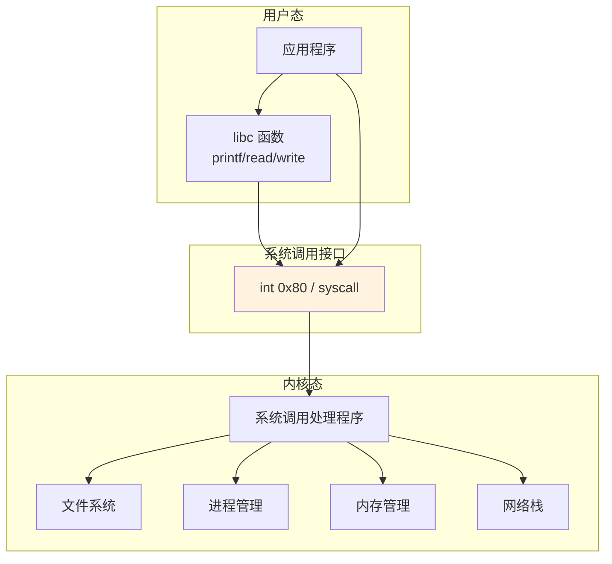
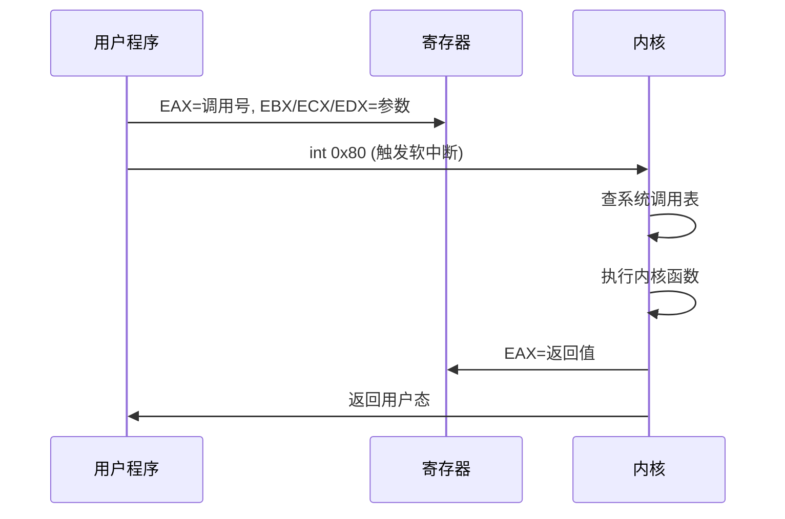
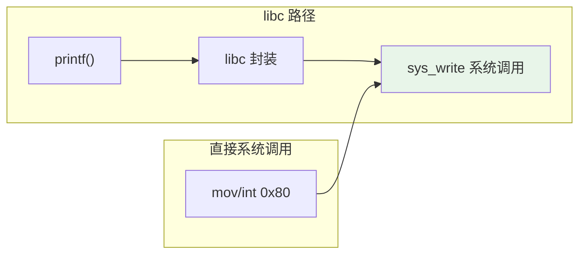
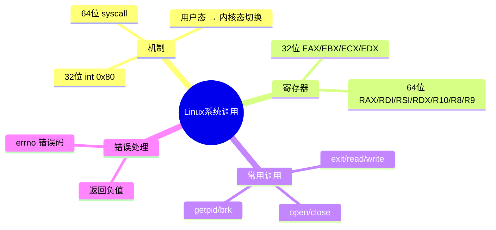

# Linux系统调用

## 用户态与内核态的边界

汇编程序不能直接操作硬件——读文件、写屏幕、创建进程，这些操作必须请求操作系统内核代劳。**系统调用**（System Call）就是用户程序向内核发出的服务请求，是用户态与内核态之间的"大门"。

如果把操作系统比作一家银行，用户程序是顾客，系统调用就是柜台窗口——你不能自己进金库取钱，必须通过窗口让工作人员帮你操作。



## 32 位系统调用机制

### 调用流程



### 寄存器约定

| 寄存器 | 用途 |
|--------|------|
| EAX | 系统调用号 |
| EBX | 第 1 个参数 |
| ECX | 第 2 个参数 |
| EDX | 第 3 个参数 |
| ESI | 第 4 个参数 |
| EDI | 第 5 个参数 |
| EBP | 第 6 个参数 |
| EAX | 返回值 |

::: important 系统调用号不是函数地址
EAX 中放的是系统调用的**编号**，不是函数地址。内核维护一张系统调用表（sys_call_table），根据编号查找对应的内核函数。
:::

### 常用 32 位系统调用号

| 编号 | 名称 | 功能 | 参数 |
|------|------|------|------|
| 1 | sys_exit | 退出进程 | EBX=退出码 |
| 2 | sys_fork | 创建进程 | EBX=标志 |
| 3 | sys_read | 读取 | EBX=fd, ECX=buf, EDX=len |
| 4 | sys_write | 写入 | EBX=fd, ECX=buf, EDX=len |
| 5 | sys_open | 打开文件 | EBX=路径, ECX=标志, EDX=模式 |
| 6 | sys_close | 关闭文件 | EBX=fd |
| 11 | sys_execve | 执行程序 | EBX=路径, ECX=argv, EDX=envp |
| 20 | sys_getpid | 获取PID | 无 |
| 45 | sys_brk | 改变数据段 | EBX=新地址 |

## 64 位系统调用机制

64 位 Linux 使用 `syscall` 指令替代 `int 0x80`，性能更好（不需要软中断的开销）：

| 寄存器 | 用途 |
|--------|------|
| RAX | 系统调用号 |
| RDI | 第 1 个参数 |
| RSI | 第 2 个参数 |
| RDX | 第 3 个参数 |
| R10 | 第 4 个参数（注意：不是 RCX！） |
| R8 | 第 5 个参数 |
| R9 | 第 6 个参数 |
| RAX | 返回值 |

::: warning 64 位系统调用号与 32 位不同！
64 位系统调用号与 32 位完全不同。例如：
- 32 位：sys_write = 4
- 64 位：sys_write = 1

在 64 位系统上用 `int 0x80` 可以兼容调用 32 位系统调用，但不推荐——性能差且参数传递方式不同。
:::

### 常用 64 位系统调用号

| 编号 | 名称 | 功能 |
|------|------|------|
| 0 | sys_read | 读取 |
| 1 | sys_write | 写入 |
| 2 | sys_open | 打开文件 |
| 3 | sys_close | 关闭文件 |
| 60 | sys_exit | 退出进程 |
| 39 | sys_getpid | 获取PID |
| 12 | sys_brk | 改变数据段 |

## 系统调用的错误处理

系统调用失败时，返回值为负数（即 EAX 的最高位为 1）。错误码存储在 EAX 中：

```nasm
mov eax, 5              ; sys_open
mov ebx, filename
mov ecx, 0              ; O_RDONLY
int 0x80

; 检查错误
cmp eax, 0
jl open_error           ; 返回值 < 0 表示出错
; 成功：EAX = 文件描述符
```

常见错误码（errno）：

| 错误码 | 值 | 含义 |
|--------|-----|------|
| EPERM | 1 | 操作不允许 |
| ENOENT | 2 | 文件不存在 |
| EACCES | 13 | 权限不足 |
| EFAULT | 14 | 地址错误 |
| EBADF | 9 | 文件描述符无效 |

::: tip 查看完整系统调用表
```bash
# 32 位
cat /usr/include/asm/unistd_32.h

# 64 位
cat /usr/include/asm/unistd_64.h

# man 手册
man 2 syscalls
```
:::

## 实战：read + write 回显程序

```nasm
; echo.asm - 从 stdin 读取并回显到 stdout
; 编译: nasm -f elf32 echo.asm -o echo.o
; 链接: ld -m elf_i386 echo.o -o echo
; 运行: ./echo (输入文字后回车)

section .data
    prompt db '> ', 0
    prompt_len equ $ - prompt

section .bss
    buffer resb 256           ; 输入缓冲区

section .text
    global _start

_start:
.main_loop:
    ; 显示提示符
    mov eax, 4                ; sys_write
    mov ebx, 1                ; stdout
    mov ecx, prompt
    mov edx, prompt_len
    int 0x80

    ; 读取输入
    mov eax, 3                ; sys_read
    mov ebx, 0                ; stdin
    mov ecx, buffer
    mov edx, 255
    int 0x80

    ; 检查 EOF 或错误
    cmp eax, 0
    jle .exit

    ; 回显输入
    mov edx, eax              ; 实际读取的字节数
    mov eax, 4                ; sys_write
    mov ebx, 1                ; stdout
    mov ecx, buffer
    int 0x80

    jmp .main_loop

.exit:
    mov eax, 1                ; sys_exit
    xor ebx, ebx
    int 0x80
```

## 实战：获取与打印 PID

```nasm
; pid.asm - 获取并打印当前进程 PID
; 编译: nasm -f elf32 pid.asm -o pid.o
; 链接: ld -m elf_i386 pid.o -o pid

section .data
    prefix db 'PID: '
    prefix_len equ $ - prefix
    newline db 0xA

section .bss
    pid_str resb 16           ; PID 数字字符串

section .text
    global _start

_start:
    ; 获取 PID
    mov eax, 20               ; sys_getpid
    int 0x80
    ; EAX = PID

    ; 将 PID 转换为字符串
    mov ecx, 10
    mov esi, pid_str + 15     ; 从末尾开始
    mov byte [esi], 0         ; null 终止

.convert_loop:
    xor edx, edx
    div ecx                   ; EAX = PID/10, EDX = PID%10
    add dl, '0'              ; 数字 → ASCII
    dec esi
    mov [esi], dl
    test eax, eax
    jnz .convert_loop

    ; 计算字符串长度
    mov edx, pid_str + 16
    sub edx, esi              ; 长度

    ; 打印前缀
    mov eax, 4
    mov ebx, 1
    mov ecx, prefix
    mov edx, prefix_len
    int 0x80

    ; 打印 PID
    mov eax, 4
    mov ebx, 1
    mov ecx, esi              ; 字符串起始
    mov edx, pid_str + 16
    sub edx, esi
    int 0x80

    ; 打印换行
    mov eax, 4
    mov ebx, 1
    mov ecx, newline
    mov edx, 1
    int 0x80

    ; 退出
    mov eax, 1
    xor ebx, ebx
    int 0x80
```

## 实战：64 位系统调用版本

```nasm
; hello64.asm - 64 位 Linux 系统调用
; 编译: nasm -f elf64 hello64.asm -o hello64.o
; 链接: ld hello64.o -o hello64

section .data
    msg db 'Hello from 64-bit Linux!', 0xA
    msg_len equ $ - msg

section .text
    global _start

_start:
    ; sys_write(1, msg, msg_len)
    mov rax, 1                ; sys_write (64位调用号)
    mov rdi, 1                ; stdout
    mov rsi, msg              ; 缓冲区
    mov rdx, msg_len          ; 长度
    syscall                   ; 64 位系统调用

    ; sys_exit(0)
    mov rax, 60               ; sys_exit (64位调用号)
    xor rdi, rdi              ; 退出码 0
    syscall
```

::: important 32 位 vs 64 位系统调用对比
| 项目 | 32 位 | 64 位 |
|------|-------|-------|
| 指令 | `int 0x80` | `syscall` |
| 调用号寄存器 | EAX | RAX |
| 参数寄存器 | EBX/ECX/EDX/ESI/EDI/EBP | RDI/RSI/RDX/R10/R8/R9 |
| write 调用号 | 4 | 1 |
| exit 调用号 | 1 | 60 |
:::

## 与 C 标准库的对比

```c
// C 代码
printf("Hello\n");
exit(0);
```

```nasm
; 汇编等价（直接系统调用，不经过 libc）
; printf → sys_write
mov eax, 4
mov ebx, 1
mov ecx, msg
mov edx, msg_len
int 0x80

; exit → sys_exit
mov eax, 1
xor ebx, ebx
int 0x80
```



::: tip 什么时候直接用系统调用？
- 学习和理解底层机制时
- 写极小的可执行文件（不链接 libc，体积从 KB 降到几十字节）
- 无法链接 libc 的场景（如引导扇区代码）
- 一般应用开发还是推荐使用 libc——它处理了错误重试、信号中断等边界情况
:::

## 小结



::: tip 面试要点
- 系统调用是用户态进入内核态的唯一正规途径
- 32 位用 `int 0x80`，64 位用 `syscall`——性能差异显著
- 64 位系统调用号与 32 位完全不同（write: 32位=4, 64位=1）
- 系统调用失败返回负值，错误码在 EAX/RAX 中
- 第 4 个参数在 64 位下用 R10 而非 RCX（syscall 指令会覆盖 RCX）
:::

::: info 原著参考
本章内容参考自《汇编语言：基于Linux环境（第3版）》Jeff Duntemann 第12章"Coder's Introduction to the Cosmos"及第13章"Heading for 64-bit"。书中详细讲解了 Linux 系统调用的工作原理和实战应用。
:::
