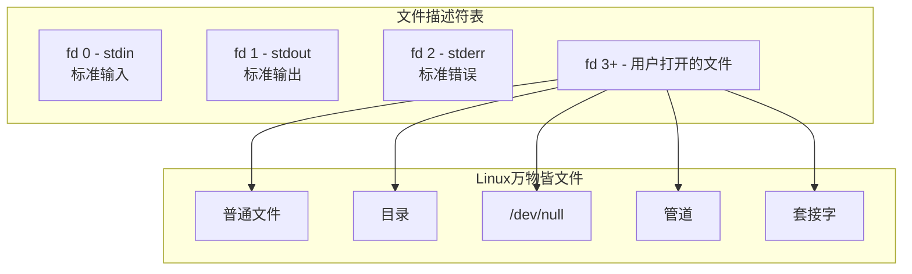

# 文件操作

## 一切皆文件

Linux 的哲学是"一切皆文件"——普通文件、目录、设备、管道、套接字，统统用文件描述符（File Descriptor）操作。在汇编层面，文件操作就是通过系统调用对文件描述符进行读、写、打开、关闭。



## 文件操作系统调用

### open - 打开文件

```nasm
; int open(const char *pathname, int flags, mode_t mode)
mov eax, 5              ; sys_open (32位)
mov ebx, filename       ; 文件路径
mov ecx, flags          ; 打开标志
mov edx, mode           ; 权限模式（创建文件时）
int 0x80
; EAX = 文件描述符（成功）或 负数（失败）
```

### 常用打开标志

| 标志 | 值 | 含义 |
|------|-----|------|
| O_RDONLY | 0 | 只读 |
| O_WRONLY | 1 | 只写 |
| O_RDWR | 2 | 读写 |
| O_CREAT | 0x40 | 不存在则创建 |
| O_TRUNC | 0x200 | 截断为 0 |
| O_APPEND | 0x400 | 追加写入 |

### 文件权限模式

| 权限 | 八进制 | 含义 |
|------|--------|------|
| 0644 | rw-r--r-- | 普通文件默认 |
| 0755 | rwxr-xr-x | 可执行文件默认 |
| 0600 | rw------- | 私有文件 |

### read - 读取文件

```nasm
; ssize_t read(int fd, void *buf, size_t count)
mov eax, 3              ; sys_read
mov ebx, fd             ; 文件描述符
mov ecx, buffer         ; 缓冲区地址
mov edx, count          ; 读取字节数
int 0x80
; EAX = 实际读取的字节数，0=EOF，负数=错误
```

### write - 写入文件

```nasm
; ssize_t write(int fd, const void *buf, size_t count)
mov eax, 4              ; sys_write
mov ebx, fd             ; 文件描述符
mov ecx, buffer         ; 数据地址
mov edx, count          ; 写入字节数
int 0x80
; EAX = 实际写入的字节数，负数=错误
```

### close - 关闭文件

```nasm
; int close(int fd)
mov eax, 6              ; sys_close
mov ebx, fd             ; 文件描述符
int 0x80
; EAX = 0（成功）或 负数（失败）
```

## 文件操作完整流程


## 实战：文件复制程序

```nasm
; filecopy.asm - 用汇编实现文件复制
; 编译: nasm -f elf32 filecopy.asm -o filecopy.o
; 链接: ld -m elf_i386 filecopy.o -o filecopy
; 用法: ./filecopy (硬编码复制 src.txt → dst.txt)

section .data
    src_name db 'src.txt', 0
    dst_name db 'dst.txt', 0
    buf_size equ 4096

    ; 错误消息
    err_open_src db 'Error: Cannot open source file', 0xA
    err_open_src_len equ $ - err_open_src
    err_open_dst db 'Error: Cannot create dest file', 0xA
    err_open_dst_len equ $ - err_open_dst
    err_read    db 'Error: Read failed', 0xA
    err_read_len equ $ - err_read
    success_msg db 'Copy complete!', 0xA
    success_len equ $ - success_msg

section .bss
    buffer resb buf_size
    src_fd resd 1
    dst_fd resd 1

section .text
    global _start

_start:
    ; ====== 打开源文件 ======
    mov eax, 5              ; sys_open
    mov ebx, src_name
    mov ecx, 0              ; O_RDONLY
    mov edx, 0
    int 0x80
    cmp eax, 0
    jl .err_open_src
    mov [src_fd], eax

    ; ====== 创建目标文件 ======
    mov eax, 5              ; sys_open
    mov ebx, dst_name
    mov ecx, 0x241          ; O_WRONLY | O_CREAT | O_TRUNC
    mov edx, 0x1A4          ; 0644 = rw-r--r--
    int 0x80
    cmp eax, 0
    jl .err_open_dst
    mov [dst_fd], eax

    ; ====== 复制循环 ======
.copy_loop:
    ; 读取源文件
    mov eax, 3              ; sys_read
    mov ebx, [src_fd]
    mov ecx, buffer
    mov edx, buf_size
    int 0x80

    cmp eax, 0
    jl .err_read
    je .copy_done           ; EOF

    ; 写入目标文件
    mov edx, eax            ; 实际读取的字节数
    mov eax, 4              ; sys_write
    mov ebx, [dst_fd]
    mov ecx, buffer
    int 0x80

    jmp .copy_loop

.copy_done:
    ; 关闭文件
    mov eax, 6              ; sys_close
    mov ebx, [src_fd]
    int 0x80
    mov eax, 6
    mov ebx, [dst_fd]
    int 0x80

    ; 打印成功消息
    mov eax, 4
    mov ebx, 1
    mov ecx, success_msg
    mov edx, success_len
    int 0x80

    ; 退出
    mov eax, 1
    xor ebx, ebx
    int 0x80

; ====== 错误处理 ======
.err_open_src:
    mov eax, 4
    mov ebx, 2              ; stderr
    mov ecx, err_open_src
    mov edx, err_open_src_len
    int 0x80
    mov eax, 1
    mov ebx, 1
    int 0x80

.err_open_dst:
    mov eax, 4
    mov ebx, 2
    mov ecx, err_open_dst
    mov edx, err_open_dst_len
    int 0x80
    mov eax, 1
    mov ebx, 2
    int 0x80

.err_read:
    mov eax, 4
    mov ebx, 2
    mov ecx, err_read
    mov edx, err_read_len
    int 0x80
    mov eax, 1
    mov ebx, 3
    int 0x80
```

## 实战：逐字符读取文件

```nasm
; hexdump.asm - 以十六进制显示文件内容
; 编译: nasm -f elf32 hexdump.asm -o hexdump.o
; 链接: ld -m elf_i386 hexdump.o -o hexdump

section .data
    filename db 'hexdump.asm', 0     ; 读取自身
    hex_chars db '0123456789ABCDEF'
    space db ' '
    newline db 0xA
    offset dd 0

section .bss
    char resb 1
    line_buf resb 48          ; 一行显示缓冲
    src_fd resd 1

section .text
    global _start

_start:
    ; 打开文件
    mov eax, 5
    mov ebx, filename
    xor ecx, ecx             ; O_RDONLY
    int 0x80
    mov [src_fd], eax

    mov ecx, 0               ; 列计数器

.read_loop:
    ; 读取 1 字节
    mov eax, 3
    mov ebx, [src_fd]
    mov ecx, char
    mov edx, 1
    int 0x80

    cmp eax, 0
    jle .done

    ; 将字节转为两位十六进制
    movzx eax, byte [char]
    mov ebx, eax
    shr al, 4                ; 高 4 位
    movzx esi, al
    mov al, [hex_chars + esi]
    mov [line_buf], al
    mov eax, ebx
    and al, 0x0F             ; 低 4 位
    movzx esi, al
    mov al, [hex_chars + esi]
    mov [line_buf + 1], al

    ; 输出十六进制值 + 空格
    mov eax, 4
    mov ebx, 1
    mov ecx, line_buf
    mov edx, 2
    int 0x80

    mov eax, 4
    mov ebx, 1
    mov ecx, space
    mov edx, 1
    int 0x80

    ; 每 16 字节换行
    inc dword [offset]
    mov eax, [offset]
    and eax, 0x0F
    cmp eax, 0
    jne .read_loop

    mov eax, 4
    mov ebx, 1
    mov ecx, newline
    mov edx, 1
    int 0x80
    jmp .read_loop

.done:
    ; 关闭文件
    mov eax, 6
    mov ebx, [src_fd]
    int 0x80

    mov eax, 1
    xor ebx, ebx
    int 0x80
```

## 文件定位：lseek

对于随机访问文件，使用 `lseek` 系统调用移动文件读写位置：

```nasm
; off_t lseek(int fd, off_t offset, int whence)
mov eax, 19             ; sys_lseek (32位)
mov ebx, fd             ; 文件描述符
mov ecx, offset         ; 偏移量
mov edx, whence         ; 定位基准
int 0x80
; EAX = 新的文件位置
```

| whence | 值 | 含义 |
|--------|-----|------|
| SEEK_SET | 0 | 文件开头 |
| SEEK_CUR | 1 | 当前位置 |
| SEEK_END | 2 | 文件末尾 |

```nasm
; 获取文件大小
mov eax, 19             ; sys_lseek
mov ebx, [fd]
xor ecx, ecx            ; offset = 0
mov edx, 2              ; SEEK_END
int 0x80
; EAX = 文件大小

; 回到文件开头
mov eax, 19
mov ebx, [fd]
xor ecx, ecx
xor edx, edx            ; SEEK_SET
int 0x80
```

## 文件元数据：stat

```nasm
; int stat(const char *pathname, struct stat *statbuf)
mov eax, 106            ; sys_stat (32位)
mov ebx, filename
mov ecx, stat_buf       ; struct stat 的缓冲区
int 0x80
```

struct stat 结构体中的关键字段偏移：

| 偏移 | 大小 | 字段 |
|------|------|------|
| 0 | 2 | st_dev |
| 12 | 4 | st_mode（文件类型+权限） |
| 20 | 4 | st_size（文件大小） |

## 小结


::: tip 面试要点
- Linux 文件操作核心：open/read/write/close，通过文件描述符操作
- 标准文件描述符：0=stdin, 1=stdout, 2=stderr，进程启动时自动打开
- O_CREAT 标志需要同时提供 mode 参数（如 0644）
- read 返回 0 表示 EOF，返回负数表示错误
- lseek(SEEK_END) 技巧可以获取文件大小
- 文件描述符是有限资源（默认上限 1024），用完必须 close
:::

::: info 原著参考
本章内容参考自《汇编语言：基于Linux环境（第3版）》Jeff Duntemann 第12章"Coder's Introduction to the Cosmos"。书中详细讲解了 Linux 文件 I/O 的系统调用接口和实战编程。
:::
