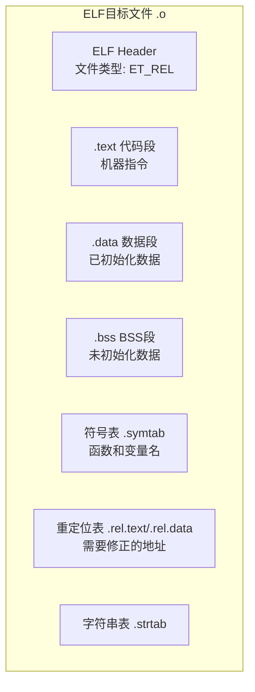
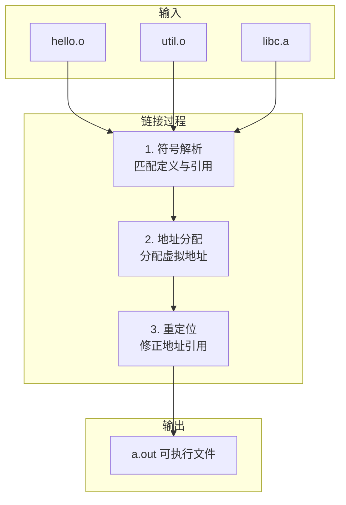
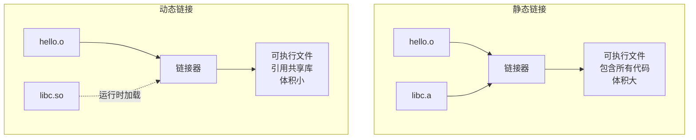
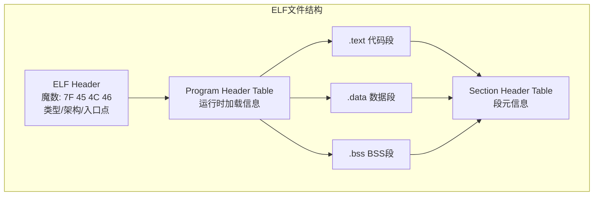
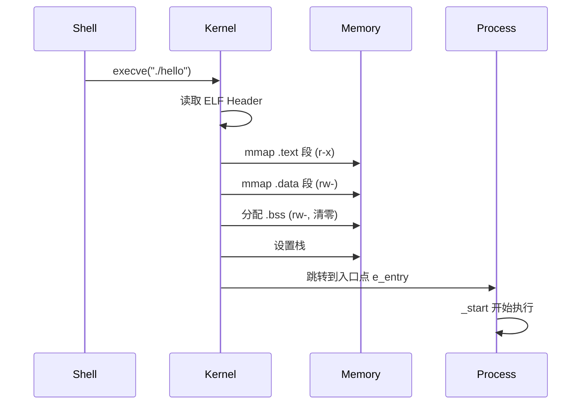
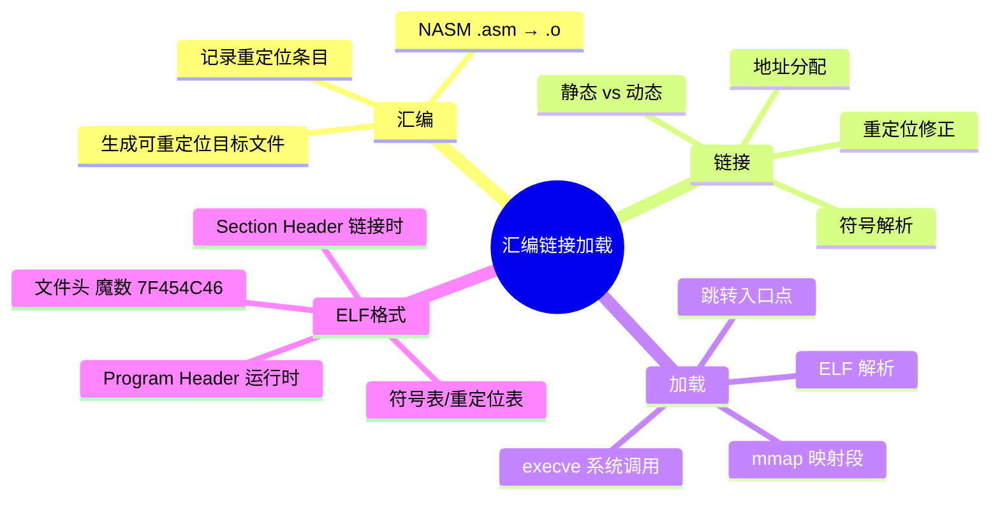

# 汇编链接加载过程

## 从源码到执行：三个阶段

你写的汇编代码变成可执行程序，需要经过三个阶段：**汇编**、**链接**、**加载**。每个阶段都有不同的职责，理解它们是掌握编译原理和调试链接错误的基础。


## 第一阶段：汇编（Assembly）

### 汇编器做什么

汇编器将助记符翻译成机器码，但地址还是**相对的**——因为汇编器不知道最终代码会被放在内存的哪个位置。

```nasm
; 源码
mov eax, [msg]           ; msg 的地址是多少？汇编器不知道
call my_func             ; my_func 在哪个地址？汇编器不知道
jmp .loop                ; .loop 是局部标号，相对跳转可以确定
```

### 目标文件的结构



### 查看目标文件内容

```bash
# 查看段信息
readelf -S hello.o

# 查看符号表
nm hello.o

# 查看重定位条目
readelf -r hello.o

# 反汇编代码段
objdump -d hello.o
```

### 重定位条目

目标文件中所有需要链接器修正的地址，都以**重定位条目**的形式记录：

```bash
$ readelf -r hello.o

Relocation section '.rel.text' at offset 0x3c4 contains 3 entries:
 Offset     Info    Type            Sym.Value  Sym. Name
00000007   00000101 R_386_32          00000000   msg
00000010   00000201 R_386_32          00000000   len
0000001a   00000304 R_386_PC32        00000000   my_func
```

- `R_386_32`：绝对地址重定位——需要填入符号的最终虚拟地址
- `R_386_PC32`：PC 相对重定位——需要填入符号相对于当前位置的偏移

## 第二阶段：链接（Linking）

### 链接器做什么

链接器将一个或多个目标文件**合并**，解决符号引用，生成可执行文件：



### 符号解析

每个目标文件有一个符号表，记录定义的和引用的符号：

```bash
$ nm hello.o
         U printf          # U = 未定义（需要外部提供）
00000000 T _start          # T = 在代码段定义
00000000 D msg             # D = 在数据段定义
```

链接器的任务是：为每个 `U`（未定义）符号找到对应的 `T`/`D`（定义）符号。

::: important 链接错误的本质
```
undefined reference to `my_func'
```
这就是符号解析失败——链接器在所有目标文件中都没找到 `my_func` 的定义。

```
multiple definition of `my_var'
```
同一个符号在多个目标文件中定义了——链接器不知道用哪个。
:::

### 地址分配

链接器将所有目标文件的段合并，分配虚拟地址：

```
hello.o 的 .text (0x00 - 0x2F)  ─┐
                                  ├→ 可执行文件的 .text (0x08048000 - 0x0804805F)
util.o  的 .text (0x00 - 0x2F)  ─┘

hello.o 的 .data (0x00 - 0x0F)  ─┐
                                  ├→ 可执行文件的 .data (0x08049000 - 0x0804901F)
util.o  的 .data (0x00 - 0x0F)  ─┘
```

### 重定位

地址分配后，链接器遍历重定位条目，修正代码中的地址引用：

```nasm
; 重定位前（目标文件中）
mov eax, 0x00000000       ; msg 的地址待填入
                    ← 重定位条目: offset=7, type=R_386_32, sym=msg

; 重定位后（可执行文件中）
mov eax, 0x08049000       ; msg 的实际虚拟地址
```

### 静态链接 vs 动态链接



| 特性 | 静态链接 | 动态链接 |
|------|---------|---------|
| 库代码 | 嵌入可执行文件 | 运行时加载 .so |
| 文件大小 | 大 | 小 |
| 更新库 | 需重新编译 | 替换 .so 即可 |
| 启动速度 | 快 | 稍慢（需查找 .so） |
| 内存占用 | 每进程一份 | 多进程共享 |

## ELF 文件格式

Linux 可执行文件采用 **ELF**（Executable and Linkable Format）格式：



### ELF 魔数

```bash
$ xxd hello | head -1
00000000: 7f45 4c46 0101 0100 0000 0000 0000 0000  .ELF............
```

- `7F`：标识这是一个 ELF 文件
- `45 4C 46`：ASCII "ELF"
- `01`：32 位（`02` = 64 位）
- `01`：小端序
- `01`：ELF 版本 1

### 查看 ELF 信息

```bash
# 查看文件头
readelf -h hello

# 查看程序头（段加载信息）
readelf -l hello

# 查看段头
readelf -S hello

# 查看符号表
readelf -s hello

# 查看依赖的动态库
readelf -d hello | grep NEEDED
```

## 第三阶段：加载（Loading）

### 加载器做什么

当你在终端输入 `./hello` 时：

1. Shell 调用 `fork()` 创建子进程
2. 子进程调用 `execve("./hello", ...)`
3. 内核的加载器读取 ELF 文件
4. 根据 Program Header 将段映射到内存
5. 设置栈、环境变量、命令行参数
6. 跳转到入口点 `_start`



### 进程的初始栈

在 `_start` 执行前，内核已经在栈上准备好了数据：

```
高地址
┌──────────────────┐
│  环境变量字符串    │
│  ...             │
│  命令行参数字符串  │
│  argv[0] = "./hello" │
├──────────────────┤
│  NULL            │  ← envp 末尾
│  环境变量指针      │
│  ...             │
│  NULL            │  ← argv 末尾
│  argv[1] 指针     │
│  argv[0] 指针     │
│  argc = 1        │  ← ESP 指向这里
└──────────────────┘
低地址
```

```nasm
; 在 _start 中访问 argc 和 argv
_start:
    pop eax               ; argc
    pop ecx               ; argv[0] = 程序名
    ; 剩余的 argv[1..] 和 envp 在栈上继续
```

## 实战：多文件项目

```nasm
; ============================================
; main.asm - 主程序
; ============================================
section .data
    msg db 'Result: ', 0
    msg_len equ $ - msg
    nl db 0xA

section .text
    extern add_numbers         ; 声明外部函数
    global _start

_start:
    ; 调用 add_numbers(10, 20)
    push dword 20
    push dword 10
    call add_numbers
    add esp, 8

    ; EAX = 30
    add eax, '0'              ; 转为 ASCII（简化版，仅个位数）
    mov [nl], al              ; 存入换行符位置

    ; 打印结果
    mov eax, 4
    mov ebx, 1
    mov ecx, msg
    mov edx, msg_len
    int 0x80

    mov eax, 4
    mov ebx, 1
    mov ecx, nl
    mov edx, 1
    int 0x80

    ; 退出
    mov eax, 1
    xor ebx, ebx
    int 0x80
```

```nasm
; ============================================
; math.asm - 数学函数模块
; ============================================
section .text
    global add_numbers

; ============================================
; add_numbers - 两数相加
; 输入: [ebp+8]=a, [ebp+12]=b
; 输出: EAX = a + b
; ============================================
add_numbers:
    push ebp
    mov ebp, esp
    mov eax, [ebp+8]
    add eax, [ebp+12]
    mov esp, ebp
    pop ebp
    ret
```

编译链接：

```bash
nasm -f elf32 main.asm -o main.o
nasm -f elf32 math.asm -o math.o
ld -m elf_i386 main.o math.o -o multi_file
./multi_file
# 输出: Result: 0  (简化版，30→'0'不是正确转换，仅作演示)
```

## 实战：与 C 代码混合编译

```nasm
; ============================================
; add.asm - 供 C 调用的汇编函数
; ============================================
section .text
    global add_asm

; int add_asm(int a, int b)
add_asm:
    push ebp
    mov ebp, esp
    mov eax, [ebp+8]
    add eax, [ebp+12]
    pop ebp
    ret
```

```c
/* main.c - 调用汇编函数的 C 程序 */
#include <stdio.h>

extern int add_asm(int a, int b);

int main() {
    int result = add_asm(10, 20);
    printf("add_asm(10, 20) = %d\n", result);
    return 0;
}
```

编译链接：

```bash
nasm -f elf32 add.asm -o add.o
gcc -m32 -c main.c -o main.o
gcc -m32 main.o add.o -o mixed
./mixed
# 输出: add_asm(10, 20) = 30
```

## 小结



::: tip 面试要点
- 汇编三阶段：汇编（生成 .o）→ 链接（生成可执行文件）→ 加载（运行）
- 目标文件中的地址是相对的，链接器通过重定位表修正为绝对地址
- `R_386_32` 是绝对重定位，`R_386_PC32` 是 PC 相对重定位
- 静态链接库嵌入可执行文件，动态链接运行时加载 .so
- ELF 魔数 `7F 45 4C 46`（DEL + "ELF"），可区分 32/64 位和大/小端
- `_start` 的栈顶是 argc，然后是 argv 指针数组和 envp 指针数组
:::

::: info 原著参考
本章内容参考自《汇编语言：基于Linux环境（第3版）》Jeff Duntemann 第5章"The Right to Assemble"及第6章"A Place to Stand, with Access to Tools"。书中详细讲解了 NASM 汇编器、LD 链接器的使用和 ELF 文件格式。
:::
