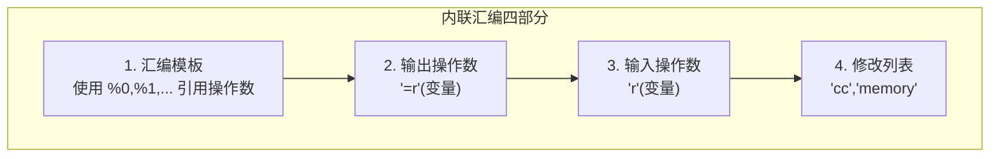
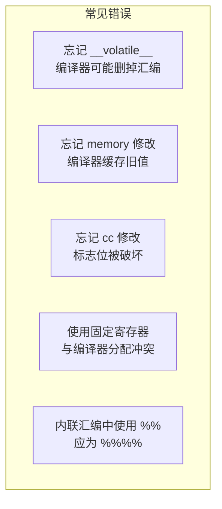
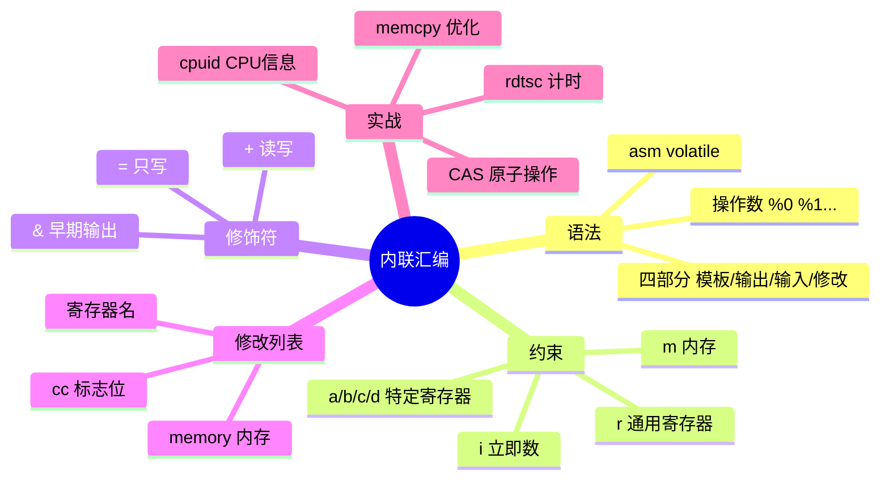

# 内联汇编

## 在 C 中嵌入汇编：为什么需要内联汇编？

大多数时候，C 编译器生成的代码已经足够高效。但在某些场景下，你需要内联汇编：

- 访问 C 语言无法表达的 CPU 指令（如 `cpuid`、`rdtsc`）
- 手动优化性能关键路径
- 操作系统内核中直接控制硬件
- 实现原子操作

内联汇编就像在 C 代码中开了一扇"天窗"——让你在高级语言的舒适区中，直接伸手操作底层硬件。


## GCC 内联汇编语法

### 基本格式

```c
__asm__ __volatile__(
    "汇编指令模板"
    : 输出操作数        // 可选
    : 输入操作数        // 可选
    : 修改列表          // 可选
);
```

- `__asm__` 是 `asm` 的安全写法（避免与关键字冲突）
- `__volatile__` 告诉编译器不要优化掉这段汇编

### 四个部分详解

```c
__asm__ __volatile__(
    "movl %1, %0"           // 汇编模板
    : "=r"(result)          // 输出: %0 = result
    : "r"(input)            // 输入: %1 = input
    :                       // 修改列表（无）
);
```



### 操作数编号规则

- `%0` = 第一个输出操作数
- `%1` = 第二个操作数（可能是第二个输出或第一个输入）
- 以此类推，输出和输入连续编号

```c
int a = 10, b = 20, result;
__asm__(
    "addl %2, %0"          // %0=result, %1=a, %2=b
    : "=r"(result)          // 输出 %0
    : "r"(a), "r"(b)        // 输入 %1, %2
);
// result = a + b = 30
```

::: warning 操作数编号从输出开始
编号顺序是：先输出操作数，再输入操作数。如果有 2 个输出和 1 个输入，则 %0、%1 是输出，%2 是输入。
:::

## 约束字符

约束告诉编译器操作数可以使用什么样的寄存器/内存：

### 通用约束

| 约束 | 含义 |
|------|------|
| `r` | 任意通用寄存器 |
| `m` | 内存操作数 |
| `i` | 立即数 |
| `n` | 已知值的立即数 |
| `g` | 任意（寄存器或内存或立即数） |

### 修饰符

| 修饰符 | 含义 |
|--------|------|
| `=` | 只写输出 |
| `+` | 读写操作数 |
| `&` | 早期输出（在输入使用前就已分配） |

### x86 特定约束

| 约束 | 寄存器 |
|------|--------|
| `a` | EAX/RAX |
| `b` | EBX/RBX |
| `c` | ECX/RCX |
| `d` | EDX/RDX |
| `S` | ESI/RSI |
| `D` | EDI/RDI |

## 常见内联汇编示例

### 读取时间戳计数器（RDTSC）

```c
static inline unsigned long long rdtsc(void) {
    unsigned int lo, hi;
    __asm__ __volatile__(
        "rdtsc"
        : "=a"(lo), "=d"(hi)    // lo→EAX, hi→EDX
    );
    return ((unsigned long long)hi << 32) | lo;
}

// 使用
unsigned long long t1 = rdtsc();
// ... 执行待测量代码 ...
unsigned long long t2 = rdtsc();
printf("CPU cycles: %llu\n", t2 - t1);
```

### CPUID - 获取 CPU 信息

```c
void get_cpu_vendor(char *vendor) {
    unsigned int eax, ebx, ecx, edx;
    __asm__ __volatile__(
        "cpuid"
        : "=b"(ebx), "=c"(ecx), "=d"(edx)
        : "a"(0)               // CPUID leaf 0
    );
    // Vendor string 在 EBX:EDX:ECX 中
    unsigned int *p = (unsigned int *)vendor;
    p[0] = ebx;
    p[1] = edx;
    p[2] = ecx;
    vendor[12] = '\0';
}
```

### 原子比较交换（CAS）

```c
// bool compare_and_swap(int *ptr, int expected, int newval)
// 如果 *ptr == expected，则 *ptr = newval 并返回 true
static inline int cas(int *ptr, int expected, int newval) {
    int result;
    __asm__ __volatile__(
        "lock cmpxchgl %2, %1"
        : "=a"(result), "+m"(*ptr)
        : "r"(newval), "0"(expected)
        : "cc", "memory"
    );
    return result == expected;
}
```

::: important 修改列表
- `"cc"`：汇编代码修改了标志寄存器（EFLAGS）
- `"memory"`：汇编代码修改了内存，编译器不能缓存内存值
- 对于 `cmpxchg` 等修改标志位的指令，必须加 `"cc"`
- 对于读写内存的指令，必须加 `"memory"` 防止编译器重排序
:::

### 内存屏障

```c
// 全内存屏障
static inline void memory_barrier(void) {
    __asm__ __volatile__("mfence" ::: "memory");
}

// 编译器屏障（不生成指令，只阻止编译器重排）
static inline void compiler_barrier(void) {
    __asm__ __volatile__("" ::: "memory");
}
```

### 快速位操作

```c
// 统计 1 的个数（使用 POPCNT 指令）
static inline int popcount(unsigned int x) {
    int result;
    __asm__("popcntl %1, %0" : "=r"(result) : "r"(x));
    return result;
}

// 位扫描正向（找最低位 1）
static inline int bsf(unsigned int x) {
    int result;
    __asm__("bsfl %1, %0" : "=r"(result) : "r"(x));
    return result;
}
```

## 64 位内联汇编

64 位模式下，寄存器名称和调用约定都不同：

```c
// 64 位 RDTSC
static inline unsigned long long rdtsc64(void) {
    unsigned long long result;
    __asm__ __volatile__(
        "rdtsc\n\t"
        "shlq $32, %%rdx\n\t"   // 注意: 64位用 %%rdx
        "orq %%rdx, %%rax\n\t"
        : "=a"(result)
        :                       // 无输入
        : "rdx"                 // 修改 RDX
    );
    return result;
}
```

::: warning 32 位 vs 64 位差异
- 32 位寄存器：`%eax`, `%ebx` 等
- 64 位寄存器：`%%rax`, `%%rbx` 等（内联汇编中需双 %%）
- 约束也需对应：`"=a"` 在 32 位选 EAX，64 位选 RAX
:::

## 实战：性能测量框架

```c
/* perf_counter.h - 基于内联汇编的性能计数器 */
#ifndef PERF_COUNTER_H
#define PERF_COUNTER_H

#include <stdio.h>

/* 读取 TSC */
static inline unsigned long long rdtsc_start(void) {
    unsigned int lo, hi;
    __asm__ __volatile__(
        "cpuid\n\t"            /* 串行化 */
        "rdtsc\n\t"
        : "=a"(lo), "=d"(hi)
        :
        : "%ebx", "%ecx"
    );
    return ((unsigned long long)hi << 32) | lo;
}

static inline unsigned long long rdtsc_end(void) {
    unsigned int lo, hi;
    __asm__ __volatile__(
        "rdtscp\n\t"           /* 串行化的 RDTSC */
        "movl %%eax, %0\n\t"
        "movl %%edx, %1\n\t"
        "cpuid\n\t"
        : "=r"(lo), "=r"(hi)
        :
        : "%eax", "%ebx", "%ecx", "%edx"
    );
    return ((unsigned long long)hi << 32) | lo;
}

/* 便利宏 */
#define PERF_BEGIN() unsigned long long _perf_t1 = rdtsc_start()
#define PERF_END(msg) do { \
    unsigned long long _perf_t2 = rdtsc_end(); \
    printf("%s: %llu cycles\n", msg, _perf_t2 - _perf_t1); \
} while(0)

#endif
```

```c
/* test_perf.c - 使用性能计数器 */
#include "perf_counter.h"

int main() {
    volatile int sum = 0;

    PERF_BEGIN();
    for (int i = 0; i < 1000; i++) {
        sum += i;
    }
    PERF_END("1000 iterations");

    return 0;
}
```

## 实战：利用内联汇编优化的 memcpy

```c
/* fast_memcpy.c - 利用 rep movsd 的快速内存复制 */
#include <stddef.h>

void* fast_memcpy(void *dest, const void *src, size_t n) {
    __asm__ __volatile__(
        "cld\n\t"
        "rep movsb"
        : "+D"(dest), "+S"(src), "+c"(n)
        :
        : "cc", "memory"
    );
    return dest;
}
```

## 内联汇编的常见陷阱



::: warning 内联汇编调试困难
- 编译器无法验证汇编指令的正确性
- 约束写错会导致静默的错误（寄存器被覆盖）
- 不同 GCC 版本行为可能不同
- 尽可能用 C 写代码，只在必要时用内联汇编
:::

## 小结



::: tip 面试要点
- GCC 内联汇编四部分：汇编模板、输出操作数、输入操作数、修改列表
- `__volatile__` 防止编译器优化删除汇编代码
- 操作数按输出→输入顺序编号：%0、%1、...
- 约束 `"r"` 让编译器选寄存器，`"a"` 指定 EAX
- 修改列表 `"cc"` 表示修改了标志位，`"memory"` 表示修改了内存
- RDTSC 用于高精度计时，CPUID 用于 CPU 信息查询
- 内联汇编的优先替代方案：使用编译器内建函数（`__builtin_*`）
:::

::: info 原著参考
本章内容参考自《汇编语言：基于Linux环境（第3版）》Jeff Duntemann 第12章"Coder's Introduction to the Cosmos"中关于 C 与汇编混合编程的讨论。内联汇编的具体语法请参考 GCC 官方文档 "Extended Asm" 章节。
:::
