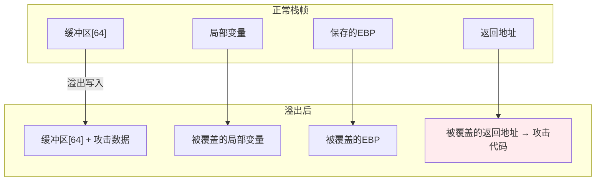
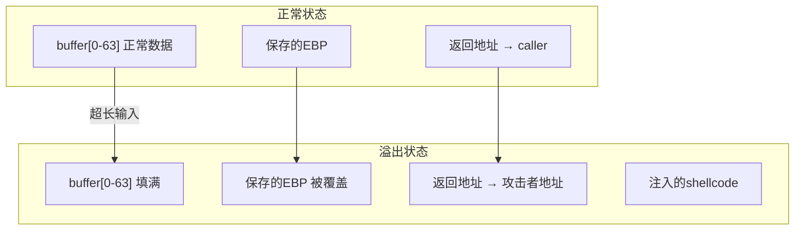
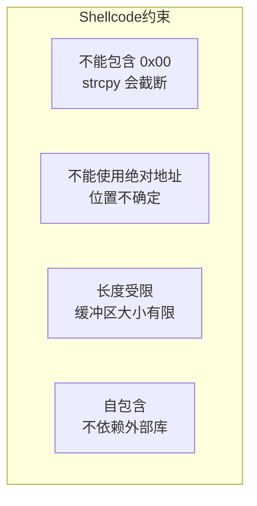
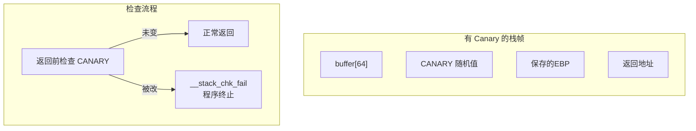
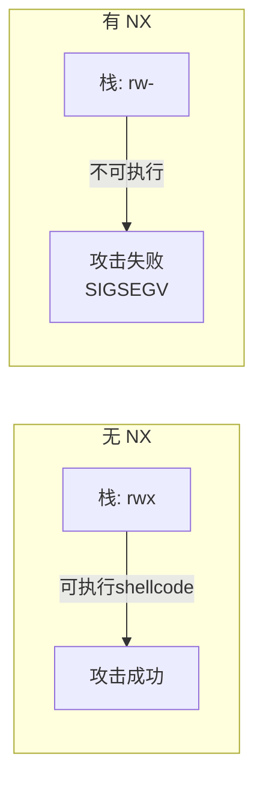
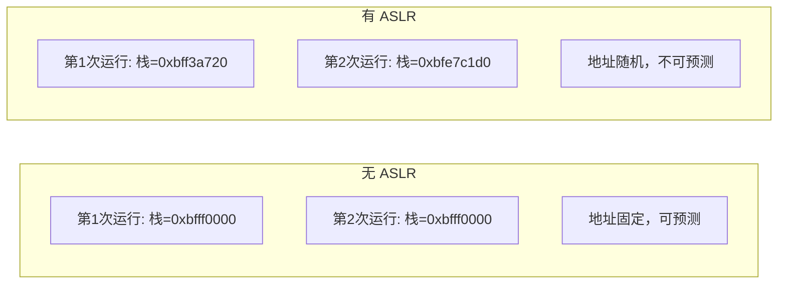
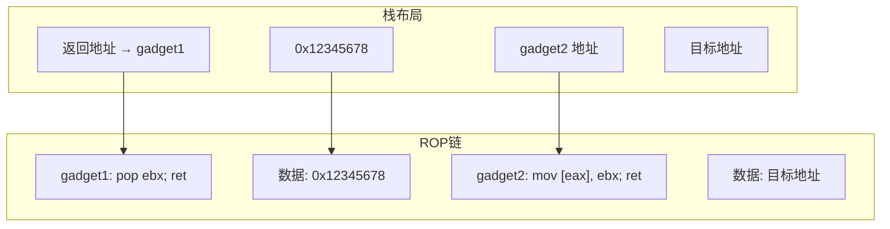
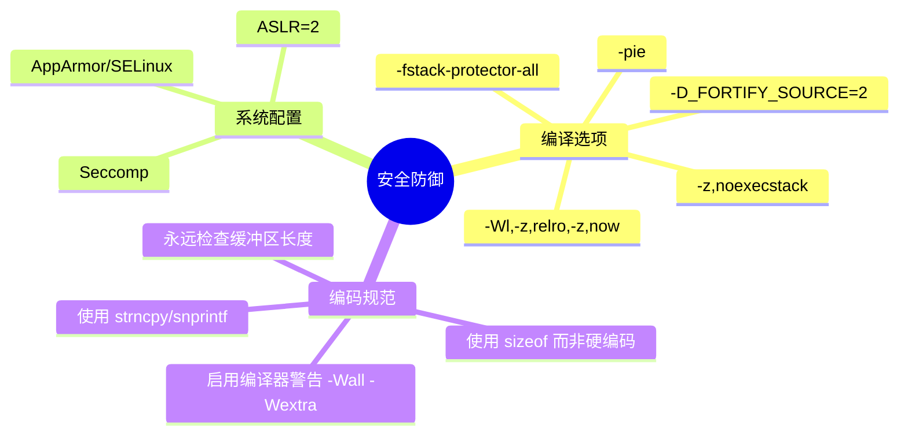
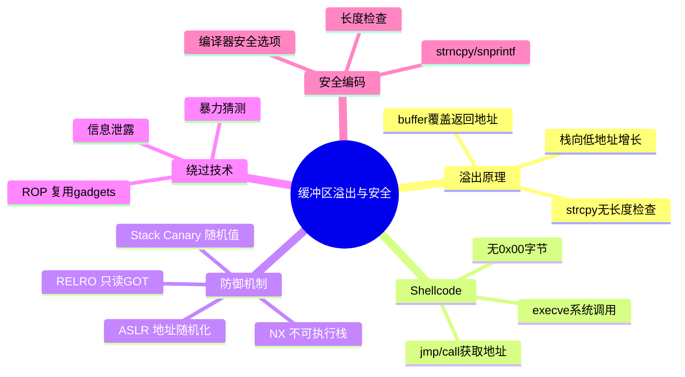

# 缓冲区溢出与安全

## 缓冲区溢出：最经典的漏洞

缓冲区溢出是最古老也最危险的软件漏洞之一——攻击者通过向缓冲区写入超出其容量的数据，覆盖相邻的内存，从而劫持程序控制流。理解缓冲区溢出的原理，是理解现代安全防御机制的基础。



::: warning 本节内容仅用于安全学习
本节讲解缓冲区溢出的原理和防御技术，**仅用于安全研究和防御目的**。未经授权对他人系统进行攻击是违法行为。
:::

## 栈缓冲区溢出原理

### 漏洞代码示例

```c
// vulnerable.c - 有缓冲区溢出漏洞的程序
#include <stdio.h>
#include <string.h>

void vulnerable_function(char *input) {
    char buffer[64];           // 只有 64 字节的缓冲区
    strcpy(buffer, input);     // 没有长度检查！
    printf("You entered: %s\n", buffer);
}

int main(int argc, char **argv) {
    if (argc > 1) {
        vulnerable_function(argv[1]);
    }
    return 0;
}
```

`strcpy` 不检查源字符串长度——如果输入超过 64 字节，就会溢出缓冲区，覆盖栈上的其他数据。

### 栈帧中的溢出过程



### 用汇编理解溢出

```nasm
; vulnerable_function 的栈帧
vulnerable_function:
    push ebp
    mov ebp, esp
    sub esp, 64                ; 分配 64 字节缓冲区

    ; buffer 的地址 = ebp - 64
    ; 返回地址在 ebp + 4
    ; 攻击者写入 64 + 4（EBP）+ 4（返回地址）= 72 字节即可控制返回地址

    ; strcpy 不做边界检查
    ; 如果 input 长度 > 64，数据会覆盖保存的 EBP 和返回地址

    mov esp, ebp
    pop ebp
    ret                        ; 跳转到被覆盖的返回地址！
```

::: important 溢出的关键
缓冲区在低地址，返回地址在高地址，而数据是从低地址向高地址写入的——这正是溢出能覆盖返回地址的原因。如果栈向高地址增长，缓冲区溢出就不会覆盖返回地址。
:::

## Shellcode 基础

Shellcode 是注入到目标程序中执行的机器码。经典示例：启动 `/bin/sh`：

```nasm
; shellcode.asm - 32位 Linux execve("/bin/sh") shellcode
; 编译: nasm -f elf32 shellcode.asm -o shellcode.o
; 提取: objcopy -O binary shellcode.o shellcode.bin

section .text
    global _start

_start:
    ; execve("/bin/sh", ["/bin/sh", NULL], NULL)

    ; 方法：利用 jmp/call 技巧获取字符串地址
    jmp short get_string

shellcode_start:
    pop esi                    ; ESI = "/bin/sh" 的地址

    ; 构造 argv 数组在栈上
    xor eax, eax               ; EAX = 0
    push eax                   ; argv[1] = NULL
    push esi                   ; argv[0] = "/bin/sh"
    mov ecx, esp               ; ECX = argv 数组地址

    ; envp = NULL
    xor edx, edx

    ; sys_execve
    mov al, 11                 ; 系统调用号（只用 AL，避免 \0）
    int 0x80

get_string:
    call shellcode_start       ; call 会压入下一条指令的地址
    db '/bin/sh', 0            ; 字符串紧跟在 call 之后

; 整个 shellcode 不能包含 \0 字节（会被 strcpy 截断）
```

### Shellcode 的约束



### 避免 0x00 的技巧

```nasm
; ❌ 有 0x00 的写法
mov eax, 0              ; 编码为 B8 00 00 00 00（包含 0x00）

; ✅ 无 0x00 的写法
xor eax, eax            ; 编码为 31 C0（无 0x00）

; ❌
mov al, 0x0B            ; 可能编码含 0x00

; ✅
push byte 0x0B
pop eax                  ; EAX = 11，无 0x00
```

## 现代防御机制

### 栈保护（Stack Canary）

在返回地址前插入一个随机值（canary），函数返回前检查 canary 是否被修改：



```nasm
; GCC -fstack-protector 生成的代码
vulnerable_function:
    push ebp
    mov ebp, esp
    sub esp, 72                ; 多分配 8 字节放 canary

    ; 从 GS 段读取 canary（每次运行随机）
    mov eax, gs:0x14
    mov [ebp-8], eax           ; 存储 canary

    ; ... 函数体 ...

    ; 返回前检查 canary
    mov eax, [ebp-8]
    xor eax, gs:0x14           ; 与原始值比较
    jne .stack_smash_detected  ; 不相等则检测到溢出！

    mov esp, ebp
    pop ebp
    ret

.stack_smash_detected:
    call __stack_chk_fail      ; 终止程序
```

::: tip 编译选项
```bash
gcc -fstack-protector-all   # 所有函数加 canary
gcc -fno-stack-protector    # 禁用 canary（调试用）
```
:::

### NX Bit（No-eXecute）

将栈和堆标记为**不可执行**，即使注入了 shellcode 也无法运行：



```bash
# 查看可执行段的权限
readelf -l program | grep STACK

# 编译时禁用 NX（仅调试用）
gcc -z execstack program.c
```

### ASLR（地址空间布局随机化）

每次运行时随机化栈、堆、共享库的加载地址，攻击者无法预测目标地址：



```bash
# 查看 ASLR 状态
cat /proc/sys/kernel/randomize_va_space
# 0 = 关闭, 1 = 部分随机, 2 = 完全随机

# 临时关闭 ASLR（仅调试用）
echo 0 | sudo tee /proc/sys/kernel/randomize_va_space

# 编译时禁用 PIE（位置无关可执行文件）
gcc -no-pie program.c
```

### RELRO（Relocation Read-Only）

将 GOT（全局偏移表）标记为只读，防止覆盖 GOT 条目：

```bash
# 部分 RELRO（默认）
gcc -Wl,-z,relro program.c

# 完整 RELRO（启动时解析所有符号，然后锁定 GOT）
gcc -Wl,-z,relro,-z,now program.c
```

## 绕过技术概览

攻击与防御是永恒的军备竞赛：

| 防御机制 | 绕过技术 |
|---------|---------|
| Stack Canary | 信息泄露泄露 canary 值 |
| NX/DEP | ROP（Return-Oriented Programming） |
| ASLR | 信息泄露、暴力猜测 |
| RELRO | 覆盖其他可写函数指针 |

### ROP 原理

NX 阻止了在栈上执行代码，但 ROP 利用**已有代码片段**（gadgets）实现攻击：



ROP 的核心思想：不需要注入新代码，而是复用程序中已有的 `ret` 结尾的小片段（gadgets），通过精心构造的栈帧串联它们。

## 实战：安全编码实践

### 使用安全的字符串函数

```c
// ❌ 不安全
char buf[64];
strcpy(buf, input);      // 无长度检查
gets(buf);               // 无长度检查
sprintf(buf, "%s", input); // 无长度检查

// ✅ 安全
char buf[64];
strncpy(buf, input, sizeof(buf) - 1);
buf[sizeof(buf) - 1] = '\0';
fgets(buf, sizeof(buf), stdin);
snprintf(buf, sizeof(buf), "%s", input);
```

### 用汇编实现安全拷贝

```nasm
; safe_copy.asm - 带长度检查的字符串拷贝
; 输入: ESI=源, EDI=目标, ECX=最大长度
; 输出: EAX=实际拷贝长度

safe_strncpy:
    push ebp
    mov ebp, esp
    push esi
    push edi

    mov esi, [ebp+8]         ; 源
    mov edi, [ebp+12]        ; 目标
    mov ecx, [ebp+16]        ; 最大长度
    dec ecx                   ; 留一个字节给 '\0'
    xor edx, edx             ; 计数器

.copy_loop:
    test ecx, ecx
    jz .copy_done
    lodsb                     ; AL = [ESI++]
    stosb                     ; [EDI++] = AL
    test al, al               ; 是否为 '\0'?
    jz .copy_done
    dec ecx
    inc edx
    jmp .copy_loop

.copy_done:
    ; 确保以 null 结尾
    mov byte [edi], 0
    mov eax, edx              ; 返回实际长度

    pop edi
    pop esi
    mov esp, ebp
    pop ebp
    ret
```

### 检查编译器的安全选项

```bash
# 查看二进制的安全特性
checksec --file=program

# 输出示例：
# RELRO        STACK CANARY  NX         PIE        RPATH     RUNPATH   Symbols
# Full RELRO   Canary found  NX enabled  PIE enabled  No RunPath  No Symbols
```

## 安全检查清单



## 小结



::: tip 面试要点
- 缓冲区溢出：向缓冲区写入超过其容量的数据，覆盖栈上的返回地址
- Stack Canary：在返回地址前放随机值，返回前检测是否被覆盖
- NX Bit：将栈标记为不可执行，阻止 shellcode 运行
- ASLR：随机化内存布局，使攻击者无法预测地址
- ROP：利用已有代码片段绕过 NX，通过构造栈帧串联 gadgets
- 安全编码：始终检查缓冲区长度，使用 strncpy/snprintf 替代不安全函数
- GCC 安全编译选项：`-fstack-protector-all -D_FORTIFY_SOURCE=2 -pie -Wl,-z,relro,-z,now`
:::

::: info 原著参考
本章内容参考自《汇编语言：基于Linux环境（第3版）》Jeff Duntemann 第12章中关于安全编程的讨论。缓冲区溢出的深入技术可参考《Hacking: The Art of Exploitation》Jon Erickson。
:::
