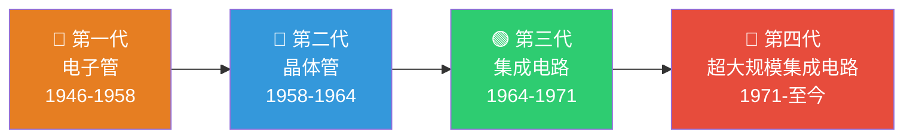
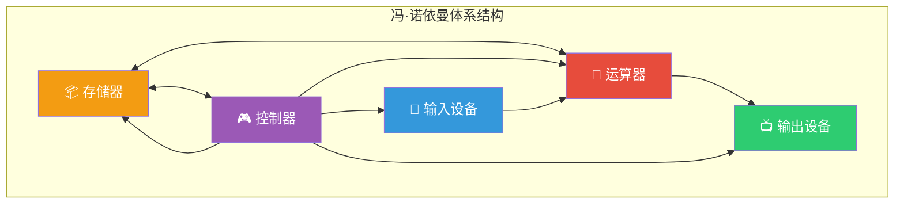
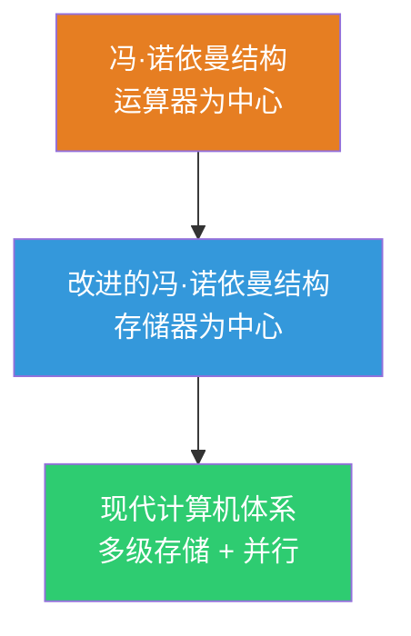

> 如果把计算机的发展比作一部进化史，那么每一代计算机都像一次"物种爆发"——从笨重的电子管巨兽到指甲盖上的芯片，每一次元器件的革新都催生了全新的计算文明。

## 一、计算机的四代发展

### 1.1 发展时间线

### 1.2 四代计算机详细对比

| 代次 | 时间 | 逻辑元件 | 内存 | 外存 | 运算速度 | 代表机型 |
|:---:|------|----------|------|------|----------|----------|
| 第一代 | 1946-1958 | 电子管 | 磁鼓 | 穿孔卡片 | 几千次/秒 | ENIAC |
| 第二代 | 1958-1964 | 晶体管 | 磁芯 | 磁带 | 几十万次/秒 | IBM 7090 |
| 第三代 | 1964-1971 | 中小规模集成电路 | 半导体存储器 | 磁盘 | 几百万次/秒 | IBM 360 |
| 第四代 | 1971-至今 | 大/超大规模集成电路 | 半导体存储器 | 磁盘/SSD | 数十亿次/秒 | 个人PC |

::: important 关键转折点
每一代的更替都源于**逻辑元件**的革新。元件的微型化带来了速度提升、体积缩小、功耗降低和可靠性增强，这被称为计算机发展的"四化趋势"。
:::

### 1.3 各代特征详解

**第一代（电子管计算机）**

- 使用约 18000 个电子管，耗电 150 千瓦
- ENIAC 重达 30 吨，占地 170 平方米
- 用机器语言编程，无操作系统
- 主要用于科学计算

**第二代（晶体管计算机）**

- 晶体管比电子管体积小、功耗低、可靠性高
- 出现了高级语言（FORTRAN、COBOL）和批处理系统
- 开始应用于数据处理和事务管理

**第三代（集成电路计算机）**

- 将多个电子元件集成在一块芯片上
- 出现了分时操作系统和小型机
- 软件工程概念萌芽

**第四代（超大规模集成电路计算机）**

- 微处理器诞生（Intel 4004，1971年）
- 个人计算机（PC）普及
- 出现了并行处理、分布式计算
- 互联网与移动计算时代

---

## 二、冯·诺依曼体系结构

### 2.1 冯·诺依曼其人

约翰·冯·诺依曼（John von Neumann），美籍匈牙利数学家，1945年发表了著名论文《关于EDVAC的报告草案》，提出了**存储程序**的计算机设计思想，被誉为"现代计算机之父"。

### 2.2 冯·诺依曼体系结构图

### 2.3 冯·诺依曼体系的核心思想

::: important 存储程序思想
**存储程序**是冯·诺依曼体系结构的灵魂：将程序（指令序列）和数据以二进制形式预先存入计算机的存储器中，计算机在工作时自动、连续地从存储器中依次取出指令并执行，无需人工干预。
:::

冯·诺依曼体系的**三大核心特征**：

1. **数据和指令同等地位**：均以二进制形式存放在存储器中，计算机区分它们的唯一依据是**访问时机**
2. **存储程序**：程序预先存入存储器，计算机自动依次执行
3. **顺序执行**：指令按地址顺序存放，通常按顺序执行，遇到转移指令时改变执行顺序

### 2.4 冯·诺依曼结构的局限性

| 局限性 | 说明 |
|--------|------|
| 存储器瓶颈 | CPU 速度远高于存储器，形成"存储墙"（Memory Wall） |
| 串行执行 | 指令必须顺序执行，难以充分利用并行性 |
| 数据与指令共存 | 可能产生安全漏洞（如缓冲区溢出攻击） |

::: warning 易混点
冯·诺依曼体系中，**运算器**是核心部件；而现代计算机中，**存储器**才是核心——因为 CPU 的大部分时间在等待数据。
:::

---

## 三、现代计算机的发展

### 3.1 从冯·诺依曼到现代体系

### 3.2 摩尔定律

英特尔创始人之一戈登·摩尔于1965年提出：

> 集成电路上可容纳的晶体管数目，约每隔18-24个月便会增加一倍，性能也将提升一倍。

::: info 摩尔定律的现状
摩尔定律本质上是经济规律而非物理定律。近年来，随着工艺节点逼近物理极限（3nm、2nm），摩尔定律的增速明显放缓，业界开始转向**多核并行**和**领域专用架构（DSA）**等方向。
:::

### 3.3 计算机的分类

| 分类依据 | 类型 | 说明 |
|----------|------|------|
| 用途 | 专用计算机 | 针对特定任务设计，效率高但灵活性差 |
| 用途 | 通用计算机 | 可完成各种任务，灵活性高 |
| 规模 | 巨型机/大型机/中型机/小型机/微型机/单片机 | 按体积、速度、价格划分 |
| 指令系统 | CISC | 复杂指令集，如 x86 |
| 指令系统 | RISC | 精简指令集，如 ARM、RISC-V |

---

## 四、练习题

### 题目1

下列关于冯·诺依曼体系结构的叙述中，错误的是（ ）

A. 指令和数据以二进制形式存放在存储器中
B. 指令和数据通过不同的总线传输
C. 计算机以运算器为中心
D. 程序可以自动、连续地执行

### 题目2

第四代计算机的逻辑元件是（ ）

A. 电子管
B. 晶体管
C. 中小规模集成电路
D. 大规模和超大规模集成电路

### 题目3

简述"存储程序"思想的含义及其重要性。

---

### 参考答案

**题目1：B**

冯·诺依曼体系中，指令和数据以同等地位存放在同一存储器中，通过**同一总线**传输，计算机通过访问时机区分指令和数据，而非通过不同的物理通路。

**题目2：D**

第四代（1971年至今）的逻辑元件是大规模和超大规模集成电路（VLSI）。第一代电子管，第二代晶体管，第三代中小规模集成电路。

**题目3：**

存储程序思想是指将程序（指令序列）和数据预先存入计算机的存储器中，计算机在运行时自动从存储器中依次取出指令并执行，无需人工干预。

重要性：
- 实现了计算机的自动、连续工作，摆脱了对人工操作的依赖
- 使得程序可以方便地修改和替换，赋予计算机极大的通用性
- 奠定了现代计算机体系结构的基础，是计算机能"计算"的根本保证

---

::: tip 面试速查
- **四代发展**：电子管→晶体管→中小规模IC→大规模/超大规模IC
- **冯·诺依曼三大特征**：①指令与数据同等地位 ②存储程序 ③顺序执行
- **冯·诺依曼五大部件**：运算器、控制器、存储器、输入设备、输出设备
- **存储程序**是冯·诺依曼体系的核心思想
- 冯·诺依曼体系以**运算器**为中心，现代计算机以**存储器**为中心
:::

::: info 原著参考
- 唐朔飞《计算机组成原理》第1章
- 白中英《计算机组成原理》第1章
- Patterson & Hennessy《Computer Organization and Design》Chapter 1
:::
