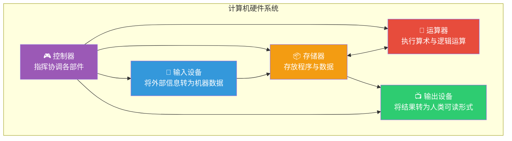
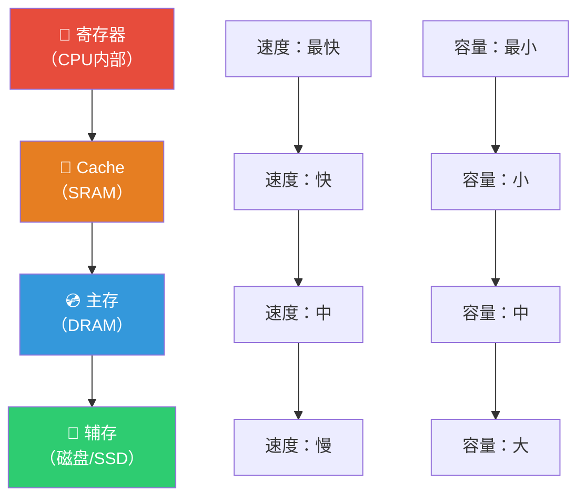
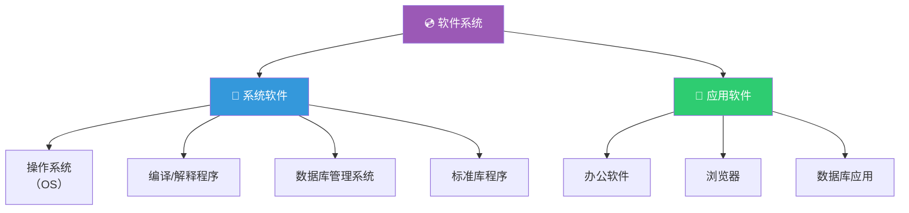
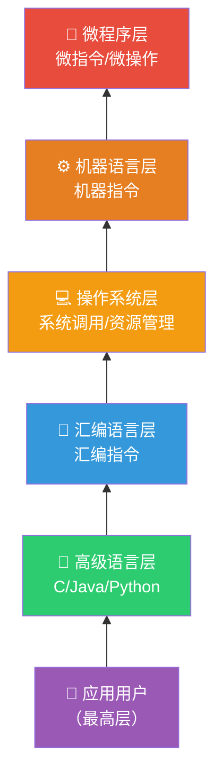

> 如果把计算机比作一栋摩天大厦，那么硬件就是钢筋混凝土的骨架，软件就是水电空调的灵魂，而层次结构则告诉你：从地基到顶层，每一层都为上一层提供了怎样的服务，又向下一层提出了怎样的需求。

## 一、硬件系统

### 1.1 冯·诺依曼五大部件

冯·诺依曼体系将硬件系统分为五大功能部件：

### 1.2 各部件详解

| 部件 | 功能 | 关键概念 |
|------|------|----------|
| **运算器（ALU）** | 执行算术运算和逻辑运算 | 累加器（ACC）、乘商寄存器（MQ）、操作数寄存器（X） |
| **控制器（CU）** | 指挥协调各部件工作 | 程序计数器（PC）、指令寄存器（IR）、指令译码器（ID） |
| **存储器** | 存放程序和数据 | 存储体、地址寄存器（MAR）、数据寄存器（MDR） |
| **输入设备** | 将外部信息转为计算机能识别的数据 | 键盘、鼠标、扫描仪 |
| **输出设备** | 将计算机处理结果转为人类可识别的形式 | 显示器、打印机、音响 |

::: important CPU 的组成
**运算器 + 控制器 = 中央处理器（CPU）**。CPU 是计算机的核心部件，负责取指令、分析指令和执行指令。
:::

### 1.3 存储器的层次

---

## 二、软件系统

### 2.1 软件分类

### 2.2 系统软件 vs 应用软件

| 特性 | 系统软件 | 应用软件 |
|------|----------|----------|
| **目的** | 管理计算机资源，为应用软件提供支撑 | 解决特定领域的问题 |
| **依赖关系** | 直接管理硬件 | 依赖系统软件运行 |
| **举例** | Windows、Linux、GCC、MySQL Server | Word、Chrome、微信 |
| **用户** | 面向计算机和程序员 | 面向最终用户 |

::: warning 易混点
**数据库管理系统（DBMS）**属于系统软件，而**数据库应用系统**（如基于数据库开发的工资管理系统）属于应用软件。二者不要混淆！
:::

---

## 三、计算机系统的层次结构

### 3.1 六层模型

从底向上，计算机系统可划分为多个层次，每一层为上一层提供服务：

### 3.2 各层详解

| 层次 | 名称 | 内容 | 翻译方式 |
|:---:|------|------|----------|
| 0 | 微程序层 | 由硬件直接执行微指令 | 硬件执行 |
| 1 | 机器语言层 | 由微程序解释机器指令 | 微程序解释 |
| 2 | 操作系统层 | 由机器语言程序解释操作系统调用 | 机器语言程序解释 |
| 3 | 汇编语言层 | 由汇编程序翻译为机器语言 | 汇编程序翻译 |
| 4 | 高级语言层 | 由编译程序翻译为汇编/机器语言 | 编译程序翻译 |
| 5 | 应用语言层 | 由应用程序处理用户命令 | 应用程序解释 |

::: tip 理解层次的意义
- **下层是上层的基础**：上层的功能依赖下层提供的服务
- **上层是下层的扩展**：下层提供基本功能，上层提供更方便、更强大的功能
- **各层之间通过接口通信**：层与层之间的界面称为**接口**
- **透明性**：从上层看，下层的实现细节是透明的（不需要了解）
:::

---

## 四、编译与解释

### 4.1 编译与解释的区别

### 4.2 编译与解释对比

| 特性 | 编译 | 解释 |
|------|------|------|
| **执行方式** | 先翻译，后执行 | 边翻译，边执行 |
| **目标程序** | 生成独立的目标代码 | 不生成目标代码 |
| **执行速度** | 快（目标代码已优化） | 慢（每次都要翻译） |
| **开发效率** | 修改后需重新编译 | 修改后可立即运行 |
| **错误检测** | 编译时检测全部语法错误 | 运行到错误处才报错 |
| **跨平台性** | 目标代码与平台相关 | 与平台无关（解释器负责适配） |
| **代表语言** | C、C++ | Python、JavaScript |

::: warning 易混点
- Java 采用的是**编译+解释**混合方式：先用 `javac` 编译为字节码（.class），再由 JVM 解释执行
- 编译程序产生的目标程序可以**多次运行**，而解释程序每次运行源程序都需要重新解释
:::

---

## 五、练习题

### 题目1

在计算机的层次结构中，位于微程序层之上的是（ ）

A. 汇编语言层
B. 操作系统层
C. 机器语言层
D. 高级语言层

### 题目2

下列属于系统软件的是（ ）

A. 数据库应用系统
B. 编译程序
C. 办公自动化软件
D. 浏览器

### 题目3

简述编译方式和解释方式的主要区别。

---

### 参考答案

**题目1：C**

计算机层次结构从底向上依次为：微程序层→机器语言层→操作系统层→汇编语言层→高级语言层。微程序层的上一层是机器语言层。

**题目2：B**

编译程序属于系统软件中的语言处理程序。数据库应用系统、办公自动化软件、浏览器均属于应用软件。注意数据库管理系统（DBMS）属于系统软件，但数据库应用系统属于应用软件。

**题目3：**

| 区别 | 编译 | 解释 |
|------|------|------|
| 翻译时机 | 先翻译全部源程序，再执行 | 逐句翻译并执行 |
| 目标程序 | 生成可重复执行的目标程序 | 不生成目标程序 |
| 执行速度 | 快 | 慢 |
| 灵活性 | 修改后需重新编译 | 修改后可立即运行 |
| 跨平台 | 目标代码与平台相关 | 依赖解释器，跨平台性好 |

---

::: tip 面试速查
- **硬件五大部件**：运算器、控制器、存储器、输入设备、输出设备
- **CPU = 运算器 + 控制器**
- **层次结构**（自底向上）：微程序→机器语言→操作系统→汇编语言→高级语言
- **编译**：先翻译后执行，生成目标程序，执行快
- **解释**：边翻译边执行，不生成目标程序，开发灵活
- **系统软件 vs 应用软件**：DBMS 是系统软件，数据库应用系统是应用软件
:::

::: info 原著参考
- 唐朔飞《计算机组成原理》第1章 1.2节
- 白中英《计算机组成原理》第1章 1.3节
- CSAPP Chapter 1
:::
