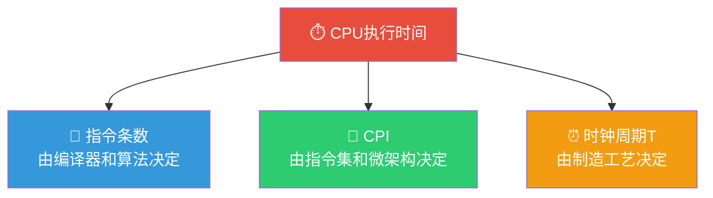

> 如果把计算机比作一辆跑车，那么主频就是发动机转速，CPI 就是每跑一公里需要转多少圈，MIPS 就是时速表——只有综合理解这些指标，你才能真正判断这辆跑车到底有多快。

## 一、基本性能指标

### 1.1 字长

**字长**是指计算机一次能处理的二进制数据的位数。

| 字长 | 含义 |
|:---:|------|
| 8位 | 一次处理1字节 |
| 16位 | 一次处理2字节 |
| 32位 | 一次处理4字节 |
| 64位 | 一次处理8字节 |

::: important 字长与各寄存器的关系
- **机器字长**：CPU 一次能处理的二进制数据的位数（决定运算精度）
- **指令字长**：一条指令的总长度（不一定是机器字长的整数倍）
- **存储字长**：一个存储单元存储的二进制数据的位数
- **数据通路带宽**：数据总线一次能并行传送的信息位数
:::

### 1.2 存储器容量

$$
\text{存储容量} = \text{存储单元个数} \times \text{存储字长}
$$

| 概念 | 公式 | 说明 |
|------|------|------|
| MAR 位数为 $k$ | 存储单元数 $\leq 2^k$ | $k$ 位地址可寻址 $2^k$ 个单元 |
| MDR 位数为 $n$ | 每个单元存储 $n$ 位 | 存储字长为 $n$ |
| 总容量 | $2^k \times n$ 位 | 也可表示为 $2^k \times n/8$ 字节 |

::: warning 易混点
MAR 的位数决定了最大可寻址空间，而不是实际配置的容量。例如 MAR 为 32 位，最大可寻址 $2^{32} = 4\text{GB}$，但实际可能只装了 2GB 内存。
:::

---

## 二、CPU 性能指标

### 2.1 主频与时钟周期

**主频（时钟频率）**：CPU 内部时钟的频率，单位为 Hz（赫兹）。

$$
f = \frac{1}{T}
$$

其中 $T$ 为时钟周期。

::: warning 主频高 ≠ 速度快
主频仅表示 CPU 内部时钟的快慢，不同架构的 CPU 在一个时钟周期内能完成的工作量不同。因此，**主频不能跨架构比较性能**。
:::

### 2.2 CPI（Cycles Per Instruction）

**CPI**：执行一条指令所需的平均时钟周期数。

$$
\text{CPI} = \frac{\text{执行程序所需的总时钟周期数}}{\text{指令条数}}
$$

对于包含多种类型指令的程序，综合 CPI 为：

$$
\text{CPI} = \sum_{i=1}^{n} (\text{CPI}_i \times \frac{I_i}{I_N})
$$

其中：
- $\text{CPI}_i$：第 $i$ 类指令的 CPI
- $I_i$：第 $i$ 类指令的条数
- $I_N$：总指令条数

### 2.3 CPU 执行时间

$$
T_{CPU} = \text{指令条数} \times \text{CPI} \times T = \frac{\text{指令条数} \times \text{CPI}}{f}
$$

### 2.4 MIPS（Million Instructions Per Second）

$$
\text{MIPS} = \frac{\text{指令条数}}{T_{CPU} \times 10^6} = \frac{f}{\text{CPI} \times 10^6}
$$

::: important MIPS 的局限
- MIPS 仅衡量整数运算能力，不能反映浮点运算性能
- 不同指令集的 MIPS 不可比（一条 CISC 指令可能完成多条 RISC 指令的工作）
- MIPS 可能与实际性能相悖（如包含大量简单指令的程序 MIPS 高但实际运行慢）
:::

### 2.5 FLOPS（Floating-point Operations Per Second）

$$
\text{MFLOPS} = \frac{\text{浮点运算次数}}{T_{CPU} \times 10^6}
$$

| 单位 | 倍率 |
|------|------|
| MFLOPS | $10^6$ 次/秒 |
| GFLOPS | $10^9$ 次/秒 |
| TFLOPS | $10^{12}$ 次/秒 |
| PFLOPS | $10^{15}$ 次/秒 |
| EFLOPS | $10^{18}$ 次/秒 |

---

## 三、系统性能指标

### 3.1 吞吐量与响应时间

| 指标 | 定义 | 特点 |
|------|------|------|
| **吞吐量** | 单位时间内处理请求的数量 | 关注系统整体处理能力 |
| **响应时间** | 从提交请求到获得结果的时间 | 关注用户体验 |

$$
\text{吞吐量} = \frac{\text{完成任务数}}{\text{总时间}}
$$

### 3.2 基准测试（Benchmark）

基准测试使用一组标准化的程序来评估计算机系统的性能。

| 基准测试 | 特点 |
|----------|------|
| **SPECint** | 整数运算性能基准 |
| **SPECfp** | 浮点运算性能基准 |
| **TPC-C** | 联机事务处理性能 |
| **Linpack** | 线性代数运算性能（超级计算机排名依据） |

::: info Amdahl 定律
系统加速比受限于可改进部分的比例：

$$
S = \frac{1}{(1 - F) + \frac{F}{S_e}}
$$

其中 $F$ 为可改进部分的比例，$S_e$ 为该部分的加速比。

**核心结论**：即使某一部分无限加速，整体加速比也有上限 $S_{max} = \frac{1}{1-F}$。
:::

---

## 四、综合计算例题

### 例题1：CPU 执行时间计算

某计算机主频为 2GHz，执行某程序共需要 6×10⁹ 个时钟周期，求：
1. 该程序的 CPU 执行时间
2. 若该程序包含 2×10⁹ 条指令，求 CPI 和 MIPS

**解答：**

1. CPU 执行时间：

$$
T_{CPU} = \frac{6 \times 10^9}{2 \times 10^9} = 3\text{s}
$$

2. CPI：

$$
\text{CPI} = \frac{6 \times 10^9}{2 \times 10^9} = 3
$$

MIPS：

$$
\text{MIPS} = \frac{2 \times 10^9}{3 \times 10^6} \approx 666.7
$$

---

### 例题2：综合 CPI 计算

某程序包含 4 类指令，各类指令的 CPI 和使用比例如下：

| 指令类型 | CPI | 使用比例 |
|----------|:---:|:--------:|
| 算术逻辑 | 1 | 60% |
| 加载/存储 | 2 | 20% |
| 转移 | 3 | 15% |
| 其他 | 4 | 5% |

求该程序的综合 CPI。

**解答：**

$$
\text{CPI} = 1 \times 0.6 + 2 \times 0.2 + 3 \times 0.15 + 4 \times 0.05 = 0.6 + 0.4 + 0.45 + 0.2 = 1.65
$$

---

### 例题3：Amdahl 定律应用

某计算机系统中，浮点运算占总运行时间的 40%。将浮点运算部件加速到原来的 5 倍，求系统的整体加速比。

**解答：**

$$
S = \frac{1}{(1-0.4) + \frac{0.4}{5}} = \frac{1}{0.6 + 0.08} = \frac{1}{0.68} \approx 1.47
$$

---

## 五、练习题

### 题目1

某 CPU 的主频为 1.5GHz，执行某程序需要 6 秒，该程序包含 9×10⁹ 条指令，求该程序的 CPI。

### 题目2

下列关于计算机性能指标的叙述中，正确的是（ ）

A. 主频越高，计算机运行速度一定越快
B. CPI 是执行一条指令所需的时间
C. MIPS 值相同的两台计算机运行同一程序的速度一定相同
D. 基准测试程序可以更客观地评估计算机性能

### 题目3

某程序中，可并行化的部分占 80%，现将该部分用 4 个处理器并行执行，求加速比。

---

### 参考答案

**题目1：**

$$
T_{CPU} = \frac{\text{指令条数} \times \text{CPI}}{f}
$$

$$
6 = \frac{9 \times 10^9 \times \text{CPI}}{1.5 \times 10^9}
$$

$$
\text{CPI} = \frac{6 \times 1.5 \times 10^9}{9 \times 10^9} = 1
$$

**题目2：D**

A 错误：主频高不一定速度快，不同架构 CPU 的 CPI 不同。
B 错误：CPI 是执行一条指令所需的**时钟周期数**，不是时间。执行一条指令的时间 = CPI × T。
C 错误：MIPS 只衡量指令执行速度，不同指令集的 MIPS 不可比。
D 正确：基准测试使用标准化的程序集，可以更客观地评估综合性能。

**题目3：**

由 Amdahl 定律：

$$
S = \frac{1}{(1-0.8) + \frac{0.8}{4}} = \frac{1}{0.2 + 0.2} = \frac{1}{0.4} = 2.5
$$

---

::: tip 面试速查
- **主频** $f$ 与**时钟周期** $T$ 的关系：$f = 1/T$
- **CPI** = 总时钟周期数 / 指令条数
- **CPU 执行时间** = 指令条数 × CPI × T = 指令条数 × CPI / f
- **MIPS** = 指令条数 / (执行时间 × 10⁶) = f / (CPI × 10⁶)
- **FLOPS** 衡量浮点运算速度，MIPS 衡量整数运算速度
- **Amdahl 定律**：$S = 1/[(1-F) + F/S_e]$，加速比有上限
- **主频高 ≠ 速度快**，需综合 CPI、指令条数等因素
:::

::: info 原著参考
- 唐朔飞《计算机组成原理》第1章 1.3节
- 白中英《计算机组成原理》第1章 1.4节
- CSAPP Chapter 1.4
:::
