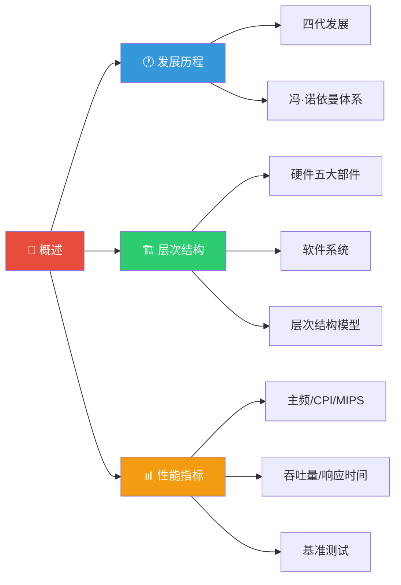

> 如果把学习计算机组成原理比作盖一栋大楼，那么"概述"就是施工前的规划图——你需要先了解大楼的历史渊源、整体架构和验收标准，才能知道每一块砖该往哪里放。

## 📖 章节导览

本章是计算机组成原理的入门篇，从宏观角度介绍计算机的基本概念，为后续深入学习各子系统奠定基础。

---

## 📑 本章文章

| 序号 | 文章 | 核心内容 |
|:---:|------|----------|
| 1 | [计算机发展历程](./01_计算机发展历程.md) | 四代发展、冯·诺依曼体系结构、存储程序思想 |
| 2 | [计算机系统层次结构](./02_计算机系统层次结构.md) | 硬件五大部件、软件系统、层次结构、编译与解释 |
| 3 | [计算机性能指标](./03_计算机性能指标.md) | 主频、CPI、MIPS、FLOPS、吞吐量、基准测试 |
