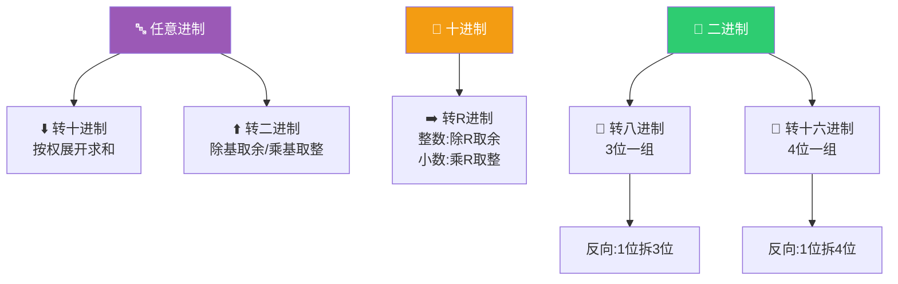
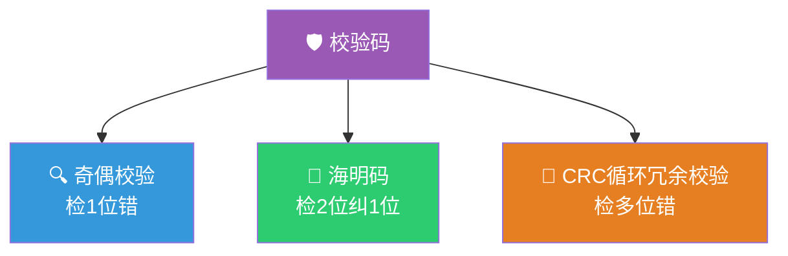
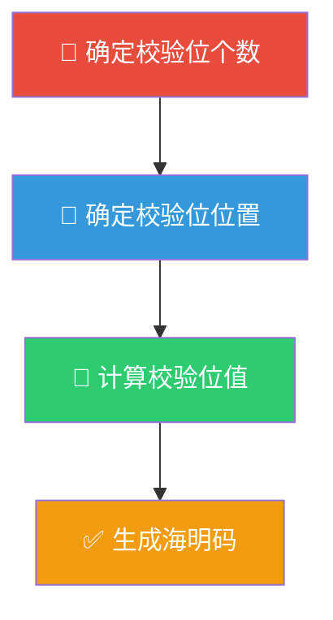

> 如果把计算机比作一个只认识"开"和"关"的异世界居民，那么"数制与编码"就是翻译官——它负责把人类世界的十进制数、英文字母、甚至错误检测手段，统统翻译成这个居民能理解的 0 和 1。

## 一、进位计数制

### 1.1 常见进制

| 进制 | 基数 | 数字符号 | 权 | 后缀 |
|:---:|:---:|----------|------|:---:|
| 二进制 | 2 | 0, 1 | $2^n$ | B |
| 八进制 | 8 | 0~7 | $8^n$ | O/Q |
| 十进制 | 10 | 0~9 | $10^n$ | D |
| 十六进制 | 16 | 0~9, A~F | $16^n$ | H |

### 1.2 进制转换流程



### 1.3 进制转换方法

**R 进制转十进制——按权展开求和**

$$
(D)_R = \sum_{i=-m}^{n-1} d_i \times R^i
$$

例：$(1011.01)_2 = 1 \times 2^3 + 0 \times 2^2 + 1 \times 2^1 + 1 \times 2^0 + 0 \times 2^{-1} + 1 \times 2^{-2} = 11.25$

**十进制转 R 进制**

- **整数部分**：除 R 取余，逆序排列
- **小数部分**：乘 R 取整，顺序排列

例：将 25.625 转换为二进制

整数部分：$25 \div 2 = 12 \cdots 1$, $12 \div 2 = 6 \cdots 0$, $6 \div 2 = 3 \cdots 0$, $3 \div 2 = 1 \cdots 1$, $1 \div 2 = 0 \cdots 1$ → $11001$

小数部分：$0.625 \times 2 = 1.25$ 取 $1$, $0.25 \times 2 = 0.5$ 取 $0$, $0.5 \times 2 = 1.0$ 取 $1$ → $.101$

结果：$(25.625)_{10} = (11001.101)_2$

**二进制 ↔ 八进制/十六进制**

| 转换 | 方法 |
|------|------|
| 二→八 | 以小数点为界，3位一组，不足补0 |
| 八→二 | 1位八进制拆为3位二进制 |
| 二→十六 | 以小数点为界，4位一组，不足补0 |
| 十六→二 | 1位十六进制拆为4位二进制 |

---

## 二、BCD 码

### 2.1 BCD 码概述

**BCD（Binary-Coded Decimal）码**：用二进制编码表示十进制数，每1位十进制数用4位二进制表示。

| 十进制 | 8421码 | 5421码 | 2421码 | 余3码 |
|:---:|:---:|:---:|:---:|:---:|
| 0 | 0000 | 0000 | 0000 | 0011 |
| 1 | 0001 | 0001 | 0001 | 0100 |
| 2 | 0010 | 0010 | 0010 | 0101 |
| 3 | 0011 | 0011 | 0011 | 0110 |
| 4 | 0100 | 0100 | 0100 | 0111 |
| 5 | 0101 | 1000 | 1011 | 1000 |
| 6 | 0110 | 1001 | 1100 | 1001 |
| 7 | 0111 | 1010 | 1101 | 1010 |
| 8 | 1000 | 1011 | 1110 | 1011 |
| 9 | 1001 | 1100 | 1111 | 1100 |

### 2.2 8421 码详解

8421 码是最常用的 BCD 码，4位的权值分别为 8、4、2、1。

::: warning 8421 码的修正
8421 码的有效编码为 0000~1001（0~9）。当两个 8421 码相加结果 > 9（即 1010~1111）时，需要**加 6 修正**（即加 0110）。

例：$5 + 8 = 13$
- 直接相加：$0101 + 1000 = 1101$（无效码）
- 加6修正：$1101 + 0110 = 1\ 0011$ → 表示 $13$
:::

### 2.3 余3码的特点

- 每个编码比 8421 码多 3（即加 0011）
- **自补码**：0和9、1和8、2和7……互为反码，便于减法运算

---

## 三、字符编码

### 3.1 ASCII 码

**ASCII（American Standard Code for Information Interchange）**：美国信息交换标准代码，用7位二进制表示128个字符。

| 类别 | 编码范围 | 说明 |
|------|----------|------|
| 控制字符 | 0~31 | 不可打印，如换行、回车 |
| 数字 | 48~57 | '0'=48, '1'=49, ... '9'=57 |
| 大写字母 | 65~90 | 'A'=65, 'B'=66, ... 'Z'=90 |
| 小写字母 | 97~122 | 'a'=97, 'b'=98, ... 'z'=122 |

::: tip 记忆技巧
- 数字 '0' = 48 = 0x30
- 大写 'A' = 65 = 0x41
- 小写 'a' = 97 = 0x61
- 大小写差值 = 32（即第5位为0/1的区别）
:::

### 3.2 Unicode

- 统一编码标准，目标为世界上所有字符分配唯一编号
- 常见编码方式：UTF-8（变长1~4字节）、UTF-16、UTF-32
- 兼容 ASCII（前128个字符编码相同）

---

## 四、校验码

### 4.1 校验码概述

校验码用于检测或纠正数据传输/存储过程中的错误。



### 4.2 奇偶校验码

在数据位后添加1位校验位，使整个编码中"1"的个数为奇数（奇校验）或偶数（偶校验）。

| 数据 | 奇校验码 | 偶校验码 |
|------|----------|----------|
| 1010 | 1010**1** | 1010**0** |
| 1011 | 1011**0** | 1011**1** |

- **优点**：实现简单，开销小
- **缺点**：只能检测奇数位错误，不能纠错

### 4.3 海明码（Hamming Code）

**核心思想**：在数据位之间插入若干校验位，每个校验位负责校验一组特定的数据位。

#### 海明码编码流程



#### 校验位个数的确定

设数据位为 $n$ 位，校验位为 $k$ 位，需满足：

$$
2^k \geq n + k + 1
$$

| 数据位 $n$ | 最小校验位 $k$ | 海明码总长 |
|:---:|:---:|:---:|
| 4 | 3 | 7 |
| 8 | 4 | 12 |
| 16 | 5 | 21 |

#### 校验位的位置

校验位放在海明码的第 $1, 2, 4, 8, \ldots, 2^{k-1}$ 位（即 $2^i$ 位置），数据位依次填入其余位置。

#### 校验位的计算

每个校验位 $P_i$ 校验所有满足"第 $i$ 位为1"的位置上的数据位，采用异或运算。

**例题：** 对数据 1010 进行海明编码（偶校验）。

**解答：**

1. $n=4$，由 $2^k \geq n+k+1$ 得 $k=3$，共7位
2. 校验位位置：$P_1$ 在第1位，$P_2$ 在第2位，$P_3$ 在第4位
3. 数据位排列：

| 位置 | 7 | 6 | 5 | 4 | 3 | 2 | 1 |
|:---:|:---:|:---:|:---:|:---:|:---:|:---:|:---:|
| 内容 | $D_4$ | $D_3$ | $D_2$ | $P_3$ | $D_1$ | $P_2$ | $P_1$ |
| 值 | 1 | 0 | 1 | | 0 | | |

4. 计算校验位：
   - $P_1$（位置1）：校验位置 3, 5, 7 → $P_1 = D_1 \oplus D_2 \oplus D_4 = 0 \oplus 1 \oplus 1 = 0$
   - $P_2$（位置2）：校验位置 3, 6, 7 → $P_2 = D_1 \oplus D_3 \oplus D_4 = 0 \oplus 0 \oplus 1 = 1$
   - $P_3$（位置4）：校验位置 5, 6, 7 → $P_3 = D_2 \oplus D_3 \oplus D_4 = 1 \oplus 0 \oplus 1 = 0$

5. 海明码：**1010010**

#### 海明码的纠错

接收方对每个校验组进行异或校验，得到指误字 $S_3S_2S_1$：

- $S_3S_2S_1 = 000$：无错误
- $S_3S_2S_1 \neq 000$：指误字的值即为出错位置，取反即可纠正

::: important 海明码能力
- **检错能力**：检测2位错误（需增加1位全校验位）
- **纠错能力**：纠正1位错误
- 最小码距 $d_{min} = 3$
:::

### 4.4 CRC 循环冗余校验码

#### 基本原理

将数据位视为多项式，用生成多项式 $G(x)$ 去除，得到的余数作为校验位附加在数据后面。

#### CRC 编码步骤

1. 设数据位为 $m$ 位，生成多项式为 $r$ 阶（即 $r+1$ 位）
2. 在数据位后补 $r$ 个 0，得到 $m+r$ 位信息
3. 对 $m+r$ 位信息模2除以生成多项式，得 $r$ 位余数
4. 将余数替换补的0，得到最终的 CRC 码

**例题：** 数据 1100，生成多项式 $G(x) = x^3 + x + 1$（即 1011），求 CRC 码。

**解答：**

1. 生成多项式为3阶，需补3个0：$1100\ 000$
2. 模2除法：

```
1100000 ÷ 1011
1100
----
 1011
----
 0110
  0000
  ----
  1100
  1011
  ----
   1110
   1011
   ----
    101   ← 余数
```

3. CRC 码为：$1100\ 101$

#### CRC 校验

接收方用相同的生成多项式对收到的 CRC 码进行模2除法，若余数为0则无错，否则出错。

::: tip 模2除法规则
- 做减法时不借位，等价于异或运算
- 上商规则：余数首位为1则商1，为0则商0
:::

---

## 五、练习题

### 题目1

将十进制数 43.75 转换为二进制数。

### 题目2

对数据 1101 进行海明编码（偶校验），并说明若第5位出错时如何纠错。

### 题目3

数据 1010，生成多项式 $G(x) = x^3 + x^2 + 1$，求 CRC 码。

### 题目4

两个8421码 0111 和 0110 相加，结果是否需要修正？若需要，修正后的结果是什么？

---

### 参考答案

**题目1：**

整数部分：$43 \div 2 = 21 \cdots 1$, $21 \div 2 = 10 \cdots 1$, $10 \div 2 = 5 \cdots 0$, $5 \div 2 = 2 \cdots 1$, $2 \div 2 = 1 \cdots 0$, $1 \div 2 = 0 \cdots 1$ → $101011$

小数部分：$0.75 \times 2 = 1.5$ 取 $1$, $0.5 \times 2 = 1.0$ 取 $1$ → $.11$

结果：$(43.75)_{10} = (101011.11)_2$

**题目2：**

1. $n=4$, $k=3$, 共7位
2. 排列：

| 位置 | 7 | 6 | 5 | 4 | 3 | 2 | 1 |
|:---:|:---:|:---:|:---:|:---:|:---:|:---:|:---:|
| 内容 | $D_4$ | $D_3$ | $D_2$ | $P_3$ | $D_1$ | $P_2$ | $P_1$ |
| 值 | 1 | 1 | 0 | | 1 | | |

3. $P_1 = D_1 \oplus D_2 \oplus D_4 = 1 \oplus 0 \oplus 1 = 0$
   $P_2 = D_1 \oplus D_3 \oplus D_4 = 1 \oplus 1 \oplus 1 = 1$
   $P_3 = D_2 \oplus D_3 \oplus D_4 = 0 \oplus 1 \oplus 1 = 0$

4. 海明码：**1100110**

5. 若第5位出错（0→1）：收到的码为 110**1**110
   - $S_1 = P_1 \oplus D_1 \oplus D_2 \oplus D_4 = 0 \oplus 1 \oplus 1 \oplus 1 = 1$
   - $S_2 = P_2 \oplus D_1 \oplus D_3 \oplus D_4 = 1 \oplus 1 \oplus 1 \oplus 1 = 0$
   - $S_3 = P_3 \oplus D_2 \oplus D_3 \oplus D_4 = 1 \oplus 1 \oplus 1 \oplus 1 = 0$

   指误字 $S_3S_2S_1 = 101$，即第5位出错，取反纠正。

**题目3：**

生成多项式 $G(x) = x^3 + x^2 + 1$ → 1101，3阶补3个0：$1010\ 000$

模2除法：

```
1010000 ÷ 1101
1010
----
 0110
  0000
  ----
  1100
  1101
  ----
   001   ← 余数
```

CRC 码：$1010\ 001$

**题目4：**

$0111 + 0110 = 1101$

1101 是无效的8421码（大于1001），需要加6修正：

$1101 + 0110 = 1\ 0011$ → 表示13，正确。

---

::: tip 面试速查
- **进制转换**：R转十按权展开，十转R除R取余/乘R取整
- **二↔八/十六**：3位/4位分组
- **8421码**：结果>9需加6修正
- **海明码**：校验位在 $2^i$ 位置，$2^k \geq n+k+1$，检2纠1，码距≥3
- **CRC**：模2除法（异或），余数作校验位
- **ASCII**：'0'=48, 'A'=65, 'a'=97
:::

::: info 原著参考
- 唐朔飞《计算机组成原理》第2章 2.1节
- 白中英《计算机组成原理》第2章 2.1节
- CSAPP Chapter 2.1
:::
