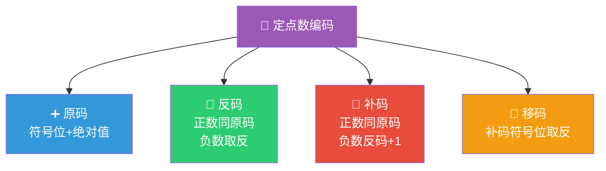
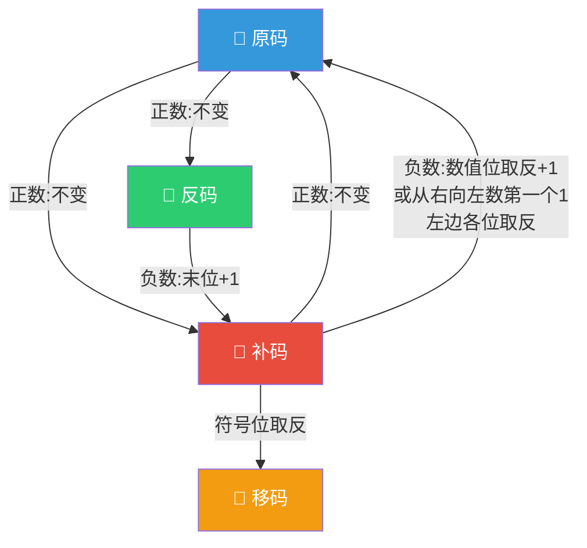
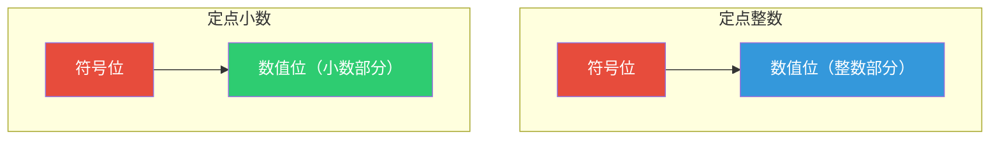
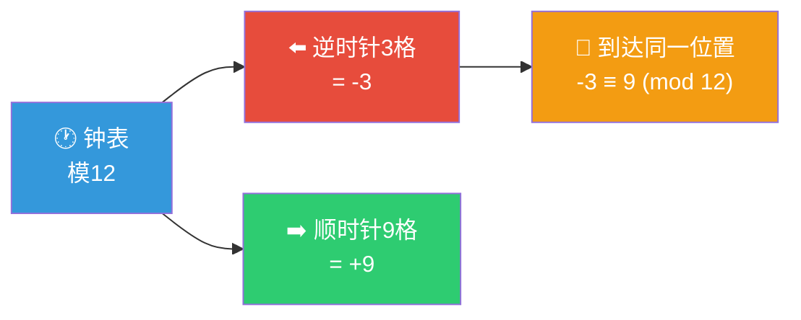

> 如果把定点数比作尺子上的刻度，那么原码、反码、补码、移码就是四把刻度规则不同的尺子——它们丈量的是同一个数轴，但刻度的起点和方向各不相同，理解它们的转换关系是学习计算机运算的基石。

## 一、真值与机器数

### 1.1 基本概念

| 概念 | 定义 | 示例 |
|------|------|------|
| **真值** | 人类习惯使用的带符号数，正号可省略 | $+1010$、$-1010$ |
| **机器数** | 真值在计算机中的二进制表示，符号位数字化 | $01010$、$11010$ |

::: important 符号位约定
在机器数中，**最高位为符号位**：0表示正数，1表示负数。其余位为数值位。
:::

---

## 二、四种编码方式

### 2.1 编码规则总览

### 2.2 原码

**定义**：符号位0表示正，1表示负，数值部分为绝对值的二进制表示。

$$
[x]_原 = \begin{cases} x & 0 \leq x < 2^n \\ 2^n - x = 2^n + |x| & -2^n < x \leq 0 \end{cases}
$$

**示例（8位）**：

| 真值 | 原码 |
|------|------|
| $+27$ | $0001\ 1011$ |
| $-27$ | $1001\ 1011$ |
| $+0$ | $0000\ 0000$ |
| $-0$ | $1000\ 0000$ |

::: warning 原码的0有两种表示
原码中 +0 和 -0 的编码不同，这是原码的一个缺陷。
:::

### 2.3 反码

**定义**：正数的反码与原码相同；负数的反码为原码的符号位不变，数值位按位取反。

$$
[x]_反 = \begin{cases} x & 0 \leq x < 2^n \\ (2^{n+1} - 1) + x & -2^n < x \leq 0 \end{cases}
$$

**示例（8位）**：

| 真值 | 原码 | 反码 |
|------|------|------|
| $+27$ | $0001\ 1011$ | $0001\ 1011$ |
| $-27$ | $1001\ 1011$ | $1110\ 0100$ |
| $+0$ | $0000\ 0000$ | $0000\ 0000$ |
| $-0$ | $1000\ 0000$ | $1111\ 1111$ |

### 2.4 补码

**定义**：正数的补码与原码相同；负数的补码为反码末位加1。

$$
[x]_补 = \begin{cases} x & 0 \leq x < 2^n \\ 2^{n+1} + x & -2^n \leq x < 0 \end{cases}
$$

**示例（8位）**：

| 真值 | 原码 | 反码 | 补码 |
|------|------|------|------|
| $+27$ | $0001\ 1011$ | $0001\ 1011$ | $0001\ 1011$ |
| $-27$ | $1001\ 1011$ | $1110\ 0100$ | $1110\ 0101$ |
| $+0$ | $0000\ 0000$ | $0000\ 0000$ | $0000\ 0000$ |
| $-0$ | $1000\ 0000$ | $1111\ 1111$ | $0000\ 0000$ |

::: important 补码的核心意义
1. **0的表示唯一**：+0 和 -0 的补码相同
2. **多表示一个负数**：8位补码可表示 $-128$（$1000\ 0000$），这是原码和反码做不到的
3. **加减法统一**：补码加减法可以直接运算，无需区分符号位
:::

### 2.5 移码

**定义**：将补码的符号位取反。

$$
[x]_移 = 2^n + x \quad (-2^n \leq x < 2^n)
$$

等价于：$[x]_移 = [x]_补$ 的符号位取反。

**示例（8位）**：

| 真值 | 补码 | 移码 |
|------|------|------|
| $+27$ | $0001\ 1011$ | $1001\ 1011$ |
| $-27$ | $1110\ 0101$ | $0110\ 0101$ |
| $-128$ | $1000\ 0000$ | $0000\ 0000$ |
| $+127$ | $0111\ 1111$ | $1111\ 1111$ |

::: tip 移码的特点
- 移码的大小顺序与真值一致（可直接比较大小）
- 常用于浮点数的阶码表示
- 移码的全0表示最小值，全1表示最大值
:::

---

## 三、编码转换关系

### 3.1 转换流程图

### 3.2 快速转换技巧

**原码 → 补码（负数）**：

- **方法一**：原码 → 反码（数值位取反）→ 补码（末位+1）
- **方法二**（推荐）：从原码数值位的**最右边开始**，到第一个1（含）保持不变，左边各位取反

**补码 → 原码（负数）**：

- **方法**：与原码→补码的转换完全相同！（互为逆运算）

例：$[x]_原 = 1\ 0110100$

方法二：从右数第一个1是第2位的0前面的1，该1及其右边的00不变，左边0110取反得1001

$[x]_补 = 1\ 1001100$

**补码 → 移码**：符号位取反

**移码 → 补码**：符号位取反

### 3.3 转换总结表

| 转换 | 方法 |
|------|------|
| 原码→反码 | 正数不变；负数数值位取反 |
| 反码→原码 | 同上（互为逆运算） |
| 原码→补码 | 正数不变；负数反码+1 或 从右找1左边取反 |
| 补码→原码 | 同上（互为逆运算） |
| 补码→移码 | 符号位取反 |
| 移码→补码 | 符号位取反 |

---

## 四、定点整数与定点小数

### 4.1 定点数格式

| 类型 | 小数点位置 | 表示范围（n+1位，含1位符号位） |
|------|-----------|-------------------------------|
| **定点整数** | 在最低位之后 | 原码：$-(2^n-1) \sim +(2^n-1)$ |
| | | 补码：$-2^n \sim +(2^n-1)$ |
| **定点小数** | 在符号位之后 | 原码：$-(1-2^{-n}) \sim +(1-2^{-n})$ |
| | | 补码：$-1 \sim +(1-2^{-n})$ |

### 4.2 表示范围对比（8位）

| 编码 | 整数范围 | 小数范围 |
|------|----------|----------|
| 原码 | $-127 \sim +127$ | $-0.1111111 \sim +0.1111111$ |
| 反码 | $-127 \sim +127$ | $-0.1111111 \sim +0.1111111$ |
| 补码 | $-128 \sim +127$ | $-1 \sim +0.1111111$ |

::: warning 关键差异
- 原码和反码的0有正负两种表示，而补码的0唯一
- 补码比原码/反码多表示一个数（8位整数多表示 $-128$，8位小数多表示 $-1$）
- 定点小数补码可以表示 $-1$，而原码和反码不能（因为 $-1$ 的原码需要 $1.0000000$，但这在原码中表示 $-0$）
:::

---

## 五、补码的深入理解

### 5.1 为什么需要补码？

**模运算**：一个4位计数器的模为 $2^4 = 16$。对于模16的运算，$-3$ 和 $+13$ 是等价的（因为 $-3 \equiv 13 \pmod{16}$）。

这就是补码的数学本质：**用正数代替负数参与运算**。

### 5.2 补码的直观理解

-3 的补码就是 $12 - 3 = 9$。同理，对于 $n+1$ 位二进制数，$-x$ 的补码为 $2^{n+1} - x$。

### 5.3 补码的运算性质

1. **$[x+y]_补 = [x]_补 + [y]_补$**（补码加法直接运算）
2. **$[x-y]_补 = [x]_补 + [-y]_补$**（减法转加法）
3. **$[-x]_补 = [x]_补$ 连同符号位取反+1**（求补操作）

---

## 六、练习题

### 题目1

已知 $x = -53$，用8位二进制表示 $x$ 的原码、反码、补码、移码。

### 题目2

已知 $[x]_补 = 1.0110100$，求 $[x]_原$、$[-x]_补$。

### 题目3

8位定点整数补码的表示范围是多少？为什么比原码多表示一个数？

### 题目4

判断下列说法是否正确：负数的补码的补码等于原码。

---

### 参考答案

**题目1：**

$|x| = 53 = (0010101)_2$

- 原码：$1010\ 1011$
- 反码：$1101\ 0100$
- 补码：$1101\ 0101$
- 移码：$0101\ 0101$

**题目2：**

$[x]_补 = 1.0110100$（负数小数）

求$[x]_原$：符号位不变，数值位从右数第一个1（最后两位00）不变，左边01101取反得10010

$[x]_原 = 1.1001100$

求$[-x]_补$：对$[x]_补$连同符号位取反+1

取反：$0.1001011$，+1：$0.1001100$

$[-x]_补 = 0.1001100$

**题目3：**

8位定点整数补码范围：$-128 \sim +127$

比原码多一个数的原因：原码中 +0 和 -0 的编码不同（00000000 和 10000000），占用了两个编码表示同一个值0；补码中0的表示唯一（00000000），因此多出一个编码（10000000）用来表示 $-128$。

**题目4：**

正确。补码与原码之间的转换是互逆操作（对于负数，都是从右找第一个1，左边数值位取反），因此对补码再求一次补码就得到原码。

---

::: tip 面试速查
- **原码**：符号位+绝对值，0有两种表示
- **反码**：正数同原码，负数数值位取反，0有两种表示
- **补码**：正数同原码，负数反码+1，0唯一，多表示一个负数
- **移码**：补码符号位取反，大小顺序与真值一致
- **快速转换**：原码↔补码，从右找第一个1，左边数值位取反
- **补码本质**：模运算，用正数代替负数
- **定点整数补码范围**：$-2^n \sim +2^n-1$
- **定点小数补码范围**：$-1 \sim +1-2^{-n}$
:::

::: info 原著参考
- 唐朔飞《计算机组成原理》第2章 2.2节
- 白中英《计算机组成原理》第2章 2.2节
- CSAPP Chapter 2.2
:::
