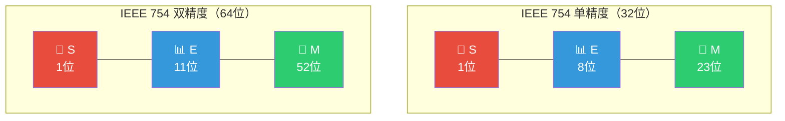
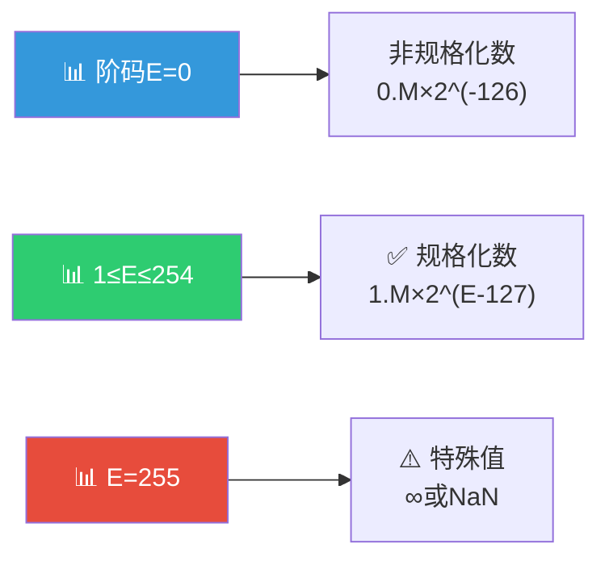

> 如果把定点数比作一把固定刻度的尺子，那么浮点数就像一把可以伸缩的望远镜——它通过调整"倍率"（阶码）来表示从极小到极大的数，用有限的位数覆盖近乎无限的数值范围。

## 一、浮点数的基本格式

### 1.1 科学计数法的启示

在十进制中，科学计数法将数表示为：

$$
N = M \times R^E
$$

例如：$-123.456 = -1.23456 \times 10^2$

浮点数就是二进制版本的科学计数法。

### 1.2 浮点数的组成

$$
N = (-1)^S \times M \times R^E
$$

| 组成部分 | 含义 | 说明 |
|----------|------|------|
| $S$ | 符号位（Sign） | 0正1负 |
| $M$ | 尾数（Mantissa） | 决定精度 |
| $E$ | 阶码（Exponent） | 决定范围 |
| $R$ | 基数（Radix） | 通常为2 |

::: important 阶码与尾数的作用
- **阶码的位数**决定浮点数表示的**范围**（阶码越多，范围越大）
- **尾数的位数**决定浮点数表示的**精度**（尾数越多，精度越高）
- 阶码用**移码**表示（便于比较大小），尾数用**原码**或**补码**表示
:::

---

## 二、IEEE 754 标准

### 2.1 IEEE 754 格式

IEEE 754 是目前最广泛使用的浮点数标准，规定了浮点数的格式和运算规则。

### 2.2 IEEE 754 位布局详解

| 参数 | 单精度（float） | 双精度（double） |
|------|:---:|:---:|
| 总位数 | 32 | 64 |
| 符号位 S | 1 | 1 |
| 阶码位数 | 8 | 11 |
| 尾数位数 | 23 | 52 |
| 阶码偏移量 | 127 | 1023 |
| 阶码范围 | 1~254 | 1~2046 |
| 规格化尾数 | $1.M$ | $1.M$ |

### 2.3 IEEE 754 的关键设计

::: important 隐藏的1
IEEE 754 规格化浮点数的尾数默认有一个隐藏的"1"（隐含位），即实际尾数为 **$1.M$**，但存储时只存 $M$ 部分。这样多出1位精度。

- 单精度：23位存储 + 1位隐含 = 24位有效位数
- 双精度：52位存储 + 1位隐含 = 53位有效位数
:::

::: important 移码偏移量
IEEE 754 中阶码采用移码表示，但偏移量不是 $2^{n-1}$，而是 $2^{n-1}-1$：
- 单精度：偏移量 $= 2^7 - 1 = 127$
- 双精度：偏移量 $= 2^{10} - 1 = 1023$

实际阶值 $e = E - \text{偏移量}$（$E$ 为存储的阶码值）
:::

### 2.4 IEEE 754 数值计算公式

**规格化数**（$E \neq 0$ 且 $E \neq 255/2047$）：

$$
(-1)^S \times 1.M \times 2^{E-\text{偏移量}}
$$

---

## 三、规格化

### 3.1 为什么要规格化

规格化的目的是使浮点数的表示**唯一**，并**最大化有效位数**。

### 3.2 规格化规则

| 基数 | 尾数编码 | 规格化要求 |
|:---:|----------|------------|
| 2 | 原码 | 尾数最高位必须为1 |
| 2 | 补码 | 尾数最高位必须与符号位不同 |

::: warning 补码规格化特殊情形
补码规格化数：
- 正数：$0.1xx...x$（最高数值位为1）
- 负数：$1.0xx...x$（最高数值位为0）

注意：$1.1xx...x$ 不是规格化数（虽然其真值不是-0，但最高数值位与符号位相同）。
:::

### 3.3 IEEE 754 的规格化

IEEE 754 中，规格化数隐含尾数整数位为1，因此尾数部分总是形如 $1.xxxxx...$，自动满足规格化要求。

---

## 四、浮点数的范围

### 4.1 单精度浮点数范围

| 阶码 E | 类型 | 值 |
|:---:|------|-----|
| 0 | 非规格化数 | $(-1)^S \times 0.M \times 2^{-126}$ |
| 1~254 | 规格化数 | $(-1)^S \times 1.M \times 2^{E-127}$ |
| 255 | 特殊值 | $M=0$：$\pm\infty$；$M\neq 0$：NaN |

### 4.2 单精度数值范围

| 范围 | 值 |
|------|-----|
| 最小正规格化数 | $1.0 \times 2^{-126} \approx 1.18 \times 10^{-38}$ |
| 最大正规格化数 | $(2-2^{-23}) \times 2^{127} \approx 3.40 \times 10^{38}$ |
| 最小正非规格化数 | $2^{-23} \times 2^{-126} = 2^{-149} \approx 1.40 \times 10^{-45}$ |

### 4.3 双精度数值范围

| 范围 | 值 |
|------|-----|
| 最小正规格化数 | $1.0 \times 2^{-1022} \approx 2.23 \times 10^{-308}$ |
| 最大正规格化数 | $(2-2^{-52}) \times 2^{1023} \approx 1.80 \times 10^{308}$ |

---

## 五、特殊值

### 5.1 IEEE 754 特殊值详解

| 阶码 E | 尾数 M | 含义 |
|:---:|:---:|------|
| 全0 | 全0 | $\pm0$（正零/负零） |
| 全0 | 非0 | 非规格化数（Denormalized） |
| 全1 | 全0 | $\pm\infty$（正无穷/负无穷） |
| 全1 | 非0 | NaN（Not a Number） |

::: important NaN 的产生
以下运算会产生 NaN：
- $0/0$
- $\infty - \infty$
- $\infty \times 0$
- $\sqrt{-1}$（负数开方）

NaN 的特点：**NaN 与任何值（包括自身）的比较结果都为 false**。
:::

### 5.2 非规格化数的作用

非规格化数用于填充0与最小规格化数之间的"间隙"，实现**渐进下溢**（gradual underflow），避免突然变为0。

---

## 六、IEEE 754 编码实例

### 例题1：十进制转IEEE 754单精度

将 $-12.75$ 转换为 IEEE 754 单精度浮点数。

**解答：**

1. 确定符号位：负数，$S = 1$
2. 将绝对值转为二进制：$12.75 = 1100.11_2$
3. 规格化：$1100.11 = 1.10011 \times 2^3$
4. 阶码：$E = 3 + 127 = 130 = 10000010_2$
5. 尾数（去掉隐含的1）：$M = 10011000000000000000000$
6. 合并：$1\ 10000010\ 10011000000000000000000$

十六进制：`C14C0000`

### 例题2：IEEE 754单精度转十进制

将 IEEE 754 单精度浮点数 `41B40000` 转换为十进制。

**解答：**

1. 二进制：`0 10000011 01101000000000000000000`
2. 符号位 $S = 0$（正数）
3. 阶码 $E = 10000011_2 = 131$，实际阶值 $e = 131 - 127 = 4$
4. 尾数 $M = 01101$，加上隐含1：$1.01101$
5. 真值：$+1.01101 \times 2^4 = +10110.1_2 = +22.5$

---

## 七、练习题

### 题目1

将 $+5.75$ 转换为 IEEE 754 单精度浮点数的十六进制表示。

### 题目2

IEEE 754 单精度浮点数 `C0A00000H` 表示的十进制值是多少？

### 题目3

简述 IEEE 754 标准中非规格化数的作用。

### 题目4

在 IEEE 754 双精度浮点数中，阶码占多少位？偏移量是多少？

---

### 参考答案

**题目1：**

1. $S = 0$（正数）
2. $5.75 = 101.11_2$
3. 规格化：$1.0111 \times 2^2$
4. 阶码：$E = 2 + 127 = 129 = 10000001_2$
5. 尾数：$01110000000000000000000$
6. 合并：`0 10000001 01110000000000000000000`
7. 十六进制：`40B80000`

**题目2：**

1. 二进制：`1 10000001 01000000000000000000000`
2. $S = 1$（负数）
3. $E = 10000001_2 = 129$，$e = 129 - 127 = 2$
4. 尾数（含隐含1）：$1.01$
5. 真值：$-1.01 \times 2^2 = -101_2 = -5$

**题目3：**

非规格化数用于表示0与最小规格化数之间的极小数值。其阶码全0，尾数非0，隐含位为0（而非1），实际阶值为 $-126$（单精度）。非规格化数实现了"渐进下溢"，使得数值可以逐渐减小到0，而不是从最小规格化数突然跳变到0，提高了数值的连续性。

**题目4：**

IEEE 754 双精度浮点数中，阶码占 **11位**，偏移量为 $2^{10}-1 =$ **1023**。

---

::: tip 面试速查
- **浮点数 = 符号位 + 阶码 + 尾数**
- **IEEE 754 单精度**：1+8+23 = 32位，偏移量127
- **IEEE 754 双精度**：1+11+52 = 64位，偏移量1023
- **规格化**：隐含1，尾数为 $1.M$，阶码 $1 \sim 254$（单精度）
- **特殊值**：$E$全0→0或非规格化数；$E$全1→$\infty$或NaN
- **范围**（单精度）：约 $\pm 1.18 \times 10^{-38} \sim \pm 3.40 \times 10^{38}$
- **补码规格化**：尾数最高位与符号位不同
- **原码规格化**：尾数最高位为1
:::

::: info 原著参考
- 唐朔飞《计算机组成原理》第2章 2.3节
- 白中英《计算机组成原理》第2章 2.3节
- IEEE 754-2019 Standard
- CSAPP Chapter 2.4
:::
