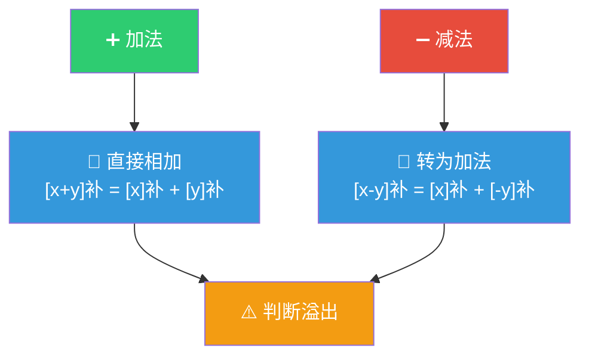
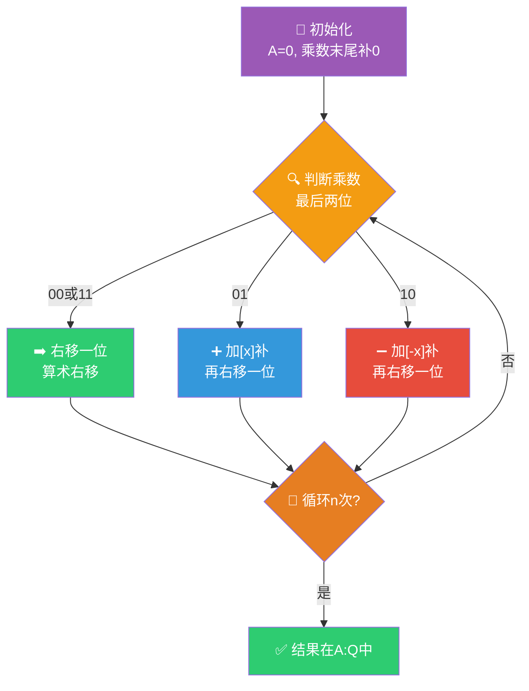
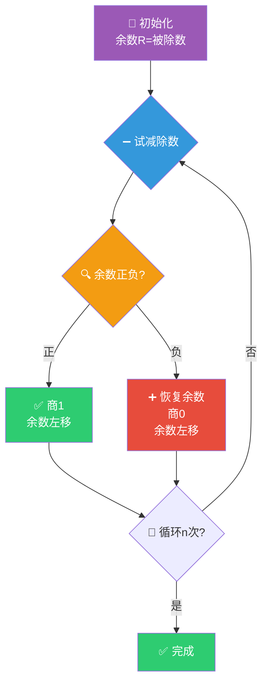

> 如果把定点数的表示比作学会了认数字，那么定点数的运算就是学会算术——加减乘除四则运算在计算机中的实现，每一步都藏着精妙的设计智慧，尤其是补码让加减法合二为一、Booth 算法让乘法变得优雅。

## 一、补码加减法运算

### 1.1 补码加减法规则

**核心公式：**

$$
[x + y]_补 = [x]_补 + [y]_补
$$

$$
[x - y]_补 = [x]_补 + [-y]_补
$$

::: important 补码加减法的统一
补码的最大贡献就是**将减法转化为加法**：只需要将减数的补码取反加1（求补操作），就可以用加法器完成减法运算。这意味着计算机只需要一个加法器就能完成加减法。
:::

### 1.2 补码加减法步骤

1. 将操作数转换为补码
2. 符号位参与运算（与数值位同等对待）
3. 从最低位开始逐位相加，向高位进位
4. 丢弃最高位进位（模运算自然溢出）
5. 判断是否溢出

### 1.3 计算示例

**例题：** $x = +0110$, $y = -0100$，用补码求 $x + y$。

**解答：**

$[x]_补 = 00110$，$[y]_补 = 11100$

$$
\begin{array}{r}
  00110 \\
+ 11100 \\
\hline
 100010 \\
\end{array}
$$

丢弃最高位进位1，结果 $[x+y]_补 = 00010$，即 $x+y = +0010 = +2$。

验证：$6 + (-4) = 2$ ✓

---

## 二、溢出判断

### 2.1 溢出的概念

**溢出**：运算结果超出了机器数的表示范围。

- 正溢出：正数 + 正数 = 负数（错误）
- 负溢出：负数 + 负数 = 正数（错误）

::: warning 溢出只发生在同号相加
- 正 + 正 = 负 → 正溢出
- 负 + 负 = 正 → 负溢出
- 正 + 负 → 不可能溢出
:::

### 2.2 三种溢出判断方法

#### 方法一：单符号位法

**规则**：两个同号数相加，结果符号与操作数符号不同，则溢出。

设 $A_s$、$B_s$ 为操作数符号位，$S_s$ 为结果符号位：

$$
V = A_s B_s \overline{S_s} + \overline{A_s}\ \overline{B_s}\ S_s
$$

$V = 1$ 表示溢出，$V = 0$ 表示未溢出。

#### 方法二：进位判断法

**规则**：符号位进位 $C_s$ 与最高数值位进位 $C_1$ 不同，则溢出。

$$
V = C_s \oplus C_1
$$

| 情况 | $C_s$ | $C_1$ | $V$ | 说明 |
|:---:|:---:|:---:|:---:|------|
| 正+正 | 0 | 1 | 1 | 正溢出 |
| 负+负 | 1 | 0 | 1 | 负溢出 |
| 正+负 | 0 | 0 | 0 | 无溢出 |
| 正+负 | 1 | 1 | 0 | 无溢出 |

#### 方法三：双符号位法（变形补码）

用两位符号位：00 表示正，11 表示负。

**规则**：两位符号位不同，则溢出。

| 符号位 | 含义 |
|:---:|------|
| 00 | 结果为正，无溢出 |
| 01 | 正溢出 |
| 10 | 负溢出 |
| 11 | 结果为负，无溢出 |

$$
V = S_{s1} \oplus S_{s2}
$$

**例题：** $x = +1011$, $y = +0111$，用双符号位补码求 $x+y$。

$[x]_补 = 00\ 1011$，$[y]_补 = 00\ 0111$

$$
\begin{array}{r}
  00\ 1011 \\
+ 00\ 0111 \\
\hline
  01\ 0010 \\
\end{array}
$$

符号位为 01，**正溢出**！（4位数值位无法表示+18）

若 $x = +0011$, $y = +0111$：

$[x]_补 = 00\ 0011$，$[y]_补 = 00\ 0111$

$$
\begin{array}{r}
  00\ 0011 \\
+ 00\ 0111 \\
\hline
  00\ 1010 \\
\end{array}
$$

符号位为 00，无溢出。结果为 $+1010 = +10$。

---

## 三、原码一位乘法

### 3.1 原码乘法规则

**核心思想**：符号位与数值位分开处理。

- **符号位**：$P_s = x_s \oplus y_s$（异或确定乘积符号）
- **数值位**：取绝对值相乘

### 3.2 运算过程

**例题：** $x = -0.1101$, $y = +0.1011$，用原码一位乘法求 $x \times y$。

**解答：**

符号位：$P_s = 1 \oplus 0 = 1$（负数）

数值部分：$|x| = 0.1101$, $|y| = 0.1011$

| 步数 | 乘数 | 部分积 | 说明 |
|:---:|:---:|--------|------|
| 初态 | 1011 | 00.0000 | |
| 1 | 101**1** | +00.1101 → 00.1101 → 右移 → 00.0110 | 最低位为1，加|X| |
| 2 | 10**1**1 | +00.1101 → 01.0011 → 右移 → 00.1001 | 最低位为1，加|X| |
| 3 | 1**0**11 | +00.0000 → 00.1001 → 右移 → 00.0100 | 最低位为0，加0 |
| 4 | **1**011 | +00.1101 → 01.0001 → 右移 → 00.1000 | 最低位为1，加|X| |

数值结果：$0.10001111$

最终结果：$x \times y = -0.10001111$

---

## 四、补码一位乘法（Booth 算法）

### 4.1 Booth 算法原理

Booth 算法是补码乘法的经典算法，**符号位参与运算**，无需单独处理。

### 4.2 Booth 算法流程

### 4.3 Booth 算法判断规则

| 乘数末两位 $y_{i}y_{i-1}$ | 操作 |
|:---:|------|
| 00 | 部分积右移一位 |
| 01 | 部分积加 $[x]_补$，右移一位 |
| 10 | 部分积加 $[-x]_补$，右移一位 |
| 11 | 部分积右移一位 |

### 4.4 计算示例

**例题：** $x = +0.1011$, $y = -0.0101$，用 Booth 算法求 $x \times y$。

**解答：**

$[x]_补 = 0.1011$，$[-x]_补 = 1.0101$，$[y]_补 = 1.1011$

乘数 $Q = 1.1011$，末尾补0得 $1.1011\mathbf{0}$

| 步数 | 判断位 | 操作 | 部分积A | 乘数Q | Q_{-1} |
|:---:|:---:|------|--------|-------|:---:|
| 初态 | | | 00.0000 | 1.1011 | 0 |
| 1 | 10 | $+[-x]_补$ | +11.0101 → 11.0101 | 1.1011 | 0 |
| | | 右移 | 11.1010 | 11.101 | 1 |
| 2 | 11 | 右移 | 11.1101 | 011.10 | 1 |
| 3 | 01 | $+[x]_补$ | +00.1011 → 00.1000 | 011.10 | 1 |
| | | 右移 | 00.0100 | 0011.1 | 0 |
| 4 | 10 | $+[-x]_补$ | +11.0101 → 11.1001 | 0011.1 | 0 |
| | | 右移 | 11.1100 | 10011 | 1 |

结果：$[x \times y]_补 = 1.11001001$

$x \times y = -0.00110111$

验证：$0.1011 \times (-0.0101) = -0.00110111$ ✓

::: important Booth 算法要点
- 乘数末尾补0，形成 $y_{n}y_{n-1}$ 判断位
- 符号位参与运算，使用双符号位（变形补码）
- 每次右移为**算术右移**（符号位不变）
- 共进行 $n+1$ 次判断，$n$ 次移位（$n$ 为数值位位数）
:::

---

## 五、原码除法

### 5.1 恢复余数法

**核心思想**：先试减，若余数为负则恢复（加回除数），商0。

**缺点**：当余数为负时需要额外一步恢复，运算步骤不固定，影响效率。

### 5.2 加减交替法（不恢复余数法）

**核心改进**：余数为负时，不再恢复，而是将余数左移后**加除数**。

| 当前余数 | 操作 | 商位 |
|----------|------|:---:|
| 正 | 左移后减除数 | 1 |
| 负 | 左移后加除数 | 0 |

**数学原理**：若当前余数 $R < 0$，恢复余数法需要 $R + Y$，然后左移得 $2(R+Y)$，再减 $Y$ 得 $2R + 2Y - Y = 2R + Y$。这等价于直接将 $R$ 左移后加 $Y$。

**例题：** $x = -0.1011$, $y = +0.1101$，用加减交替法求 $x \div y$。

**解答：**

符号位：$P_s = 1 \oplus 0 = 1$（负商）

$|x| = 0.1011$，$|y| = 0.1101$，$[-|y|]_补 = 1.0011$

| 步数 | 操作 | 余数 | 商 |
|:---:|------|------|:---:|
| 0 | 初始 | 0.1011 | |
| 1 | $-|y|$ | $+1.0011 \to 1.1110$（负） | 0 |
| 2 | 左移, $+|y|$ | $1.1100+0.1101 \to 0.1001$（正） | 1 |
| 3 | 左移, $-|y|$ | $1.0010+1.0011 \to 0.0101$（正） | 1 |
| 4 | 左移, $-|y|$ | $0.1010+1.0011 \to 1.1101$（负） | 0 |
| 5 | 左移, $+|y|$ | $1.1010+0.1101 \to 0.0111$（正） | 1 |

商：$0.1101$，余数：$0.0111 \times 2^{-4}$

最终结果：$x \div y = -0.1101$，余数 $= -0.0111 \times 2^{-4}$

---

## 六、练习题

### 题目1

$x = +0.1010$, $y = +0.0110$，用双符号位补码求 $x + y$，并判断是否溢出。

### 题目2

$x = -0.1101$, $y = +0.1011$，用 Booth 算法求 $x \times y$。

### 题目3

分别用进位判断法和双符号位法判断：$x = -0.1010$, $y = -0.0110$，$[x]_补 + [y]_补$ 是否溢出。

### 题目4

简述恢复余数法与加减交替法（不恢复余数法）的区别。

---

### 参考答案

**题目1：**

$[x]_补 = 00.1010$，$[y]_补 = 00.0110$

$$
\begin{array}{r}
  00.1010 \\
+ 00.0110 \\
\hline
 01.0000 \\
\end{array}
$$

符号位为 01，**正溢出**。

验证：$0.1010 + 0.0110 = 1.0000$，超过4位小数表示范围，确实溢出。

**题目2：**

$[x]_补 = 1.0011$，$[-x]_补 = 0.1101$，$[y]_补 = 0.1011$

乘数末尾补0：$0.1011\mathbf{0}$

| 步数 | 判断 | 操作 | A | Q | Q_{-1} |
|:---:|:---:|------|--------|-------|:---:|
| 初态 | | | 00.0000 | 0.1011 | 0 |
| 1 | 10 | $+[-x]_补$ | $+00.1101$ → 00.1101 | 0.1011 | 0 |
| | | 右移 | 00.0110 | 10.101 | 1 |
| 2 | 11 | 右移 | 00.0011 | 010.10 | 1 |
| 3 | 01 | $+[x]_补$ | $+11.0011$ → 11.0110 | 010.10 | 1 |
| | | 右移 | 11.1011 | 0010.1 | 0 |
| 4 | 10 | $+[-x]_补$ | $+00.1101$ → 00.1000 | 0010.1 | 0 |
| | | 右移 | 00.0100 | 00010 | 1 |

结果：$[x \times y]_补 = 1.01110001$

$x \times y = -0.10001111$

验证：$(-0.1101) \times 0.1011 = -0.10001111$ ✓

**题目3：**

$[x]_补 = 1.0110$，$[y]_补 = 1.1010$

$$
\begin{array}{r}
  1.0110 \\
+ 1.1010 \\
\hline
 11.0000 \\
\end{array}
$$

**进位判断法**：符号位进位 $C_s = 1$，最高数值位进位 $C_1 = 1$，$V = 1 \oplus 1 = 0$，无溢出。

**双符号位法**：$[x]_补 = 11.0110$，$[y]_补 = 11.1010$，结果 $11.0000$，符号位为 11，无溢出。

两种方法结论一致：**无溢出**。

验证：$-0.1010 + (-0.0110) = -1.0000$... 实际上 $-0.1010 + (-0.0110) = -0.22$（十进制），$= -0.0011\ 1001\ 1001...$（二进制），不溢出。确认无溢出。

**题目4：**

| 区别 | 恢复余数法 | 加减交替法 |
|------|-----------|-----------|
| 余数为负时 | 加除数恢复余数，再左移减除数 | 不恢复，直接左移加除数 |
| 运算步骤 | 不固定（余数为负时多一步恢复） | 固定（每步要么减要么加） |
| 效率 | 较低 | 较高 |
| 数学等价性 | 基础方法 | 与恢复余数法结果一致 |

---

::: tip 面试速查
- **补码加减法**：$[x+y]_补 = [x]_补 + [y]_补$，$[x-y]_补 = [x]_补 + [-y]_补$
- **溢出判断**：①同号相加结果异号 ②$V = C_s \oplus C_1$ ③双符号位不同则溢出
- **Booth算法**：判断末两位，01加$[x]_补$，10加$[-x]_补$，00/11仅右移
- **原码乘法**：符号位异或，数值位取绝对值相乘
- **加减交替法**：余数正→左移减除数商1，余数负→左移加除数商0
- **恢复余数法**：余数负→先加除数恢复商0，再继续
:::

::: info 原著参考
- 唐朔飞《计算机组成原理》第2章 2.4节
- 白中英《计算机组成原理》第2章 2.4节
- CSAPP Chapter 2.3
:::
