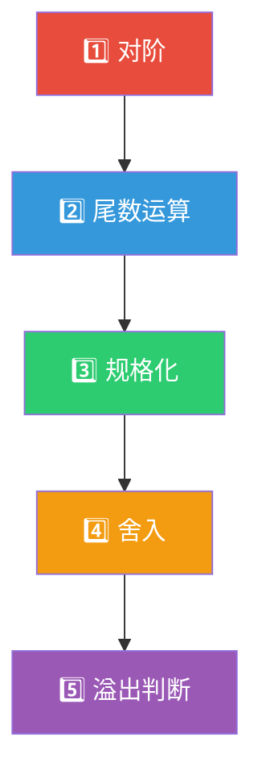
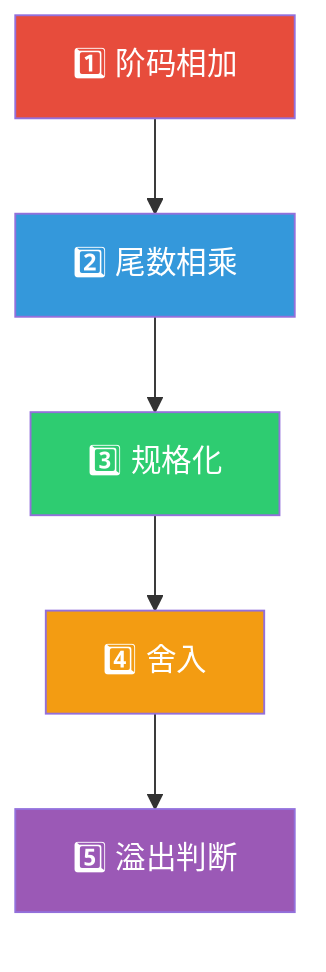
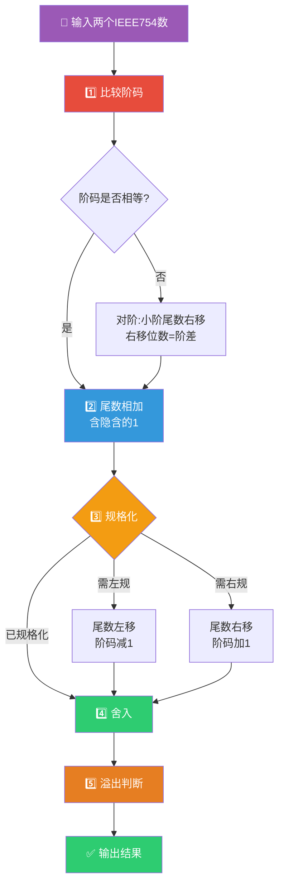
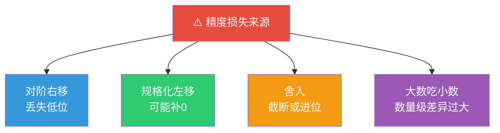

> 如果把浮点数比作科学计数法，那么浮点运算就是两篇科学论文的"对齐与合并"——你必须先把两篇论文的度量单位统一（对阶），再合并数据（尾数运算），最后还要标准化格式（规格化），才能得到一篇严谨的结果。

## 一、浮点加减运算

### 1.1 五步流程

浮点加减运算必须按以下五步严格顺序执行：

---

### 1.2 第一步：对阶

**目的**：使两个操作数的阶码相等，才能对尾数进行加减。

**规则**：**小阶向大阶看齐**（右移小阶的尾数，每右移1位阶码加1）。

::: important 为什么要小阶向大阶看齐？
若大阶向小阶看齐，需要将大阶的尾数左移，这会丢失高位有效数字，造成严重精度损失。而小阶向大阶看齐，右移丢失的是低位，影响较小。
:::

**对阶步骤：**

1. 求阶差：$\Delta E = E_x - E_y$
2. 若 $\Delta E > 0$：$y$ 的尾数右移 $|\Delta E|$ 位，$E_y$ 增至 $E_x$
3. 若 $\Delta E < 0$：$x$ 的尾数右移 $|\Delta E|$ 位，$E_x$ 增至 $E_y$
4. 若 $\Delta E = 0$：无需对阶

---

### 1.3 第二步：尾数运算

将对阶后的两个尾数进行加减运算（使用补码加减法）。

- 加法：$M_x + M_y$
- 减法：$M_x - M_y$

符号位参与运算，尾数运算可能产生以下结果：
- 结果已经是规格化数 → 直接进入第4步
- 结果不是规格化数 → 需要第3步规格化

---

### 1.4 第三步：规格化

**左规**：尾数左移，阶码减1。

- 条件：结果为 $0.0\cdots01xx\cdots$（正数）或 $1.1\cdots10xx\cdots$（负数补码）
- 每左移1位，阶码减1
- 直到满足规格化要求

**右规**：尾数右移，阶码加1。

- 条件：尾数加减后产生进位，如 $01.xx\cdots$ 或 $10.xx\cdots$（双符号位不同）
- 右移1位，阶码加1
- 右规最多进行1次

::: warning 左规 vs 右规
- **左规**：可能多次，每次阶码-1
- **右规**：最多1次，阶码+1
- 右规发生在尾数运算结果溢出时（双符号位为01或10）
:::

---

### 1.5 第四步：舍入

右规和对阶时，尾数右移会丢失低位，需要舍入处理。

| 舍入方式 | 规则 | 特点 |
|----------|------|------|
| **就近舍入**（0舍1入） | 丢弃位最高位为0则舍去，为1则末位+1 | 类似四舍五入，IEEE 754默认 |
| **截断舍入** | 直接截断丢弃位 | 简单但有系统偏差 |
| **朝0舍入** | 向零方向截断 | 总是使绝对值变小 |
| **朝+∞舍入** | 正数进位，负数截断 | |
| **朝-∞舍入** | 正数截断，负数进位 | |

::: important 就近舍入的"中间情况"
当丢弃位恰好为"一半"时（如 $0.1000\cdots0$），IEEE 754 规定使结果末位为偶数（即"最近偶数"舍入），避免统计偏差。
:::

---

### 1.6 第五步：溢出判断

浮点数的溢出由**阶码**判断，而非尾数：

| 情况 | 判断 |
|------|------|
| 阶码上溢 | 阶码 > 最大阶码 → **溢出**（结果为±∞） |
| 阶码下溢 | 阶码 < 最小阶码 → **下溢**（按机器0处理或非规格化数） |
| 尾数溢出 | 不影响最终结果（可通过右规和舍入修正） |

::: warning 易混点
- 尾数溢出 ≠ 浮点数溢出！尾数溢出可以通过右规修正
- 只有**阶码溢出**才是真正的浮点数溢出
- 阶码上溢是真正的异常，阶码下溢通常处理为0
:::

---

### 1.7 完整计算示例

**例题：** $x = 2^{010} \times 0.110100$，$y = 2^{100} \times (-0.101000)$，求 $x + y$。

**解答：**

**第一步：对阶**

$\Delta E = E_x - E_y = 010 - 100 = -010$（十进制：2 - 4 = -2）

$y$ 的阶大，$x$ 的尾数右移2位，$E_x$ 加2：

$M_x = 0.001101$（右移2位，原为0.110100，丢弃末尾00）

$E_x = 100$

**第二步：尾数运算**

$[M_x]_补 = 0.001101$，$[M_y]_补 = 1.011000$

$$
\begin{array}{r}
  00.001101 \\
+ 11.011000 \\
\hline
 11.100101 \\
\end{array}
$$

结果：$[M_x + M_y]_补 = 1.100101$，即 $M = -0.011011$

**第三步：规格化**

$1.100101$ 不是规格化数（补码负数规格化应为 $1.0xx$ 形式），需左规：

左移1位：$1.001010$，阶码 $E = 100 - 1 = 011$

此时 $1.001010$ 已规格化（符号位1，最高数值位0）。

**第四步：舍入**

左规没有丢弃有效位，无需舍入。

**第五步：溢出判断**

阶码 $E = 011$，未溢出。

**最终结果：**

$x + y = 2^{011} \times (-0.110110)$

验证：$x = 2^2 \times 0.8125 = 3.25$，$y = 2^4 \times (-0.625) = -10$

$x + y = 3.25 + (-10) = -6.75$

$2^3 \times (-0.84375) = 8 \times (-0.84375) = -6.75$ ✓

---

## 二、浮点乘除运算

### 2.1 浮点乘法

$$
(A \times 2^{E_A}) \times (B \times 2^{E_B}) = (A \times B) \times 2^{E_A + E_B}
$$

**运算步骤：**

| 步骤 | 操作 | 说明 |
|:---:|------|------|
| 1 | 阶码相加 | $E = E_A + E_B$（注意移码相加需减去偏移量） |
| 2 | 尾数相乘 | $M = M_A \times M_B$（可用Booth算法） |
| 3 | 规格化 | 乘积可能需要左规 |
| 4 | 舍入 | 处理多余的低位 |
| 5 | 溢出判断 | 检查阶码是否溢出 |

::: important 阶码相加的特殊处理
如果阶码用移码表示，两个移码相加会多加一次偏移量，需要修正：

$$
E = E_A + E_B - \text{偏移量}
$$

例如单精度：$E = E_A + E_B - 127$
:::

**乘法符号位**：$S = S_A \oplus S_B$（同号得正，异号得负）

### 2.2 浮点除法

$$
(A \times 2^{E_A}) \div (B \times 2^{E_B}) = (A \div B) \times 2^{E_A - E_B}
$$

| 步骤 | 操作 | 说明 |
|:---:|------|------|
| 1 | 阶码相减 | $E = E_A - E_B$（移码相减需加上偏移量） |
| 2 | 尾数相除 | $M = M_A \div M_B$ |
| 3 | 规格化 | 商可能需要左规 |
| 4 | 舍入 | 处理多余的低位 |
| 5 | 溢出判断 | 检查阶码是否溢出 |

::: important 除法前提
除数不能为0。若除数为0，应产生除零异常。
:::

**除法符号位**：$S = S_A \oplus S_B$

### 2.3 乘除法计算示例

**例题：** $x = 2^{010} \times 0.110100$，$y = 2^{011} \times 0.101000$，求 $x \times y$。

**解答：**

**第一步：阶码相加**

$E = 010 + 011 = 101$（十进制：2 + 3 = 5）

**第二步：尾数相乘**

$0.110100 \times 0.101000 = 0.100000100000$（使用原码乘法或Booth算法）

**第三步：规格化**

$0.100000100000$ 已经是规格化数（最高数值位为1），无需左规。

**第四步：舍入**

取有效位数。

**第五步：溢出判断**

阶码 $E = 101$，在表示范围内，未溢出。

**最终结果：**

$x \times y = 2^{101} \times 0.1000001$

---

## 三、IEEE 754 浮点加减运算

### 3.1 IEEE 754 加法详细流程

### 3.2 IEEE 754 特殊值运算规则

| 操作数1 | 操作数2 | 加法结果 | 乘法结果 |
|:---:|:---:|----------|----------|
| NaN | 任意 | NaN | NaN |
| 任意 | NaN | NaN | NaN |
| +∞ | -∞ | NaN | -∞ |
| +∞ | +∞ | +∞ | +∞ |
| -∞ | -∞ | -∞ | +∞ |
| +∞ | 有限正数 | +∞ | +∞ |
| +0 | -0 | +0 | -0 |

---

## 四、浮点运算的精度问题

### 4.1 精度损失的原因

### 4.2 大数吃小数

当一个很大的数与一个很小的数相加时，小数可能在右移对阶过程中被完全移出，导致加法无效。

**示例：** 单精度下，$10^{10} + 1 = 10^{10}$（1在对阶时被移出尾数范围）

::: warning 编程中的注意事项
- 避免将大量小数与大数逐一相加（应先排序，小数先加）
- 累加时使用 Kahan 求和算法减少精度损失
- 比较浮点数时使用误差范围而非精确相等
:::

### 4.3 保证精度的方法

| 方法 | 说明 |
|------|------|
| 双精度运算 | 使用 double 而非 float |
| Kahan 求和 | 补偿累加误差 |
| 排序后累加 | 小数优先相加 |
| 任意精度库 | 如 GMP、MPFR |

---

## 五、练习题

### 题目1

$x = 2^{011} \times 0.101100$，$y = 2^{001} \times 0.110100$，用5步法求 $x + y$。

### 题目2

简述浮点加减运算中"对阶"操作的原则和原因。

### 题目3

$x = 2^{010} \times 0.110000$，$y = 2^{011} \times 0.101000$，求 $x \times y$。

### 题目4

浮点数运算中，尾数溢出是否等同于浮点数溢出？为什么？

---

### 参考答案

**题目1：**

**第一步：对阶**

$\Delta E = 3 - 1 = 2$，$y$ 的阶小，$y$ 的尾数右移2位：

$M_y = 0.001101$（右移2位，丢弃末尾00）

$E_y = 011$

**第二步：尾数运算**

$0.101100 + 0.001101 = 0.111001$

**第三步：规格化**

$0.111001$ 已规格化（最高数值位为1），无需调整。

**第四步：舍入**

无丢弃位，无需舍入。

**第五步：溢出判断**

阶码 $E = 011$，未溢出。

**结果：** $x + y = 2^{011} \times 0.111001$

**题目2：**

对阶原则：**小阶向大阶看齐**，即将阶码较小的数的尾数右移，同时阶码增大，直到两个数的阶码相等。

原因：
- 如果大阶向小阶看齐，需要将大阶数的尾数左移，左移会丢失高位有效数字，造成严重精度损失
- 小阶向大阶看齐时，尾数右移丢失的是低位，对精度影响较小
- 计算机中高位权重大，低位权重小，因此选择保留高位、牺牲低位

**题目3：**

**第一步：阶码相加**

$E = 2 + 3 = 5 = 101_2$

**第二步：尾数相乘**

$0.110000 \times 0.101000$

$= 0.110 \times 0.101 = 0.011110$

（逐位计算：$0.110 \times 0.001 = 0.000110$，$0.110 \times 0.100 = 0.011000$，相加 $= 0.011110$）

**第三步：规格化**

$0.011110$ 需左规1位：$0.111100$，阶码 $E = 101 - 1 = 100$

**第四步：舍入**

取有效位数。

**第五步：溢出判断**

阶码 $E = 100$，未溢出。

**结果：** $x \times y = 2^{100} \times 0.111100$

**题目4：**

**不等同**。浮点数溢出由阶码判断，而非尾数。

- 尾数溢出：尾数运算结果超出表示范围，但可以通过**右规**（尾数右移1位，阶码+1）修正，不一定是真正的浮点数溢出
- 阶码溢出：阶码超出表示范围，才是真正的浮点数溢出。阶码上溢结果为±∞，阶码下溢结果处理为0

因此，尾数溢出只是中间过程的现象，可以通过规格化修正；只有阶码溢出才是最终的溢出判断。

---

::: tip 面试速查
- **浮点加减5步**：对阶→尾数运算→规格化→舍入→溢出判断
- **对阶原则**：小阶向大阶看齐（右移小阶尾数）
- **左规**：尾数左移，阶码减1（可能多次）
- **右规**：尾数右移，阶码加1（最多1次）
- **舍入**：IEEE 754默认就近舍入（最近偶数）
- **溢出判断**：看阶码，不看尾数
- **浮点乘法**：阶码相加（减偏移量）、尾数相乘
- **浮点除法**：阶码相减（加偏移量）、尾数相除
- **大数吃小数**：数量级差异过大时，小数在右移中丢失
:::

::: info 原著参考
- 唐朔飞《计算机组成原理》第2章 2.5节
- 白中英《计算机组成原理》第2章 2.5节
- IEEE 754-2019 Standard
- CSAPP Chapter 2.4
:::
