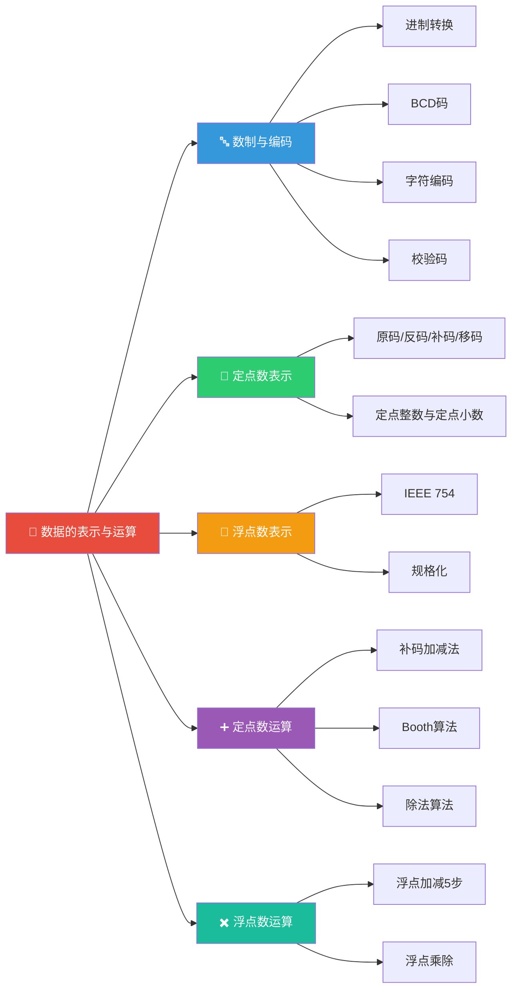

> 如果把计算机比作一个只会"0"和"1"的世界，那么"数据的表示与运算"就是这个世界的基本语法——它规定了现实世界中的数字、文字如何被翻译成 0 和 1，以及这些 0 和 1 如何进行加、减、乘、除的运算。

## 📖 章节导览

本章是计算机组成原理的基础核心，研究数据在计算机内部的表示方式和运算方法。

---

## 📑 本章文章

| 序号 | 文章 | 核心内容 |
|:---:|------|----------|
| 1 | [数制与编码](./01_数制与编码.md) | 进制转换、BCD码、ASCII/Unicode、奇偶校验、海明码、CRC |
| 2 | [定点数的表示](./02_定点数的表示.md) | 原码/反码/补码/移码、定点整数与定点小数、编码转换 |
| 3 | [浮点数的表示](./03_浮点数的表示.md) | IEEE 754标准、规格化、浮点数范围、特殊值 |
| 4 | [定点数的运算](./04_定点数的运算.md) | 补码加减法、Booth算法、除法算法 |
| 5 | [浮点数的运算](./05_浮点数的运算.md) | 浮点加减5步流程、浮点乘除运算 |
