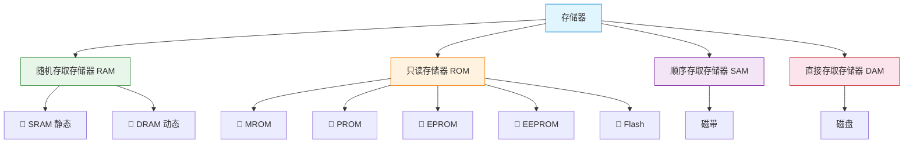
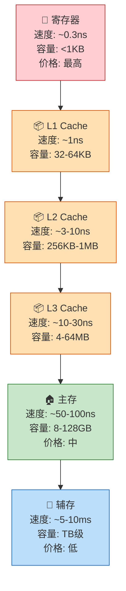
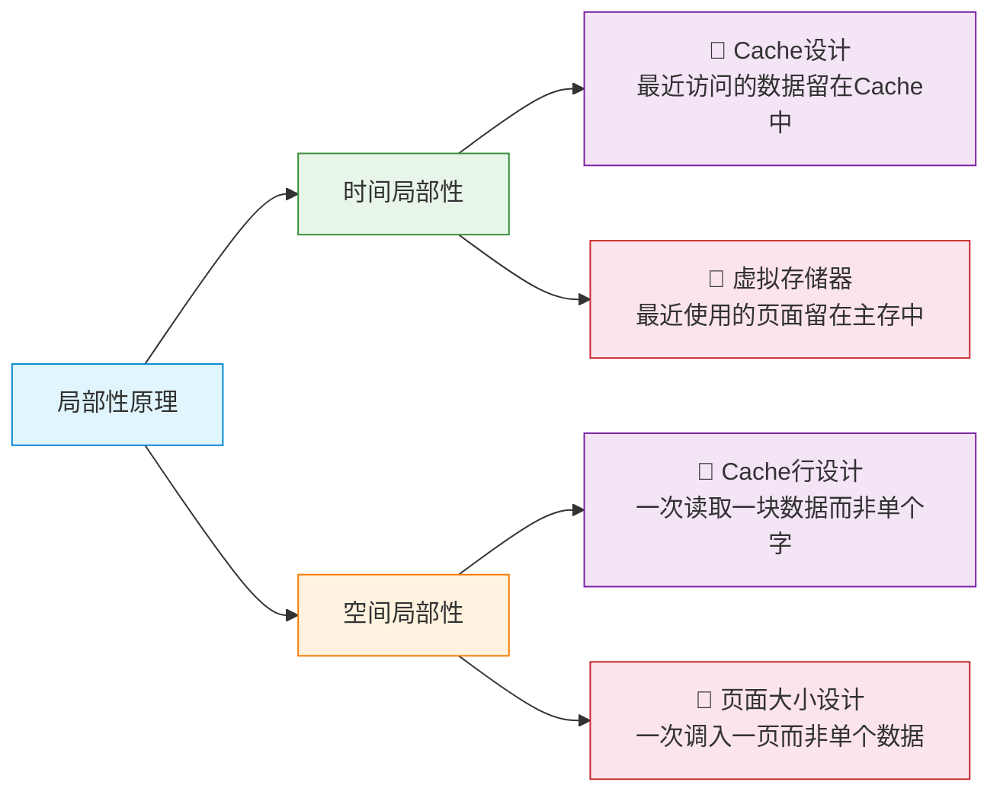
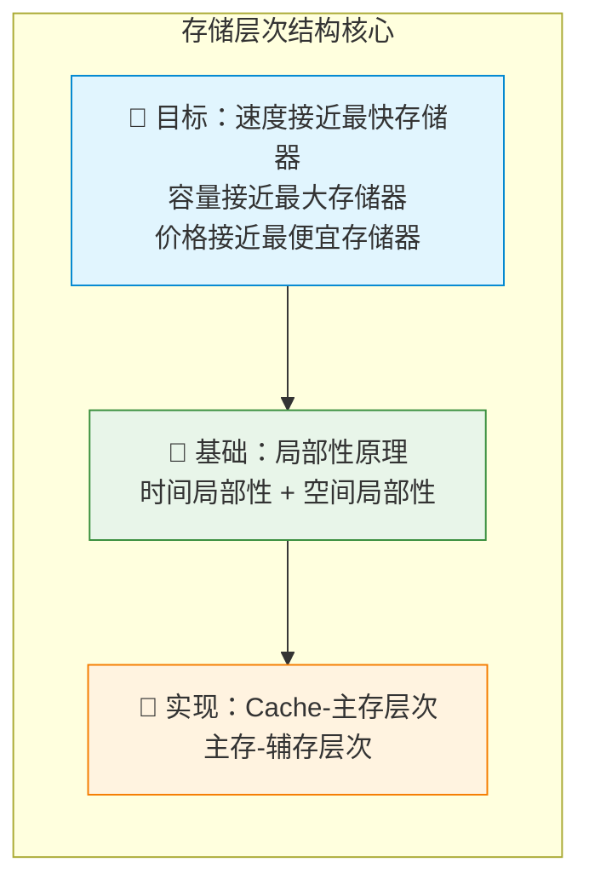

# 存储器概述

> 如果把计算机比作一座工厂，那么存储系统就是工厂的仓库体系——从工人手边的工具箱到远处的物流中心，每一级仓库都在速度、容量和成本之间做出权衡，确保生产线永不缺料。

---

## 一、存储器分类

存储器种类繁多，可从多个维度进行分类。

### 1. 按存储介质分类

| 类型 | 存储介质 | 特点 | 典型代表 |
|:---:|:---:|:---:|:---:|
| 🧲 磁性存储器 | 磁性材料 | 非易失、容量大、速度慢 | 磁盘、磁带 |
| ⚡ 半导体存储器 | 半导体芯片 | 速度快、易失/非易失均有 | RAM、ROM |
| 💿 光学存储器 | 激光刻蚀 | 非易失、容量较大 | CD、DVD |

### 2. 按存取方式分类



### 3. 按在计算机中的作用分类

| 类型 | 作用 | 速度 | 容量 | 价格 |
|:---:|:---:|:---:|:---:|:---:|
| 🏃 寄存器 | CPU内部暂存 | 最快 | 极小 | 极贵 |
| 📦 高速缓存(Cache) | CPU与主存间缓冲 | 很快 | 小 | 贵 |
| 🏠 主存储器(内存) | 存放运行程序和数据 | 中等 | 中等 | 中等 |
| 🏢 辅助存储器(外存) | 存放大量数据 | 慢 | 大 | 便宜 |

::: important RAM 与 ROM 的本质区别
- **RAM（Random Access Memory）**：可读可写，断电后数据丢失（易失性），用于主存
- **ROM（Read-Only Memory）**：通常只读，断电后数据保留（非易失性），用于固件、BIOS等
:::

---

## 二、存储器层次结构

### 1. 层次结构图



### 2. 层次结构的两个关键关系

| 关系 | 含义 | 目的 |
|:---:|:---:|:---:|
| 📈 **容量递增** | 从寄存器到辅存，容量越来越大 | 满足大容量存储需求 |
| 📉 **速度递减** | 从寄存器到辅存，速度越来越慢 | 降低存储成本 |
| 💰 **位价递减** | 从寄存器到辅存，每位价格越来越低 | 在成本与性能间取平衡 |

::: tip 核心思想
存储层次结构的本质是：**利用局部性原理，用较低的成本实现接近最快存储器的速度，同时提供接近最大存储器的容量**。
:::

---

## 三、存储器性能指标

### 1. 存储容量

$$
\text{存储容量} = \text{存储字数} \times \text{存储字长}
$$

- **存储字数**：存储器中可寻址的单元总数
- **存储字长**：每个存储单元的位数

::: info 容量换算
- 1 KB = 2^10 B = 1024 B
- 1 MB = 2^20 B
- 1 GB = 2^30 B
- 1 TB = 2^40 B
:::

### 2. 存取速度

| 指标 | 定义 | 单位 |
|:---:|:---:|:---:|
| ⏱️ 存取时间 | 从启动到完成一次读/写操作的时间 | ns |
| ⏱️ 存取周期 | 连续两次独立读/写操作之间的最小间隔 | ns |
| ⏱️ 主存带宽 | 单位时间内主存传输的数据量 | B/s |

::: important 存取时间 vs 存取周期
**存取周期 ≥ 存取时间**，因为存取周期包含了一次完整的读/写操作加上存储器的恢复时间（如 DRAM 的刷新恢复时间）。
:::

### 3. 存储器带宽计算

$$
\text{带宽} = \frac{\text{数据宽度（位）}}{\text{存取周期（秒）}}
$$

**例**：某主存存取周期为 200ns，数据宽度为 64 位，则带宽为：

$$
\frac{64}{200 \times 10^{-9}} = 320 \times 10^6 \text{ bps} = 40 \text{ MB/s}
$$

---

## 四、局部性原理

局部性原理是存储层次结构能够有效工作的理论基础。

### 1. 时间局部性

> 如果某个数据项被访问，那么在不久的将来它很可能再次被访问。

**典型场景**：
- 循环体中的指令被反复执行
- 循环计数变量被反复读写
- 函数调用中的局部变量被反复访问

### 2. 空间局部性

> 如果某个数据项被访问，那么其地址附近的数据项很可能即将被访问。

**典型场景**：
- 顺序执行的指令
- 数组的顺序遍历
- 结构体字段的连续访问

### 3. 局部性原理的应用



### 4. 局部性原理量化分析

```c
// 分析以下代码的局部性
int sum = 0;
for (int i = 0; i < N; i++) {   // i: 时间局部性好
    sum += a[i];                  // sum: 时间局部性好
}                                 // a[i]: 空间局部性好（连续访问）
```

| 变量 | 时间局部性 | 空间局部性 | 原因 |
|:---:|:---:|:---:|:---:|
| `i` | ✅ 强 | ❌ 弱 | 每次循环都要读写 |
| `sum` | ✅ 强 | ❌ 弱 | 每次循环都要累加 |
| `a[i]` | ❌ 弱 | ✅ 强 | 数组顺序遍历，地址连续 |

---

## 五、存储系统总结



---

::: tip 面试速查
1. **RAM vs ROM**：RAM可读写、易失；ROM只读、非易失
2. **SRAM vs DRAM**：SRAM用触发器、快、贵、用于Cache；DRAM用电容、慢、便宜、用于主存
3. **存取周期 ≥ 存取时间**：周期包含恢复时间
4. **局部性原理**：时间局部性（最近用过的还会用）+ 空间局部性（附近的也会用）
5. **层次结构**：寄存器→L1→L2→L3→主存→辅存，速度递减、容量递增、位价递减
:::

::: info 原著参考
- 唐朔飞《计算机组成原理》第3章 存储系统
- 白中英《计算机组成原理》第4章 存储器
- Patterson & Hennessy《Computer Organization and Design》Chapter 5
:::
