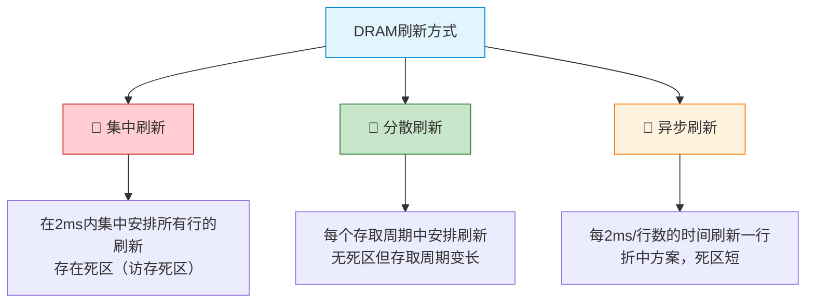
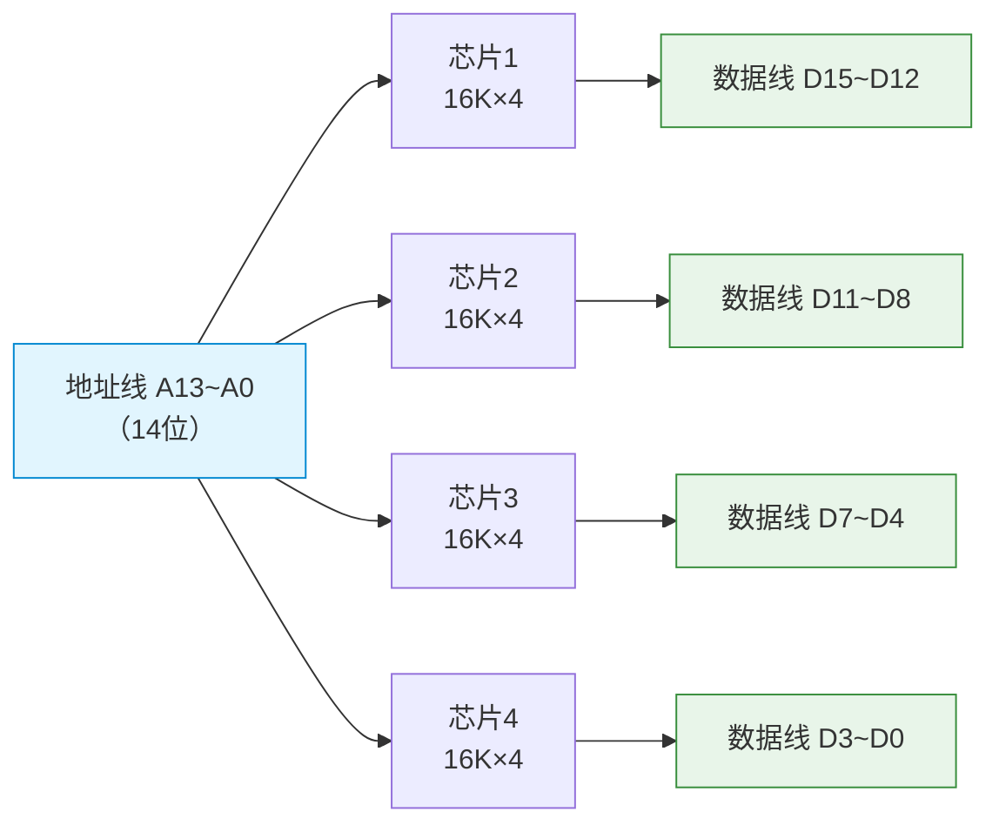
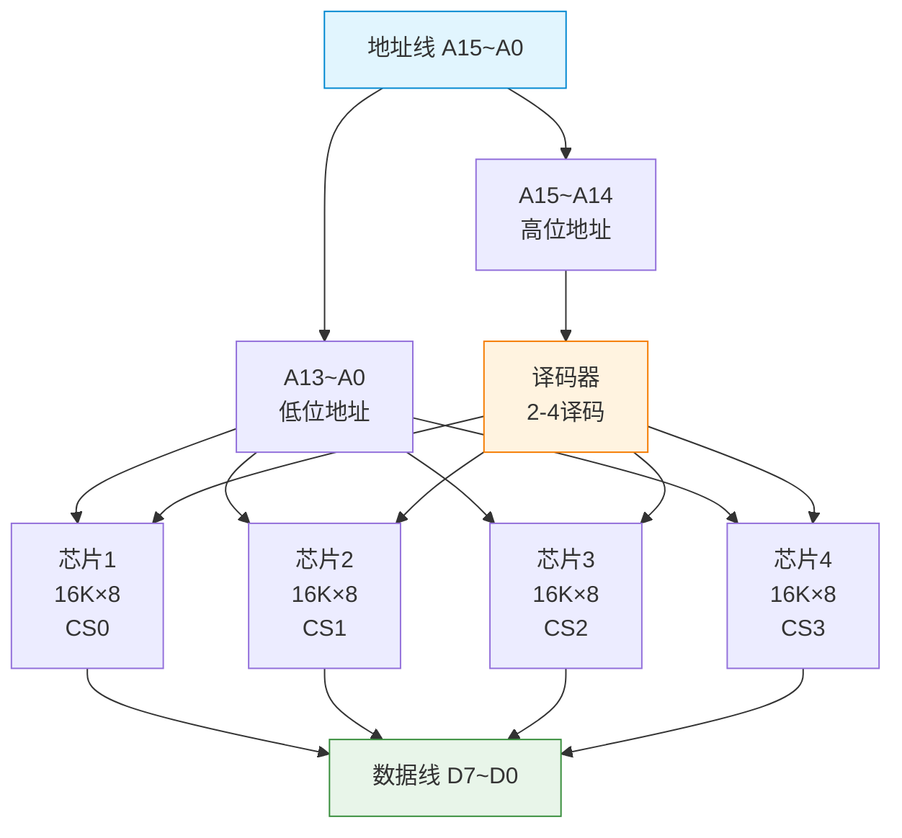
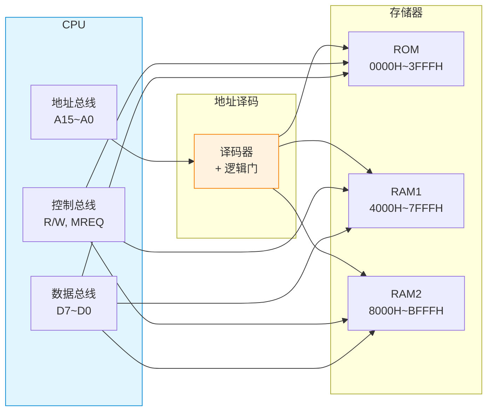

# 主存储器

> 如果把存储系统比作一座图书馆，主存储器就是馆内的书架区——它必须足够快，让读者（CPU）不必久等；又必须足够大，让常用的书（程序和数据）都能随手可得。而SRAM和DRAM则像是精装版和平装版的区别，各有取舍。

---

## 一、SRAM 与 DRAM

### 1. SRAM（静态随机存取存储器）

SRAM 使用**触发器**（六管电路）存储信息，只要不断电，数据就不会丢失。

```
SRAM存储元（六管静态存储元）：

    Vcc
     |
  ┌──┤──┐
  │ T5 T6 │ ← 负载管（负载）
  │  |  |  │
  │ T1 T2 │ ← 驱动管（交叉耦合反相器）
  │  |  |  │
  │ T3 T4 │ ← 门控管（读写控制）
  └──┤──┘
     |
    GND

  位线B ──T3── A点 ──T1── A'点 ──T4── 位线B'
```

**特点**：
- ✅ 不需要刷新，存取速度快（1~10ns）
- ✅ 集成度低，功耗大，成本高
- 📌 用作 **Cache**

### 2. DRAM（动态随机存取存储器）

DRAM 使用**电容**（单管电路）存储信息，电容会漏电，必须定期刷新。

```
DRAM存储元（单管动态存储元）：

  字线（选择线）
     |
     T（MOS管开关）
     |
  ┌──┴──┐
  │  Cs  │ ← 存储电容
  └──┬──┘
     |
    GND

  数据线（位线）──T──Cs
```

**特点**：
- ✅ 集成度高，功耗低，成本低
- ❌ 需要刷新，存取速度较慢（50~70ns）
- 📌 用作 **主存**

### 3. SRAM 与 DRAM 对比

| 特性 | SRAM | DRAM |
|:---:|:---:|:---:|
| 📦 存储元件 | 触发器（6管） | 电容（1管+1电容） |
| ⚡ 存取速度 | 快（1~10ns） | 慢（50~70ns） |
| 🔄 是否需要刷新 | 不需要 | 需要 |
| 🏗️ 集成度 | 低 | 高 |
| 💰 成本 | 高 | 低 |
| ⚡ 功耗 | 大 | 小 |
| 📍 典型用途 | Cache | 主存 |

---

## 二、DRAM 的刷新

### 1. 刷新方式

DRAM 电容上的电荷只能维持约 **2ms**，必须在此时间内完成一次刷新。



### 2. 刷新方式对比

| 刷新方式 | 方法 | 优点 | 缺点 |
|:---:|:---:|:---:|:---:|
| 集中刷新 | 2ms内集中刷新所有行 | 正常访问不受影响 | 有较长的死区时间 |
| 分散刷新 | 每个存取周期刷新一行 | 无明显死区 | 存取周期加倍，速度降低 |
| 异步刷新 | 每隔2ms/行数时间刷新一行 | 死区极短 | 控制稍复杂 |

::: warning 刷新注意要点
1. 刷新以**行**为单位，逐行进行
2. 刷新操作与读操作类似，但不输出数据
3. 刷新期间不能进行正常的读/写操作
4. **刷新优先级高于访存**，但低于CPU的DMA请求
:::

### 3. 刷新计算示例

**例**：某 DRAM 有 1024 行，刷新间隔 2ms，存取周期 50ns。

- 集中刷新：刷新 1024 行需 1024 × 50ns = 51.2μs，死区 51.2μs
- 异步刷新：每 2ms/1024 ≈ 1.95μs 刷新一行，每次死区仅 50ns

---

## 三、ROM 分类

| 类型 | 全称 | 特点 | 擦除方式 |
|:---:|:---:|:---:|:---:|
| MROM | 掩膜式ROM | 出厂时写入，不可改写 | 不可擦除 |
| PROM | 可编程ROM | 用户可写入一次 | 不可擦除 |
| EPROM | 可擦除可编程ROM | 紫外线擦除，可多次改写 | 紫外线照射 |
| EEPROM | 电可擦除可编程ROM | 电信号擦除，可字节级改写 | 电信号 |
| Flash | 闪存 | 电擦除，按块擦除，速度快 | 电信号 |

::: tip Flash 存储器
Flash 是 EEPROM 的改进版，是目前最常用的非易失性存储器：
- **NOR Flash**：随机读取快，用于存储固件（BIOS）
- **NAND Flash**：密度高、容量大，用于U盘、SSD
:::

---

## 四、存储器扩展

当单个存储芯片无法满足容量需求时，需要进行存储器扩展。

### 1. 位扩展（扩展字长）

> 芯片字长不够，多片并联扩展位数。

**场景**：用 4 片 16K×4bit 芯片扩展为 16K×16bit 存储器。



**连接方式**：
- 各芯片的地址线并联
- 各芯片的片选信号并联
- 各芯片的数据线分列输出

### 2. 字扩展（扩展字数）

> 芯片字数不够，多片串联扩展地址范围。

**场景**：用 4 片 16K×8bit 芯片扩展为 64K×8bit 存储器。



**连接方式**：
- 各芯片的地址线并联（低位地址）
- 高位地址经译码器产生各芯片的片选信号
- 各芯片的数据线并联输出

### 3. 字位同时扩展

> 同时扩展字数和字长。

**场景**：用 8 片 16K×4bit 芯片扩展为 64K×8bit 存储器。

- 先位扩展：2片 16K×4bit → 16K×8bit（一组）
- 再字扩展：4组 16K×8bit → 64K×8bit

---

## 五、存储器与 CPU 的连接

### 1. 连接原理



### 2. 连接步骤

1. **确定地址空间**：根据CPU地址线位数确定最大寻址空间
2. **地址分配**：为各芯片分配地址范围
3. **设计译码电路**：根据地址范围设计片选逻辑
4. **连接数据线**：根据位扩展需求连接数据线
5. **连接控制线**：读/写信号、访存信号等

### 3. 译码方式

| 译码方式 | 说明 | 特点 |
|:---:|:---:|:---:|
| 线选法 | 用一根高位地址线直接选中芯片 | 简单但地址空间不连续 |
| 部分译码 | 部分高位地址参与译码 | 有地址重叠区 |
| 全译码 | 所有高位地址都参与译码 | 地址唯一，无重叠 |

::: important 全译码 vs 部分译码
- **全译码**：每个地址唯一对应一个存储单元，无浪费
- **部分译码**：某些地址线未参与译码，存在地址重叠（一个存储单元可有多个地址）
:::

---

## 六、典型例题

### 例题1：存储器扩展设计

**题目**：用 1K×4bit 的芯片组成 4K×8bit 的存储器，需要多少片？如何连接？

**解答**：

- 字扩展：4K/1K = 4 组
- 位扩展：8bit/4bit = 2 片/组
- 总芯片数：4 × 2 = **8 片**

| 组号 | 地址范围 | 芯片 |
|:---:|:---:|:---:|
| 第0组 | 000H~3FFH | 芯片1、2 |
| 第1组 | 400H~7FFH | 芯片3、4 |
| 第2组 | 800H~BFFH | 芯片5、6 |
| 第3组 | C00H~FFFH | 芯片7、8 |

- 地址线：A9~A0 接各芯片（片内地址）
- A11、A10 经 2-4 译码器产生 4 个片选信号
- 每组内 2 片做位扩展，分别接 D7~D4 和 D3~D0

### 例题2：CPU 与存储器连接

**题目**：CPU 有 16 根地址线、8 根数据线，用 4K×8bit 的 RAM 和 4K×8bit 的 ROM 组成存储器，RAM 地址从 2000H 开始，ROM 地址从 8000H 开始。设计连接方案。

**解答**：

| 存储器 | 地址范围 | 地址线 | 片选 |
|:---:|:---:|:---:|:---:|
| RAM | 2000H~2FFFH | A11~A0 | A15~A12 = 0010 |
| ROM | 8000H~8FFFH | A11~A0 | A15~A12 = 1000 |

- RAM 片选：$\overline{CS} = \overline{A15} \cdot A14 \cdot \overline{A13} \cdot \overline{A12}$
- ROM 片选：$A15 \cdot \overline{A14} \cdot \overline{A13} \cdot \overline{A12}$

---

::: tip 面试速查
1. **SRAM vs DRAM**：SRAM用触发器（6管），快、贵，做Cache；DRAM用电容（1管），需刷新，做主存
2. **DRAM刷新**：集中刷新（有死区）、分散刷新（周期加倍）、异步刷新（折中）
3. **ROM分类**：MROM→PROM→EPROM→EEPROM→Flash，可改写性递增
4. **位扩展**：并联扩展字长；**字扩展**：译码扩展字数
5. **全译码**：地址唯一无重叠；**部分译码**：有地址重叠区
6. **连接三步**：地址分配→译码电路→数据/控制线连接
:::

::: info 原著参考
- 唐朔飞《计算机组成原理》3.2节 主存储器
- 白中英《计算机组成原理》4.2节 主存储器的组织
- Patterson & Hennessy《Computer Organization and Design》Chapter 5.3-5.4
:::
