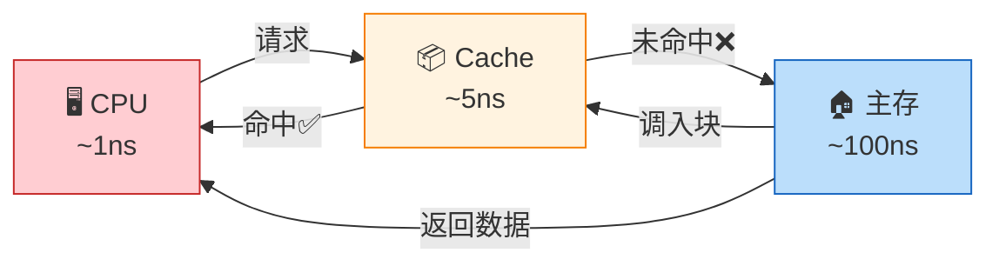
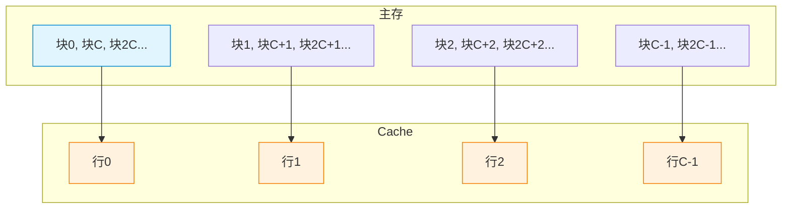
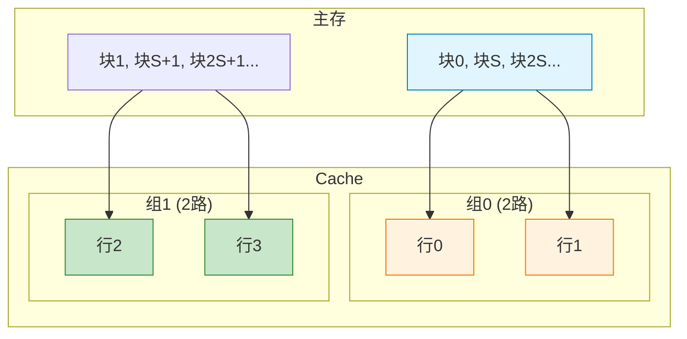
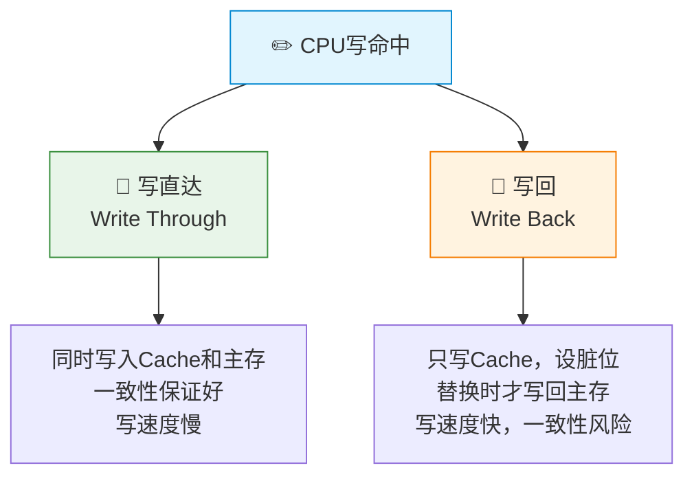

# 高速缓冲存储器

> 如果把CPU比作一位手速极快的厨师，主存是远处的仓库，那么Cache就是厨师手边的备菜台——把最常用的食材提前放在手边，减少来回跑仓库的次数，让烹饪效率翻倍。

---

## 一、Cache 基本原理

### 1. 为什么需要 Cache？

CPU 的速度远快于主存，若每次都直接访问主存，CPU 将大量时间浪费在等待上。Cache 作为高速小容量存储器，位于 CPU 与主存之间，利用**局部性原理**缓存频繁访问的数据。



### 2. Cache 的工作流程

1. CPU 发出访存地址
2. Cache 控制器判断该地址的数据是否在 Cache 中
3. **命中**：直接从 Cache 读取数据
4. **未命中**：从主存读取数据，同时将该数据所在块调入 Cache

::: important Cache 的设计前提
- Cache 对程序员是**透明**的（不可见）
- Cache 与主存的交互以**块**为单位
- Cache 的容量远小于主存，需要映射策略和替换算法
:::

---

## 二、地址映射方式

Cache 的核心问题：主存块如何映射到 Cache 中的位置？

### 1. 直接映射（Direct Mapping）

> 每个主存块只能映射到 Cache 中的一个**固定**位置。

$$
\text{Cache行号} = \text{主存块号} \mod \text{Cache行数}
$$

```
主存地址划分：
┌──────────┬──────────┬────────────┐
│   标记    │  行索引   │   块内地址   │
│  (Tag)   │ (Index)  │ (Offset)   │
└──────────┴──────────┴────────────┘
```



| 优点 | 缺点 |
|:---:|:---:|
| 实现简单，速度快 | 冲突率高，空间利用率低 |

### 2. 全相联映射（Fully Associative Mapping）

> 主存块可以映射到 Cache 中的**任意**位置。

```
主存地址划分：
┌──────────────┬────────────┐
│     标记      │   块内地址   │
│    (Tag)     │  (Offset)  │
└──────────────┴────────────┘
（无索引字段，需与所有行的标记比较）
```

| 优点 | 缺点 |
|:---:|:---:|
| 冲突率低，空间利用率高 | 需要比较所有行，硬件复杂，速度慢 |

### 3. 组相联映射（Set Associative Mapping）

> 主存块映射到 Cache 中某一**组**的任意位置，组间直接映射，组内全相联映射。

$$
\text{Cache组号} = \text{主存块号} \mod \text{Cache组数}
$$

```
主存地址划分：
┌──────────┬──────────┬────────────┐
│   标记    │  组索引   │   块内地址   │
│  (Tag)   │ (Set)    │ (Offset)   │
└──────────┴──────────┴────────────┘
```



| 优点 | 缺点 |
|:---:|:---:|
| 折中方案，兼顾速度和冲突率 | 实现较直接映射复杂 |

### 4. 三种映射方式对比

| 特性 | 直接映射 | 全相联映射 | 组相联映射 |
|:---:|:---:|:---:|:---:|
| 映射位置 | 固定一行 | 任意一行 | 固定一组内任意行 |
| 标记比较 | 1次 | 全部行 | 组内各行 |
| 冲突率 | 高 | 低 | 中等 |
| 硬件复杂度 | 低 | 高 | 中等 |
| 查找速度 | 快 | 慢 | 中等 |
| 地址结构 | Tag+Index+Offset | Tag+Offset | Tag+Set+Offset |

::: tip N路组相联
"2路组相联"意味着每组有2行；"4路组相联"意味着每组有4行。路数越多，越接近全相联映射；路数越少（1路），就是直接映射。
:::

---

## 三、替换算法

当 Cache 满了，新块调入时需要替换旧块。替换算法只在**全相联映射**和**组相联映射**中需要（直接映射位置固定，无选择余地替换）。

### 1. 常见替换算法

| 算法 | 原理 | 优点 | 缺点 |
|:---:|:---:|:---:|:---:|
| 🎯 **LRU** | 替换最近最久未使用的块 | 命中率高，利用时间局部性 | 需要记录访问顺序 |
| 📋 **FIFO** | 替换最早进入Cache的块 | 实现简单 | 可能替换常用块 |
| 🔢 **LFU** | 替换访问次数最少的块 | 考虑了使用频率 | 需要计数器，早期高频块难被替换 |
| 🎲 **随机** | 随机替换一行 | 实现最简单 | 命中率不稳定 |

### 2. LRU 替换算法示例

**题目**：4路组相联Cache，某组初始为空，访问序列为：2, 3, 2, 1, 5, 2, 4, 5, 3, 2, 5

| 访问 | Cache内容（最近→最久） | 命中？ |
|:---:|:---|:---:|
| 2 | 2 | ❌ |
| 3 | 3, 2 | ❌ |
| 2 | 2, 3 | ✅ |
| 1 | 1, 2, 3 | ❌ |
| 5 | 5, 1, 2, 3 | ❌ |
| 2 | 2, 5, 1, 3 | ✅ |
| 4 | 4, 2, 5, 1（替换3） | ❌ |
| 5 | 5, 4, 2, 1 | ✅ |
| 3 | 3, 5, 4, 2（替换1） | ❌ |
| 2 | 2, 3, 5, 4 | ✅ |
| 5 | 5, 2, 3, 4 | ✅ |

命中率 = 5/11 ≈ 45.5%

::: warning LRU 的实现
LRU 需要为每行设置计数器，记录最近访问顺序：
- 命中时：该行计数器清零，比其低的计数器+1
- 未命中时：替换计数器最大的行，新行计数器清零，其余+1
:::

---

## 四、写策略

Cache 与主存的数据一致性问题：当 CPU 修改了 Cache 中的数据，主存中的副本怎么办？

### 1. 写命中时的策略



| 策略 | 操作 | 一致性 | 速度 | 额外开销 |
|:---:|:---:|:---:|:---:|:---:|
| 写直达 | 同时写Cache和主存 | 好 | 慢 | 写缓冲 |
| 写回 | 只写Cache，设脏位 | 差 | 快 | 脏位标志 |

### 2. 写不命中时的策略

| 策略 | 操作 | 特点 |
|:---:|:---:|:---:|
| 写分配 | 先调入块再修改 | 配合写回使用 |
| 非写分配 | 直接写主存，不调入Cache | 配合写直达使用 |

::: tip 写策略搭配
- **写直达 + 非写分配**：简单，一致性好的经典搭配
- **写回 + 写分配**：高性能系统的常见选择
:::

---

## 五、Cache 性能分析

### 1. 命中率与平均访问时间

$$
h = \frac{N_c}{N_c + N_m} \quad \text{（命中率）}
$$

$$
t_a = h \cdot t_c + (1-h) \cdot t_m \quad \text{（平均访问时间）}
$$

其中：
- $N_c$：Cache命中次数
- $N_m$：主存访问次数
- $t_c$：Cache存取时间
- $t_m$：主存存取时间

### 2. 效率

$$
e = \frac{t_c}{t_a} \times 100\%
$$

### 3. 性能计算示例

**例**：某Cache存取时间 10ns，主存存取时间 200ns，命中率 95%。

$$
t_a = 0.95 \times 10 + 0.05 \times 200 = 9.5 + 10 = 19.5 \text{ ns}
$$

$$
e = \frac{10}{19.5} \times 100\% \approx 51.3\%
$$

::: important 命中率的影响
命中率是Cache性能的关键。命中率从95%提升到99%，平均访问时间从19.5ns降至11.9ns，性能提升显著。
:::

---

## 六、典型例题

### 例题1：地址划分

**题目**：主存容量 256MB，按字节编址，Cache有 64行，每行 64B。分别计算直接映射、2路组相联、全相联映射的地址格式。

**解答**：

主存容量 = 256MB = 2^28 B，地址 28 位

块内地址 = log₂64 = 6 位

**直接映射**：
- 行索引 = log₂64 = 6 位
- 标记 = 28 - 6 - 6 = 16 位
- | Tag(16) | Index(6) | Offset(6) |

**2路组相联**：
- 组数 = 64/2 = 32，组索引 = log₂32 = 5 位
- 标记 = 28 - 5 - 6 = 17 位
- | Tag(17) | Set(5) | Offset(6) |

**全相联映射**：
- 标记 = 28 - 6 = 22 位
- | Tag(22) | Offset(6) |

### 例题2：Cache映射计算

**题目**：直接映射Cache，64行，每行4个字，主存按字节编址。主存地址 0x00000040 映射到Cache哪一行？

**解答**：

- 块大小 = 4字 = 16B，块内地址 = 4位
- 行索引位数 = log₂64 = 6位
- 地址 0x00000040 = ...0100 0000
- 块内地址（低4位）= 0000
- 行索引（第4~9位）= 0001 00 = 4

映射到 **第4行**。

### 例题3：LRU替换

**题目**：2路组相联Cache，共4组，LRU替换。访问序列（块号）：0, 4, 8, 0, 12, 4, 8。求命中次数。

**解答**：

- 组号 = 块号 mod 4

| 访问块号 | 组号 | Cache组内容 | 命中？ |
|:---:|:---:|:---|:---:|
| 0 | 0 | [0, -] | ❌ |
| 4 | 0 | [4, 0] | ❌ |
| 8 | 0 | [8, 4]（替换0） | ❌ |
| 0 | 0 | [0, 8]（替换4） | ❌ |
| 12 | 0 | [12, 0]（替换8） | ❌ |
| 4 | 0 | [4, 12]（替换0） | ❌ |
| 8 | 0 | [8, 4]（替换12） | ❌ |

命中率 = 0/7 = 0%（该序列直接映射冲突严重）

::: warning 注意
本题中块0、4、8、12都映射到同一组，2路组相联容量不足以缓解冲突。如果是4路组相联，命中率会大幅提升。
:::

---

::: tip 面试速查
1. **三种映射**：直接映射（取模固定行）、全相联（任意行）、组相联（固定组内任意行）
2. **地址划分**：Tag + Index/Set + Offset，三种映射的Index字段不同
3. **LRU替换**：替换最近最久未使用的块，需计数器实现
4. **写策略**：写直达（同时写主存）vs 写回（脏位标记，替换时写回）
5. **性能公式**：$t_a = h \cdot t_c + (1-h) \cdot t_m$
6. **命中率是关键**：95%→99%的提升远大于90%→95%的提升
:::

::: info 原著参考
- 唐朔飞《计算机组成原理》3.4节 高速缓冲存储器
- 白中英《计算机组成原理》4.4节 Cache
- Patterson & Hennessy《Computer Organization and Design》Chapter 5.3-5.5
:::
