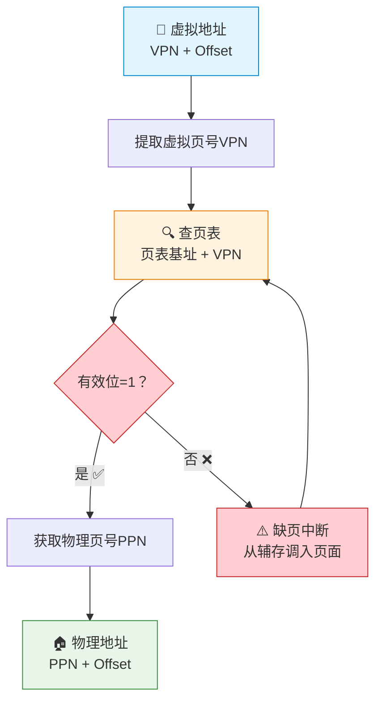
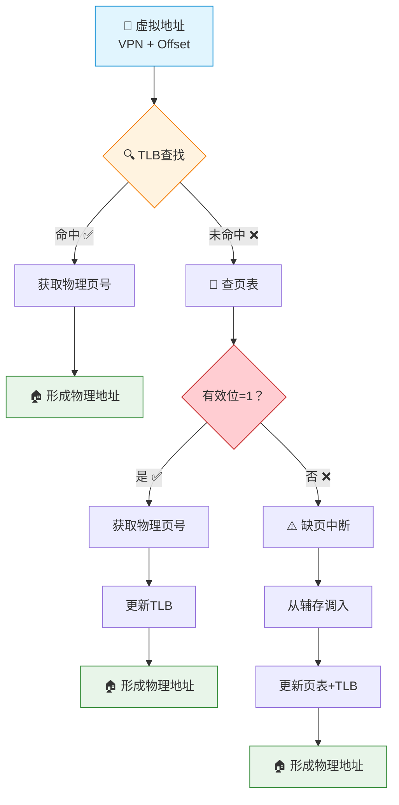
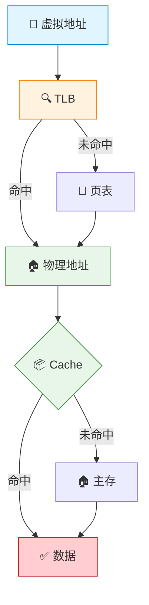
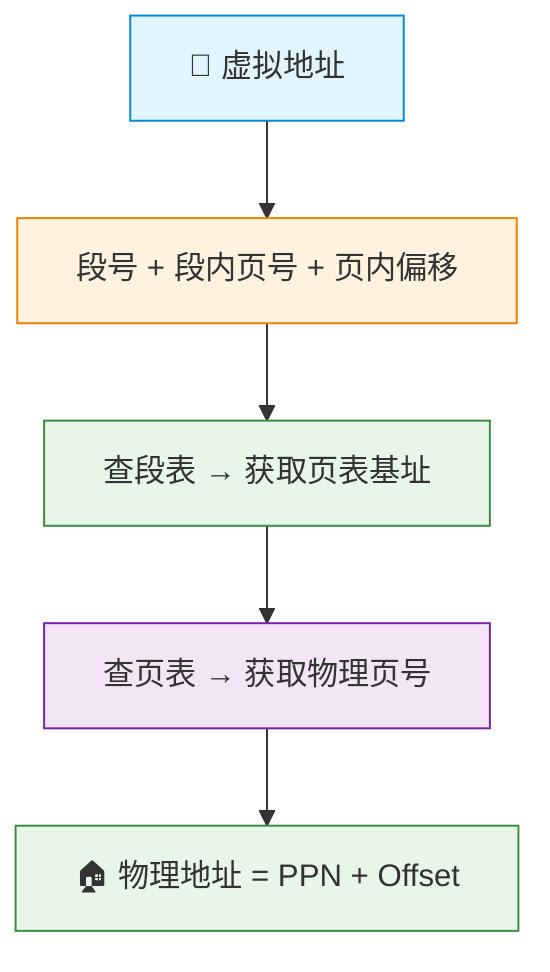

# 虚拟存储器

> 如果把主存比作办公桌，辅存比作文件柜，那么虚拟存储器就是让你拥有"透视眼"——你只需说出文件编号（虚拟地址），系统自动帮你从文件柜找到文件放到桌上，仿佛办公桌无限大。你永远不必操心文件到底在桌上还是柜里。

---

## 一、虚拟存储器概念

### 1. 为什么需要虚拟存储器？

- **主存容量有限**：程序和数据总量往往远超主存容量
- **多道程序并发**：多个程序同时运行，每个都需要独立地址空间
- **内存保护**：各程序之间不能互相干扰

### 2. 虚拟存储器的基本思想


::: important 虚拟存储器与 Cache 的对比
| 特性 | Cache-主存 | 主存-辅存（虚拟存储器） |
|:---:|:---:|:---:|
| 解决问题 | 速度不匹配 | 容量不匹配 |
| 透明性 | 对应用程序员透明 | 对应用程序员透明 |
| 数据移动单位 | 块（几十字节） | 页/段（几KB~几MB） |
| 失效时 | CPU等待 | 页面置换，可能很长 |
:::

---

## 二、页式虚拟存储器

### 1. 基本原理

将虚拟地址空间和物理地址空间都划分为固定大小的**页**，通过**页表**建立虚拟页到物理页的映射。

```
虚拟地址划分：
┌──────────────┬──────────────┐
│  虚拟页号VPN  │   页内偏移    │
│ (Virtual Page)│  (Offset)   │
└──────────────┴──────────────┘

物理地址划分：
┌──────────────┬──────────────┐
│  物理页号PPN  │   页内偏移    │
│(Physical Page)│  (Offset)   │
└──────────────┴──────────────┘
```

### 2. 页表

页表是虚拟页到物理页的映射表，存放在主存中。

| 字段 | 说明 |
|:---:|:---:|
| 页号 | 虚拟页编号（隐含，由下标表示） |
| 物理页号 | 对应的主存页框号 |
| 有效位 | 该页是否在主存中 |
| 脏位 | 该页是否被修改过 |
| 访问位 | 用于页面置换算法 |
| 修改位 | 该页是否被写入 |

### 3. 地址变换过程



::: warning 缺页中断
缺页中断与一般中断的区别：
1. 缺页中断是在**指令执行期间**产生的（一般中断在指令执行完后检测）
2. 一条指令可能产生**多次**缺页中断（如跨页的指令）
3. 缺页中断属于**内中断**（异常）
:::

---

## 三、TLB（快表）

### 1. 为什么需要 TLB？

每次访存都要先查页表（访问一次主存），再访问数据（又访问一次主存），导致访存速度减半。TLB（Translation Lookaside Buffer）是页表的**高速缓存**，将常用页表项缓存在 Cache 中。

### 2. TLB 的结构

TLB 采用**全相联映射**或**组相联映射**，包含：

| 字段 | 说明 |
|:---:|:---:|
| 标记（Tag） | 虚拟页号 |
| 物理页号 | 对应的物理页框号 |
| 有效位 | 该项是否有效 |
| 脏位 | 对应页面是否被修改 |
| 访问位 | 用于替换算法 |

### 3. TLB 查找流程



### 4. TLB、Cache 与主存的访问关系



**访存时间分析**：

| TLB | Cache | 访问过程 | 时间 |
|:---:|:---:|:---:|:---:|
| 命中 | 命中 | TLB→Cache | $t_{TLB} + t_{Cache}$ |
| 命中 | 未命中 | TLB→Cache→主存 | $t_{TLB} + t_{Cache} + t_m$ |
| 未命中 | 命中 | TLB→页表→Cache | $t_{TLB} + t_m + t_{Cache}$ |
| 未命中 | 未命中 | TLB→页表→Cache→主存 | $t_{TLB} + 2t_m$ |

---

## 四、段式虚拟存储器

### 1. 基本原理

将虚拟地址空间按**逻辑功能**划分为若干段，每段长度可变，通过段表建立映射。

```
虚拟地址划分：
┌──────────────┬──────────────┐
│   段号        │   段内偏移    │
│ (Segment)    │  (Offset)   │
└──────────────┴──────────────┘
```

### 2. 段表结构

| 字段 | 说明 |
|:---:|:---:|
| 段号 | 段的编号（隐含） |
| 段基址 | 该段在主存中的起始地址 |
| 段长 | 该段的长度 |
| 有效位 | 该段是否在主存中 |

### 3. 地址变换

$$
\text{物理地址} = \text{段基址} + \text{段内偏移}
$$

::: warning 越界检查
段式存储必须检查：**段内偏移 < 段长**，否则产生地址越界异常。
:::

---

## 五、段页式虚拟存储器

### 1. 基本原理

结合段式和页式的优点：先分段，段内再分页。



### 2. 三种虚拟存储器对比

| 特性 | 页式 | 段式 | 段页式 |
|:---:|:---:|:---:|:---:|
| 划分方式 | 固定大小页 | 可变大小段 | 先分段再分页 |
| 地址空间 | 一维 | 二维 | 二维 |
| 越界检查 | 不需要 | 需要 | 段级需要 |
| 外碎片 | 无 | 有 | 无 |
| 内碎片 | 有 | 无 | 有（段末页） |
| 逻辑性 | 差 | 好 | 好 |
| 实现复杂度 | 低 | 中 | 高 |

---

## 六、典型例题

### 例题1：页式地址变换

**题目**：某系统虚拟地址 32 位，物理地址 24 位，页大小 4KB。求页表项数和地址格式。

**解答**：

- 页大小 4KB = 2^12 B → 页内偏移 12 位
- 虚拟页号 = 32 - 12 = **20 位**，页表项数 = 2^20 = **1M**
- 物理页号 = 24 - 12 = **12 位**

| 虚拟地址 | VPN(20位) | Offset(12位) |
|:---:|:---:|:---:|
| 物理地址 | PPN(12位) | Offset(12位) |

### 例题2：TLB + Cache 访问时间

**题目**：TLB访问时间 2ns，Cache访问时间 10ns，主存访问时间 100ns，TLB命中率 98%，Cache命中率 90%。求平均访存时间。

**解答**：

- TLB命中时（98%）：先查TLB(2ns)，再查Cache
  - Cache命中(90%)：2 + 10 = 12ns
  - Cache未命中(10%)：2 + 10 + 100 = 112ns
  - 平均：0.9 × 12 + 0.1 × 112 = 10.8 + 11.2 = 22ns

- TLB未命中时（2%）：查TLB(2ns) + 查页表(100ns) + 查Cache
  - Cache命中(90%)：2 + 100 + 10 = 112ns
  - Cache未命中(10%)：2 + 100 + 10 + 100 = 212ns
  - 平均：0.9 × 112 + 0.1 × 212 = 100.8 + 21.2 = 122ns

- **总平均**：0.98 × 22 + 0.02 × 122 = 21.56 + 2.44 = **24ns**

### 例题3：虚拟地址转换

**题目**：页大小 1KB，页表如下，求虚拟地址 0x0A3F 的物理地址。

| 虚拟页号 | 物理页号 | 有效位 |
|:---:|:---:|:---:|
| 0 | 5 | 1 |
| 1 | - | 0 |
| 2 | 3 | 1 |
| 3 | 8 | 1 |

**解答**：

- 页大小 1KB = 2^10 B → 页内偏移 10 位
- 0x0A3F = 0000 1010 0011 1111
- 虚拟页号 = 0000 10 = 2，页内偏移 = 10 0011 1111 = 0x23F
- 查页表：虚拟页号2 → 物理页号3，有效位=1 ✅
- 物理地址 = 3 << 10 | 0x23F = 0x0C00 + 0x23F = **0x0E3F**

---

::: tip 面试速查
1. **虚拟存储器**：解决主存容量不足，逻辑上扩充主存
2. **页式存储**：固定大小页，无外碎片，有内碎片，一维地址
3. **段式存储**：可变大小段，有外碎片，无内碎片，二维地址，需越界检查
4. **TLB**：页表的高速缓存，大幅减少地址变换时间
5. **缺页中断**：属于内中断（异常），指令执行期间产生，可多次发生
6. **段页式**：先分段再分页，兼顾逻辑性和空间利用率
7. **TLB→页表→Cache→主存**：理解四级查找流程及各种命中/未命中组合的时间
:::

::: info 原著参考
- 唐朔飞《计算机组成原理》3.5节 虚拟存储器
- 白中英《计算机组成原理》4.5节 虚拟存储器
- Patterson & Hennessy《Computer Organization and Design》Chapter 5.7
:::
