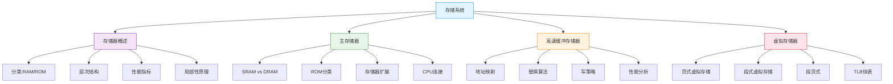

# 存储系统

> 如果把计算机比作一座工厂，CPU 是飞速运转的加工中心，那么存储系统就是工厂的仓库体系——从工人手边的工具箱（寄存器），到车间的临时货架（Cache），再到工厂的主仓库（主存），最后是远处的物流中心（辅存），层层缓存、逐级调配，确保加工中心永远不缺原料。

## 本章概述

存储系统是计算机体系结构中极其重要的一环。程序的执行速度不仅取决于 CPU 的运算能力，更取决于存储系统能否以足够的速度向 CPU 提供指令和数据。本章将从存储器的基本概念出发，深入讲解主存储器的组织与扩展、高速缓冲存储器（Cache）的工作原理与设计、以及虚拟存储器的实现机制。

## 目录

- [存储器概述](01_存储器概述.md) —— 存储器分类、层次结构、性能指标与局部性原理
- [主存储器](02_主存储器.md) —— SRAM/DRAM/ROM、存储器扩展、存储器与CPU连接
- [高速缓冲存储器](03_高速缓冲存储器.md) —— Cache映射、替换算法、写策略、性能分析
- [虚拟存储器](04_虚拟存储器.md) —— 页式/段式/段页式虚拟存储、TLB、地址变换

## 核心知识图谱

## 学习建议

1. **理解局部性原理**：这是整个存储层次结构的理论基石，Cache 和虚拟存储器的设计都依赖于它
2. **掌握三种映射方式**：直接映射、全相联映射、组相联映射是 Cache 的核心考点
3. **地址变换是重点**：虚拟地址到物理地址的转换过程，结合 TLB 的查找流程，是高频考题
4. **动手画图**：存储器扩展的连接图、Cache 映射的地址划分图，多画几遍才能真正理解
