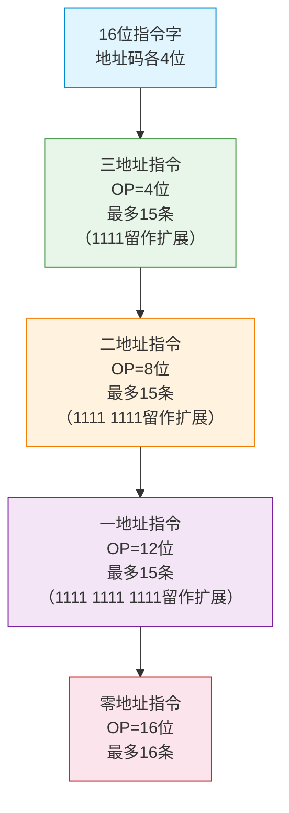

# 指令格式

> 如果把计算机比作一支乐队，那么指令就是乐谱上的每个音符——操作码决定"演奏什么"，地址码决定"谁来演奏"。音符的编排方式（格式），决定了乐队的表达力和演奏效率。

---

## 一、指令的基本格式

一条指令由两部分组成：

```
┌──────────────────┬──────────────────┐
│     操作码 OP     │     地址码 A      │
│  (Operation Code) │   (Address Code)  │
└──────────────────┴──────────────────┘
```

- **操作码（OP）**：指出指令要执行什么操作（加、减、传送、跳转等）
- **地址码（A）**：指出操作数的位置或操作数本身

::: important 操作码与地址码的权衡
指令字长固定时，操作码位数越多，可定义的操作越多；但地址码位数越少，寻址空间越小。两者需要权衡。
:::

---

## 二、按地址码数目分类

### 1. 四地址指令

```
┌──────┬──────┬──────┬──────┬──────┐
│  OP  │  A1  │  A2  │  A3  │  A4  │
└──────┴──────┴──────┴──────┴──────┘
```

- 操作：$(A1) \text{ OP } (A2) \rightarrow A3$，下一条指令地址 = A4
- 需要 4 次访存（取指令 + 取A1 + 取A2 + 存A3）
- **缺点**：指令过长，A4可由PC自动+1获得

### 2. 三地址指令

```
┌──────┬──────┬──────┬──────┐
│  OP  │  A1  │  A2  │  A3  │
└──────┴──────┴──────┴──────┘
```

- 操作：$(A1) \text{ OP } (A2) \rightarrow A3$，下一条指令由PC自动给出
- 需要 4 次访存
- **改进**：省去A4，由PC隐含给出下条指令地址

### 3. 二地址指令

```
┌──────┬──────┬──────┐
│  OP  │  A1  │  A2  │
└──────┴──────┴──────┘
```

- 操作：$(A1) \text{ OP } (A2) \rightarrow A1$
- 需要 4 次访存（若A1在主存）或 3 次访存（若A1在寄存器）
- **注意**：A1既是源操作数又是目的操作数，执行后A1被覆盖

### 4. 一地址指令

```
┌──────┬──────┐
│  OP  │  A1  │
└──────┴──────┘
```

- 操作：$(ACC) \text{ OP } (A1) \rightarrow ACC$
- 需要 2 次访存
- 另一个操作数隐含在累加器ACC中

### 5. 零地址指令

```
┌──────┐
│  OP  │
└──────┘
```

- 无地址码，操作数隐含在栈顶（堆栈型计算机）
- 如：`PUSH`、`POP`、`ADD`（弹出栈顶两个元素，结果压栈）

### 6. 各类指令对比

| 类型 | 地址码数 | 访存次数 | 典型用途 |
|:---:|:---:|:---:|:---:|
| 四地址 | 4 | 4+ | 几乎不用 |
| 三地址 | 3 | 4 | RISC常用 |
| 二地址 | 2 | 3~4 | 最常用格式 |
| 一地址 | 1 | 2 | 累加器型机器 |
| 零地址 | 0 | 0~1 | 堆栈型机器 |

---

## 三、指令字长

### 1. 按指令字长分类

| 类型 | 说明 | 特点 |
|:---:|:---:|:---:|
| 定长指令字 | 所有指令长度相同 | 便于流水线，RISC常用 |
| 变长指令字 | 指令长度可变 | 灵活，CISC常用 |

### 2. 指令字长与机器字长的关系

- **单字长指令**：指令字长 = 机器字长
- **半字长指令**：指令字长 = 机器字长/2
- **双字长指令**：指令字长 = 2 × 机器字长

::: tip 定长 vs 变长
- **定长指令**：取指速度快，适合流水线，但可能有空间浪费
- **变长指令**：编码紧凑，但取指需要多次访存，不适合流水线
:::

---

## 四、扩展操作码技术

### 1. 基本思想

在指令字长固定的前提下，用**可变长度的操作码**来兼容不同地址数的指令：

- 地址码多的指令，操作码短
- 地址码少的指令，操作码长

### 2. 设计示例

**题目**：16位指令字，地址码每个4位，设计扩展操作码。

```
┌─────────────────────────────────────────────┐
│ 三地址指令：OP(4位) + A1(4位) + A2(4位) + A3(4位)│
│ OP = 0000~1110 → 15条三地址指令              │
│ 1111 作为扩展标志                             │
├─────────────────────────────────────────────┤
│ 二地址指令：1111 + OP(4位) + A1(4位) + A2(4位)  │
│ OP = 0000~1110 → 15条二地址指令              │
│ 1111 1111 作为扩展标志                       │
├─────────────────────────────────────────────┤
│ 一地址指令：1111 1111 + OP(4位) + A1(4位)       │
│ OP = 0000~1110 → 15条一地址指令              │
│ 1111 1111 1111 作为扩展标志                  │
├─────────────────────────────────────────────┤
│ 零地址指令：1111 1111 1111 + OP(4位)            │
│ OP = 0000~1111 → 16条零地址指令              │
└─────────────────────────────────────────────┘
```



### 3. 扩展操作码设计原则

1. **短操作码不能是长操作码的前缀**（否则无法区分）
2. 各指令的操作码一定不能重复
3. 通常留出全1作为扩展标志

::: warning 扩展操作码的编码问题
扩展操作码本质上是一种**前缀编码**，类似于哈夫曼编码的思想：使用频率高的指令分配短操作码，使用频率低的指令分配长操作码。
:::

---

## 五、指令设计原则

### 1. 完备性

指令系统应能完成所有必要的操作，不需要软件额外实现基本功能。

### 2. 有效性

指令的执行效率要高，包括：
- 指令长度短
- 执行速度快
- 常用操作有专用指令

### 3. 规整性

- 指令格式规整：操作码和数据格式对称
- 寄存器使用规整：通用寄存器对各指令同等可用
- 编址方式规整：各种寻址方式对各类指令同等可用

### 4. 兼容性

同一系列的计算机，低档机上的程序应能在高档机上运行（向上兼容）。

---

## 六、典型例题

### 例题1：扩展操作码设计

**题目**：某机器指令字长16位，每个地址码占4位。若三地址指令有12条，二地址指令有30条，一地址指令有62条，则零地址指令最多有多少条？

**解答**：

- 三地址指令占 OP 4位中的 12 个编码（0000~1011），剩余 16-12 = 4 个扩展窗口
- 二地址指令：4 × 16 = 64 个编码空间，用30个，剩余 64-30 = 34 个扩展窗口
- 一地址指令：34 × 16 = 544 个编码空间，用62个，剩余 544-62 = 482 个扩展窗口
- 零地址指令：482 × 16 = **7712 条**

### 例题2：指令格式设计

**题目**：某机器有8个通用寄存器，主存容量 256KB 按字节编址。设计二地址指令格式，一个操作数用寄存器寻址，另一个用直接寻址。

**解答**：

- 8个寄存器 → 寄存器编号 3 位
- 256KB = 2^18 B → 直接地址 18 位
- 设操作码 8 位（可定义256种操作）

```
┌──────────┬──────────┬──────────────────────┐
│  OP(8位)  │  R(3位)   │     Addr(18位)        │
└──────────┴──────────┴──────────────────────┘
指令字长 = 8 + 3 + 18 = 29 位
```

---

::: tip 面试速查
1. **指令 = 操作码 + 地址码**，操作码决定做什么，地址码决定对谁做
2. **地址码数量**：四地址→三地址→二地址→一地址→零地址，访存次数递减
3. **扩展操作码**：固定字长下，短操作码留给多地址指令，长操作码留给少地址指令
4. **扩展原则**：短操作码不能是长操作码的前缀（类似前缀编码）
5. **设计原则**：完备性、有效性、规整性、兼容性
:::

::: info 原著参考
- 唐朔飞《计算机组成原理》4.1节 指令格式
- 白中英《计算机组成原理》5.1节 指令格式
- Patterson & Hennessy《Computer Organization and Design》Chapter 2.5
:::
