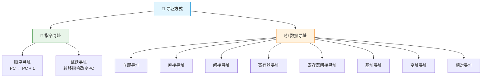
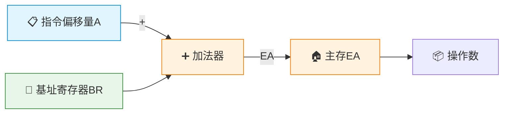
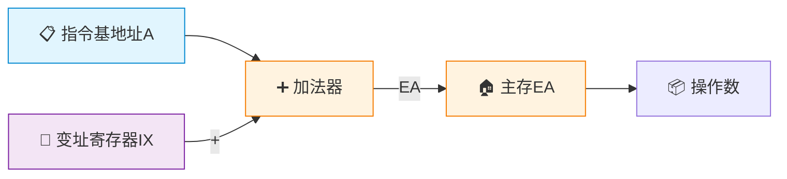
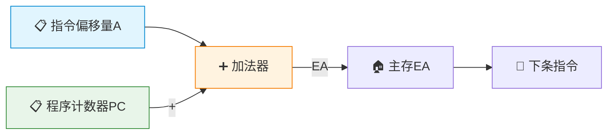

# 寻址方式

> 如果把指令比作一封快递单，寻址方式就是快递单上的地址填写规则——是直接写收件人门牌号（直接寻址），还是写一个代收点的编号（寄存器寻址），抑或写"收件人隔壁"（相对寻址）？不同的填写规则，决定了快递送达的速度和灵活性。

---

## 一、寻址方式概述

**寻址方式**：确定本条指令的数据地址及下一条待执行指令的地址的方法。

- **指令寻址**：确定下一条指令的地址
- **数据寻址**：确定操作数的地址



---

## 二、立即寻址

> 操作数直接包含在指令中。

```
指令格式：  ┌──────┬──────────┐
            │  OP  │ 立即数   │
            └──────┴──────────┘

执行过程：   操作数 = 指令中的立即数
```


| 优点 | 缺点 |
|:---:|:---:|
| 不需要访存，速度最快 | 操作数大小受指令字长限制 |
| 实现简单 | 操作数不能修改（常数） |

::: tip 适用场景
立即寻址用于给寄存器或内存单元赋初值，如 `MOV R1, #5`。
:::

---

## 三、直接寻址

> 指令中直接给出操作数的主存地址。

```
指令格式：  ┌──────┬──────────┐
            │  OP  │  有效地址 │
            └──────┴──────────┘
```


| 优点 | 缺点 |
|:---:|:---:|
| 简单直观 | 寻址空间受地址码位数限制 |
| 只需1次访存 | 地址不能动态修改 |

---

## 四、间接寻址

> 指令中给出的是操作数地址的地址。

### 1. 一次间接寻址


### 2. 多次间接寻址

间接寻址可以嵌套，用标志位标记是否为最终地址。

| 优点 | 缺点 |
|:---:|:---:|
| 扩大寻址空间 | 多次访存，速度慢 |
| 可实现指针操作 | 实现复杂 |

::: warning 间接寻址的访存次数
- 一次间接寻址：需要 **2次访存**
- N次间接寻址：需要 **N+1次访存**
:::

---

## 五、寄存器寻址

> 操作数在寄存器中，指令给出寄存器编号。


| 优点 | 缺点 |
|:---:|:---:|
| 不需要访存，速度快 | 寄存器数量有限 |
| 寄存器编号短，指令短 | 寻址空间受寄存器数限制 |

---

## 六、寄存器间接寻址

> 寄存器中存放的是操作数的主存地址。


| 优点 | 缺点 |
|:---:|:---:|
| 比间接寻址少1次访存 | 仍需1次访存 |
| 适合循环中遍历数组 | — |

---

## 七、基址寻址

> 基址寄存器的内容 + 指令中的偏移量 = 有效地址。

$$
EA = (BR) + A
$$



::: important 基址寻址的特点
- **基址寄存器的内容由操作系统设置**，用户程序不可修改
- **指令中的偏移量可变**，用于定位段内不同位置
- **用途**：实现程序的重定位，解决多道程序设计中程序的装入问题
- **基址寄存器是面向操作系统的**
:::

---

## 八、变址寻址

> 变址寄存器的内容 + 指令中的基地址 = 有效地址。

$$
EA = (IX) + A
$$



::: important 变址寻址的特点
- **指令中的基地址不变**，变址寄存器内容可变
- **用途**：处理数组、循环等重复操作，IX自动递增/递减
- **变址寄存器是面向用户的**
:::

### 基址寻址 vs 变址寻址

| 特性 | 基址寻址 | 变址寻址 |
|:---:|:---:|:---:|
| 基准值 | 基址寄存器（OS设） | 指令中的地址 |
| 变化量 | 指令中的偏移量 | 变址寄存器（用户设） |
| 用途 | 程序重定位 | 数组遍历/循环 |
| 面向对象 | 操作系统 | 用户程序 |

---

## 九、相对寻址

> PC 的内容 + 指令中的偏移量 = 有效地址。

$$
EA = (PC) + A
$$



::: important 相对寻址的特点
- **偏移量是相对于当前指令位置的**（注意：PC已指向下一条指令）
- **用途**：实现条件转移、循环等，代码可以浮动（位置无关码）
- **转移范围**：由偏移量位数决定，如8位偏移量可转移 -128~+127
:::

::: warning PC 的值
计算有效地址时，PC 的值已经是当前指令地址 + 指令长度（因为取指后PC已自动+1）。相对寻址的偏移量是相对于**下一条指令**的位置。
:::

---

## 十、寻址方式综合对比

| 寻址方式 | 有效地址 | 访存次数 | 优点 | 典型用途 |
|:---:|:---:|:---:|:---:|:---:|
| 立即寻址 | 操作数=立即数 | 0 | 最快 | 赋初值 |
| 直接寻址 | EA = A | 1 | 简单 | 简单变量 |
| 间接寻址 | EA = (A) | 2+ | 空间大 | 指针 |
| 寄存器寻址 | 操作数=(Ri) | 0 | 快 | 常用变量 |
| 寄存器间接 | EA = (Ri) | 1 | 较快 | 数组/指针 |
| 基址寻址 | EA = (BR)+A | 1 | 重定位 | 多道程序 |
| 变址寻址 | EA = (IX)+A | 1 | 数组 | 循环遍历 |
| 相对寻址 | EA = (PC)+A | 1 | 浮动 | 转移指令 |

---

## 十一、典型例题

### 例题1：寻址方式比较

**题目**：某机器字长16位，主存按字节编址，PC当前值为2008H。分别用直接寻址和相对寻址（偏移量8位补码）访问地址2000H，写出指令中的地址字段值。

**解答**：

- **直接寻址**：地址字段 = 2000H（直接给出目标地址）
- **相对寻址**：注意PC已指向下条指令
  - 设当前指令为2字节指令，则取指后 PC = 2008H + 2 = 200AH
  - 偏移量 = 2000H - 200AH = -0AH = F6H（8位补码）
  - 指令中地址字段 = F6H

### 例题2：基址+变址复合寻址

**题目**：基址寄存器BR = 4000H，变址寄存器IX = 0002H，指令中偏移量A = 30H。求基址+变址寻址方式下的有效地址。

**解答**：

$$
EA = (BR) + (IX) + A = 4000H + 0002H + 0030H = 4032H
$$

### 例题3：各种寻址方式的访存次数

**题目**：指令已取到IR中，执行以下寻址方式各需几次访存？

| 寻址方式 | 访存次数 | 说明 |
|:---:|:---:|:---:|
| 立即寻址 | 0 | 操作数在指令中 |
| 直接寻址 | 1 | 访问主存取操作数 |
| 一次间接寻址 | 2 | 取地址+取操作数 |
| 寄存器寻址 | 0 | 操作数在寄存器中 |
| 寄存器间接寻址 | 1 | 从寄存器取地址后访存 |
| 基址寻址 | 1 | 计算地址后访存 |
| 变址寻址 | 1 | 计算地址后访存 |
| 相对寻址 | 1 | 计算地址后访存 |

---

::: tip 面试速查
1. **立即寻址**：操作数在指令中，不访存，最快但只适合常数
2. **直接/间接寻址**：地址在指令中/地址的地址在指令中，间接多一次访存
3. **寄存器寻址**：操作数在寄存器中，不访存
4. **基址寻址**：BR+A，面向OS，用于程序重定位
5. **变址寻址**：IX+A，面向用户，用于数组遍历
6. **相对寻址**：PC+A，用于转移指令，实现位置无关码
7. **注意**：相对寻址中PC指向的是**下一条指令**的地址
:::

::: info 原著参考
- 唐朔飞《计算机组成原理》4.2节 寻址方式
- 白中英《计算机组成原理》5.2节 指令的寻址方式
- Patterson & Hennessy《Computer Organization and Design》Chapter 2.4-2.5
:::
