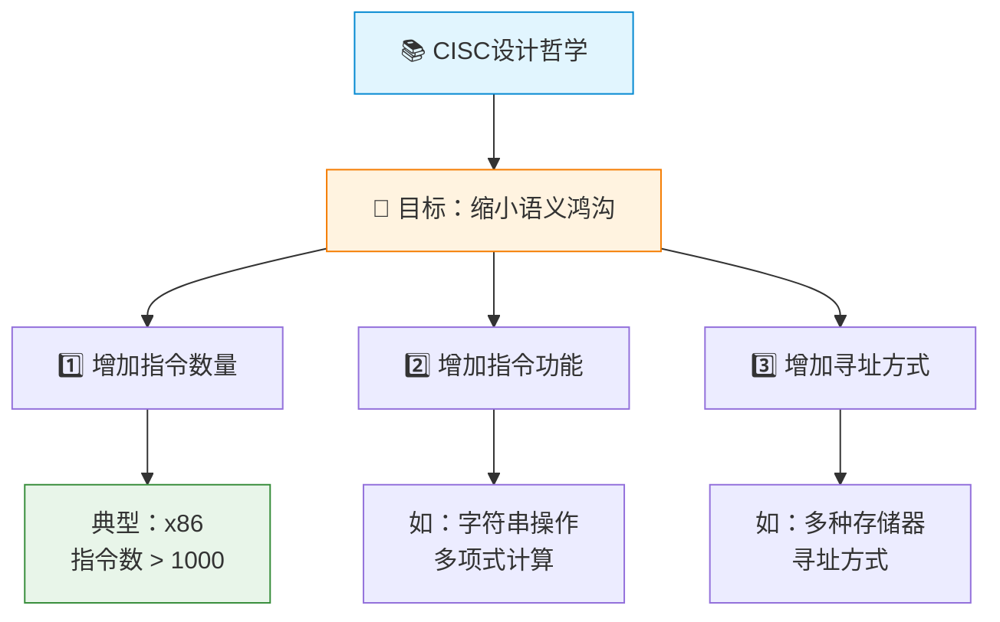
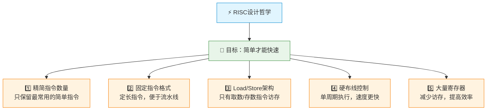
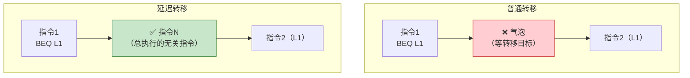
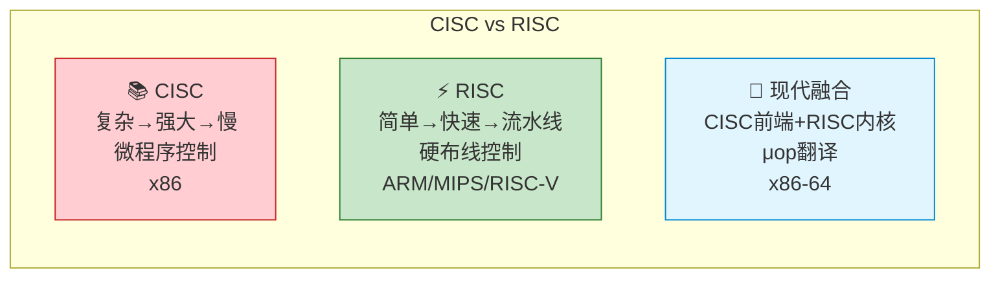

# CISC与RISC

> 如果把指令系统比作沟通语言，CISC像是一本收录了所有词汇的百科全书——事无巨细，应有尽有；RISC则像是一本精选高频词的口袋词典——薄而精，查得快。两种哲学各有来由，但现代CPU的走向已经给出答案：精简，才能飞驰。

---

## 一、CISC（复杂指令集计算机）

### 1. CISC 的设计思路

CISC（Complex Instruction Set Computer）追求**强化的指令功能**，通过设置功能复杂的指令来缩小"语义鸿沟"——让硬件更接近高级语言的语义。



### 2. CISC 的主要特点

| 特点 | 说明 |
|:---:|:---:|
| 指令数量多 | 通常超过200条，x86有上千条 |
| 指令长度可变 | 1~15字节不等 |
| 寻址方式多样 | 多达十几种寻址方式 |
| 指令执行时间不一 | 简单指令1个周期，复杂指令可能数十个周期 |
| 微程序控制 | 多数指令由微程序实现 |
| 通用寄存器少 | 强调存储器-存储器操作 |

### 3. CISC 的问题

::: warning CISC 的困境
1. **80/20规律**：约20%的指令占据了80%的运行时间，大量复杂指令很少被使用
2. **指令长度不一**：难以实现流水线，取指和译码复杂
3. **微程序开销**：复杂的微程序增加了控制存储器的容量和访问时间
4. **VLSI实现的困难**：复杂控制逻辑占用大量芯片面积，不利于提高主频
5. **编译优化困难**：指令太多，编译器难以选择最优指令序列
:::

---

## 二、RISC（精简指令集计算机）

### 1. RISC 的设计思路

RISC（Reduced Instruction Set Computer）的核心哲学：**简单才能快速**。



### 2. RISC 的主要特点

| 特点 | 说明 |
|:---:|:---:|
| 指令数量少 | 通常少于100条 |
| 指令长度固定 | 便于流水线和取指 |
| 寻址方式少 | 通常只有立即、寄存器、偏移等 |
| 只有Load/Store访存 | 运算指令只在寄存器间操作 |
| 硬布线控制 | 绝大多数指令单周期完成 |
| 通用寄存器多 | 通常32个以上 |
| 重视编译优化 | 依赖编译器进行指令调度 |

### 3. RISC 的关键技术

#### (1) 重叠寄存器窗口

为减少函数调用时的寄存器保存/恢复开销，RISC采用**重叠寄存器窗口**技术：

```
窗口结构（每个窗口32个寄存器）：

     全局寄存器（所有过程共享）
    ┌─────────────────────────┐
    │      R0 ~ R9            │
    └─────────────────────────┘

     过程A窗口          过程B窗口
    ┌──────────┐      ┌──────────┐
    │ R10~R17  │      │ R10~R17  │
    │ (输入)    │══════│ (输入)    │  ← 重叠！
    │ R18~R25  │      │ R18~R25  │
    │ (本地)    │      │ (本地)    │
    │ R26~R31  │══════│ R26~R31  │  ← 重叠！
    │ (输出)    │      │ (输出)    │
    └──────────┘      └──────────┘
```

- 过程A的输出区 = 过程B的输入区（重叠）
- 函数调用时参数通过重叠区直接传递，无需保存/恢复

#### (2) 延迟转移

为解决控制冒险，RISC采用**延迟转移**技术：



---

## 三、CISC 与 RISC 对比

| 特性 | CISC | RISC |
|:---:|:---:|:---:|
| 📋 指令数量 | 多（>200） | 少（<100） |
| 📏 指令长度 | 可变 | 固定 |
| 🎯 寻址方式 | 多 | 少 |
| ⏱️ 指令执行时间 | 差异大 | 大多1个周期 |
| 🔧 控制方式 | 微程序 | 硬布线 |
| 📂 寄存器数量 | 少 | 多 |
| 💾 访存方式 | 多种指令可访存 | 仅Load/Store |
| 🏗️ 流水线 | 难以实现 | 易于实现 |
| 📝 编译优化 | 困难 | 重视 |
| 🖥️ 典型代表 | x86 | ARM、MIPS、RISC-V |

::: tip 现代趋势：融合
现代CPU已不再是纯粹的CISC或RISC：
- **x86（CISC）**：内部将复杂指令拆分为微操作（μop），类似RISC执行
- **ARM（RISC）**：增加了DSP指令、NEON向量指令等，部分CISC特征
- **RISC-V**：精简基础指令集 + 可扩展的模块化设计
:::

---

## 四、指令流水线与 RISC

### 1. 为什么 RISC 适合流水线？

RISC 的设计天然适合流水线执行：

| RISC特征 | 对流水线的支持 |
|:---:|:---:|
| 指令定长 | 每周期取一条指令，取指简单 |
| 指令格式规整 | 译码简单，一个周期完成 |
| 单周期执行 | 每级流水线时间一致 |
| Load/Store架构 | 减少数据冒险 |
| 硬布线控制 | 控制信号生成快 |

### 2. 经典五级流水线

```
指令1:  取指(IF) → 译码(ID) → 执行(EX) → 访存(MEM) → 写回(WB)
指令2:           → 取指(IF) → 译码(ID) → 执行(EX)  → 访存(MEM) → 写回(WB)
指令3:                     → 取指(IF) → 译码(ID)   → 执行(EX)  → 访存(MEM) → 写回(WB)
```

| 流水级 | 功能 | 所需硬件 |
|:---:|:---:|:---:|
| IF（取指） | 从指令存储器取指令 | PC、指令存储器 |
| ID（译码） | 指令译码、读寄存器 | 译码器、寄存器堆 |
| EX（执行） | ALU运算、地址计算 | ALU |
| MEM（访存） | 存取数据 | 数据存储器 |
| WB（写回） | 写结果到寄存器 | 寄存器堆 |

### 3. 流水线的性能

理想情况下，N条指令执行时间：

$$
T_{pipeline} = (k + N - 1) \times \Delta t
$$

其中 k 为流水级数，Δt 为一个流水级的时钟周期。

- **加速比**：$S = \frac{T_{sequential}}{T_{pipeline}} = \frac{N \times k \times \Delta t}{(k+N-1) \times \Delta t}$

当 N → ∞ 时，加速比 → k（流水级数）

---

## 五、总结



---

::: tip 面试速查
1. **CISC**：指令多、格式变长、微程序控制、难以流水线、代表x86
2. **RISC**：指令少、格式定长、硬布线控制、适合流水线、代表ARM/MIPS/RISC-V
3. **RISC五要素**：精简指令、定长格式、Load/Store、硬布线、多寄存器
4. **80/20规律**：20%的指令占80%的运行时间，是RISC的理论依据
5. **重叠寄存器窗口**：RISC减少函数调用开销的技术
6. **延迟转移**：RISC解决控制冒险的技术
7. **现代趋势**：CISC前端翻译μop + RISC内核执行
:::

::: info 原著参考
- 唐朔飞《计算机组成原理》4.4节 CISC和RISC
- 白中英《计算机组成原理》5.4节 CISC和RISC
- Patterson & Hennessy《Computer Organization and Design》Chapter 1.3-1.4
:::
