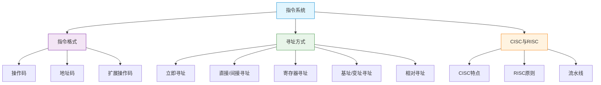

# 指令系统

> 如果把CPU比作一位厨师，那么指令就是菜谱上的操作步骤——每条指令告诉厨师要做什么菜（操作码）、用什么食材（操作数）、从哪里取食材（寻址方式）。好的菜谱体系既要丰富（CISC），又要高效（RISC），在表达力与执行效率之间寻找最佳平衡。

## 本章概述

指令系统是计算机软件和硬件的界面，是程序员所能看到的机器的主要属性。本章从指令的基本格式出发，深入讲解各种寻址方式的工作原理，并对比分析 CISC 和 RISC 两种指令体系的设计哲学。

## 目录

- [指令格式](01_指令格式.md) —— 操作码、地址码、扩展操作码、指令设计原则
- [寻址方式](02_寻址方式.md) —— 立即/直接/间接/寄存器/基址/变址/相对寻址
- [CISC与RISC](03_CISC与RISC.md) —— 复杂指令集与精简指令集的对比

## 核心知识图谱

## 学习建议

1. **理解指令格式**：操作码和地址码的位数分配是扩展操作码技术的基础
2. **掌握寻址方式**：这是考试高频考点，要能画出每种寻址方式的数据通路
3. **CISC vs RISC**：理解两种设计哲学的本质差异，以及RISC如何支持流水线
