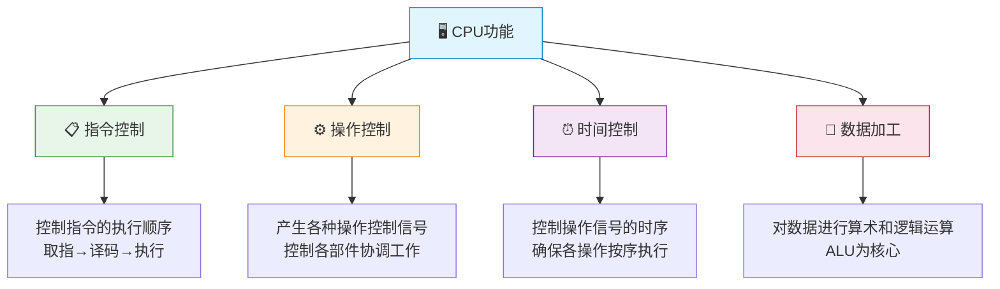
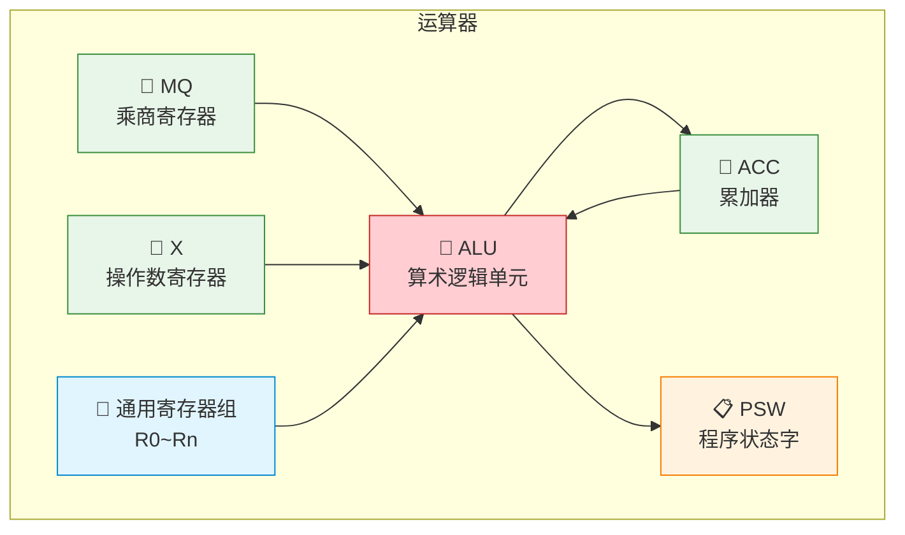
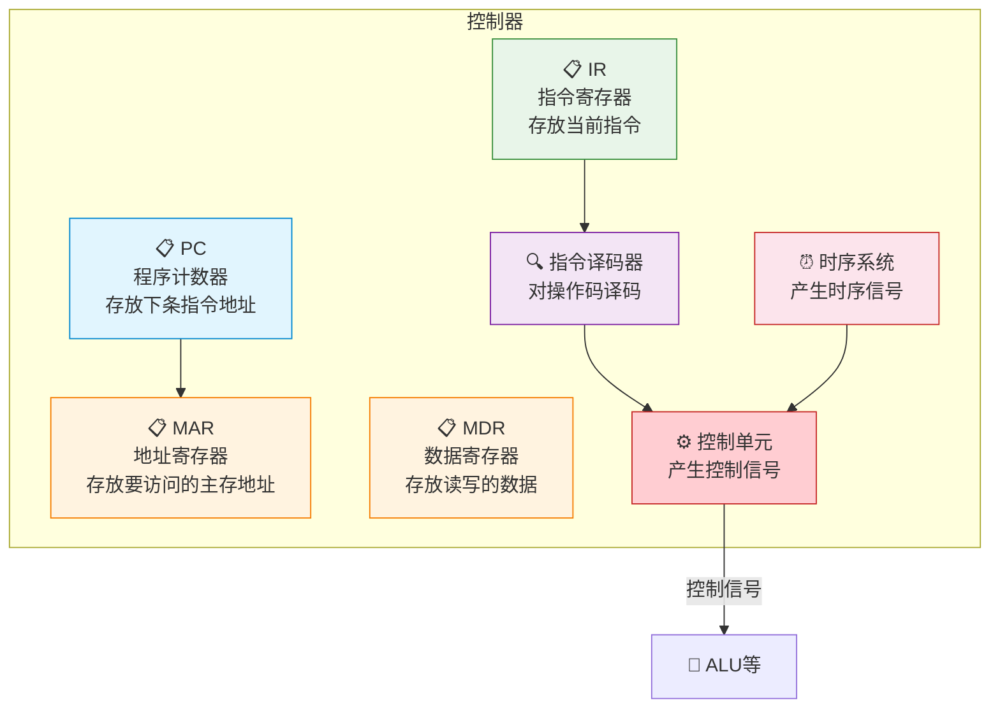
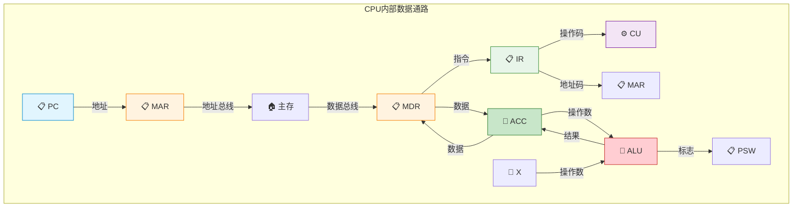
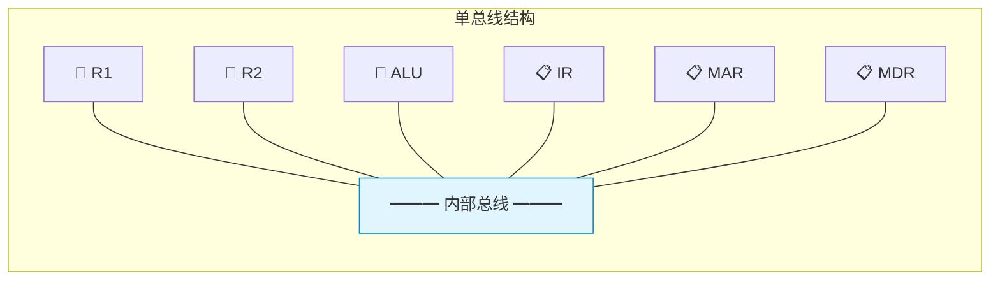
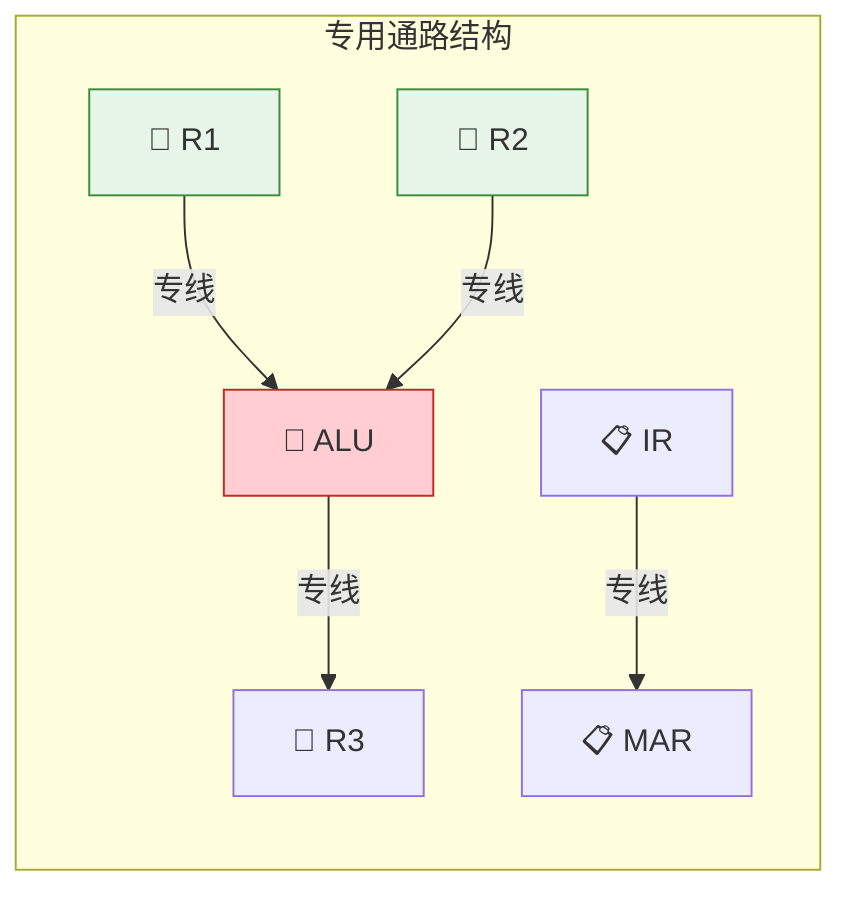

# CPU的基本结构

> 如果把CPU比作一个精密运作的厨房，运算器就是灶台——负责煎炒烹炸（算术逻辑运算）；控制器就是厨师长——指挥谁先炒、谁后蒸、何时出锅（时序控制）；而寄存器就是厨台上的调料盒——最常用的东西永远在手边，伸手即取。

---

## 一、CPU 的功能

CPU 的核心功能可以归纳为四大类：



| 功能 | 说明 | 实现部件 |
|:---:|:---:|:---:|
| 指令控制 | 控制程序的执行顺序 | PC、IR |
| 操作控制 | 产生控制信号协调各部件 | 控制器 |
| 时间控制 | 控制操作时序 | 时序发生器 |
| 数据加工 | 算术逻辑运算 | ALU |

---

## 二、运算器结构

运算器是CPU中负责数据加工的部件，核心是ALU（算术逻辑单元）。

### 1. 运算器的组成



### 2. 各寄存器功能

| 寄存器 | 全称 | 功能 |
|:---:|:---:|:---:|
| ACC | 累加器 | 存放运算结果或源操作数 |
| MQ | 乘商寄存器 | 乘除运算时存放乘数/商 |
| X | 操作数寄存器 | 存放另一个操作数 |
| PSW | 程序状态字 | 存放状态标志（OF/SF/ZF/CF） |
| GPR | 通用寄存器 | 多用途，存放操作数和地址 |

### 3. 运算器的工作过程

#### 加法运算：$(ACC) + (X) \rightarrow ACC$

```
操作数1在ACC中 → ALU → 结果存回ACC
操作数2在X中  ↗
```

#### 乘法运算：$(ACC) \times (MQ) \rightarrow ACC // MQ$

```
被乘数在X中   → ALU → 高位积存ACC
乘数在MQ中    ↗       低位积存MQ
```

### 4. PSW 标志位

| 标志位 | 全称 | 含义 |
|:---:|:---:|:---:|
| OF | Overflow Flag | 溢出标志 |
| SF | Sign Flag | 符号标志 |
| ZF | Zero Flag | 零标志 |
| CF | Carry Flag | 进位/借位标志 |

---

## 三、控制器结构

控制器是CPU的指挥中心，负责产生控制信号，协调各部件工作。

### 1. 控制器的组成



### 2. 各寄存器功能

| 寄存器 | 全称 | 功能 |
|:---:|:---:|:---:|
| PC | 程序计数器 | 存放下一条要执行的指令地址，自动+1 |
| IR | 指令寄存器 | 存放当前正在执行的指令 |
| MAR | 存储器地址寄存器 | 存放要访问的主存单元地址 |
| MDR | 存储器数据寄存器 | 存放向主存写入/从主存读出的数据 |

::: important PC 与 IR 的关系
- **PC**：指出"从哪里取指令"→ 输出 → MAR → 访问主存
- **IR**：保存"取到的指令是什么"→ 操作码 → 译码 → 产生控制信号
- 取指后 PC 自动 +1（或 +指令长度），指向下一条指令
:::

### 3. 控制器的两种实现方式

| 方式 | 原理 | 速度 | 灵活性 | 典型应用 |
|:---:|:---:|:---:|:---:|:---:|
| 硬布线控制 | 组合逻辑电路直接产生控制信号 | 快 | 差（修改需改电路） | RISC |
| 微程序控制 | 存储逻辑，微指令产生控制信号 | 慢 | 好（修改微程序即可） | CISC |

---

## 四、CPU 内部数据通路

### 1. 数据通路的基本结构

数据通路是CPU内部数据流动的路径，包括寄存器之间的数据传送和ALU运算。



### 2. 数据通路的两种结构

#### (1) CPU内部总线方式



| 特点 | 说明 |
|:---:|:---:|
| 优点 | 结构简单，控制容易 |
| 缺点 | 同一时刻只允许一对部件传送数据，效率低 |
| 冲突 | 数据传送需要分时使用总线 |

#### (2) 专用数据通路方式



| 特点 | 说明 |
|:---:|:---:|
| 优点 | 多个数据传送可并行，效率高 |
| 缺点 | 硬件复杂，成本高 |

::: tip 面试常问
**单总线结构中ALU为什么不能直接连总线？**
ALU需要两个输入端同时提供操作数，但单总线同一时刻只能传送一个数据。因此需要设置暂存器：
1. 第一个操作数先送入暂存器Y
2. 第二个操作数送入ALU另一端
3. ALU运算后结果通过暂存器Z送总线
:::

### 3. 单总线数据通路的操作序列

以 `ADD R1, R2`（(R1)+(R2)→R2）为例：

| 步骤 | 操作 | 说明 |
|:---:|:---:|:---:|
| 1 | PC → MAR | 将指令地址送MAR |
| 2 | M(MAR) → MDR | 从主存读指令到MDR |
| 3 | MDR → IR | 指令送IR |
| 4 | PC + 1 → PC | PC自动加1 |
| 5 | R1 → Y | 第一个操作数送暂存器Y |
| 6 | R2 + Y → Z | ALU执行加法，结果送暂存器Z |
| 7 | Z → R2 | 结果送回R2 |

---

## 五、CPU 寄存器总结

| 寄存器 | 位置 | 可见性 | 功能 |
|:---:|:---:|:---:|:---:|
| PC | 控制器 | 用户可见 | 下条指令地址 |
| IR | 控制器 | 用户不可见 | 当前指令 |
| MAR | 控制器 | 用户不可见 | 主存地址 |
| MDR | 控制器 | 用户不可见 | 主存数据 |
| ACC | 运算器 | 用户可见 | 累加器 |
| MQ | 运算器 | 用户不可见 | 乘商寄存器 |
| X | 运算器 | 用户不可见 | 操作数寄存器 |
| PSW | 运算器 | 用户可见 | 程序状态字 |
| GPR | 运算器 | 用户可见 | 通用寄存器 |

::: important 用户可见 vs 用户不可见
- **用户可见**：汇编程序员可以使用的寄存器（PC、ACC、PSW、通用寄存器）
- **用户不可见**：对汇编程序员透明的寄存器（IR、MAR、MDR、MQ、X）
- 注意：MAR和MDR对汇编程序员不可见，但对系统程序员（如OS开发者）可能间接可见
:::

---

::: tip 面试速查
1. **CPU四大功能**：指令控制、操作控制、时间控制、数据加工
2. **运算器**：ALU为核心，配合ACC/MQ/X/PSW/通用寄存器
3. **控制器**：PC/IR/MAR/MDR + 译码器 + 时序系统 + 控制单元
4. **PC**：存下条指令地址，取指后自动+1
5. **IR**：存当前指令，操作码→译码→控制信号
6. **MAR/MDR**：CPU与主存的接口，MAR存地址，MDR存数据
7. **单总线 vs 专用通路**：简单慢 vs 复杂快
8. **用户可见寄存器**：PC、ACC、PSW、通用寄存器
:::

::: info 原著参考
- 唐朔飞《计算机组成原理》5.1节 CPU的功能和组成
- 白中英《计算机组成原理》6.1节 中央处理器的功能和组成
- Patterson & Hennessy《Computer Organization and Design》Chapter 4.1-4.3
:::
