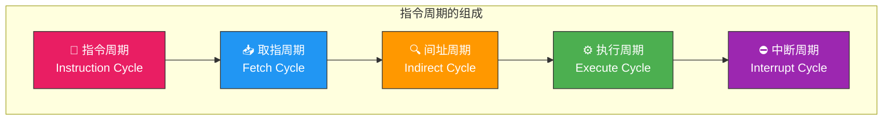
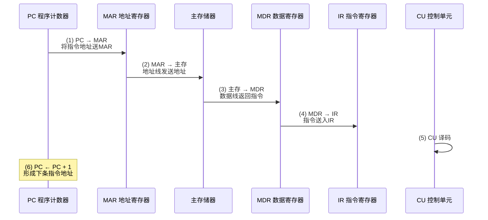
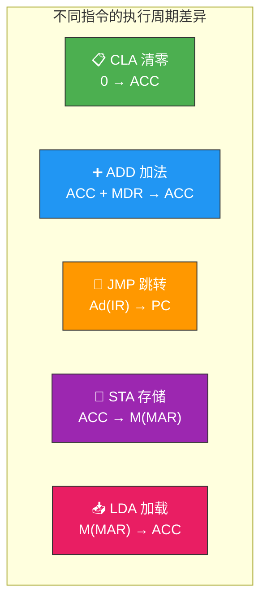
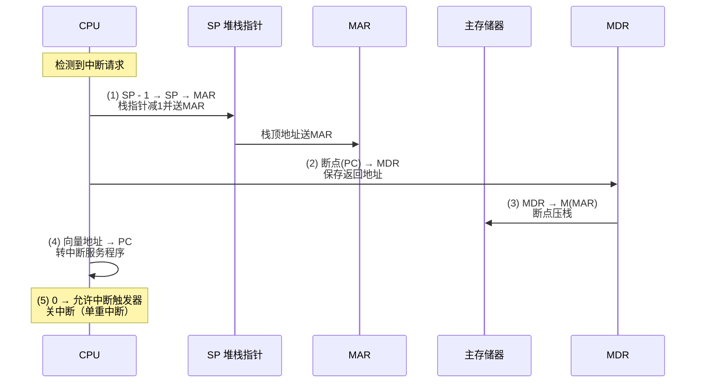
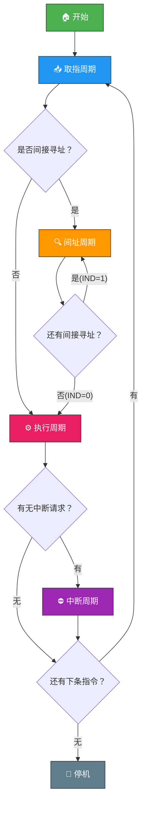
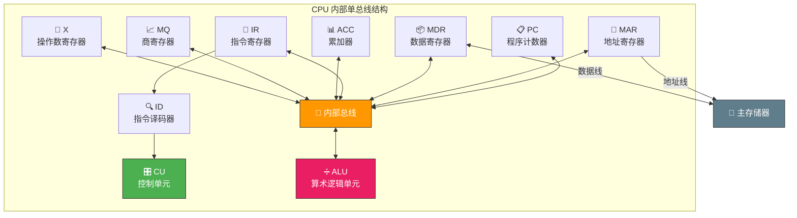
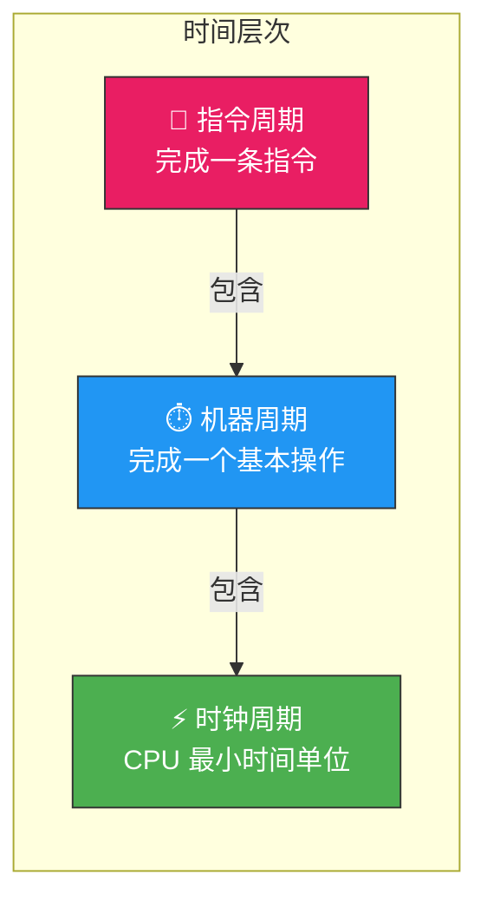

# 指令执行过程

> 如果把 CPU 比作一个精密的时钟，指令就是驱动齿轮转动的发条——每一条指令都经历取指、译码、执行的精密流程，亿万次循环往复，才让计算机"活"了起来。

## 一、指令周期的基本概念

**指令周期**是指 CPU 从主存取出并执行一条指令所需的全部时间。不同指令的指令周期可能不同——一条简单的加法指令和一条复杂的乘法指令所需时间显然不同。



| 周期 | 功能 | 是否必须 |
|------|------|---------|
| **取指周期** | 从主存取出指令 | 必须有 |
| **间址周期** | 取操作数有效地址 | 仅间接寻址时 |
| **执行周期** | 执行指令操作 | 必须有 |
| **中断周期** | 处理中断请求 | 仅发生中断时 |

::: important 每条指令至少经历取指和执行两个周期，间址周期和中断周期是可选的。
:::

---

## 二、取指周期

取指周期的任务是从主存中取出将要执行的指令，并送入指令寄存器 IR。

### 2.1 取指周期的操作流程



### 2.2 取指周期的微操作序列

| 步骤 | 微操作 | 说明 |
|------|--------|------|
| 1 | `PC → MAR` | 将程序计数器内容送地址寄存器 |
| 2 | `1 → R` | 发读命令 |
| 3 | `M(MAR) → MDR` | 主存中由 MAR 指向单元的内容读入 MDR |
| 4 | `MDR → IR` | 将读出的指令送入指令寄存器 |
| 5 | `OP(IR) → CU` | 指令操作码送控制单元译码 |
| 6 | `PC + 1 → PC` | 形成下一条指令地址 |

::: tip PC + 1 的含义
`PC + 1` 中的 1 是指一条指令占用的存储字数。若一条指令占 1 个存储字，则 PC + 1；若占 4 个存储字，则 PC + 4。
:::

---

## 三、间址周期

当指令采用**间接寻址**时，取指之后需要进入间址周期，根据指令中的形式地址找到有效地址。

### 3.1 间址周期的操作流程


### 3.2 间址周期的微操作序列

| 步骤 | 微操作 | 说明 |
|------|--------|------|
| 1 | `Ad(IR) → MAR` | 将指令中的地址码送 MAR |
| 2 | `1 → R` | 发读命令 |
| 3 | `M(MAR) → MDR` | 从主存读出有效地址 |

::: warning 多次间址
若间接寻址标志位 `IND = 1`，则需重复间址周期；当 `IND = 0` 时，MDR 中的内容才是真正的有效地址，才进入执行周期。
:::

---

## 四、执行周期

执行周期的任务是完成指令规定的操作。不同指令的执行周期微操作序列完全不同。

### 4.1 执行周期的示例

**非访存指令（CLA——清零累加器）：**

| 步骤 | 微操作 | 说明 |
|------|--------|------|
| 1 | `0 → ACC` | 将累加器清零 |

**访存指令（ADD @X——加法指令，间接寻址）：**

| 步骤 | 微操作 | 说明 |
|------|--------|------|
| 1 | `Ad(IR) → MAR` | 地址码送 MAR |
| 2 | `1 → R` | 发读命令 |
| 3 | `M(MAR) → MDR` | 取出操作数 |
| 4 | `ACC + MDR → ACC` | 累加器与操作数相加 |

**转移指令（JMP X——无条件跳转）：**

| 步骤 | 微操作 | 说明 |
|------|--------|------|
| 1 | `Ad(IR) → PC` | 将转移地址送 PC |



---

## 五、中断周期

当 CPU 响应中断请求时，在执行周期结束后进入中断周期，完成保存断点、转中断服务程序等操作。

### 5.1 中断周期的操作流程



### 5.2 中断周期的微操作序列

| 步骤 | 微操作 | 说明 |
|------|--------|------|
| 1 | `SP - 1 → SP, SP → MAR` | 堆栈指针减1并送 MAR |
| 2 | `PC → MDR` | 将断点（返回地址）送 MDR |
| 3 | `1 → W` | 发写命令 |
| 4 | `MDR → M(MAR)` | 将断点压入栈保存 |
| 5 | `向量地址 → PC` | 将中断服务程序入口送 PC |
| 6 | `0 → EINT` | 关中断（单重中断时） |

::: important 断点保存方式
保存断点有三种方式：**压栈**（用 SP 指向的栈区保存）、**存入特定地址**（如 0 号地址）、**存入硬件寄存器**。其中压栈方式最灵活，支持中断嵌套。
:::

---

## 六、指令执行的完整流程

将四个周期串联，就得到了指令执行的完整流程：



---

## 七、CPU 内部数据通路

### 7.1 CPU 内部单总线结构



### 7.2 CPU 内部通信方式

| 通信方式 | 特点 | 优缺点 |
|---------|------|--------|
| **单总线** | 所有部件共享一条总线 | 结构简单，但同一时刻只允许一对部件通信，效率低 |
| **双总线** | ALU 两端各接一条总线 | 可同时提供两个操作数，效率较高 |
| **专用数据通路** | 部件间设置专用连接线 | 并行性好，速度快，但硬件成本高 |

::: warning 单总线的数据通路冲突
在单总线结构中，ALU 的两个输入端不能同时从总线获取数据。因此，一个操作数需要先送入暂存寄存器（如 X 寄存器），另一个操作数再从总线送入 ALU。
:::

### 7.3 寄存器之间的数据传送

以 `PC → MAR` 为例，单总线结构下的微操作序列：

| 步骤 | 微操作 | 说明 |
|------|--------|------|
| 1 | `PCout, MARin` | PC 内容输出到总线，MAR 从总线读入 |
| 2 | `PC + 1 → PC` | PC 自增（可由专用增量器完成，不占用总线） |

---

## 八、指令执行过程的微操作序列综合

以一条完整的**间接寻址加法指令** `ADD @X` 为例，给出完整的微操作序列：

### 8.1 取指周期

| 步骤 | 微操作 | 控制信号 |
|------|--------|---------|
| 1 | `PC → MAR` | PCout, MARin |
| 2 | `1 → R` | Read |
| 3 | `M(MAR) → MDR` | MDRinE |
| 4 | `MDR → IR` | MDRout, IRin |
| 5 | `PC + 1 → PC` | PC+1 |
| 6 | `OP(IR) → CU` | — |

### 8.2 间址周期

| 步骤 | 微操作 | 控制信号 |
|------|--------|---------|
| 1 | `Ad(IR) → MAR` | IRout, MARin |
| 2 | `1 → R` | Read |
| 3 | `M(MAR) → MDR` | MDRinE |

### 8.3 执行周期

| 步骤 | 微操作 | 控制信号 |
|------|--------|---------|
| 1 | `MDR → X` | MDRout, Xin |
| 2 | `ACC + X → ACC` | ACCout, ALUadd, ACCin |

```c
// 间接寻址加法指令的执行伪代码
void execute_ADD_indirect() {
    // 取指周期
    MAR = PC;           // PC → MAR
    MDR = Memory[MAR];  // M(MAR) → MDR
    IR = MDR;           // MDR → IR
    PC = PC + 1;        // 形成下条指令地址

    // 间址周期
    MAR = Ad(IR);       // Ad(IR) → MAR
    MDR = Memory[MAR];  // 取出有效地址

    // 执行周期
    X = MDR;            // 操作数送X
    ACC = ACC + X;      // 执行加法
}
```

---

## 九、机器周期与时钟周期

### 9.1 时间关系的层次



### 9.2 三者的关系

| 概念 | 定义 | 关系 |
|------|------|------|
| **时钟周期（节拍）** | CPU 主频的倒数，是最小时间单位 | 基本单位 |
| **机器周期** | 完成一个基本操作（如取指）的时间 | 通常 = 一次存储器访问时间 |
| **指令周期** | 完成一条指令的时间 | = 若干个机器周期 |

::: important 机器周期的确定
机器周期通常以**存储器的读写周期**为基准。因为访存操作是 CPU 最频繁的基本操作，一次存储器读/写的时间就定义为一个机器周期。一个机器周期包含若干时钟周期。
:::

---

## 十、练习题

### 题目 1

**题目：** 什么是指令周期、机器周期和时钟周期？三者之间有何关系？

**解答：**

- **指令周期**：CPU 从主存取出并执行一条指令的全部时间
- **机器周期**：完成一个基本操作（如取指、间址等）的时间，通常以存储器访问周期为基准
- **时钟周期**：CPU 主频的倒数，是最小的时间单位

关系：一个指令周期包含若干机器周期，一个机器周期包含若干时钟周期。指令周期 ≥ 机器周期 ≥ 时钟周期。

---

### 题目 2

**题目：** 写出指令 `STA X`（将累加器内容存入直接地址 X）在取指周期和执行周期的微操作序列。

**解答：**

**取指周期：**

| 步骤 | 微操作 |
|------|--------|
| 1 | PC → MAR |
| 2 | 1 → R |
| 3 | M(MAR) → MDR |
| 4 | MDR → IR |
| 5 | OP(IR) → CU |
| 6 | PC + 1 → PC |

**执行周期（直接寻址）：**

| 步骤 | 微操作 |
|------|--------|
| 1 | Ad(IR) → MAR |
| 2 | 1 → W |
| 3 | ACC → MDR |
| 4 | MDR → M(MAR) |

---

### 题目 3

**题目：** 在单总线结构的 CPU 中，为什么 ALU 的两个输入不能同时从总线获取操作数？如何解决？

**解答：**

单总线结构中，同一时刻只能有一个部件向总线发送数据。ALU 需要两个操作数，但总线一次只能传送一个。

**解决方案：**
1. 先将一个操作数送入暂存寄存器 X
2. 再将另一个操作数送入 ALU 的另一个输入端
3. ALU 运算后结果通过总线送入目标寄存器

例如 `ACC + MDR → ACC` 的微操作序列：
1. `MDR → X`（先将 MDR 内容暂存到 X）
2. `ACC + X → ACC`（ACC 直接送 ALU，X 也送 ALU，运算结果回送 ACC）

---

### 题目 4

**题目：** 中断周期中保存断点有哪三种方式？各有什么特点？

**解答：**

| 方式 | 操作 | 特点 |
|------|------|------|
| **压栈** | SP-1→SP, PC→M(SP) | 最灵活，支持中断嵌套 |
| **存入特定地址** | PC→M(0) | 简单，但不支持嵌套 |
| **存入硬件寄存器** | PC→R | 速度最快，但寄存器数量有限 |

---

::: tip 面试速查
1. **指令周期**包含取指周期、间址周期（可选）、执行周期、中断周期（可选）
2. **取指周期**是每条指令必经的，核心操作：PC→MAR→主存→MDR→IR，同时 PC+1
3. **间址周期**仅在间接寻址时存在，功能是取出操作数的有效地址
4. **执行周期**因指令而异：CLA 无访存，ADD 需访存取操作数，JMP 直接修改 PC
5. **中断周期**保存断点→转中断服务程序，压栈方式最通用
6. **单总线结构**同一时刻只能一对部件通信，ALU 需借助暂存寄存器
7. **时钟周期 < 机器周期 < 指令周期**，机器周期以存储器访问时间为基准
:::

---

::: info 原著参考
- 唐朔飞《计算机组成原理》——第五章 中央处理器
- 白中英《计算机组成原理》——第六章 中央处理器
- CSAPP 第四章《处理器体系结构》——指令执行流水线
:::
