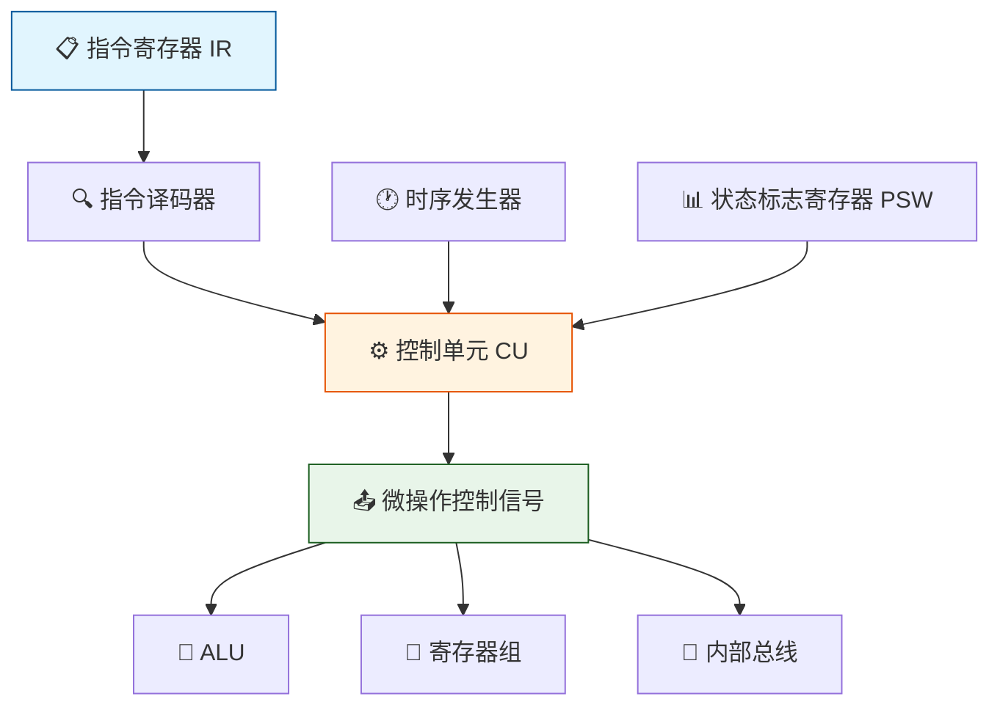
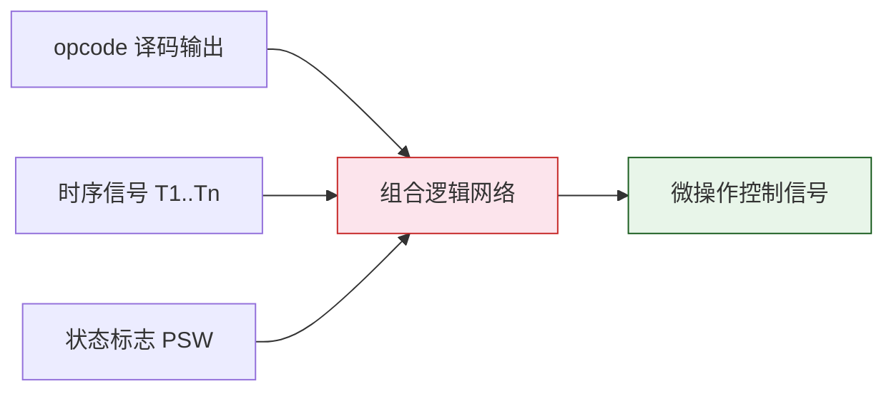
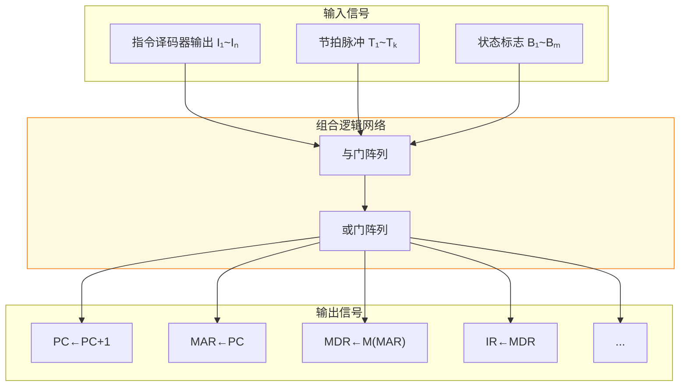
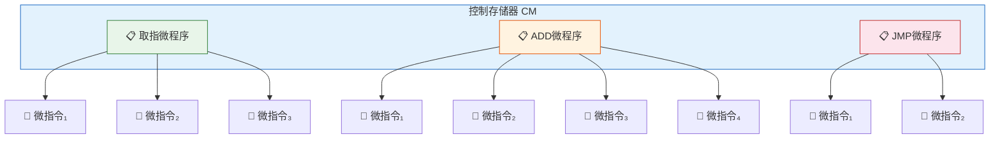
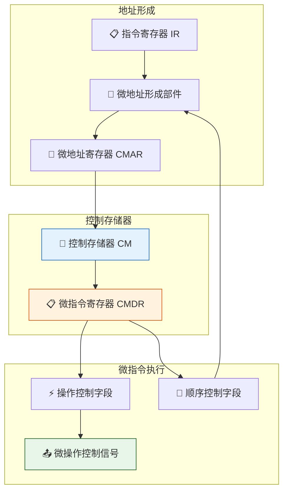
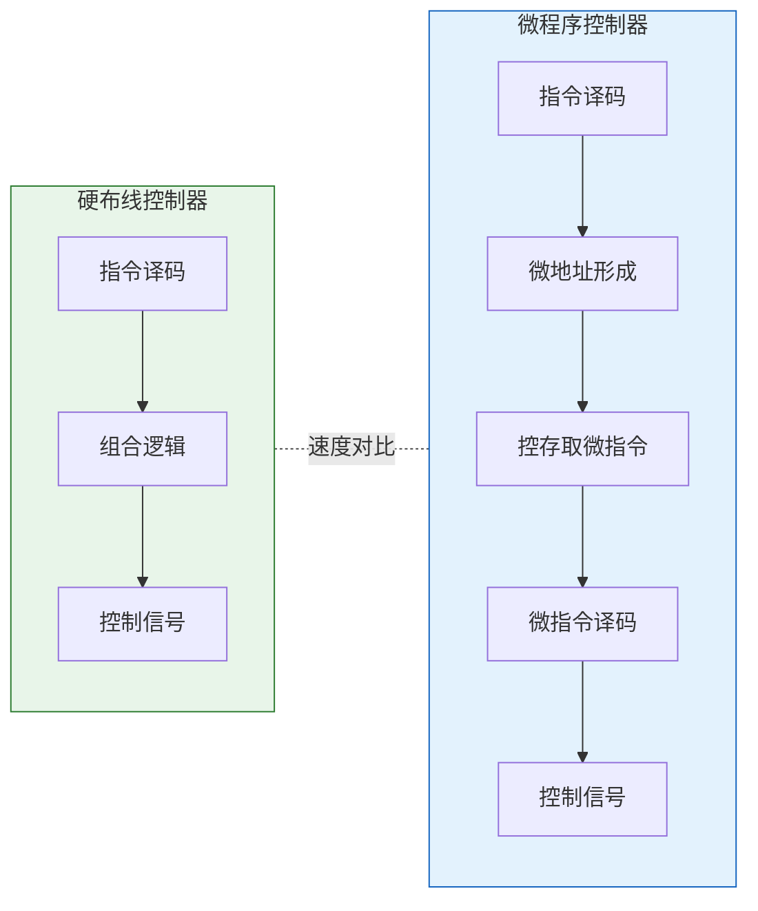

> 控制器是 CPU 的"大脑"，如同交响乐团的指挥——它不亲自演奏乐器，却决定每一个音符何时奏响、以何种力度奏响。硬布线控制器如同机械钟表，齿轮咬合精确但难以调整；微程序控制器如同可编程的乐谱，灵活易改但演奏稍慢。

## 一、控制器概述

控制器的基本功能是根据指令操作码和时序信号，产生各种操作控制信号，从而正确地建立数据通路，完成取指令和执行指令的控制。



控制器的核心任务：

| 任务 | 说明 |
|------|------|
| 取指令 | 根据 PC 中的地址从主存取出指令，送入 IR |
| 分析指令 | 对 IR 中的指令进行译码，确定操作类型和操作数地址 |
| 执行指令 | 根据译码结果产生控制信号，完成指令规定的操作 |
| 控制程序执行顺序 | 修改 PC 的值，实现程序的顺序执行和转移 |

---

## 二、硬布线控制器

### 2.1 设计原理

硬布线控制器（组合逻辑控制器）是纯硬件实现的控制器，其控制信号由逻辑门电路直接产生。



核心思想：**每一个微操作控制信号都是指令操作码、时序信号和状态标志的逻辑函数**。

$$C_i = f(I_m, T_n, B_k)$$

其中 $C_i$ 是第 $i$ 个微操作控制信号，$I_m$ 是指令译码输出，$T_n$ 是时序信号，$B_k$ 是状态标志。

### 2.2 设计步骤

1. **列出所有微操作**：分析指令系统，列出每条指令在各个时钟周期需要的微操作
2. **写出微操作命令的逻辑表达式**：对每个微操作，综合所有需要该微操作的指令及时序
3. **化简逻辑表达式**：使用卡诺图或代数化简法
4. **用逻辑门电路实现**：根据化简后的表达式画出逻辑电路

::: important 硬布线设计的关键
硬布线设计的关键在于：对每个微操作信号，找出所有需要该信号的指令和时序，然后"或"起来。
:::

### 2.3 实现方式



### 2.4 硬布线控制器的特点

| 特点 | 说明 |
|------|------|
| ✅ 速度快 | 控制信号由硬件直接产生，延迟仅为门电路延迟 |
| ✅ 适合 RISC | 指令系统简单时，硬布线效率高 |
| ❌ 不灵活 | 修改或扩展指令系统需重新设计电路 |
| ❌ 设计复杂 | 指令系统庞大时，逻辑表达式极其复杂 |
| ❌ 不规整 | 缺乏规律性，难以调试和维护 |

---

## 三、微程序控制器

### 3.1 基本思想

微程序控制器采用**存储逻辑**的思想：将每条机器指令编写成一个微程序，存入控制存储器中。执行机器指令时，逐条从控存取出微指令，由微指令产生微操作控制信号。



### 3.2 核心概念层次


| 概念 | 说明 | 对应关系 |
|------|------|----------|
| 微命令 | 控制部件产生的最基本控制信号 | 构成微指令 |
| 微操作 | 微命令控制下完成的基本操作 | 微命令→微操作 |
| 微指令 | 若干微命令的集合 + 顺序控制字段 | 构成微程序 |
| 微程序 | 若干微指令的有序集合 | 对应一条机器指令 |
| 控制存储器 | 存放全部微程序的 ROM | 微程序控制器核心 |

### 3.3 微程序控制器结构



### 3.4 工作流程

1. **取指微程序**：执行取指令操作，将指令从主存取入 IR
2. **微地址形成**：根据 IR 中的操作码，形成对应微程序的入口地址
3. **执行微程序**：从控存依次取出微指令并执行
4. **返回取指微程序**：一条指令的微程序执行完后，回到取指微程序

::: info 关键区别
- **微指令** vs **机器指令**：微指令在 CPU 内部执行，机器指令由程序员编写
- **控制存储器** vs **主存储器**：控存存放微程序（ROM），主存存放程序和数据
- **微地址** vs **主存地址**：微地址指向控存，主存地址指向主存
:::

---

## 四、微指令的编码方式

### 4.1 直接编码方式

直接编码（直接控制）方式：微指令操作控制字段中每一位代表一个微命令。

```
微指令操作控制字段：
┌───┬───┬───┬───┬───┬───┬───┬───┐
│ 1 │ 0 │ 1 │ 0 │ 0 │ 1 │ 0 │ 0 │
└───┴───┴───┴───┴───┴───┴───┴───┘
  ↓       ↓           ↓
 C1      C3          C6  （1=有效，0=无效）
```

| 优点 | 缺点 |
|------|------|
| 简单直观 | 微指令字过长 |
| 并行控制能力强 | 控存利用率低 |
| 速度快 | 微命令多时不实用 |

### 4.2 字段直接编码方式

将微指令操作控制字段分成若干段，每段采用**互斥性微命令**组合，段内编码译码产生微命令。

```
微指令操作控制字段：
┌──────────┬──────────┬──────────┐
│ 字段A     │ 字段B     │ 字段C     │
│ 2位       │ 3位       │ 2位       │
│ 4种选择   │ 8种选择   │ 4种选择   │
└──────────┴──────────┴──────────┘
   ↓ 译码       ↓ 译码       ↓ 译码
 C1~C3        C4~C10       C11~C13
```

::: important 字段编码的分组原则
1. **互斥性微命令**分在同一字段——同一时刻只可能发出其中一个
2. **相容性微命令**分在不同字段——同一时刻可能同时发出
3. 每个字段必须留一个编码表示"不操作"（如 00 表示不发任何微命令）
:::

字段编码位数计算：若某字段包含 $k$ 个互斥微命令，则需要 $\lceil \log_2(k+1) \rceil$ 位（+1 是因为需要一个空操作编码）。

### 4.3 字段间接编码方式

在字段直接编码的基础上，一个字段的含义还受另一个字段的控制。

```
字段A的译码输出 → 控制字段B的译码方式

例如：
字段A = 00 时，字段B译码产生 C1~C4
字段A = 01 时，字段B译码产生 C5~C8
```

| 编码方式 | 微指令字长 | 并行能力 | 速度 | 灵活性 |
|----------|-----------|----------|------|--------|
| 直接编码 | 最长 | 最强 | 最快 | 最低 |
| 字段直接编码 | 较短 | 较强 | 较慢 | 较高 |
| 字段间接编码 | 最短 | 较弱 | 最慢 | 最高 |

---

## 五、微指令格式设计

### 5.1 微指令的基本格式

```
┌──────────────────────────────┬──────────────────────────────┐
│       操作控制字段             │       顺序控制字段             │
│  （产生微操作控制信号）         │  （决定下一条微指令地址）       │
└──────────────────────────────┴──────────────────────────────┘
```

### 5.2 顺序控制方式

| 方式 | 说明 | 特点 |
|------|------|------|
| 断定方式 | 下地址字段直接给出后继微指令地址 | 灵活，但微指令长 |
| 计数器方式 | 类似 PC，CMAR←CMAR+1 | 简单，但不灵活 |
| 多路转移 | 根据条件选择多个转移地址之一 | 适合条件转移 |

### 5.3 微指令格式设计实例

::: warning 设计要点
设计微指令格式时，需要根据微命令的数量和相容/互斥关系，选择合适的编码方式，使微指令字长尽量短，同时保证必要的并行控制能力。
:::

**例**：某微程序控制器共有 18 个微命令，分为 5 个互斥组：
- A 组：3 个互斥微命令
- B 组：5 个互斥微命令
- C 组：4 个互斥微命令
- D 组：2 个互斥微命令
- E 组：4 个互斥微命令

采用字段直接编码，各字段位数：

| 字段 | 互斥微命令数 | 编码位数（含空操作） |
|------|-------------|-------------------|
| A | 3 | ⌈log₂4⌉ = 2 |
| B | 5 | ⌈log₂6⌉ = 3 |
| C | 4 | ⌈log₂5⌉ = 3 |
| D | 2 | ⌈log₂3⌉ = 2 |
| E | 4 | ⌈log₂5⌉ = 3 |

操作控制字段总长：2+3+3+2+3 = **13 位**（直接编码需 18 位）

---

## 六、硬布线与微程序控制器对比

| 对比项目 | 硬布线控制器 | 微程序控制器 |
|----------|-------------|-------------|
| 实现方式 | 组合逻辑电路 | 存储逻辑（微程序存于控存） |
| 速度 | 快（门电路延迟） | 慢（需访问控存） |
| 规整性 | 不规整，设计复杂 | 规整，设计规范 |
| 灵活性 | 修改困难，不灵活 | 修改方便，灵活 |
| 扩展性 | 扩展新指令需重设计 | 增加微程序即可扩展 |
| 适用场景 | RISC 处理器 | CISC 处理器 |
| 控制信号产生 | 逻辑门直接产生 | 微指令译码产生 |
| 指令系统修改 | 不易 | 容易 |



::: tip 选择原则
- 追求**速度** → 硬布线控制器
- 追求**灵活性**和**指令系统可扩展性** → 微程序控制器
- 现代 CPU 常混合使用：常用指令用硬布线，复杂指令用微程序
:::

---

## 七、练习题

### 题目 1

某微程序控制器的微指令中，操作控制字段为 16 位。若采用直接编码方式，最多可表示多少个微命令？若采用字段直接编码方式，分为 4 个字段，各字段分别包含 5、7、4、6 个互斥微命令，则操作控制字段需要多少位？

::: details 详细解答

**直接编码方式：**

每一位代表一个微命令，16 位可直接表示 **16 个微命令**。

**字段直接编码方式：**

各字段需要留一个空操作编码，因此各字段位数：

| 字段 | 互斥微命令数 | 编码位数 |
|------|-------------|---------|
| 字段1 | 5 | ⌈log₂(5+1)⌉ = ⌈log₂6⌉ = 3 |
| 字段2 | 7 | ⌈log₂(7+1)⌉ = ⌈log₂8⌉ = 3 |
| 字段3 | 4 | ⌈log₂(4+1)⌉ = ⌈log₂5⌉ = 3 |
| 字段4 | 6 | ⌈log₂(6+1)⌉ = ⌈log₂7⌉ = 3 |

操作控制字段总长：3+3+3+3 = **12 位**（可表示 5+7+4+6 = 22 个微命令）

:::

### 题目 2

简述硬布线控制器与微程序控制器的主要区别，并说明各自适用的场合。

::: details 详细解答

**主要区别：**

1. **实现原理不同**：硬布线控制器用组合逻辑电路直接产生控制信号；微程序控制器将控制信号编成微指令存入控存，通过执行微程序产生控制信号。

2. **速度不同**：硬布线控制器速度快，控制信号由逻辑门直接产生；微程序控制器速度较慢，需要从控存读取微指令再译码。

3. **灵活性不同**：硬布线控制器修改困难，需重新设计电路；微程序控制器只需修改控存中的微程序即可。

4. **规整性不同**：硬布线控制器设计不规整；微程序控制器设计规范，微指令格式统一。

**适用场合：**

- **硬布线控制器**：适用于 RISC 处理器，指令系统简单，追求高速度
- **微程序控制器**：适用于 CISC 处理器，指令系统复杂，需要灵活扩展

:::

### 题目 3

某计算机有 8 条机器指令，微程序控制器中取指微程序包含 3 条微指令，其余每条指令对应的微程序分别包含 4、5、3、6、4、5、3、4 条微指令。问控制存储器至少需要多少个存储单元？微地址寄存器至少需要多少位？

::: details 详细解答

**控制存储器容量计算：**

总微指令数 = 3 + 4 + 5 + 3 + 6 + 4 + 5 + 3 + 4 = **37 条微指令**

控制存储器至少需要 **37 个存储单元**。

**微地址寄存器位数：**

$2^n \geq 37$，$n = \lceil \log_2 37 \rceil = 6$

微地址寄存器至少需要 **6 位**（可寻址 64 个单元）。

:::

---

::: tip 面试速查
- 硬布线控制器：速度快、不灵活、适合 RISC
- 微程序控制器：速度慢、灵活、适合 CISC
- 字段直接编码：互斥微命令分同组，每组留空操作编码
- 微指令格式 = 操作控制字段 + 顺序控制字段
- 控存容量 = 所有微程序中微指令条数之和
:::

::: info 原著参考
- 唐朔飞《计算机组成原理》第 6 章
- 白中英《计算机组成原理》第 5 章
:::
