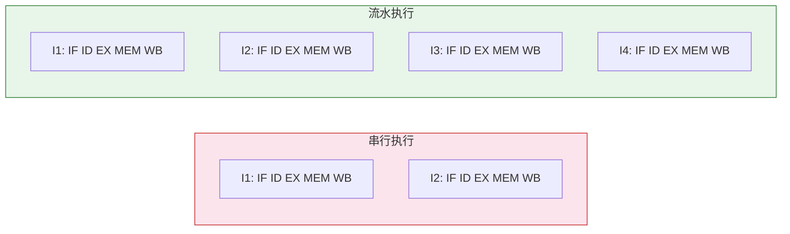
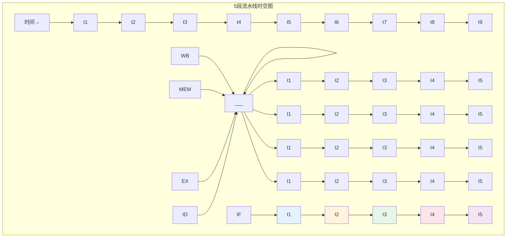
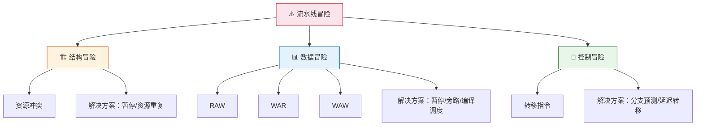
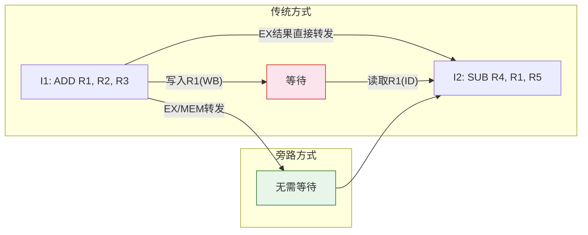
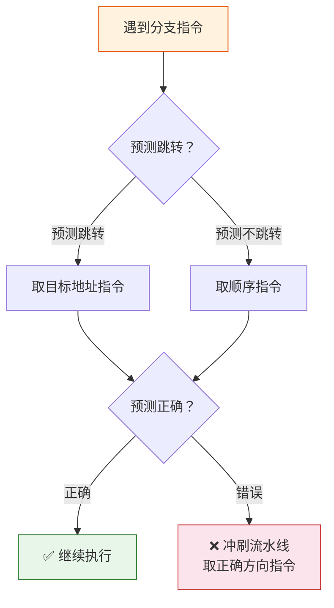
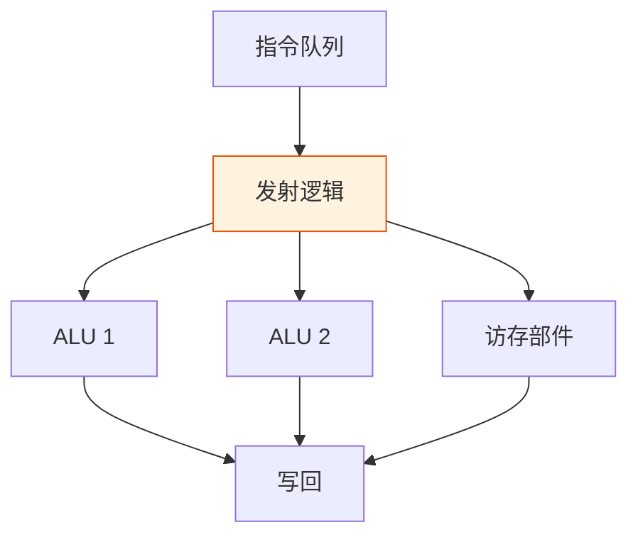

> 指令流水线如同工厂流水线——一件产品不必等上一件完全完工才开始加工，各工序同时对不同产品操作，吞吐量成倍提升。但流水线上任何一个环节的卡顿，都可能造成整条线的停顿，这就是冒险的根源。

## 一、流水线基本原理

### 1.1 串行执行 vs 流水执行

**串行执行**：一条指令完全执行完后，才启动下一条指令。

**流水执行**：将指令执行过程分成多个阶段，每个阶段由不同功能部件完成，多条指令在不同阶段重叠执行。



其中 IF=取指, ID=译码, EX=执行, MEM=访存, WB=写回。

### 1.2 流水线表示方法——时空图

时空图以横轴为时间、纵轴为空间（流水段），直观展示指令在各时段的执行情况。



::: important 时空图阅读方法
横向看：同一时刻，不同流水段执行不同指令（空间并行性）
纵向看：同一条指令，依次经过各流水段（时间顺序性）
:::

---

## 二、流水线性能指标

### 2.1 吞吐率（Throughput）

单位时间内流水线完成的任务数（指令数）。

$$TP = \frac{n}{T_{pipeline}}$$

其中 $n$ 为指令条数，$T_{pipeline}$ 为流水线总执行时间。

**理想情况下**（各段耗时相等，均为 $\Delta t$，$k$ 段流水线）：

$$T_{pipeline} = (k + n - 1) \times \Delta t$$

$$TP = \frac{n}{(k + n - 1) \times \Delta t}$$

当 $n \to \infty$ 时，最大吞吐率 $TP_{max} = \frac{1}{\Delta t}$。

### 2.2 加速比（Speedup）

流水执行时间与串行执行时间之比。

$$S = \frac{T_{sequential}}{T_{pipeline}} = \frac{n \times k \times \Delta t}{(k + n - 1) \times \Delta t} = \frac{n \times k}{k + n - 1}$$

当 $n \to \infty$ 时，最大加速比 $S_{max} = k$。

### 2.3 效率（Efficiency）

流水线中各段的利用率。

$$E = \frac{n \times k \times \Delta t}{k \times T_{pipeline}} = \frac{n}{k + n - 1}$$

当 $n \to \infty$ 时，$E_{max} = 1$（100%利用率）。

::: warning 性能指标的关系
$$S = k \times E$$

加速比 = 流水段数 × 效率。效率越高，加速比越接近段数 k。
:::

---

## 三、流水线冒险

流水线冒险（Hazard）是影响流水线性能的关键因素，分为三类：



### 3.1 结构冒险（Structure Hazard）

**原因**：不同指令在同一时刻争用同一硬件资源。

**典型情况**：指令存储器和数据存储器合一，取指和访存同时需要访问存储器。

**解决方案**：
1. 暂停（插入气泡/流水线停顿）
2. 资源重复配置（指令 Cache 与数据 Cache 分离——哈佛结构）

### 3.2 数据冒险（Data Hazard）

**原因**：后续指令需要用到前面指令的结果，但前面指令尚未写回。

**三种数据冒险**：

| 类型 | 含义 | 示例 |
|------|------|------|
| RAW（写后读） | 最常见，后指令要读的值前指令还没写 | `ADD R1,R2,R3; SUB R4,R1,R5` |
| WAR（读后写） | 后指令要写的寄存器前指令还没读 | 乱序执行中可能出现 |
| WAW（写后写） | 两条指令写同一寄存器，顺序颠倒 | 乱序执行中可能出现 |

::: important RAW 是最根本的数据冒险
顺序流水线中，只有 RAW 是真正的数据冒险。WAR 和 WAW 只在乱序执行中才会出现。
:::

**解决方案**：

1. **数据旁路（转发/前推）**：将 ALU 的输出直接送回 ALU 输入端，而不必等写回寄存器。



2. **编译器调度**：编译器通过重排指令顺序，避免数据相关导致的停顿。

3. **暂停（Stall）**：无法通过旁路解决时，插入气泡等待。

### 3.3 控制冒险（Control Hazard）

**原因**：转移指令改变了程序执行顺序，但流水线已经预取了顺序指令。

**解决方案**：

1. **分支预测**
   - **静态预测**：总是预测不跳转 / 总是预测跳转
   - **动态预测**：BHT（分支历史表），根据历史记录预测

2. **延迟转移**：将分支指令后的延迟槽填入有用指令

3. **预取两个方向**：同时预取跳转和不跳转的指令（资源开销大）



---

## 四、超标量流水线与动态调度

### 4.1 超标量流水线

超标量处理器在每个时钟周期可以**同时发射多条指令**，有多个并行的功能部件。



| 特性 | 标量流水线 | 超标量流水线 |
|------|-----------|-------------|
| CPI | ≈ 1 | < 1 |
| 功能部件 | 单套 | 多套 |
| 发射宽度 | 1 条/周期 | N 条/周期 |
| 指令顺序 | 顺序 | 可乱序 |

### 4.2 动态调度

动态调度由硬件在运行时决定指令的执行顺序：

- **记分牌（Scoreboard）**：跟踪指令和寄存器的依赖关系
- **Tomasulo 算法**：使用保留站和寄存器重命名，消除假相关（WAR、WAW）


::: tip Tomasulo 算法的核心思想
通过**寄存器重命名**消除 WAR 和 WAW 冒险，通过**保留站**实现动态调度，操作数就绪后才执行，通过**公共数据总线（CDB）**广播结果。
:::

---

## 五、练习题

### 题目 1

一条 5 段流水线，各段耗时均为 $\Delta t = 1$ns，连续执行 100 条指令。求吞吐率、加速比和效率。

::: details 详细解答

**参数**：$k = 5$，$n = 100$，$\Delta t = 1$ ns

**流水线总执行时间**：

$$T_{pipeline} = (k + n - 1) \times \Delta t = (5 + 100 - 1) \times 1 = 104 \text{ ns}$$

**吞吐率**：

$$TP = \frac{n}{T_{pipeline}} = \frac{100}{104} \approx 0.962 \text{ 条/ns}$$

**加速比**：

$$S = \frac{T_{sequential}}{T_{pipeline}} = \frac{100 \times 5 \times 1}{104} = \frac{500}{104} \approx 4.81$$

**效率**：

$$E = \frac{n}{k + n - 1} = \frac{100}{104} \approx 96.2\%$$

验证：$S = k \times E = 5 \times 0.962 = 4.81$ ✓

:::

### 题目 2

一条 5 段流水线，各段耗时分别为 80ns、50ns、70ns、100ns、60ns。求实际吞吐率、加速比和效率。

::: details 详细解答

**各段耗时不等时，时钟周期取最长段耗时**：

$$\Delta t = \max(80, 50, 70, 100, 60) = 100 \text{ ns}$$

**流水线总执行时间**：

$$T_{pipeline} = (k + n - 1) \times \Delta t$$

假设 $n$ 条指令：

$$T_{pipeline} = (5 + n - 1) \times 100 = (n + 4) \times 100 \text{ ns}$$

**吞吐率**（以 n=100 为例）：

$$TP = \frac{100}{104 \times 100} = \frac{1}{104} \text{ 条/ns} \approx 0.00962 \text{ 条/ns}$$

**串行执行时间**：

$$T_{sequential} = n \times (80 + 50 + 70 + 100 + 60) = n \times 360 \text{ ns}$$

**加速比**：

$$S = \frac{100 \times 360}{104 \times 100} = \frac{36000}{10400} \approx 3.46$$

**效率**：

$$E = \frac{n \times \sum \Delta t_i}{k \times T_{pipeline}} = \frac{100 \times 360}{5 \times 10400} = \frac{36000}{52000} \approx 69.2\%$$

::: warning
各段耗时不等时，效率会降低，因为"快"的段有空闲等待时间。理想流水线各段耗时应当相等。
:::

:::

### 题目 3

考虑以下指令序列在 5 段流水线上的执行（IF, ID, EX, MEM, WB）：

```
I1: ADD R1, R2, R3
I2: SUB R4, R1, R5
I3: AND R6, R1, R7
I4: OR  R8, R1, R9
```

（1）不加旁路时，I2 需要停顿几个周期？I3 需要停顿几个周期？
（2）加入 EX/MEM 旁路和 MEM/WB 旁路后，还有没有停顿？

::: details 详细解答

**（1）不加旁路：**

I1 在 WB 段写回 R1，I2 在 ID 段需要读 R1。

- I2 需要等到 I1 的 WB 完成后才能进入 ID → **停顿 3 个周期**（I1 在 EX 时 I2 本应进入 ID，但需等到 I1 WB 完成）
- I3 读 R1，I1 已 WB → **停顿 2 个周期**（类似分析）
- I4 读 R1 → **停顿 1 个周期**

**（2）加旁路后：**

- I1 EX 结果通过 EX/MEM 旁路直接转发给 I2 的 EX 输入 → I2 只需停顿 **1 个周期**（等 I1 完成EX）
- I1 结果通过 MEM/WB 旁路转发给 I3 → **0 停顿**
- I4 → **0 停顿**

如果使用 ALU-ALU 旁路（EX→EX 转发），I2 可以**0 停顿**执行。

:::

### 题目 4

某动态分支预测器使用 1 位 BHT，初始预测为"不跳转"。已知某循环分支连续执行 9 次跳转，第 10 次不跳转（循环退出）。求该分支预测的准确率。

::: details 详细解答

1 位 BHT 的预测规则：上次实际行为 = 本次预测。

| 次数 | 实际 | 预测 | 正确？ | BHT 更新 |
|------|------|------|--------|----------|
| 1 | 跳转 | 不跳转 | ❌ | 更新为跳转 |
| 2 | 跳转 | 跳转 | ✅ | 不变 |
| 3 | 跳转 | 跳转 | ✅ | 不变 |
| 4 | 跳转 | 跳转 | ✅ | 不变 |
| 5 | 跳转 | 跳转 | ✅ | 不变 |
| 6 | 跳转 | 跳转 | ✅ | 不变 |
| 7 | 跳转 | 跳转 | ✅ | 不变 |
| 8 | 跳转 | 跳转 | ✅ | 不变 |
| 9 | 跳转 | 跳转 | ✅ | 不变 |
| 10 | 不跳转 | 跳转 | ❌ | 更新为不跳转 |

正确次数：8，总次数：10

**准确率 = 8/10 = 80%**

::: tip 2 位 BHT 的优势
2 位饱和计数器在连续两次误预测后才改变预测方向，对循环分支的准确率更高。上述场景中，2 位 BHT 只有首尾各错一次，准确率仍为 80%，但对**嵌套循环**场景改善明显。
:::

:::

---

::: tip 面试速查
- 流水线三性能指标：吞吐率 TP、加速比 S、效率 E，关系 S=kE
- 三种冒险：结构（争资源）、数据（依赖前结果）、控制（分支跳转）
- 数据冒险解决：暂停 < 旁路/转发 < 编译调度
- 控制冒险解决：分支预测（1位/2位BHT）、延迟转移
- 超标量：CPI < 1，多发射，多功能部件
- Tomasulo：保留站 + 寄存器重命名 + CDB
:::

::: info 原著参考
- 唐朔飞《计算机组成原理》第 6 章
- 白中英《计算机组成原理》第 5 章
- Patterson & Hennessy《Computer Organization and Design》第 4 章
:::
