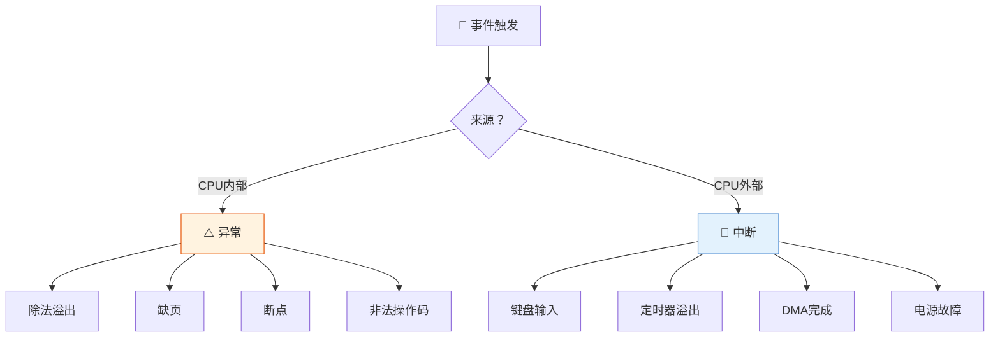
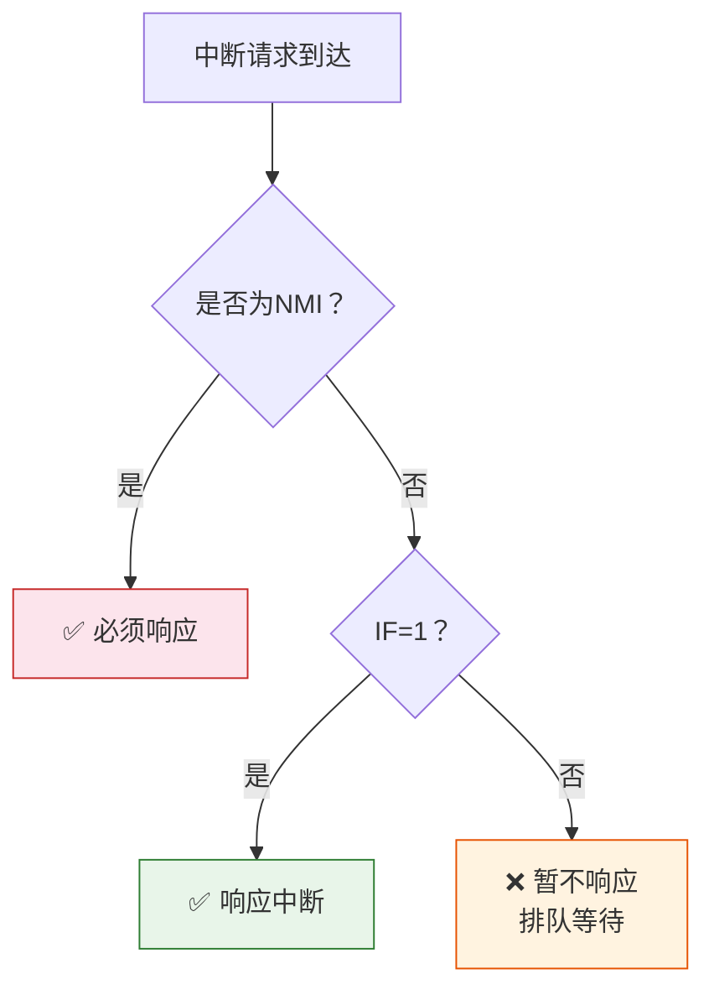
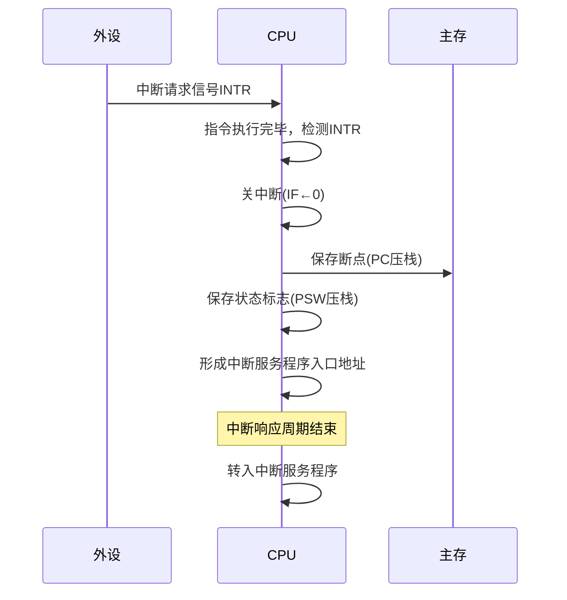
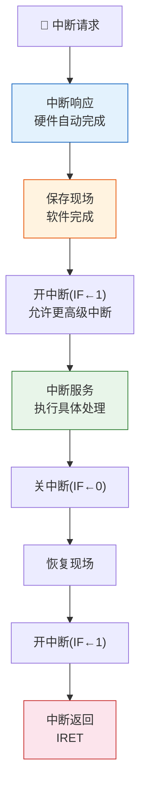
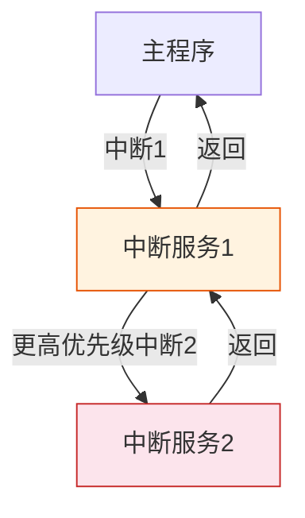

> 异常与中断如同城市的应急系统——异常是建筑内部的火警，源自 CPU 自身执行中的意外；中断是来自外部的急救电话，由外部设备发出请求。两者虽触发源不同，但处理机制一脉相承：检测→响应→保护现场→处理→恢复现场→返回。

## 一、异常与中断的区别

### 1.1 基本概念

| 对比项 | 异常（Exception） | 中断（Interrupt） |
|--------|-------------------|-------------------|
| 触发源 | CPU 内部，执行指令时产生 | CPU 外部，外部设备或事件触发 |
| 产生时机 | 指令执行过程中 | 指令执行结束后（通常） |
| 是否可预测 | 部分可预测（如陷阱） | 不可预测（异步） |
| 处理时机 | 必须立即处理 | 可延迟处理（可屏蔽） |
| 返回地址 | 可能是当前指令或下条指令 | 一定是下条指令 |



::: important 核心区分
- **异常**是 CPU 在执行指令时检测到的**内部**事件，与当前指令有关
- **中断**是 CPU 外部设备发出的**外部**事件，与当前指令无关
- 两者统称为**中断**（广义），但严格区分时，异常是同步的，中断是异步的
:::

---

## 二、异常分类

### 2.1 故障（Fault）

- **定义**：指令执行过程中检测到的错误
- **返回地址**：产生故障的**当前指令**（重新执行）
- **典型例子**：缺页异常、除法溢出、非法操作码、访问违例


### 2.2 陷阱（Trap）

- **定义**：有意为之的异常，由特定指令触发
- **返回地址**：陷阱指令的**下一条指令**（不重新执行）
- **典型例子**：系统调用（INT 指令）、断点调试、条件陷阱

### 2.3 终止（Abort）

- **定义**：严重的不可恢复错误
- **返回地址**：无（不再返回被中断的程序）
- **典型例子**：硬件故障、存储器校验错误

| 异常类型 | 返回地址 | 可恢复 | 举例 |
|----------|----------|--------|------|
| 故障（Fault） | 当前指令 | 可能 | 缺页、溢出 |
| 陷阱（Trap） | 下一条指令 | 是 | 系统调用 |
| 终止（Abort） | 无 | 否 | 硬件故障 |

---

## 三、中断分类

### 3.1 不可屏蔽中断（NMI）

- **特点**：不受中断允许标志 IF 的影响，CPU 必须响应
- **用途**：紧急事件，如电源故障、内存校验错
- **优先级**：最高

### 3.2 可屏蔽中断

- **特点**：受中断允许标志 IF 控制
  - IF=1：开中断，CPU 可以响应
  - IF=0：关中断，CPU 不响应
- **用途**：一般 I/O 设备中断请求
- **优先级**：低于 NMI



---

## 四、中断响应过程

### 4.1 中断响应的条件

1. 中断源有中断请求
2. CPU 允许中断（IF=1，可屏蔽中断；NMI 无条件响应）
3. 一条指令执行完毕（异常可在此前响应）

### 4.2 中断响应的过程



::: warning 中断响应周期
中断响应周期是硬件自动完成的，不属于指令执行过程。在此期间：
1. **关中断**：防止保存现场过程中被新中断打断
2. **保存断点**：将 PC 和 PSW 压入栈
3. **获取中断服务程序入口**：由硬件向量地址形成部件产生
:::

### 4.3 中断向量与向量地址

| 方式 | 获取入口地址的方法 | 特点 |
|------|-------------------|------|
| 向量中断 | 硬件自动产生向量地址，从向量表取入口 | 速度快 |
| 非向量中断 | 所有中断共用一个入口，软件判断中断源 | 速度慢 |

向量中断方式下，每个中断源对应一个**中断向量**，中断向量存放在**中断向量表**中：

```
中断向量表：
┌──────────┬──────────────────────────┐
│ 向量地址  │ 中断服务程序入口地址       │
├──────────┼──────────────────────────┤
│ 0x0000   │ 除法溢出处理程序          │
│ 0x0004   │ 断点处理程序              │
│ 0x0008   │ NMI处理程序               │
│ 0x000C   │ 断点中断处理程序          │
│ ...      │ ...                      │
└──────────┴──────────────────────────┘
```

---

## 五、中断处理流程

### 5.1 完整流程



### 5.2 各阶段详解

| 阶段 | 执行者 | 主要操作 |
|------|--------|----------|
| 中断响应 | 硬件 | 关中断、保存断点（PC+PSW）、取入口地址 |
| 保存现场 | 软件 | 将通用寄存器等内容压栈 |
| 中断服务 | 软件 | 执行具体的 I/O 操作或数据处理 |
| 恢复现场 | 软件 | 从栈中恢复通用寄存器内容 |
| 中断返回 | 软件（IRET） | 从栈中恢复 PC 和 PSW，返回断点 |

::: important 保存/恢复现场为何要关中断
- **保存现场时关中断**：防止现场未保存完就被新中断打断，导致现场混乱
- **恢复现场时关中断**：防止现场未恢复完就被新中断打断，导致恢复出错
- **中断服务时开中断**：允许更高级中断嵌套，提高系统实时性
:::

---

## 六、多重中断与单重中断

### 6.1 单重中断

在中断服务过程中，**不再响应**新的中断请求（IF 始终为 0）。


### 6.2 多重中断（中断嵌套）

在中断服务过程中，**允许**更高级中断打断当前中断服务。



### 6.3 多重中断的条件

1. 在中断服务程序中**开中断**（IF←1）
2. 新中断的优先级**高于**当前正在处理的中断

::: warning 优先级规则
- 优先级**高**的中断可以打断**低**的中断 → 多重中断
- 优先级**低**的中断**不能**打断**高**的中断 → 排队等待
- **同级**中断也**不能**嵌套
:::

### 6.4 单重 vs 多重中断对比

| 对比项 | 单重中断 | 多重中断 |
|--------|----------|----------|
| 服务期间是否开中断 | 不开（IF=0） | 开（IF=1） |
| 能否嵌套 | 不能 | 能（高优先级可打断低优先级） |
| 实时性 | 差 | 好 |
| 实现复杂度 | 简单 | 复杂（需优先级判断和栈管理） |
| 现场保护次数 | 1 次 | 可能多次（嵌套几层保护几次） |

---

## 七、中断优先级与屏蔽

### 7.1 中断优先级

典型优先级排列（从高到低）：

| 优先级 | 中断源 | 类型 |
|--------|--------|------|
| 1（最高） | 电源故障 | NMI |
| 2 | 内存校验错 | NMI |
| 3 | 定时器 | 可屏蔽 |
| 4 | 磁盘 I/O | 可屏蔽 |
| 5 | 键盘 | 可屏蔽 |
| 6（最低） | 打印机 | 可屏蔽 |

### 7.2 中断屏蔽字

每个中断源对应一个屏蔽字，通过设置屏蔽字可以动态调整中断的处理优先级。

```
屏蔽字示例（1=屏蔽，0=允许）：
┌──────────┬────┬────┬────┬────┬────┐
│ 中断源   │ L1 │ L2 │ L3 │ L4 │ L5 │
├──────────┼────┼────┼────┼────┼────┤
│ L1(最高) │ 1  │ 1  │ 1  │ 1  │ 1  │
│ L2       │ 0  │ 1  │ 1  │ 1  │ 1  │
│ L3       │ 0  │ 0  │ 1  │ 1  │ 1  │
│ L4       │ 0  │ 0  │ 0  │ 1  │ 1  │
│ L5(最低) │ 0  │ 0  │ 0  │ 0  │ 1  │
└──────────┴────┴────┴────┴────┴────┘
```

::: tip 屏蔽字的规律
- 自身位必为 1（不能被自己打断）
- 高优先级的中断屏蔽字中 1 更多
- 通过修改屏蔽字，可以改变中断的处理顺序
:::

---

## 八、练习题

### 题目 1

简述异常与中断的主要区别。

::: details 详细解答

| 区别 | 异常 | 中断 |
|------|------|------|
| 来源 | CPU 内部 | CPU 外部 |
| 触发方式 | 执行指令时自动检测 | 外部设备发送信号 |
| 与指令关系 | 与当前指令有关 | 与当前指令无关 |
| 同步/异步 | 同步 | 异步 |
| 响应时机 | 指令执行过程中 | 指令执行结束后 |
| 返回地址 | 当前指令（故障）或下条指令（陷阱） | 下条指令 |
| 能否屏蔽 | 不能 | 可屏蔽中断可以 |

:::

### 题目 2

某系统有 4 个中断源 L1~L4，优先级从高到低为 L1 > L2 > L3 > L4。写出各中断源的屏蔽字。若 L3 正在服务时，L1、L2、L4 同时发出请求，画出中断处理过程。

::: details 详细解答

**各中断源的屏蔽字**（1=屏蔽，0=允许）：

| 中断源 | L1 | L2 | L3 | L4 |
|--------|----|----|----|----|
| L1 | 1 | 1 | 1 | 1 |
| L2 | 0 | 1 | 1 | 1 |
| L3 | 0 | 0 | 1 | 1 |
| L4 | 0 | 0 | 0 | 1 |

**中断处理过程**（L3 服务时，L1、L2、L4 同时请求）：

1. L3 正在服务
2. L1 优先级最高，打断 L3 → 转去服务 L1
3. L1 服务完成，返回 L3
4. L2 优先级高于 L3，打断 L3 → 转去服务 L2
5. L2 服务完成，返回 L3
6. L4 优先级低于 L3，等待 L3 完成
7. L3 服务完成，处理 L4
8. L4 服务完成，返回主程序

处理顺序：L1 → L2 → L3 → L4

:::

### 题目 3

说明单重中断和多重中断在处理流程上的区别。

::: details 详细解答

**核心区别**：中断服务过程中是否开中断。

**单重中断流程**：
1. 中断响应（硬件：关中断、保存断点、取入口地址）
2. 保存现场
3. 中断服务（**不开中断**，IF=0）
4. 恢复现场
5. 开中断 + 中断返回

**多重中断流程**：
1. 中断响应（硬件：关中断、保存断点、取入口地址）
2. 保存现场
3. **开中断**（IF=1，允许更高级中断嵌套）
4. 中断服务
5. **关中断**（IF=0）
6. 恢复现场
7. 开中断 + 中断返回

区别：多重中断在保存现场后、中断服务前多了**开中断**步骤，在恢复现场前多了**关中断**步骤。

:::

---

::: tip 面试速查
- 异常 = 内部 + 同步；中断 = 外部 + 异步
- 异常三分：故障（返回当前指令）、陷阱（返回下条指令）、终止（不返回）
- 中断响应硬件完成：关中断→保存断点→取入口地址
- 保存/恢复现场必须关中断
- 多重中断 = 保存现场后开中断 + 优先级高可嵌套
- 屏蔽字可动态改变中断处理顺序
:::

::: info 原著参考
- 唐朔飞《计算机组成原理》第 8 章
- 白中英《计算机组成原理》第 7 章
:::
