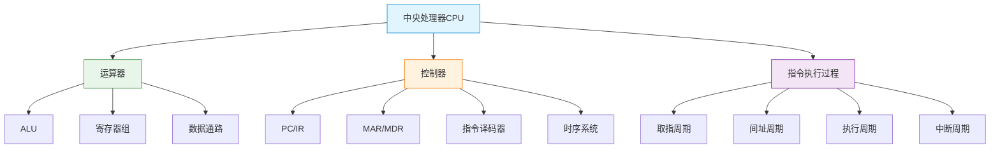

# 中央处理器

> 如果把计算机比作一个人，CPU就是大脑——运算器负责"算"（左脑逻辑），控制器负责"管"（右脑协调），两者精密配合，每秒完成数十亿次指令的执行。理解CPU，就是理解计算机的灵魂。

## 本章概述

中央处理器（CPU）是计算机的核心部件，负责指令的解释和执行。本章从CPU的基本结构出发，深入讲解运算器和控制器的组织，以及指令执行的完整过程。

## 目录

- [CPU的基本结构](01_CPU的基本结构.md) —— 运算器、控制器、数据通路
- [指令执行过程](02_指令执行过程.md) —— 指令周期、数据流、CPU通信方式

## 核心知识图谱

## 学习建议

1. **理清CPU内部寄存器**：PC、IR、MAR、MDR、ACC、PSW等，每个寄存器的作用
2. **理解数据通路**：数据在CPU内部如何流动，这是理解指令执行的基础
3. **掌握指令执行流程**：取指→间指→执行→中断，每一周期的数据流
4. **画图！画图！画图！**：CPU内部结构和数据通路图，必须亲手画才能理解
