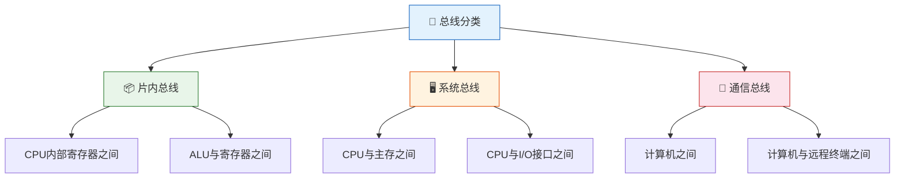
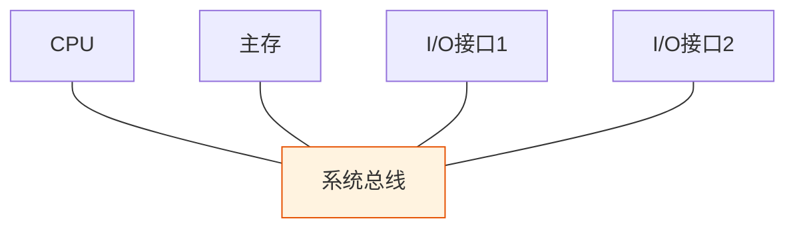
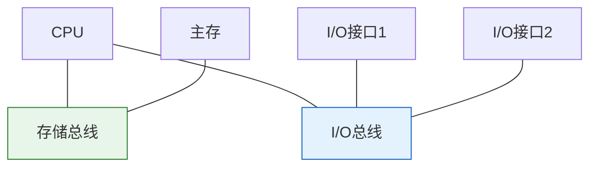
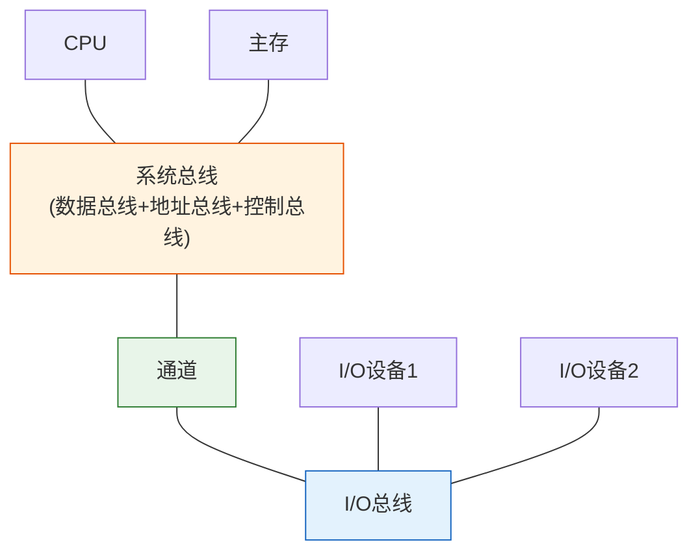

> 总线如同城市交通网络——不同的道路（数据总线、地址总线、控制总线）承载不同类型的车辆（数据、地址、控制信号），道路宽度（总线宽度）和限速（总线频率）决定了交通吞吐量（总线带宽）。

## 一、总线的基本概念

### 1.1 什么是总线

总线（Bus）是计算机各功能部件之间传送信息的**公共通道**，是一组可以为多个部件分时共享的信号线。

**总线的特性**：

| 特性 | 说明 |
|------|------|
| 分时性 | 同一时刻只能有一对设备使用总线通信 |
| 共享性 | 多个设备可以通过同一总线进行信息交换 |

::: important 分时共享的含义
- **分时**：同一时刻只允许一个设备向总线发送信息
- **共享**：多个设备可以通过同一总线接收信息
- 多个设备可以**同时接收**，但只能**分时发送**
:::

### 1.2 总线的性能优势

- 简化系统结构，减少连线数量
- 便于系统扩展，新设备只需接入总线
- 便于标准化，统一接口规范

---

## 二、总线分类

### 2.1 按功能层次分类

| 类型 | 位置 | 用途 | 特点 |
|------|------|------|------|
| 片内总线 | 芯片内部 | CPU 内部各部件通信 | 速度最快，线短 |
| 系统总线 | 主板上面 | CPU、主存、I/O 之间 | 速度较快 |
| 通信总线 | 计算机外部 | 计算机之间或与远程终端 | 速度较慢，距离长 |

### 2.2 系统总线的分类

系统总线按传输信息的性质分为三类：

| 类型 | 方向 | 宽度决定因素 | 典型宽度 |
|------|------|-------------|----------|
| 数据总线 | 双向 | 机器字长/存储字长 | 8/16/32/64位 |
| 地址总线 | 单向（CPU→外） | 寻址空间大小 | 16/20/32/64位 |
| 控制总线 | 有出有入 | 控制信号数量 | 若干条 |

::: warning 关键区分
- **数据总线宽度**决定了一次传送的数据位数，与机器字长或存储字长有关
- **地址总线宽度**决定了最大物理寻址空间：$n$ 位地址总线 → 寻址空间 $2^n$
- 控制总线中，有的从 CPU 发出（如读/写信号），有的送入 CPU（如中断请求）
:::

---

## 三、总线性能指标

### 3.1 总线宽度

总线宽度指数据总线一次能并行传送的位数。

| 总线宽度 | 一次传送数据量 |
|----------|---------------|
| 8 位 | 1 字节 |
| 16 位 | 2 字节 |
| 32 位 | 4 字节 |
| 64 位 | 8 字节 |

### 3.2 总线频率（时钟频率）

总线的工作时钟频率，单位为 MHz 或 GHz。

### 3.3 总线带宽

总线带宽 = 单位时间内传送的数据量（最大数据传输率）。

$$总线带宽 = 总线宽度 \times 总线频率$$

若总线宽度为 $W$ 字节，时钟频率为 $f$ MHz：

$$带宽 = W \times f \text{ MB/s}$$

::: important 带宽计算注意点
- 总线宽度以**字节**为单位计算带宽时，需将位数除以 8
- 若每个时钟周期传送 $N$ 次数据，则带宽 = $W \times f \times N$
- 经典计算：32 位总线，33 MHz → 带宽 = 4 × 33 = 132 MB/s
:::

**计算示例**：

某总线宽度 64 位，时钟频率 800 MHz，每个时钟周期传送 2 次数据。求总线带宽。

$$带宽 = \frac{64}{8} \times 800 \times 2 = 8 \times 800 \times 2 = 12800 \text{ MB/s} = 12.8 \text{ GB/s}$$

### 3.4 性能指标汇总

| 指标 | 含义 | 单位 |
|------|------|------|
| 总线宽度 | 数据线根数/一次传送位数 | 位（bit） |
| 总线频率 | 工作时钟频率 | MHz / GHz |
| 总线带宽 | 最大数据传输率 | MB/s / GB/s |
| 总线复用 | 地址线和数据线共用 | - |
| 信号线数 | 地址线+数据线+控制线总数 | 条 |

---

## 四、总线结构

### 4.1 单总线结构

所有部件连接到一条总线上。

| 优点 | 缺点 |
|------|------|
| 结构简单 | 带宽瓶颈 |
| 易于扩展 | 同一时刻只允许一对设备通信 |
| 成本低 | 系统效率低 |

### 4.2 双总线结构

在单总线基础上增加一条专用总线，常见形式：

| 优点 | 缺点 |
|------|------|
| 存储器和 I/O 分离 | 增加了硬件成本 |
| 减轻系统总线负担 | CPU 需要两套总线接口 |
| 提高系统吞吐量 | - |

### 4.3 三总线结构

| 优点 | 缺点 |
|------|------|
| 通道减轻 CPU 负担 | 硬件更复杂 |
| I/O 与 CPU 并行工作 | 成本更高 |
| 系统效率最高 | - |

### 4.4 总线结构对比

| 特性 | 单总线 | 双总线 | 三总线 |
|------|--------|--------|--------|
| 结构复杂度 | 低 | 中 | 高 |
| 系统吞吐量 | 低 | 中 | 高 |
| 扩展性 | 好 | 较好 | 一般 |
| 成本 | 低 | 中 | 高 |
| 适用场景 | 小型系统 | 中型系统 | 大型系统 |

---

## 五、总线标准

常见总线标准：

| 总线标准 | 宽度 | 频率 | 带宽 | 应用 |
|----------|------|------|------|------|
| ISA | 16位 | 8MHz | 16MB/s | 早期PC |
| PCI | 32/64位 | 33/66MHz | 132/528MB/s | 中期PC |
| PCI-E | 串行 | 2.5GHz+ | 最高16GB/s | 现代PC |
| USB | 串行 | 480MHz+ | 最高10Gbps | 外设 |
| AGP | 32位 | 66MHz | 最高2.1GB/s | 显卡(已淘汰) |

::: tip 总线标准化的意义
总线标准化使得不同厂商生产的设备可以互连，实现即插即用。PCIe 取代 PCI 的核心改进是从并行传输变为串行传输，通过提高频率和增加通道数来提升带宽。
:::

---

::: tip 面试速查
- 总线三分类：数据总线（双向）、地址总线（单向）、控制总线（双向）
- 总线带宽 = 总线宽度(字节) × 总线频率(MHz) = MB/s
- n 位地址总线 → 寻址空间 $2^n$
- 单总线→双总线→三总线：性能递增，复杂度递增
- 总线特性：分时性（同一时刻一个发送）+ 共享性（多个可接收）
:::

::: info 原著参考
- 唐朔飞《计算机组成原理》第 7 章
- 白中英《计算机组成原理》第 6 章
:::
