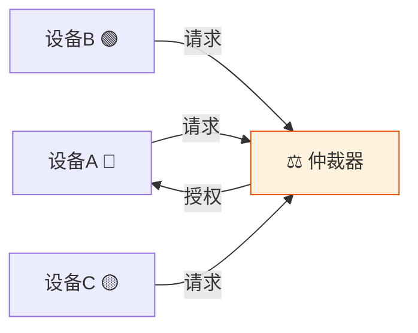
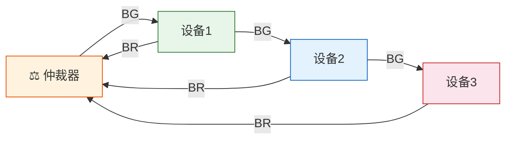
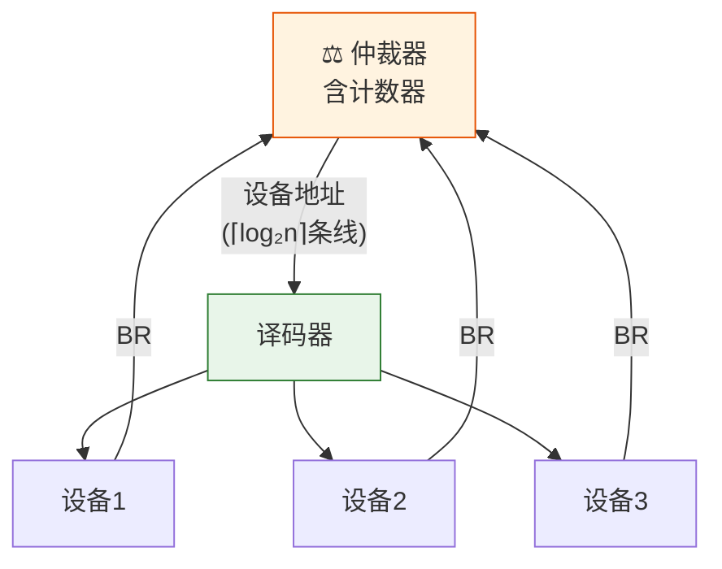
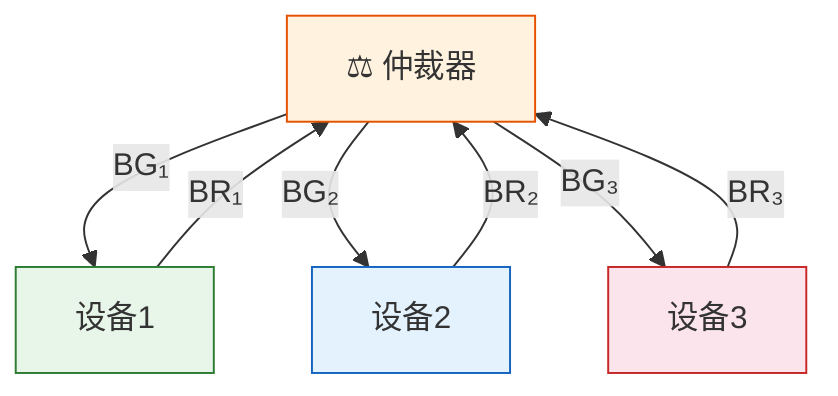
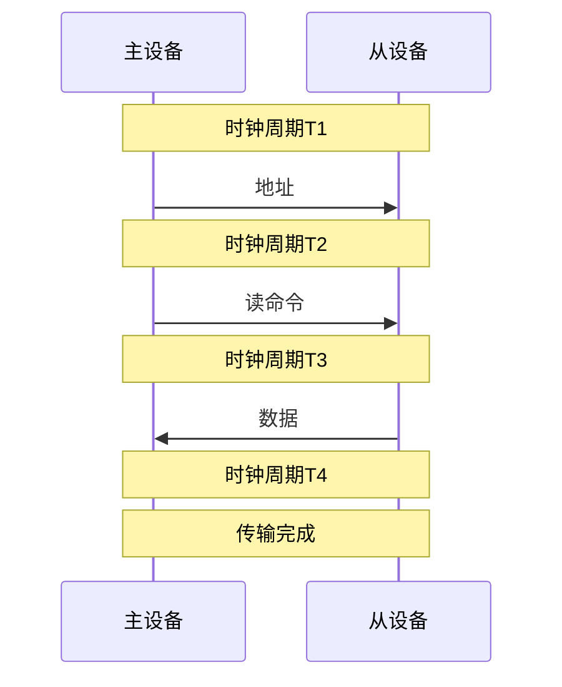
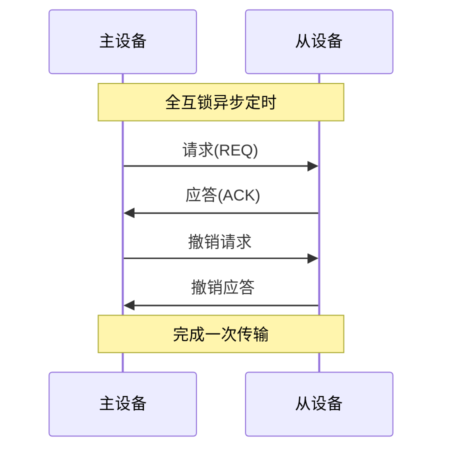

> 总线仲裁如同会议室的发言权管理——当多人同时想发言时，必须有一套规则决定谁先谁后。链式查询像排队，先来先得但可能饿死后面的人；独立请求像举手，快速但需要更多管理线。

## 一、总线仲裁

### 1.1 为什么需要总线仲裁

总线是**共享资源**，同一时刻只允许一个设备向总线发送数据。当多个设备同时请求使用总线时，需要仲裁机制决定使用权的归属。



### 1.2 仲裁方式分类

| 分类 | 方式 | 特点 |
|------|------|------|
| 集中仲裁 | 链式查询、计数器定时查询、独立请求 | 有中央仲裁器 |
| 分布仲裁 | 自举分布、冲突检测 | 无中央仲裁器，各设备自行协商 |

---

## 二、集中仲裁

### 2.1 链式查询方式

所有设备共享总线请求线（BR）和总线授权线（BG），BG 信号沿链路逐级传递。



**工作过程**：
1. 设备通过 BR 线发出总线请求
2. 仲裁器通过 BG 线发出总线授权信号
3. BG 信号沿链路逐级传递，离仲裁器最近的设备优先获得总线
4. 若某设备不需要总线，BG 继续向下传递

| 优点 | 缺点 |
|------|------|
| 结构简单，只需 3 条控制线 | 优先级固定，离仲裁器近的优先级高 |
| 扩展容易 | 对电路故障敏感（链路断开则后续设备无法请求） |
| 线数少 | 优先级低的设备可能"饿死" |

### 2.2 计数器定时查询方式

总线授权信号根据计数器的值直接送至对应设备。



**工作过程**：
1. 设备发出总线请求 BR
2. 仲裁器中的计数器开始计数
3. 计数值通过设备地址线送至各设备
4. 计数值与设备编号匹配的设备获得总线使用权

**计数器初始值决定优先级**：
- 计数器从 0 开始 → 优先级固定，同链式查询
- 计数器从上次停止处继续 → 循环优先级，更公平

| 优点 | 缺点 |
|------|------|
| 优先级可调（改变计数起点） | 需要额外的设备地址线（⌈log₂n⌉条） |
| 比链式查询更灵活 | 速度比独立请求慢 |
| 不会因故障导致后续设备失效 | 仲裁器较复杂 |

### 2.3 独立请求方式

每个设备有独立的总线请求线（BRᵢ）和总线授权线（BGᵢ）。



**工作过程**：
1. 各设备通过自己的 BRᵢ 线独立发出请求
2. 仲裁器根据优先级策略选择一个设备
3. 通过对应 BGᵢ 线授权该设备使用总线

| 优点 | 缺点 |
|------|------|
| 响应最快（无需逐级传递） | 控制线数多（2n 条） |
| 优先级灵活可编程 | 硬件复杂 |
| 故障隔离好 | 成本高 |

### 2.4 三种集中仲裁方式对比

| 对比项 | 链式查询 | 计数器定时查询 | 独立请求 |
|--------|----------|---------------|----------|
| 控制线数 | 3 条 | 2+⌈log₂n⌉条 | 2n 条 |
| 仲裁速度 | 慢 | 中 | 快 |
| 优先级 | 固定 | 可变 | 灵活 |
| 故障敏感性 | 高 | 低 | 低 |
| 扩展性 | 好 | 一般 | 差 |
| 成本 | 低 | 中 | 高 |

---

## 三、分布仲裁

分布仲裁不需要中央仲裁器，各设备自行竞争总线使用权。

**自举分布仲裁**：每个设备有自己的仲裁号，请求总线时将自己的仲裁号发送到仲裁总线上，各设备比较仲裁号，号最大者获得总线。

**冲突检测（CSMA/CD）**：先听后发，边发边听，冲突停止，随机重试（以太网采用）。

---

## 四、总线操作周期

一次完整的总线操作包含以下阶段：


| 阶段 | 操作 | 说明 |
|------|------|------|
| 请求 | 主设备发出总线请求 | 需要 CPU 或 I/O 设备发起 |
| 仲裁 | 仲裁器决定总线使用权 | 确定哪个主设备可以使用总线 |
| 寻址 | 主设备发出从设备地址 | 指定通信对象 |
| 数据传输 | 主从设备间交换数据 | 读操作或写操作 |
| 释放 | 主设备释放总线控制权 | 总线空闲，可供其他设备使用 |

---

## 五、总线定时方式

### 5.1 同步定时

所有设备使用**统一的时钟信号**协调数据传输。



| 优点 | 缺点 |
|------|------|
| 控制简单 | 所有设备必须按最慢设备的工作速度运行 |
| 传输速率确定 | 时钟频率受最长总线延迟限制 |
| 适合速度相近的设备 | 灵活性差 |

### 5.2 异步定时

没有统一时钟，通过**请求-应答握手信号**协调传输。

**三种握手方式**：

| 方式 | 请求 | 应答 | 特点 |
|------|------|------|------|
| 不互锁 | 发出后自动撤销 | 发出后自动撤销 | 速度最快，可靠性最低 |
| 半互锁 | 收到应答后撤销 | 发出后自动撤销 | 中等 |
| 全互锁 | 收到应答后撤销 | 请求撤销后才撤销 | 速度最慢，可靠性最高 |



| 优点 | 缺点 |
|------|------|
| 适合速度不同的设备 | 控制逻辑复杂 |
| 灵活性好 | 传输速率不确定 |
| 可靠性高 | 每次传输需额外握手开销 |

### 5.3 半同步定时

在同步定时的基础上，增加**等待信号（WAIT）**，允许慢速设备请求延长传输周期。

```
正常情况：T1 → T2 → T3 → T4
慢速设备：T1 → T2 → Tw → Tw → T3 → T4
                         ↑插入等待周期
```

| 优点 | 缺点 |
|------|------|
| 兼顾同步的简单性 | 仍需统一时钟 |
| 允许慢速设备参与 | WAIT信号增加控制复杂度 |
| 比纯同步灵活 | - |

### 5.4 三种定时方式对比

| 对比项 | 同步 | 异步 | 半同步 |
|--------|------|------|--------|
| 时钟 | 统一时钟 | 无时钟 | 统一时钟+WAIT |
| 速度 | 受最慢设备限制 | 按实际需要 | 可变 |
| 灵活性 | 低 | 高 | 中 |
| 复杂度 | 低 | 高 | 中 |
| 可靠性 | 一般 | 高 | 较高 |
| 适用场景 | 速度相近的设备 | 速度差异大的设备 | 兼容场景 |

---

## 六、练习题

### 题目 1

某系统总线宽度为 32 位，总线时钟频率为 100MHz，每个时钟周期传送一次数据。求总线带宽。若将总线宽度增加到 64 位，频率提高到 200MHz，带宽变为多少？

::: details 详细解答

**原配置：**

$$带宽 = \frac{32}{8} \times 100 = 4 \times 100 = 400 \text{ MB/s}$$

**新配置：**

$$带宽 = \frac{64}{8} \times 200 = 8 \times 200 = 1600 \text{ MB/s} = 1.6 \text{ GB/s}$$

:::

### 题目 2

比较链式查询、计数器定时查询和独立请求三种集中仲裁方式的优缺点，说明各自的适用场景。

::: details 详细解答

| 方式 | 优点 | 缺点 | 适用场景 |
|------|------|------|----------|
| 链式查询 | 结构简单，线数少，扩展容易 | 优先级固定，对故障敏感 | 小型简单系统 |
| 计数器定时查询 | 优先级可调，灵活性较好 | 需要额外地址线，速度中等 | 中型系统 |
| 独立请求 | 速度最快，优先级灵活，故障隔离好 | 线数多(2n条)，成本高 | 高性能大型系统 |

:::

### 题目 3

某系统采用 4 个设备共享总线，分别画出链式查询、计数器定时查询、独立请求方式所需的控制线数量，并说明各自的仲裁过程。

::: details 详细解答

**链式查询**：3 条控制线（BR + BG + BS）

仲裁过程：
1. 任一设备通过 BR 线发出请求
2. 仲裁器发出 BG 信号
3. BG 信号沿链路传递，设备1优先获得；若设备1不请求，BG 传至设备2，以此类推
4. 获得授权的设备通过 BS 线通知仲裁器总线忙

**计数器定时查询**：2 + ⌈log₂4⌉ = 2 + 2 = 4 条控制线（BR + BS + 2条设备地址线）

仲裁过程：
1. 设备通过 BR 线发出请求
2. 计数器从初始值开始计数，计数值通过2条地址线输出
3. 当计数值与某请求设备编号匹配时，该设备获得总线
4. 若计数器从0开始，优先级为设备0 > 设备1 > 设备2 > 设备3

**独立请求**：2 × 4 = 8 条控制线（4条BRᵢ + 4条BGᵢ）

仲裁过程：
1. 各设备通过各自的BRᵢ线独立请求
2. 仲裁器根据内部优先级逻辑选择一个设备
3. 通过对应的BGᵢ线授权该设备
4. 响应速度最快，无需逐级传递

:::

---

::: tip 面试速查
- 集中仲裁三方式：链式查询（3线/固定优先级/简单）、计数器定时（2+⌈log₂n⌉线/优先级可变）、独立请求（2n线/最快/最灵活）
- 总线操作周期：请求→仲裁→寻址→数据传输→释放
- 同步定时：统一时钟，简单但不灵活
- 异步定时：握手信号，灵活但复杂；全互锁最可靠
- 半同步定时：同步+WAIT，折中方案
:::

::: info 原著参考
- 唐朔飞《计算机组成原理》第 7 章
- 白中英《计算机组成原理》第 6 章
:::
