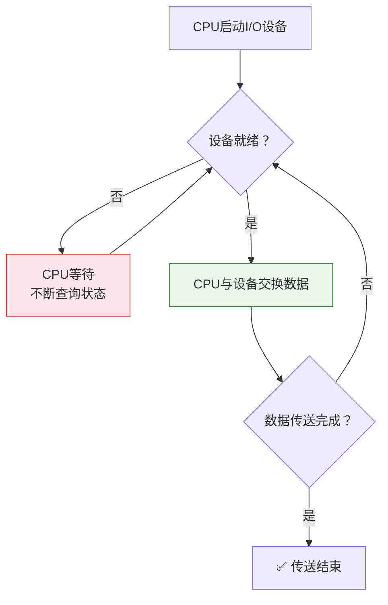
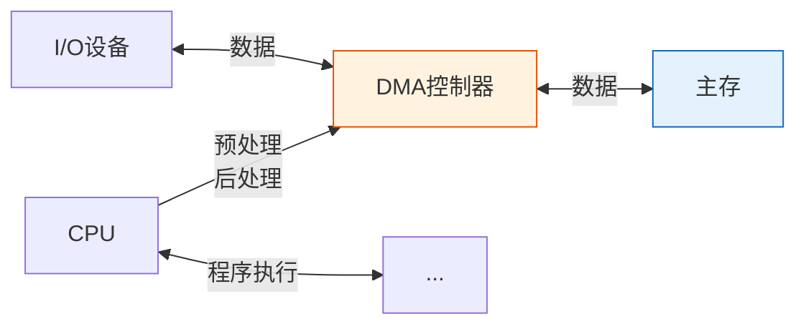
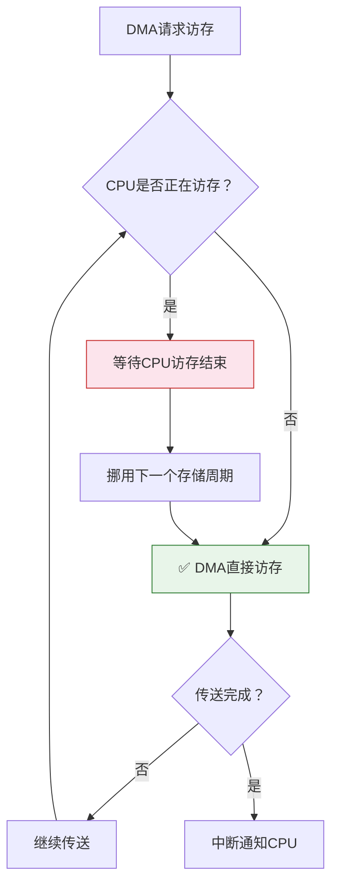
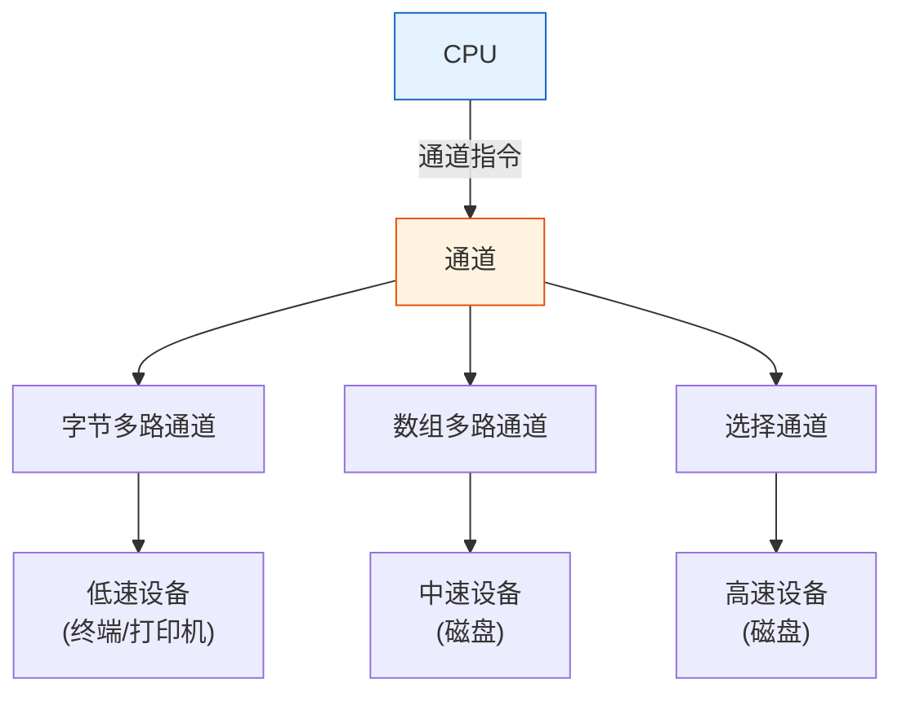

> IO方式如同餐厅的服务模式——程序查询是服务员反复问"菜好了没"；程序中断是厨师做好后主动叫服务员；DMA是直接把菜放到传送带上，不用服务员动手；通道则是请了一位专业经理，全权负责所有菜品的传递。

## 一、程序查询方式

### 1.1 基本原理

CPU 通过执行程序不断查询 I/O 设备的状态，当设备就绪时进行数据传送。



### 1.2 特点

| 特点 | 说明 |
|------|------|
| 优点 | 硬件简单，控制容易 |
| 缺点 | CPU 时间浪费严重（忙等） |
| CPU利用率 | 极低 |
| 适用场景 | 实时性要求不高、设备速度很快 |

::: warning 程序查询的致命缺陷
CPU 在等待设备就绪期间不断查询（忙等/轮询），无法执行其他任务，造成 CPU 资源的极大浪费。尤其当设备速度远慢于 CPU 时，CPU 几乎全部时间都在等待。
:::

---

## 二、程序中断方式

### 2.1 基本原理

CPU 启动 I/O 设备后继续执行其他程序，当设备就绪时向 CPU 发出中断请求，CPU 响应中断后进行数据传送。

```mermaid
sequenceDiagram
    participant CPU
    participant DEV as I/O设备

    CPU->>DEV: 启动I/O设备
    Note over CPU: CPU继续执行其他程序
    DEV->>CPU: 设备就绪，发出中断请求
    Note over CPU: 响应中断
    CPU->>DEV: 交换数据
    Note over CPU: 中断返回，继续执行

    style CPU fill:#e3f2fd,stroke:#1565c0
    style DEV fill:#fff3e0,stroke:#e65100
```

### 2.2 中断方式的工作过程

1. **中断请求**：I/O 设备完成准备工作，通过中断请求线向 CPU 发出 INTR 信号
2. **中断响应**：CPU 在每条指令执行结束后检查 INTR，若 IF=1 则响应
3. **中断处理**：
   - 保存现场
   - 执行中断服务程序（数据传送）
   - 恢复现场
   - 中断返回

### 2.3 中断方式的特点

| 特点 | 说明 |
|------|------|
| 优点 | CPU 与 I/O 设备并行工作 |
| 优点 | CPU 利用率大幅提高 |
| 缺点 | 每次数据传送都要经历中断处理开销 |
| 缺点 | 不适合大批量数据传送 |

::: important 中断方式的局限
每传送一个数据字就要进行一次中断响应→保存现场→数据传送→恢复现场→中断返回，频繁的中断处理本身消耗大量 CPU 时间。对于磁盘等高速设备的大批量数据传送，中断方式反而效率很低。
:::

---

## 三、DMA 方式

### 3.1 基本原理

DMA（Direct Memory Access，直接存储器存取）方式下，数据传送不经过 CPU，由 DMA 控制器直接控制数据在 I/O 设备和主存之间传送。



### 3.2 DMA 控制器的功能

| 功能 | 说明 |
|------|------|
| 接受 CPU 预处理 | 接收主存地址、传送字数、传送方向等参数 |
| 直接访存 | 不经过 CPU，直接与主存交换数据 |
| 地址修改 | 每传一个字自动修改主存地址 |
| 字数计数 | 每传一个字计数器减1 |
| 传送结束报告 | 计数器为0时，向CPU发中断请求 |

### 3.3 DMA 传送方式

| 方式 | 原理 | 特点 |
|------|------|------|
| 停止CPU访存 | DMA 传送期间 CPU 完全停止 | 简单但 CPU 空闲 |
| 周期挪用（窃取） | DMA 在 CPU 不访存时挪用一个存储周期 | 最常用，效率高 |
| DMA与CPU交替访存 | 将存储周期分为两半，DMA和CPU各用一半 | 效率最高，需要高速存储器 |



### 3.4 DMA 传送流程

1. **预处理**：CPU 执行 I/O 指令，给 DMA 控制器设置参数（主存地址、传送字数、传送方向）
2. **数据传送**：DMA 控制器独立完成数据传送
3. **后处理**：DMA 传送完成后发中断请求，CPU 执行中断服务程序进行后处理

### 3.5 DMA 方式的特点

| 特点 | 说明 |
|------|------|
| 优点 | CPU 与 I/O 高度并行 |
| 优点 | 适合大批量数据传送 |
| 优点 | 数据传送路径：I/O↔主存，不经过CPU |
| 缺点 | DMA 控制器硬件复杂 |
| 缺点 | 只能处理简单数据传送，不能做复杂操作 |

---

## 四、通道方式

### 4.1 基本原理

通道是专门的 I/O 处理机，有自己的指令系统（通道指令/通道程序），能独立执行 I/O 操作，使 CPU 彻底从 I/O 事务中解脱。



### 4.2 通道类型

| 通道类型 | 工作方式 | 适用设备 | 特点 |
|----------|----------|----------|------|
| 字节多路通道 | 以字节为单位交叉服务多个设备 | 低速设备（终端、打印机） | 多设备并行，但每设备速度低 |
| 数组多路通道 | 以数据块为单位交叉服务多个设备 | 中速设备（磁盘） | 通道利用率高 |
| 选择通道 | 一次只服务一个设备，完成后切换 | 高速设备（磁盘） | 速度最快，但设备串行 |

::: warning 选择通道的局限
选择通道一次只为一个设备服务，在该设备的 I/O 操作完成之前，其他设备必须等待。虽然数据传输速率高，但通道利用率可能很低（设备寻道等机械操作期间通道空闲）。
:::

### 4.3 通道工作流程

1. CPU 执行通道指令，启动通道
2. 通道从主存取出通道程序并执行
3. 通道独立完成 I/O 操作
4. I/O 完成后，通道向 CPU 发中断请求
5. CPU 响应中断，执行后处理

---

## 五、四种 IO 方式对比

| 对比项 | 程序查询 | 程序中断 | DMA | 通道 |
|--------|----------|----------|-----|------|
| CPU参与程度 | 全程参与 | 每次传送中断 | 仅预处理/后处理 | 仅启动/后处理 |
| 数据传送路径 | I/O↔CPU↔主存 | I/O↔CPU↔主存 | I/O↔主存 | I/O↔主存 |
| CPU与I/O并行 | 不并行 | 部分并行 | 高度并行 | 完全并行 |
| 传送单位 | 字 | 字 | 数据块 | 数据块 |
| 硬件复杂度 | 最低 | 低 | 高 | 最高 |
| 适用场景 | 简单低速设备 | 中速设备 | 高速块设备 | 大型系统多设备 |
| 响应速度 | 慢 | 中 | 快 | 快 |


---

## 六、练习题

### 题目 1

简述 DMA 方式与中断方式的主要区别。

::: details 详细解答

| 区别 | 中断方式 | DMA方式 |
|------|----------|---------|
| 数据传送路径 | I/O→CPU→主存 | I/O↔主存（不经过CPU） |
| 传送单位 | 一个字 | 一个数据块 |
| CPU参与 | 每次传送都参与 | 仅预处理和后处理 |
| 响应时间 | 指令执行结束后 | 存储周期结束后 |
| 优先级 | 低于DMA | 高于中断 |
| 适用场景 | 少量数据 | 大批量数据 |
| 程序切换 | 需要保存/恢复现场 | DMA传送期间无程序切换 |

:::

### 题目 2

某计算机主频 50MHz，采用程序中断方式进行 I/O 传送。每次中断处理需要 100 个时钟周期，其中 20 个周期用于数据传送。问：CPU 用于 I/O 的最大时间占比是多少？若采用 DMA 方式，DMA 传送一个 500 字的数据块，预处理和后处理共需 200 个时钟周期，问 CPU 用于 I/O 的时间占比是多少？

::: details 详细解答

**中断方式：**

每次中断 100 个时钟周期，其中 20 个用于数据传送。

假设每个时钟周期 = 1/50MHz = 20ns

每次传送 1 个字，最大 I/O 频率取决于设备速度，但 CPU 用于每次 I/O 的时间占比：

$$时间占比 = \frac{100}{\text{两次中断间隔的周期数} + 100}$$

若设备持续产生中断（极限情况）：

$$占比 = \frac{100}{100} = 100\%$$

**DMA方式：**

传送 500 字，CPU 开销仅预处理+后处理 = 200 个时钟周期。

$$占比 = \frac{200}{\text{DMA传送500字所需周期数} + 200}$$

DMA 传送期间 CPU 不参与，假设存储周期为 2 个时钟周期：

$$DMA传送时间 = 500 \times 2 = 1000 \text{ 个时钟周期}$$

$$占比 = \frac{200}{1000 + 200} = \frac{200}{1200} \approx 16.7\%$$

对比：中断方式下传送 500 字需 500 次中断 = 500 × 100 = 50000 个周期，占比远高于 DMA。

:::

---

::: tip 面试速查
- 程序查询：CPU忙等，最简单但效率最低
- 程序中断：CPU与I/O部分并行，每次传送一字
- DMA：I/O↔主存直接传送，CPU只做预处理/后处理
- DMA三种传送方式：停止CPU/周期挪用/交替访存
- 通道：专用I/O处理机，CPU最解放，最复杂
- 四种方式：并行程度递增，复杂度递增，适用速度递增
:::

::: info 原著参考
- 唐朔飞《计算机组成原理》第 8 章
- 白中英《计算机组成原理》第 7 章
:::
