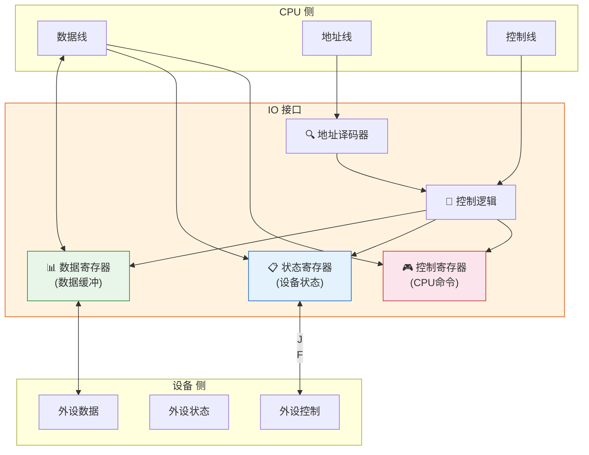
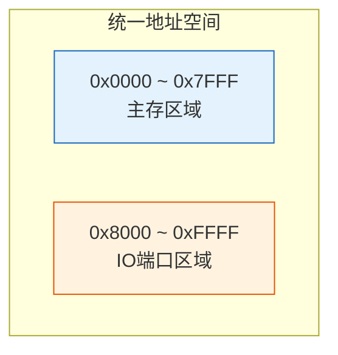
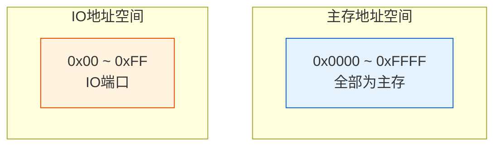

> IO接口如同翻译官——一边说着CPU能理解的"数字语言"（并行数字信号），一边说着设备能理解的"方言"（串行/模拟信号），在两种截然不同的世界之间架起沟通的桥梁。

## 一、IO接口的功能

IO接口是 CPU 与外设之间的**桥梁**，解决 CPU 与外设之间的差异：

| 差异 | 说明 | 接口解决方式 |
|------|------|-------------|
| 速度差异 | CPU 快，外设慢 | 数据缓冲寄存器 |
| 数据格式差异 | CPU 并行，外设可能串行 | 串/并转换 |
| 信号电平差异 | CPU TTL电平，外设各种电平 | 电平转换 |
| 时序差异 | CPU 同步，外设异步 | 时序协调 |
| 地址差异 | CPU 统一编址，外设独立地址 | 地址译码 |

IO接口的主要功能：

1. **数据缓冲**：解决 CPU 与外设速度不匹配问题
2. **数据格式转换**：串/并转换、字长匹配
3. **设备选择**：通过地址译码选择特定外设
4. **命令传送与状态反馈**：传递 CPU 控制命令和设备状态
5. **中断请求**：向 CPU 发送中断请求信号

---

## 二、IO接口的分类

### 2.1 按数据传送方式分类

| 类型 | 说明 | 举例 |
|------|------|------|
| 并行接口 | 多位数据同时传送 | 打印机接口 |
| 串行接口 | 数据逐位传送 | USB、RS-232 |

### 2.2 按功能分类

| 类型 | 说明 | 特点 |
|------|------|------|
| 可编程接口 | 通过程序设置工作方式 | 灵活，如 8255、8251 |
| 不可编程接口 | 工作方式固定 | 简单，如三态缓冲器 |

### 2.3 按通用性分类

| 类型 | 说明 |
|------|------|
| 通用接口 | 可连接多种设备 |
| 专用接口 | 针对特定设备设计（如磁盘控制器） |

---

## 三、IO接口的基本结构

### 3.1 IO接口中的寄存器

| 寄存器 | 功能 | 方向 |
|--------|------|------|
| 数据寄存器（DR） | 暂存 CPU 与外设之间传送的数据 | 双向 |
| 状态寄存器（SR） | 记录外设的当前状态（就绪/忙/出错） | 外设→CPU |
| 控制寄存器（CR） | 存放 CPU 发给外设的控制命令 | CPU→外设 |

::: important IO接口中的寄存器就是IO端口
每个寄存器有一个端口地址，CPU 通过端口地址访问这些寄存器，实现与外设的通信。
:::

---

## 四、IO端口编址方式

### 4.1 统一编址（存储器映射编址）

IO端口与主存单元**共用同一地址空间**。

| 优点 | 缺点 |
|------|------|
| 不需要专用I/O指令 | 主存空间减少 |
| 访问方式灵活（可用所有访存指令） | 地址译码复杂 |
| 控制逻辑简单 | 程序不易区分访存和I/O |

**典型代表**：ARM、MIPS、RISC-V

### 4.2 独立编址（I/O映射编址）

IO端口有**独立的地址空间**，使用专用的 I/O 指令访问。

| 优点 | 缺点 |
|------|------|
| 主存空间不减少 | 需要专用I/O指令（IN/OUT） |
| 程序易区分访存和I/O | I/O指令功能单一 |
| 地址译码简单 | 增加了CPU控制线的复杂度 |

**典型代表**：x86（IN/OUT 指令）

### 4.3 两种编址方式对比

| 对比项 | 统一编址 | 独立编址 |
|--------|----------|----------|
| 地址空间 | 共享 | 独立 |
| 专用I/O指令 | 不需要 | 需要 |
| 访问指令 | 所有访存指令 | IN/OUT |
| 主存空间 | 减少 | 不变 |
| 地址线 | 复用 | 需要区分(M/IO信号) |
| 典型架构 | ARM、MIPS | x86 |

::: tip 如何区分统一编址和独立编址
关键看是否有**专用的 I/O 指令**：有 IN/OUT 等专用指令 → 独立编址；所有对端口的操作都用普通访存指令 → 统一编址。
:::

---

## 五、IO接口的工作过程

以输出操作为例：

1. CPU 执行输出指令，将端口地址送地址总线
2. 接口中的地址译码器选中对应端口
3. CPU 将数据送数据总线
4. 接口将数据锁存到数据寄存器
5. 接口设置状态为"已接收"
6. 外设从接口数据寄存器取走数据
7. 外设取完后，接口设置状态为"就绪"，可接收下一数据

以输入操作为例：

1. 外设将数据送入接口数据寄存器
2. 接口设置状态为"数据就绪"
3. CPU 读取状态寄存器，发现数据就绪
4. CPU 从数据寄存器读走数据
5. 接口清除"数据就绪"状态

---

::: tip 面试速查
- IO接口功能：缓冲、格式转换、设备选择、命令/状态传递、中断请求
- IO接口三寄存器：数据(DR)、状态(SR)、控制(CR) → 就是IO端口
- 统一编址：端口与主存共享地址空间，无需专用指令（ARM/MIPS）
- 独立编址：端口有独立地址空间，需IN/OUT指令（x86）
- 核心区分：有无专用I/O指令
:::

::: info 原著参考
- 唐朔飞《计算机组成原理》第 8 章
- 白中英《计算机组成原理》第 7 章
:::
