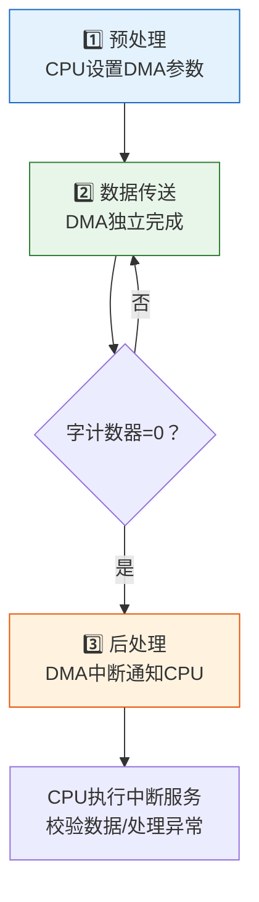
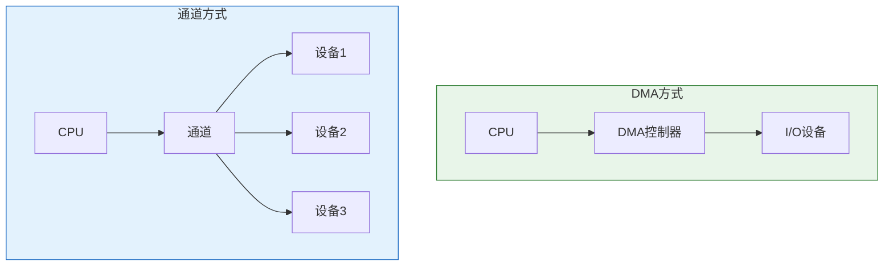

> DMA与通道如同物流系统的升级——DMA是从"快递员逐件搬运"升级为"传送带直达仓库"，数据不再经过CPU之手；通道则是"第三方物流公司"，完全接管整个运输业务，CPU只管下达订单和签收确认。

## 一、DMA 控制器结构与功能

### 1.1 DMA 控制器的基本组成

```mermaid
flowchart TB
    subgraph DMAC["DMA控制器"]
        A["📍 主存地址寄存器 AR<br/>(存放主存地址)"]
        B["📊 字计数器 WC<br/>(待传送字数)"]
        C["📦 数据缓冲寄存器 DR<br/>(暂存传送数据)"]
        D["🎮 控制/状态逻辑"]
        E["🔀 请求/响应触发器"]
    end

    A <-->|"地址总线"| F["主存"]
    C <-->|"数据总线"| F
    D -->|"控制信号"| F

    G["I/O设备"] <--> C
    E <--|"DMA请求"| G
    D -->|"DMA响应"| G

    style DMAC fill:#fff3e0,stroke:#e65100
    style A fill:#e3f2fd,stroke:#1565c0
    style B fill:#e8f5e9,stroke:#2e7d32
    style C fill:#fce4ec,stroke:#c62828
    style D fill:#f3e5f5,stroke:#6a1b9a
```

### 1.2 各寄存器功能

| 寄存器 | 功能 | 操作 |
|--------|------|------|
| AR（主存地址寄存器） | 存放主存中数据缓冲区地址 | 每传一个字自动+1 |
| WC（字计数器） | 记录待传送数据的字数 | 每传一个字自动-1，为0时传送结束 |
| DR（数据缓冲寄存器） | 暂存传送的数据 | 与主存和I/O设备交换数据 |
| 控制/状态逻辑 | 管理DMA操作的方向和时序 | 由CPU初始化设置 |

### 1.3 DMA 控制器的工作模式

| 模式 | 说明 |
|------|------|
| 读操作（输入） | I/O设备→DR→主存 |
| 写操作（输出） | 主存→DR→I/O设备 |

---

## 二、DMA 传送方式

### 2.1 停止 CPU 访存方式

DMA 传送期间，CPU 完全放弃对总线的控制权。

```
时间轴：
CPU: |████ 执行 |        等待        | ████ 执行 |
DMA: |          |████ 传送数据 █████|           |
```

| 优点 | 缺点 |
|------|------|
| 控制简单 | CPU 完全空闲 |
| DMA 传送连续 | CPU 等待时间长 |
| 适合高速设备 | CPU 利用率低 |

### 2.2 周期挪用（窃取）方式

DMA 在 CPU 不使用存储器的周期内"挪用"一个存储周期进行传送。

```
时间轴：
CPU: |████|    |████|    |████|    |████|
存储: |CPU |挪用|CPU |挪用|CPU |挪用|CPU |
DMA:      |↑|      |↑|      |↑|
```

::: important 周期挪用的三种情况
1. **CPU 不访存**：DMA 直接挪用一个周期，无冲突
2. **CPU 正在访存**：DMA 等待 CPU 当前访存结束再挪用
3. **CPU 与 DMA 同时请求**：DMA 优先（I/O 操作实时性要求更高）
:::

| 优点 | 缺点 |
|------|------|
| CPU 活动影响小 | 每次传送需申请总线 |
| 适合中等速度设备 | 传送不连续 |
| CPU 利用率高 | 控制逻辑较复杂 |

### 2.3 DMA 与 CPU 交替访存方式

将存储周期分为两半，CPU 和 DMA 各用一半。

```
时间轴：
存储周期: |CPU半|DMA半|CPU半|DMA半|CPU半|DMA半|
CPU:      |████ |     |████ |     |████ |     |
DMA:      |     |████ |     |████ |     |████ |
```

| 优点 | 缺点 |
|------|------|
| 无冲突，无需申请 | 需要高速存储器 |
| 效率最高 | 对存储器速度要求高 |
| 传送连续 | 硬件成本高 |

### 2.4 三种传送方式对比

| 对比项 | 停止CPU | 周期挪用 | 交替访存 |
|--------|---------|----------|----------|
| CPU影响 | 完全停止 | 偶尔暂停一个周期 | 无影响 |
| 传送方式 | 连续 | 分散 | 连续 |
| 效率 | 低 | 中 | 最高 |
| 复杂度 | 低 | 中 | 高 |
| 适用场景 | 高速块传送 | 一般场景 | 高速存储器系统 |

---

## 三、DMA 传送过程

### 3.1 完整流程



### 3.2 预处理阶段

CPU 执行 I/O 指令，为 DMA 控制器设置以下参数：

| 参数 | 存入 | 说明 |
|------|------|------|
| 主存缓冲区首地址 | AR | 数据存放的起始地址 |
| 传送字数 | WC | 需要传送的数据量 |
| 传送方向 | 控制逻辑 | 输入(读)还是输出(写) |
| 设备地址 | 设备地址寄存器 | 指定I/O设备 |

### 3.3 数据传送阶段

DMA 控制器独立完成以下循环：

1. 设备数据就绪 → DMA 请求总线
2. 获得总线控制权
3. 将数据从设备送入 DR（输入）或从主存读入 DR（输出）
4. 将 DR 数据写入主存（输入）或写入设备（输出）
5. AR←AR+1，WC←WC-1
6. 若 WC≠0，继续传送；否则进入后处理

### 3.4 后处理阶段

DMA 传送完成后，向 CPU 发中断请求，CPU 执行中断服务程序：

- 校验传送数据是否正确
- 测试传送过程中是否出错
- 决定是否继续传送下一批数据

---

## 四、通道类型与工作原理

### 4.1 字节多路通道

以**字节为单位**，**交叉服务**多个低速设备。

```
时间轴：
设备1: |B1|  |B1'|  |B1''|
设备2:    |B2|  |B2'|  |B2''|
设备3:       |B3|  |B3'|  |B3''|
```

每个时间片为一个字节的服务时间，各设备轮流获得服务。

**适用场景**：终端、打印机等低速设备

**通道流量**：$f_{byte} = \sum_{i=1}^{n} f_i$（各设备速率之和）

### 4.2 数组多路通道

以**数据块为单位**，**交叉服务**多个中速设备。每个设备获得通道后传送一个数据块，然后切换到下一个设备。

**适用场景**：磁盘等中速设备

**优势**：利用磁盘寻道期间为其他设备服务，提高通道利用率

### 4.3 选择通道

一次只服务一个设备，该设备的 I/O 操作完成后才切换。

**适用场景**：高速磁盘等设备

**特点**：数据传输速率最高，但通道利用率可能很低

### 4.4 三种通道对比

| 通道类型 | 服务方式 | 传送单位 | 适用设备 | 通道利用率 |
|----------|----------|----------|----------|-----------|
| 字节多路通道 | 交叉服务 | 字节 | 低速 | 高 |
| 数组多路通道 | 交叉服务 | 数据块 | 中速 | 较高 |
| 选择通道 | 独占服务 | 数据块 | 高速 | 低 |

---

## 五、通道流量计算

### 5.1 基本概念

通道流量（吞吐率）：单位时间内通道传送的数据量。

| 参数 | 说明 |
|------|------|
| $T_S$ | 设备选择时间（通道从选择设备到开始传送数据的时间） |
| $T_D$ | 传送一个字节的时间 |
| $p$ | 每次选择设备后传送的字节数 |
| $n$ | 通道连接的设备数 |
| $f_i$ | 第 $i$ 个设备的数据传输速率 |

### 5.2 各通道的极限流量

**字节多路通道**（每次传送1个字节，p=1）：

$$f_{max} = \frac{1}{T_S + T_D}$$

实际流量约束：

$$\sum_{i=1}^{n} f_i \leq f_{max}$$

**数组多路通道**（每次传送 p 个字节）：

$$f_{max} = \frac{p}{T_S + p \times T_D}$$

**选择通道**（一次服务完整个数据块，传送 k 个字节）：

$$f_{max} = \frac{1}{T_D}$$

::: important 流量不等式
选择通道和数组多路通道的流量约束：

$$\max(f_1, f_2, ..., f_n) \leq f_{max}$$

字节多路通道的流量约束：

$$f_1 + f_2 + ... + f_n \leq f_{max}$$

区别：字节多路通道是求和，选择/数组多路通道是取最大值。
:::

---

## 六、DMA 与通道对比

| 对比项 | DMA | 通道 |
|--------|-----|------|
| 本质 | 硬件控制器 | 专用I/O处理机 |
| 指令系统 | 无 | 有通道指令 |
| 程序能力 | 无（只能简单传送） | 有（可执行通道程序） |
| CPU参与 | 预处理+后处理 | 仅启动+后处理 |
| 设备管理 | 一个DMA控制器管一个设备 | 一个通道可管多个设备 |
| 数据传送 | CPU设置参数后DMA独立传送 | 通道执行通道程序完成传送 |
| 复杂度 | 中 | 高 |
| 适用规模 | 中小型系统 | 大型系统 |



---

## 七、练习题

### 题目 1

某字节多路通道连接 5 台设备，各设备的数据传输速率分别为：f₁=20KB/s，f₂=30KB/s，f₃=40KB/s，f₄=25KB/s，f₅=35KB/s。设备选择时间 T_S=2μs，传送一个字节的时间 T_D=0.5μs。问该通道的极限流量是多少？能否满足所有设备的需求？

::: details 详细解答

**计算通道极限流量：**

$$f_{max} = \frac{1}{T_S + T_D} = \frac{1}{2 + 0.5} = \frac{1}{2.5} \text{ MB/s} = 0.4 \text{ MB/s} = 400 \text{ KB/s}$$

**计算各设备流量之和：**

$$\sum f_i = 20 + 30 + 40 + 25 + 35 = 150 \text{ KB/s}$$

**判断：**

$$150 \text{ KB/s} < 400 \text{ KB/s}$$

✅ 通道极限流量满足所有设备需求。

:::

### 题目 2

某选择通道连接 3 台磁盘设备，各设备的数据传输速率分别为 f₁=2MB/s，f₂=3MB/s，f₃=4MB/s。传送一个字节的时间 T_D=0.2μs。问该通道的极限流量能否满足需求？

::: details 详细解答

**计算选择通道极限流量：**

$$f_{max} = \frac{1}{T_D} = \frac{1}{0.2} = 5 \text{ MB/s}$$

**选择通道的流量约束（取最大值）：**

$$\max(f_1, f_2, f_3) = \max(2, 3, 4) = 4 \text{ MB/s}$$

**判断：**

$$4 \text{ MB/s} < 5 \text{ MB/s}$$

✅ 通道极限流量满足所有设备需求。

:::

### 题目 3

某数组多路通道，设备选择时间 T_S=5μs，传送一个字节的时间 T_D=0.5μs，每次选择设备后传送 256 个字节。连接 4 台设备，各设备数据传输速率分别为 f₁=1MB/s，f₂=2MB/s，f₃=1.5MB/s，f₄=0.8MB/s。求通道极限流量，并判断是否满足需求。

::: details 详细解答

**计算数组多路通道极限流量：**

$$f_{max} = \frac{p}{T_S + p \times T_D} = \frac{256}{5 + 256 \times 0.5} = \frac{256}{5 + 128} = \frac{256}{133} \approx 1.925 \text{ MB/s}$$

**数组多路通道的流量约束（取最大值）：**

$$\max(1, 2, 1.5, 0.8) = 2 \text{ MB/s}$$

**判断：**

$$2 \text{ MB/s} > 1.925 \text{ MB/s}$$

❌ 通道极限流量**不满足**设备2的需求！需要提高通道性能或降低设备速率要求。

:::

### 题目 4

某 DMA 控制器采用周期挪用方式，主存存取周期为 200ns。CPU 平均每 5 个存取周期需要访存一次（其余时间执行不需要访存的指令）。若 DMA 每挪用一个周期需额外开销 50ns，求 DMA 传送一个 1000 字的数据块所需的时间，以及 CPU 被挪用周期的时间占比。

::: details 详细解答

**每个字的传送：**

DMA 每挪用一个存取周期传送一个字，每次挪用的开销包括：

$$T_{per\_word} = T_{memory} + T_{overhead} = 200 + 50 = 250 \text{ ns}$$

**总传送时间：**

$$T_{total} = 1000 \times 250 = 250000 \text{ ns} = 250 \text{ μs}$$

**CPU 被挪用的时间占比：**

CPU 平均 5 个周期中访存 1 次，即 80% 的时间不访存。

DMA 挪用周期时，只有在 CPU 也需要访存时才产生冲突。

- 无冲突概率：80%（CPU 不访存，DMA 直接挪用）
- 冲突概率：20%（CPU 也访存，DMA 需等待一个周期）

平均每次挪用的 CPU 等待时间 ≈ 0.2 × 200 = 40 ns（仅在冲突时等待）

CPU 被挪用的总时间 ≈ 1000 × (200 + 40) = 240000 ns = 240 μs

**CPU 时间占比** = 240 / 250 = 96%

但实际上 DMA 挪用的存储周期本就是 CPU 可用的存储周期：

$$占比 = \frac{1000 \times 200}{1000 \times 250} = \frac{200000}{250000} = 80\%$$

其中 80% 是 DMA 占用存储器的时间比例。

:::

---

::: tip 面试速查
- DMA三传送方式：停止CPU（简单低效）/周期挪用（常用）/交替访存（高效高成本）
- DMA三阶段：预处理（CPU设置）→数据传送（DMA独立）→后处理（中断通知CPU）
- 通道三类型：字节多路（低速/求和约束）/数组多路（中速/最大值约束）/选择通道（高速/最大值约束）
- 字节多路流量：Σfᵢ ≤ f_max
- 选择/数组多路流量：max(fᵢ) ≤ f_max
- DMA=硬件控制器，通道=专用I/O处理机（有指令系统）
:::

::: info 原著参考
- 唐朔飞《计算机组成原理》第 8 章
- 白中英《计算机组成原理》第 7 章
:::
