> 如果把计算机比作一座精密运转的工厂，那么**计算机组成原理**就是这座工厂的建筑蓝图——它告诉你每一条流水线如何排布，每一个齿轮如何咬合，每一份原料如何从仓库送达车间，最终变成用户手中的产品。

## 📚 课程概述

计算机组成原理是计算机科学与技术专业的核心基础课程，主要研究计算机硬件系统的基本组成结构和工作原理。课程涵盖数据的表示与运算、存储系统、指令系统、中央处理器（CPU）、总线、输入输出系统等核心内容。

### 参考教材

| 教材 | 作者 | 特点 |
|------|------|------|
| 《计算机组成原理》（第3版） | 唐朔飞 | 国内经典教材，体系完整，考研指定用书 |
| 《计算机组成原理》（第6版） | 白中英 | 内容精炼，逻辑清晰，适合入门 |
| 《Computer Systems: A Programmer's Perspective》（CSAPP） | Randal E. Bryant / David R. O'Hallaron | 自底向上视角，联结硬件与软件 |

---

## 🗺️ 学习路线图

```mermaid
graph TB
    A["🎯 计算机组成原理"] --> B["📖 概述"]
    A --> C["🔢 数据的表示与运算"]
    A --> D["💾 存储系统"]
    A --> E["📋 指令系统"]
    A --> F["⚙️ 中央处理器"]
    A --> G["🚌 总线"]
    A --> H["🖥️ 输入输出系统"]

    B --> B1["发展历程"]
    B --> B2["系统层次结构"]
    B --> B3["性能指标"]

    C --> C1["数制与编码"]
    C --> C2["定点数表示"]
    C --> C3["浮点数表示"]
    C --> C4["定点数运算"]
    C --> C5["浮点数运算"]

    D --> D1["主存储器"]
    D --> D2["Cache"]
    D --> D3["虚拟存储器"]

    E --> E1["指令格式"]
    E --> E2["寻址方式"]
    E --> E3["CISC与RISC"]

    F --> F1["数据通路"]
    F --> F2["控制器"]
    F --> F3["流水线"]

    G --> G1["总线仲裁"]
    G --> G2["总线标准"]

    H --> H1["I/O方式"]
    H --> H2["DMA"]
    H --> H3["I/O处理机"]

    style A fill:#e74c3c,color:#fff
    style B fill:#3498db,color:#fff
    style C fill:#2ecc71,color:#fff
    style D fill:#f39c12,color:#fff
    style E fill:#9b59b6,color:#fff
    style F fill:#1abc9c,color:#fff
    style G fill:#e67e22,color:#fff
    style H fill:#34495e,color:#fff
```

---

## 📑 完整章节目录

### [第一章 概述](./01_概述/README.md)

- [计算机发展历程](./01_概述/01_计算机发展历程.md)
- [计算机系统层次结构](./01_概述/02_计算机系统层次结构.md)
- [计算机性能指标](./01_概述/03_计算机性能指标.md)

### [第二章 数据的表示与运算](./02_数据的表示与运算/README.md)

- [数制与编码](./02_数据的表示与运算/01_数制与编码.md)
- [定点数的表示](./02_数据的表示与运算/02_定点数的表示.md)
- [浮点数的表示](./02_数据的表示与运算/03_浮点数的表示.md)
- [定点数的运算](./02_数据的表示与运算/04_定点数的运算.md)
- [浮点数的运算](./02_数据的表示与运算/05_浮点数的运算.md)

### 第三章 存储系统

- 主存储器
- Cache
- 虚拟存储器

### 第四章 指令系统

- 指令格式
- 寻址方式
- CISC 与 RISC

### 第五章 中央处理器

- 数据通路
- 控制器
- 流水线技术

### 第六章 总线

- 总线仲裁
- 总线标准

### 第七章 输入输出系统

- I/O 方式
- DMA
- I/O 处理机
