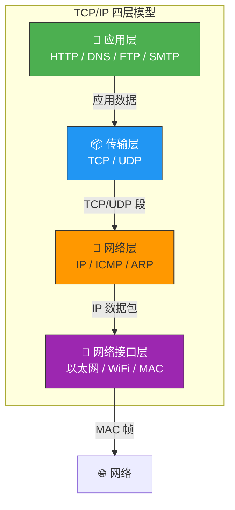
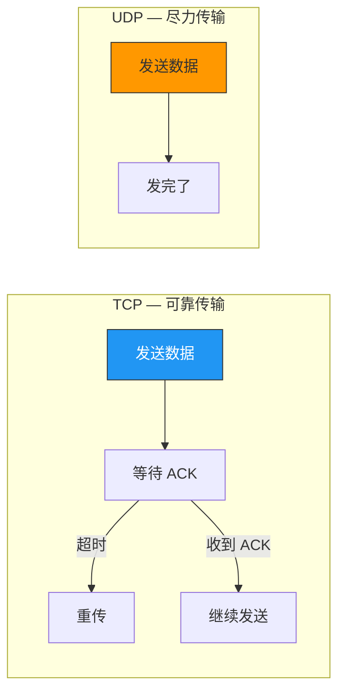
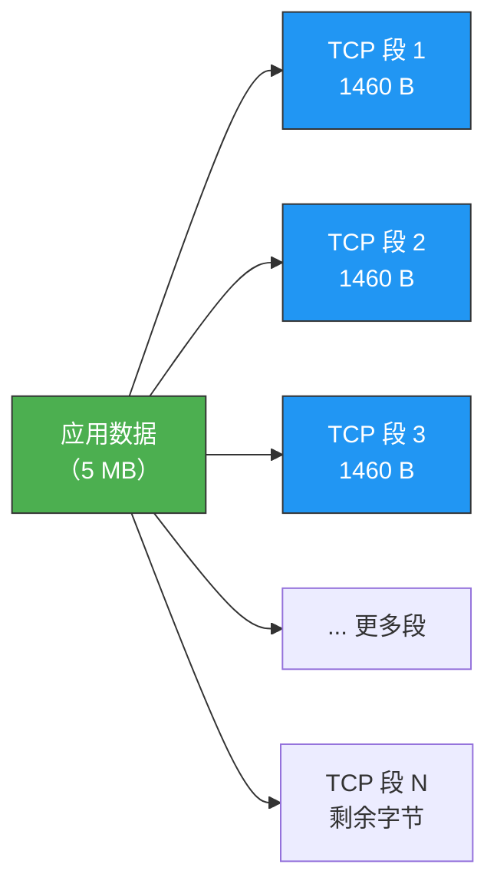
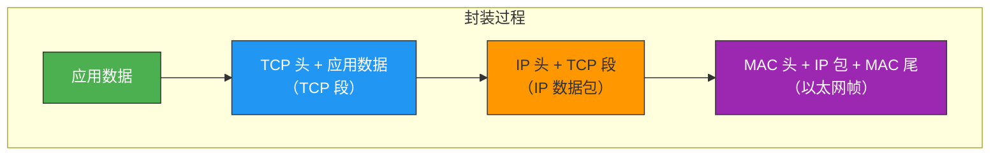
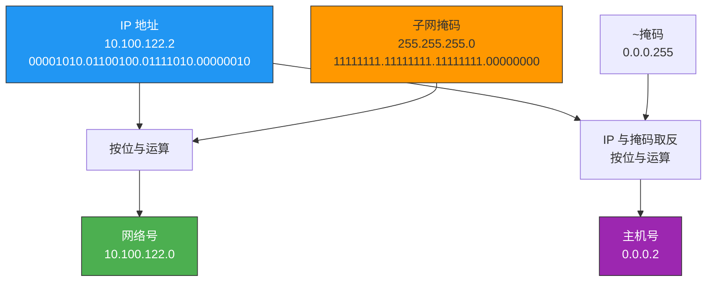
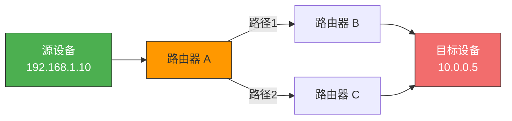
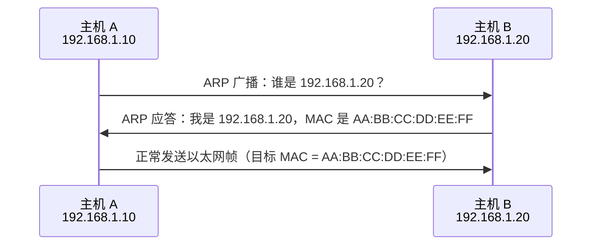
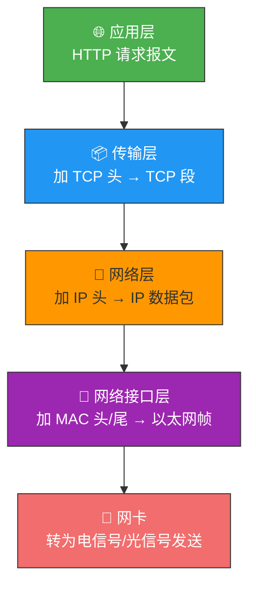

# TCP/IP 网络模型有哪几层？

> 为什么同一台设备上的进程通信用管道、共享内存就行，而不同设备之间就必须搞出一套"网络协议"？
> 答案很简单——设备千差万别，想让他们互相通信，必须先统一语言。

## 一、为什么要分层？

同一台机器上的进程间通信，手段很多：管道、消息队列、共享内存、信号……但**不同设备**上的进程通信，就得走网络。设备种类繁多，协议不统一就等于鸡同鸭讲。

所以人们把网络协议**分层设计**——每一层只做自己的事，向上提供服务，向下委托传输。就像寄快递：你只管把包裹交给快递员，快递员只管交给分拣中心，分拣中心只管装车发往目的城市……

---

## 二、应用层——只管"发什么"

应用层是我们**最直接接触**的一层。你打开浏览器访问网页、用 FTP 传文件、发邮件——全都在这一层。

**核心职责**：专注为用户提供应用功能，不关心数据怎么到达对方。

| 常见协议 | 用途 |
|---------|------|
| HTTP | 网页浏览 |
| DNS | 域名解析 |
| FTP | 文件传输 |
| SMTP | 邮件发送 |
| SSH | 远程登录 |

::: important 关键区分
应用层运行在操作系统的**用户态**，而传输层及以下工作在**内核态**。也就是说，你写的应用代码调 `send()` 时，数据就从用户态"跌入"了内核态。
:::

---

## 三、传输层——为应用"保驾护航"

传输层是应用层的"快递公司"，负责把应用数据安全送达对方的应用。

### 3.1 两大协议：TCP vs UDP

| 特性 | TCP | UDP |
|------|-----|-----|
| 连接方式 | 面向连接（三次握手） | 无连接 |
| 可靠性 | 超时重传、流量控制、拥塞控制 | 不保证送达 |
| 传输效率 | 相对较慢 | 更快更轻 |
| 适用场景 | 网页、邮件、文件传输 | 视频、语音、DNS 查询 |

### 3.2 为什么 TCP 要分块？

应用层可能一次性传来几 MB 甚至几 GB 的数据。如果直接一股脑塞到网络上，一旦中途出错，整个数据就得重传——代价太大。

所以 TCP 会按 **MSS**（Maximum Segment Size，一般 1460 字节）把大数据**切分成多个 TCP 段**：

> 丢了哪段就只重传哪段，效率高得多。

### 3.3 端口——区分应用

一台机器上跑着很多程序，传输层收到数据后怎么知道该给谁？答案是**端口号**。

| 端口 | 常见服务 |
|------|---------|
| 80 | HTTP |
| 443 | HTTPS |
| 22 | SSH |
| 3306 | MySQL |
| 6379 | Redis |

浏览器的每个标签页都是独立进程，操作系统会分配**临时端口号**（ ephemeral port，通常 32768~60999）。

---

## 四、网络层——负责"怎么走"

传输层只管"可靠地传"，但**怎么从源设备到目的设备**？这是网络层的事。

### 4.1 IP 协议与分片

网络层最核心的协议就是 **IP（Internet Protocol）**。它在 TCP 段前面加上 IP 头部，组成 IP 数据包。如果 IP 包大小超过 **MTU**（Maximum Transmission Unit，以太网中通常 1500 字节），就会**再次分片**。

### 4.2 IP 地址：网络号 + 主机号

IPv4 地址共 32 位，比如 `192.168.1.100`。但光有地址不够，还需要知道"它在哪个子网"。

IP 地址 = **网络号**（哪个子网） + **主机号**（子网内哪台机器）

**子网掩码**用来切分这两部分。以 `10.100.122.2/24` 为例：

**寻址过程**：先匹配网络号找到子网，再在子网内找主机。

### 4.3 寻址 vs 路由

- **寻址**：确定目标地址在哪个方向（像导航）
- **路由**：选择具体走哪条路（像打方向盘）

> 路由器的工作：根据目标 IP 的网络号，决定把包转发给哪个下一跳。

---

## 五、网络接口层——"最后一公里"

IP 包已经知道怎么走了，但真正在物理网络上传输，还得靠**网络接口层**。它在 IP 包外面再套上 MAC 头和 MAC 尾，变成**以太网帧**。

### 5.1 MAC 地址

IP 地址是"逻辑地址"（可变），MAC 地址是"物理地址"（出厂烧死）。

- MAC 地址 48 位，如 `00:1A:2B:3C:4D:5E`
- 在局域网内，设备间用 MAC 地址通信
- 通过 **ARP 协议**将 IP 地址解析为 MAC 地址

### 5.2 ARP 解析过程

---

## 六、完整封装流程

当你在浏览器输入一个网址，数据从应用层到网卡发出的完整封装过程：

每一层的头部就像信封一样层层包裹，收端再逐层拆开。

---

## 七、总结速查表

| 层级 | 名称 | 核心协议 | 传输单位 | 核心能力 |
|------|------|---------|---------|---------|
| 1 | 应用层 | HTTP / DNS / FTP | 消息（Message） | 为用户提供应用功能 |
| 2 | 传输层 | TCP / UDP | 段（Segment） | 端口寻址、可靠传输 |
| 3 | 网络层 | IP / ICMP / ARP | 包（Packet） | 寻址、路由、分片 |
| 4 | 网络接口层 | 以太网 / WiFi | 帧（Frame） | MAC 寻址、物理传输 |

::: tip 面试高频问答
- **Q：TCP/IP 模型是四层还是五层？**
  A：TCP/IP 标准模型是四层。教学上常把"网络接口层"拆成"数据链路层"和"物理层"，变成五层模型（OSI 是七层）。

- **Q：每层的传输单位分别叫什么？**
  A：应用层——消息；传输层——段；网络层——包；网络接口层——帧。统称"数据包"也没问题。

- **Q：IP 地址和 MAC 地址的区别？**
  A：IP 地址是逻辑地址，可变，用于跨网络寻址；MAC 地址是物理地址，固定，用于局域网内通信。
:::

---

::: info 原著参考
- 小林coding《图解网络》—— [TCP/IP 网络模型有哪几层？](https://xiaolincoding.com/network/1_base/tcp_ip_model.html)
:::
