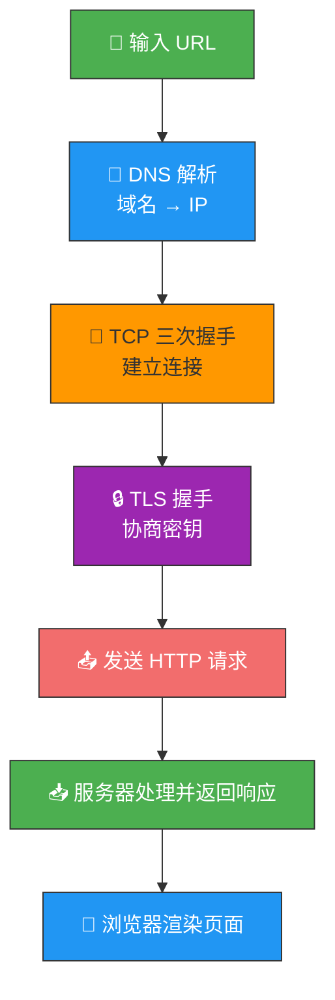
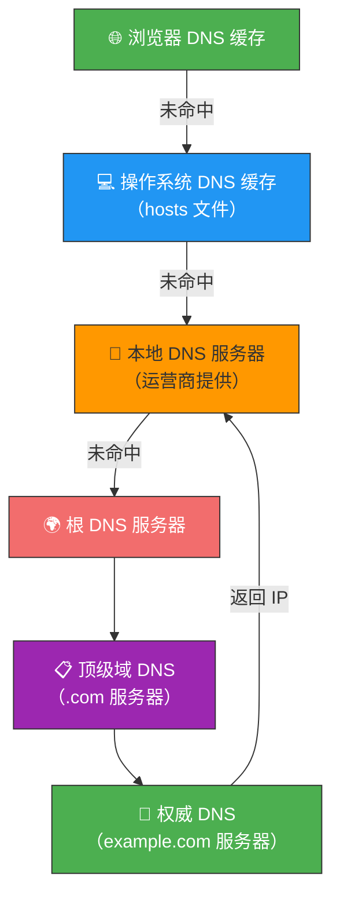
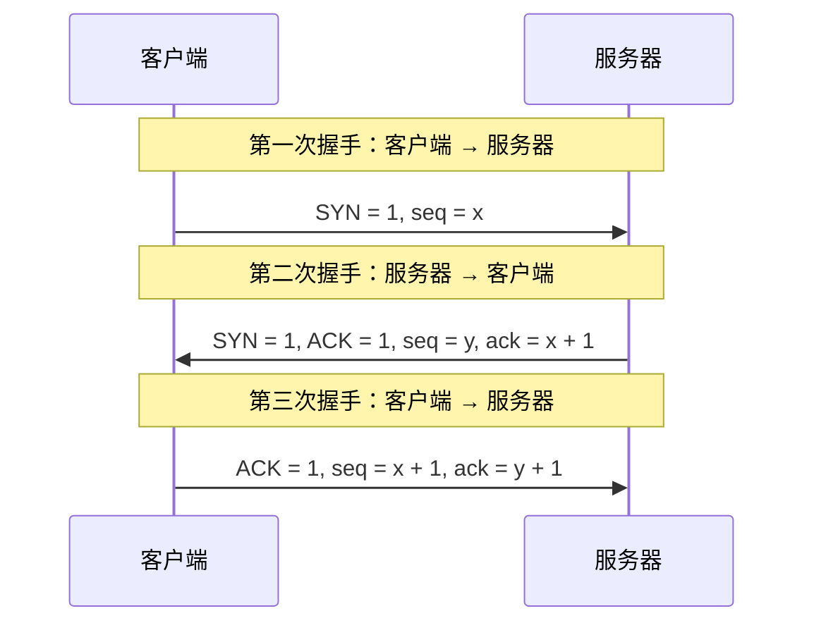
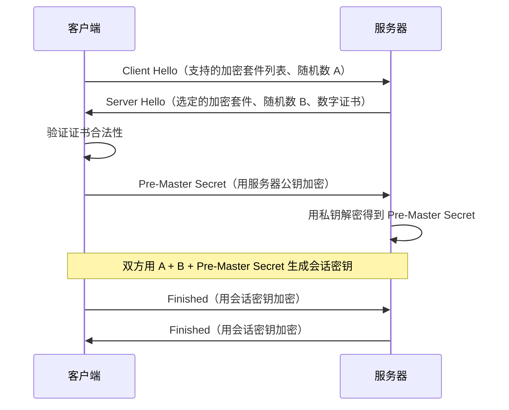
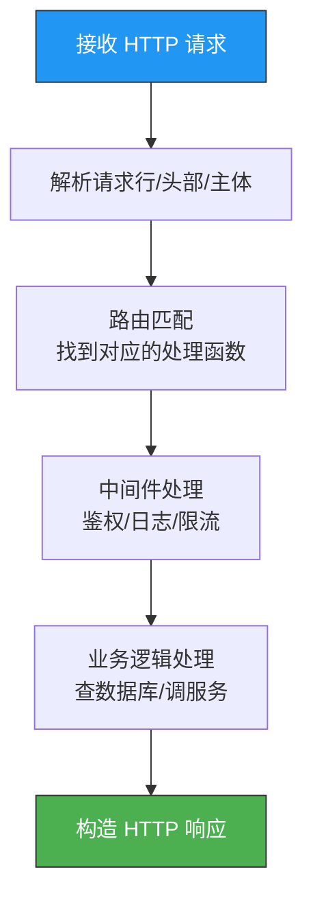
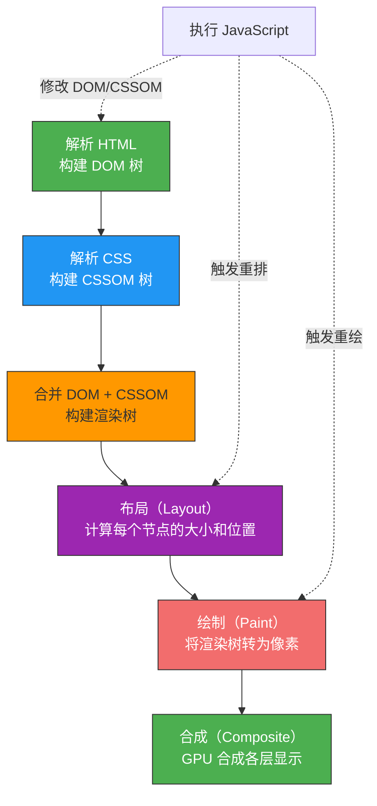
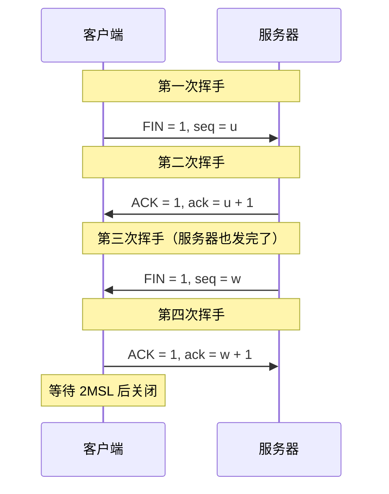
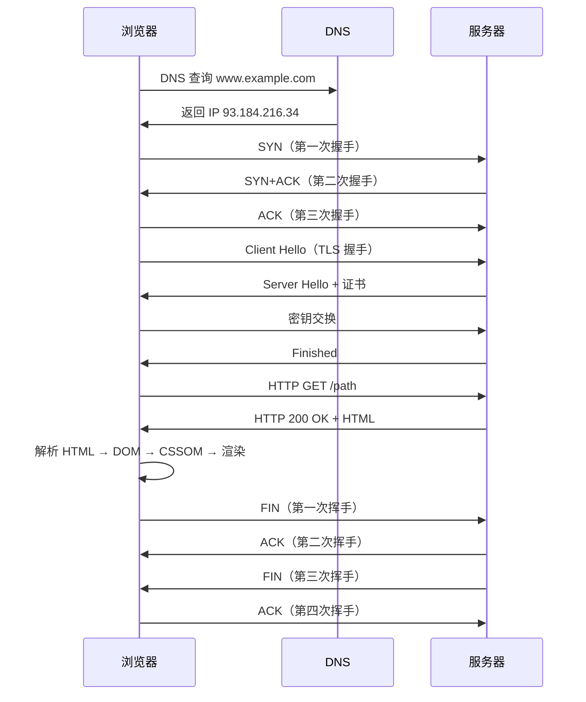

# 键入网址到网页显示，期间发生了什么？

> 这道题堪称网络面试的"最强王者"——一道题考遍 DNS、TCP、HTTP、操作系统、浏览器渲染。
> 如果你能从头到尾讲清楚，网络基础基本就过关了。

## 一、全局概览

在浏览器地址栏输入 `https://www.example.com` 按下回车后，会经历以下阶段：



下面逐一拆解。

---

## 二、URL 解析

浏览器首先判断你输入的是**URL**还是**搜索关键词**：

- 如果是合法 URL（如 `https://www.example.com`）→ 直接访问
- 如果不是（如 `hello world`）→ 交给默认搜索引擎搜索

URL 的结构：

```
  https://www.example.com:443/path/page?query=value#fragment
  \___/   \_______________/ \_/ \_________/ \_________/ \______/
  协议        主机名         端口    路径        查询参数     片段
```

| 组成 | 说明 | 示例 |
|------|------|------|
| 协议 | 通信协议 | `https` |
| 主机名 | 域名或 IP | `www.example.com` |
| 端口 | 默认 HTTP 80 / HTTPS 443 | `443` |
| 路径 | 服务器上的资源位置 | `/path/page` |
| 查询参数 | `?` 后的键值对 | `?query=value` |
| 片段 | `#` 后的锚点 | `#fragment` |

---

## 三、DNS 解析——域名变 IP

浏览器需要知道 `www.example.com` 对应的 IP 地址，这就要靠 **DNS（Domain Name System）**。

### 3.1 DNS 解析顺序

浏览器有一套完整的缓存查找链：



1. **浏览器缓存** → 有就直接用（TTL 通常几分钟到几小时）
2. **操作系统缓存** → 查 hosts 文件和系统 DNS 缓存
3. **本地 DNS 服务器** → 你的运营商分配的 DNS（如 `114.114.114.114`）
4. **根 DNS → 顶级域 DNS → 权威 DNS** → 递归/迭代查询

### 3.2 DNS 记录类型

| 类型 | 作用 | 示例 |
|------|------|------|
| A | 域名 → IPv4 | `example.com → 93.184.216.34` |
| AAAA | 域名 → IPv6 | `example.com → 2606:2800:220:1:...` |
| CNAME | 域名别名 | `www.example.com → example.com` |
| MX | 邮件服务器 | `example.com → mail.example.com` |
| NS | DNS 服务器 | `example.com → ns1.example.com` |

---

## 四、TCP 三次握手——建立连接

拿到 IP 后，浏览器要与服务器建立 TCP 连接。三次握手的核心：**确保双方都能收也能发**。



| 步骤 | 方向 | 标志 | 含义 |
|------|------|------|------|
| 第一次 | C → S | SYN | "我想跟你建立连接" |
| 第二次 | S → C | SYN + ACK | "收到，我也想跟你建立连接" |
| 第三次 | C → S | ACK | "确认，连接建立" |

::: tip 为什么是三次？
两次的话，服务器无法确认客户端收到了自己的 SYN+ACK——万一客户端没收到，服务器傻等，浪费资源。三次握手保证了**双方都确认了对方的收发能力**。
:::

---

## 五、TLS 握手——建立安全通道

如果用的是 HTTPS，在 TCP 连接建立之后还要进行 **TLS 握手**，协商加密算法和密钥。

### 5.1 TLS 1.2 RSA 握手



### 5.2 TLS 1.3 优化

TLS 1.3 将握手从 2-RTT 缩短到 **1-RTT**，甚至支持 **0-RTT** 恢复：

- 合并 Client Hello 和 Key Share
- 移除了 RSA 密钥交换，强制使用 ECDHE
- 更安全、更快

---

## 六、发送 HTTP 请求

连接建立后，浏览器构造 HTTP 请求报文：

```http
GET /path/page?query=value HTTP/1.1
Host: www.example.com
Connection: keep-alive
User-Agent: Mozilla/5.0 ...
Accept: text/html,application/xhtml+xml
Accept-Encoding: gzip, deflate, br
Cookie: session_id=abc123
```

| 请求行/头部 | 说明 |
|------------|------|
| `GET /path/page` | 请求方法 + 路径 |
| `Host` | 目标域名（虚拟主机必需） |
| `Connection: keep-alive` | 保持 TCP 连接复用 |
| `User-Agent` | 客户端标识 |
| `Accept` | 能接受的响应格式 |
| `Cookie` | 携带的 Cookie |

---

## 七、服务器处理请求

服务器接收到请求后的处理流程：



典型的响应报文：

```http
HTTP/1.1 200 OK
Content-Type: text/html; charset=utf-8
Content-Encoding: gzip
Cache-Control: max-age=3600
Set-Cookie: session_id=xyz789; Secure; HttpOnly

<!DOCTYPE html>
<html>...
```

---

## 八、浏览器渲染页面

浏览器拿到 HTML 后，经过以下步骤将页面呈现给你：



### 关键概念

| 概念 | 说明 |
|------|------|
| DOM 树 | HTML 解析出的文档对象模型 |
| CSSOM 树 | CSS 解析出的样式对象模型 |
| 渲染树 | DOM + CSSOM 合并，只包含可见元素 |
| 重排（Reflow） | 改变几何属性（宽高、位置）→ 触发布局重算 |
| 重绘（Repaint） | 改变外观属性（颜色、背景）→ 触发重新绘制 |

::: warning 性能优化建议
- 避免频繁操作 DOM（用 `documentFragment` 或虚拟 DOM）
- CSS 放 `<head>`，JS 放 `</body>` 前（或加 `defer`/`async`）
- 使用 `transform` 和 `opacity` 做动画（触发合成层，不重排不重绘）
:::

---

## 九、断开连接——TCP 四次挥手

数据传输完毕后，TCP 连接通过四次挥手断开：



为什么是四次？因为 TCP 是全双工的——每个方向的关闭需要单独的 FIN + ACK。

---

## 十、完整时序图

把所有步骤串起来：



---

## 十一、面试速查

::: tip 高频追问
- **Q：为什么 DNS 用 UDP 而不是 TCP？**
  A：DNS 查询报文通常很小（<512 字节），UDP 更快更轻。区域传送（主从同步）才用 TCP。

- **Q：HTTPS 和 HTTP 的区别？**
  A：HTTPS = HTTP + TLS。TLS 在 TCP 之上，提供加密、身份验证、数据完整性。

- **Q：为什么 TCP 关闭需要四次挥手？**
  A：全双工连接，每个方向需要单独关闭。服务器收到 FIN 后可能还有数据没发完，所以 ACK 和 FIN 分两次发。

- **Q：重排和重绘的区别？**
  A：重排必定重绘，重绘不一定重排。重排代价更大（需要重新计算布局）。
:::

---

::: info 原著参考
- 小林coding《图解网络》—— [键入网址到网页显示，期间发生了什么？](https://xiaolincoding.com/network/1_base/what_happen_url.html)
:::
