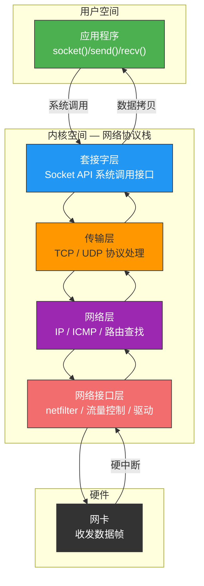
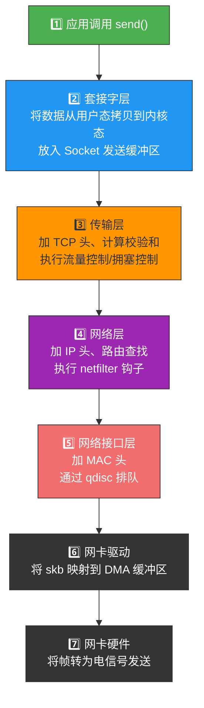
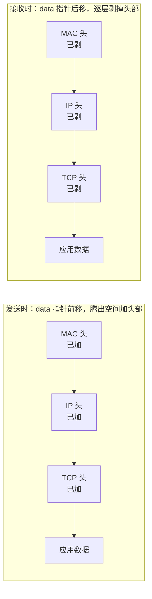
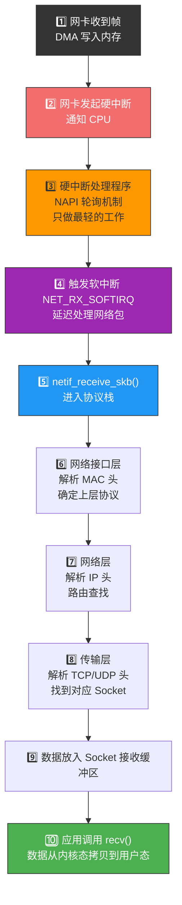
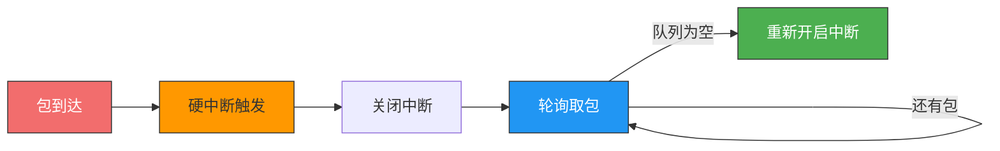
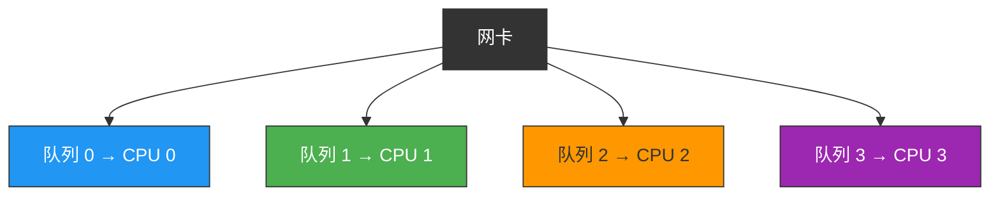
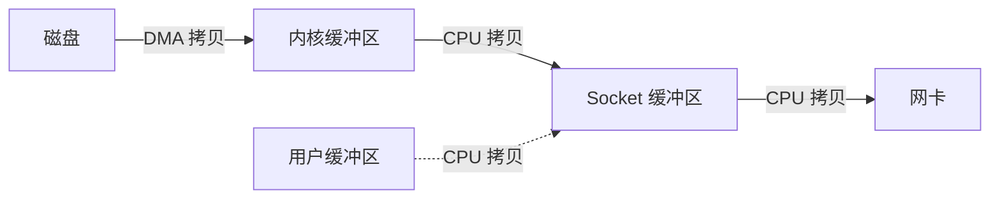

# Linux 系统是如何收发网络包的？

> 前面我们讲了 TCP/IP 分层模型和一次网页请求的全流程，但数据包在 Linux 内核里到底是怎么走的？
> 这一节钻进内核，看看网络协议栈的真面目。

## 一、Linux 网络协议栈全景

Linux 内核的网络子系统是一个**分层处理**的架构，从上到下贯穿了整个 TCP/IP 模型：



---

## 二、发送网络包的流程

当应用程序调用 `send()` 发送数据时，整个内核处理流程如下：



### 关键数据结构：sk_buff

Linux 内核用 **`sk_buff`**（简称 skb）作为网络数据包的统一表示，贯穿整个协议栈：

```c
// 简化的 sk_buff 结构
struct sk_buff {
    struct net_device *dev;      // 关联的网络设备
    unsigned int len;            // 数据总长度
    __u16 protocol;              // 上层协议类型
    unsigned char *head;         // 缓冲区起始
    unsigned char *data;         // 数据起始
    unsigned char *tail;         // 数据结束
    unsigned char *end;          // 缓冲区结束

    // TCP/UDP 头部指针
    union {
        struct tcphdr *th;
        struct udphdr *uh;
    };
    // IP 头部指针
    struct iphdr *ipih;
};
```

**精髓**：skb 不是每次复制数据，而是通过移动 `data` 指针来"添加/剥离"头部，这就是所谓的**零拷贝**设计。



---

## 三、接收网络包的流程

网卡收到一个数据帧后，内核的处理更加复杂，涉及中断、软中断、多队列等机制：



### 3.1 NAPI 机制——中断与轮询的混合

传统的纯中断模式：每个包一次中断 → 高流量时 CPU 被中断淹没。

**NAPI（New API）** 的做法：

1. 第一个包到来时触发**硬中断**
2. 硬中断处理程序**关闭中断**，启动**轮询**
3. 轮询不断从网卡取包，直到队列为空
4. 队列空了 → 重新开启中断，等待下一个包



### 3.2 多队列网卡（RSS）

现代网卡支持多个接收队列，每个队列绑定不同的 CPU 核心，避免单核瓶颈：



队列分配依据：对源/目的 IP、端口的哈希值取模。

---

## 四、网络性能优化全景

Linux 提供了大量参数来调优网络性能：

### 4.1 Socket 缓冲区调优

```bash
# 查看当前 TCP 缓冲区大小（最小/默认/最大，单位字节）
cat /proc/sys/net/ipv4/tcp_rmem
# 输出示例：4096  87380  6291456

cat /proc/sys/net/ipv4/tcp_wmem
# 输出示例：4096  16384  4194304

# 调整最大接收缓冲区到 16MB
echo "4096 87380 16777216" > /proc/sys/net/ipv4/tcp_rmem
```

### 4.2 中断亲和性

```bash
# 查看网卡中断分配
cat /proc/interrupts | grep eth

# 设置中断亲和性（绑定到 CPU 0）
echo 1 > /proc/irq/32/smp_affinity
```

### 4.3 常用优化参数

| 参数 | 作用 | 推荐值 |
|------|------|--------|
| `net.core.somaxconn` | listen 全连接队列最大长度 | `65535` |
| `net.ipv4.tcp_max_syn_backlog` | SYN 半连接队列最大长度 | `65535` |
| `net.ipv4.tcp_tw_reuse` | 允许复用 TIME_WAIT 连接 | `1` |
| `net.ipv4.ip_local_port_range` | 临时端口范围 | `1024 65535` |
| `net.ipv4.tcp_fin_timeout` | FIN_WAIT_2 超时时间（秒） | `15` |

---

## 五、零拷贝技术

传统数据发送需要 **4 次拷贝 + 4 次上下文切换**：



零拷贝技术（如 `sendfile`、`mmap`、`splice`）能减少甚至消除 CPU 参与的拷贝：

```c
// sendfile 零拷贝 — 直接从文件到网卡
// 传统：read() + send() = 4次拷贝
// sendfile：只需 2 次拷贝（DMA → 内核 → 网卡）
ssize_t sendfile(int out_fd, int in_fd, off_t *offset, size_t count);
```


---

## 六、总结

| 阶段 | 发送路径 | 接收路径 |
|------|---------|---------|
| 用户态 | `send()` 系统调用 | `recv()` 系统调用 |
| 套接字层 | 数据拷贝到内核缓冲区 | 数据拷贝到用户缓冲区 |
| 传输层 | 加 TCP 头、流控、拥控 | 解析 TCP 头、找到 Socket |
| 网络层 | 加 IP 头、路由查找 | 解析 IP 头、转发或上传 |
| 网络接口层 | 加 MAC 头、排队 | 解析 MAC 头、上传 |
| 硬件 | DMA → 网卡发送 | 网卡接收 → 硬中断 → 软中断 |

::: tip 面试速查
- **Q：为什么接收路径用软中断？**
  A：硬中断优先级高、执行快，不能长时间占用 CPU。软中断在合适的时机批量处理，避免中断风暴。

- **Q：sk_buff 为什么不用每次复制数据？**
  A：通过移动 data/tail 指针来"加头/剥头"，避免内存拷贝，提升性能。

- **Q：NAPI 解决了什么问题？**
  A：高流量时减少中断次数，用轮询替代连续中断，降低 CPU 开销。

- **Q：零拷贝有哪些实现方式？**
  A：`sendfile()`（文件→网络）、`mmap()`（文件映射到用户空间）、`splice()`（管道零拷贝）。
:::

---

::: info 原著参考
- 小林coding《图解网络》—— [Linux 系统是如何收发网络包的？](https://xiaolincoding.com/network/1_base/linux_send_receive.html)
:::
